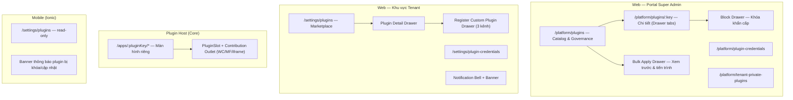

# [DES-03-UI] Đặc Tả Giao Diện & Thành Phần UI: Plugin Manager, Marketplace & Plugin Host

- **Mã Tài Liệu**: DES-03-UI
- **Phụ Trách**: Solution Architect Agent
- **Thuộc Sprint**: Sprint 03 - Plugin Manager, Plugin CLI & Cơ Chế Phân Phối Plugin
- **Quy Chuẩn**: UI/UX ERP Nhỏ Gọn — Vuông Vắn — Anti-Modal ([ui_ux_standards.md](../../../../../.agents/rules/ui_ux_standards.md))
- **Ngày Hoàn Thành**: 2026-09-19
- **Tài Liệu Nguồn**: [DES-03-API](../api/PLUGIN_MANAGER_API_SPEC.md), [DES-03-DB](../database/PLUGIN_MANAGER_DATABASE_SCHEMA.md), [SOL-03](../../05_solutions/SOL-03_plugin_ui_extension_and_cli_dev_experience.md)

---

## 1. Nguyên Tắc UI Bắt Buộc

1. **Anti-Modal tuyệt đối**: mọi form/chi tiết dùng **Drawer trượt phải (xếp tầng)** + **Split-Screen**; không popup.
2. **Mật độ cao**: `text-xs`/`text-sm`, `p-1`/`p-2`, `gap-1`/`space-y-1.5`, `rounded-none`/`rounded-sm`, viền `border-neutral-200 dark:border-neutral-800`.
3. **100% i18n**: không hardcode chuỗi; tên/mô tả plugin dùng `name_key`/`description_key`; mọi mã lỗi có i18n key.
4. **Theme sáng/tối + responsive**: Web ≥1280px; Mobile Emulation 390x844 (overflow = 0, touch target ≥ 40px).
5. **Component-first**: toàn bộ thành phần mới đóng gói trong `src/frontend/shared` trước khi dùng cho Web/Mobile.
6. **Phân định nền tảng**: quản lý/cài/gỡ plugin chỉ trên Web; Mobile chỉ xem + nhận thông báo.

---

## 2. Sơ Đồ Màn Hình

---

## 3. Web — Portal Super Admin

### 3.1. Màn `/platform/plugins` (Split-Screen)

| Vùng | Nội Dung |
| :--- | :--- |
| Cột trái (40%) | Ô tìm kiếm + bộ lọc (trạng thái phát hành, visibility, nền tảng, nguồn phân phối, `default_install`); danh sách dòng dày: tên (i18n) • key • phiên bản mới nhất • badge trạng thái • số tenant đang cài • badge "Mặc định" / "Riêng tenant" |
| Khu vực riêng | **"Hệ thống lõi"** — danh sách Core modules read-only (Q4), tách khỏi danh mục plugin |
| Cột phải (60%) | Chi tiết nhanh plugin được chọn (thông tin + hành động); hoặc empty state hướng dẫn "Đăng ký plugin" |
| Toolbar | `+ Đăng ký plugin` (mở Drawer), `Tải lại` |

### 3.2. Drawer Chi Tiết Plugin (3 tầng xếp chồng)

1. **Tầng 1 — Tổng quan**: metadata, nguồn artifact, checksum/digest, tương thích Core, phụ thuộc, nền tảng, quyền, entity, UI (screens/contributions); **chỉnh metadata catalog qua P24** (`default_install`, `locked`, `entitlement_plans`) với xác nhận + audit (BUG-91).
2. **Tầng 2 — Phiên bản (Timeline)**: mỗi phiên bản 1 dòng: SemVer • trạng thái • ngày/người đăng ký • nguồn • checksum; hành động Công bố / Ngừng hỗ trợ / Khóa / Gỡ artifact.
3. **Tầng 3 — Tenant đang cài**: bảng dense (tenant, trạng thái, phiên bản, sức khỏe container, cập nhật khả dụng) + **hành động hỗ trợ mapping API P19–P23** (Cài/Gỡ/Bật-Tắt/Nâng cấp/Rollback — bắt buộc nhập `reason`, có audit + operation_id) + nút **"Cấp/Thu entitlement"** mở Drawer tìm tenant (P12/P13).

### 3.3. Drawer "Đăng Ký Plugin / Phiên Bản" (3 kênh)

- **Bước 1 — Nguồn**: 3 tab: Docker Hub • Image Registry • Tải tệp lên (JAR + Web bundle).
- **Bước 2 — Thông tin**: ref/URL + chọn credential (platform/tenant) + nút "Kiểm tra kết nối"; upload có tiến trình + checksum sau khi tải.
- **Bước 3 — Xem trước & Xác nhận**: metadata đọc được (key, version, compatibility, permissions, entities, UI), cảnh báo (trùng key/version, slot không tồn tại, checksum), nút "Đăng ký" (bản ghi `DRAFT`).

### 3.4. Drawer "Khóa Khẩn Cấp" (P7)

- Hiển thị **danh sách tenant bị ảnh hưởng** (preview, phân trang, tìm kiếm).
- Nhập lý do (bắt buộc) + gõ lại `plugin_key` để xác nhận + toggle "Cưỡng chế gỡ ngay".
- Sau khi khóa: màn hình **tiến trình** (progress per tenant) + kết quả + nút "Gửi lại thông báo".

### 3.5. Drawer "Áp Dụng Hàng Loạt" (P10/P11)

- Chọn phiên bản + phạm vi (tất cả tenant / theo gói / danh sách chọn).
- **Xem trước**: bảng tenant ảnh hưởng + ước tính tài nguyên; tạo `preview_token`.
- Chạy job: màn hình tiến trình + báo cáo từng tenant (thành công/lỗi/lý do).

### 3.6. Màn `/platform/plugin-credentials`

- Bảng dense credential platform (name, host, username che `••••`, ngày dùng cuối) + Drawer thêm/sửa + nút "Kiểm tra".
- Không bao giờ hiển thị secret; xóa phải kiểm tra đang được dùng → `PLUGIN_CREDENTIAL_IN_USE`.

### 3.7. Màn `/platform/tenant-private-plugins`

- Bảng plugin riêng của tenant (tenant sở hữu, key, phiên bản, trạng thái, nguồn) + hành động Khóa + xem chi tiết (dùng lại Drawer 3 tầng).

---

## 4. Web — Khu Vực Tenant (Marketplace)

### 4.1. Màn `/settings/plugins`

| Nhóm | Nội Dung |
| :--- | :--- |
| **Đã cài** | ACTIVE / INACTIVE / UPDATE_AVAILABLE: tên + mô tả i18n • badge nền tảng • phiên bản hiện tại → mới nhất • trạng thái runtime • hành động (Bật/Tắt, Nâng cấp, Gỡ, Chi tiết) |
| **Có thể cài** | Plugin được cấp phép chưa cài: nút "Cài đặt" + chọn phiên bản trong Drawer chi tiết |
| **Plugin riêng của tôi** | Chỉ hiện khi `allow_custom_plugins = true`: danh sách `TENANT_PRIVATE` + nút "Đăng ký plugin riêng" |
| Toolbar | Ô tìm kiếm + bộ lọc nền tảng + badge "Cập nhật" |

### 4.2. Plugin Detail Drawer

- Mô tả, nền tảng hỗ trợ, phiên bản (danh sách chọn), quyền yêu cầu, phụ thuộc, kích thước ước tính, UI contributions.
- Hành động theo trạng thái; **cảnh báo gỡ**: banner inline "Plugin sẽ được gỡ nhưng dữ liệu vẫn được giữ nguyên" + yêu cầu nhập tên plugin xác nhận.

### 4.3. Drawer "Đăng Ký Plugin Riêng" (T8 + T14→T18)

- 3 tab nguồn (Docker Hub / Registry của tôi / Tải tệp lên — API T14) + chọn credential TENANT.
- **Quản lý phiên bản ngay trong Drawer**: danh sách phiên bản (T16) + **Đăng ký thêm phiên bản** (T15) + **Công bố / Ngừng hỗ trợ** (T17) + Gỡ phiên bản chưa dùng (T18).
- Hiển thị nhãn **"Plugin riêng — tenant tự chịu trách nhiệm"** + ghi chú nền tảng giám sát/khóa.
- Kiểm tra `allow_custom_plugins`; nếu chưa bật → thông báo liên hệ nền tảng.
- Contribution UI của plugin riêng **được phép `render_mode = WEB_COMPONENT/MODULE_FEDERATION/IFRAME`** như plugin Official (chốt Gate); iframe chỉ là lựa chọn dự phòng.

### 4.4. Thông Báo

- **Bell** trên TopBar (dùng `TopBar` shared) + danh sách thông báo dạng Drawer: loại, tiêu đề i18n, thời gian, trạng thái đọc.
- **Banner** toàn cục khi có plugin bị khóa ảnh hưởng tenant (màu amber/red, có nút "Xem chi tiết").

---

## 5. Plugin Host Region (Web Core)

### 5.1. Màn Hình Riêng `/apps/:pluginKey/*`

- Route động do Core đăng ký từ UI Manifest; layout Core giữ nguyên (TopBar/NavBar của Core).
- Nội dung render theo `render_mode` của screen: MF remote (mặc định) / WC / iframe.
- Loading skeleton + Error Boundary + thông báo khi plugin `INACTIVE`/`UNINSTALLED` (tự điều hướng về Marketplace).

### 5.2. `PluginSlotComponent` + `ContributionOutletComponent`

> **Resolve slot theo host**: với slot do plugin làm host, component phải so khớp `host.installed_version` + `host.contract_version` với `contract_version` của contribution; không khớp → không render + log cảnh báo (không làm hỏng màn hình host). **Nguồn sự thật là `ui_manifest` của phiên bản host đang cài**; `plugin_ui_slots` chỉ là chỉ mục tra cứu/validate (BUG-88).

| Thành Phần | Trách Nhiệm |
| :--- | :--- |
| `PluginSlotComponent` | Nhận `slotCode`, gọi UI Manifest (cache), kiểm tra host/contract version, render danh sách contribution theo `order` |
| `ContributionOutletComponent` | Chọn loader theo `render_mode`; bọc Error Boundary; ẩn nếu thiếu quyền; hỗ trợ theme/i18n bridge |
| `WebComponentLoader` | Nạp script custom element (Shadow DOM), gắn thẻ vào slot |
| `ModuleFederationLoader` | Nạp remote entry với shared scope version pin; mount component vào slot |
| `IframeLoader` | Tạo iframe + `sandbox` + token ngắn hạn; bridge `postMessage` (theme, lang, resize) |

### 5.3. Trạng Thái Hiển Thị

| Trạng Thái | UI |
| :--- | :--- |
| Đang tải contribution | Skeleton nhỏ theo `constraints.min_height_px` |
| Contribution lỗi | Khối "Không thể hiển thị plugin này" + mã lỗi i18n; không ảnh hưởng phần còn lại |
| Plugin bị khóa/gỡ | Không render; banner cảnh báo khi người dùng đang trong màn plugin |

---

## 6. Mobile (Ionic) — Tối Giản

- **Màn `/settings/plugins` (read-only)**: danh sách plugin đã cài + trạng thái + phiên bản; badge "Có cập nhật"; không có hành động cài/gỡ.
- **Banner thông báo**: plugin bị khóa/cập nhật — hiển thị trên Dashboard.
- Touch target ≥ 40px; safe-area; overflow = 0; i18n parity vi/en.

---

## 7. Thành Phần Dùng Chung (Shared Components)

| Component | Nguồn | Thay Đổi |
| :--- | :--- | :--- |
| `plugin-switch-list` (Sprint 02) | `shared/components` | **Nâng cấp** thành `plugin-management-list`: thêm nhóm "Đã cài/Có thể cài/Plugin riêng", badge phiên bản, hành động, giữ switch core cũ nếu cần |
| `plugin-card` | Mới | Thẻ dòng dày cho Marketplace/Catalog |
| `version-timeline` | Mới | Timeline phiên bản + badge trạng thái |
| `render-mode-badge` | Mới | `WC` / `MF` / `iframe` badge nhỏ |
| `operation-progress` | Mới | Tiến trình thao tác dài (steps + kết quả) |
| `credential-form` | Mới | Form credential (che secret) dùng chung platform/tenant |
| `plugin-slot`, `contribution-outlet` | Mới (`shared/plugin-host`) | Runtime nhúng UI (mục 5.2) |
| `drawer`, `sharp-toggle`, `badge`, `topbar` | Đã có | Tái sử dụng, bổ sung slot cho notification bell |

---

## 8. Danh Mục i18n Key (Trích Yếu — Bổ Sung vi/en Parity)

| Nhóm | Key |
| :--- | :--- |
| Marketplace | `PLUGIN_MARKETPLACE_TITLE`, `PLUGIN_MARKETPLACE_INSTALLED`, `PLUGIN_MARKETPLACE_AVAILABLE`, `PLUGIN_MARKETPLACE_CUSTOM`, `PLUGIN_MARKETPLACE_SEARCH_PLACEHOLDER`, `PLUGIN_MARKETPLACE_EMPTY` |
| Hành động | `PLUGIN_ACTION_INSTALL`, `PLUGIN_ACTION_UNINSTALL`, `PLUGIN_ACTION_ENABLE`, `PLUGIN_ACTION_DISABLE`, `PLUGIN_ACTION_UPGRADE`, `PLUGIN_ACTION_ROLLBACK`, `PLUGIN_ACTION_DETAIL`, `PLUGIN_ACTION_REGISTER` |
| Trạng thái | `PLUGIN_STATUS_ACTIVE`, `PLUGIN_STATUS_INACTIVE`, `PLUGIN_STATUS_INSTALLING`, `PLUGIN_STATUS_FAILED`, `PLUGIN_STATUS_ROLLBACK_FAILED`, `PLUGIN_STATUS_UNINSTALLED`, `PLUGIN_STATUS_UPDATE_AVAILABLE` |
| Cảnh báo | `PLUGIN_UNINSTALL_KEEP_DATA_WARNING`, `PLUGIN_LOCKED_DEFAULT_TOOLTIP`, `PLUGIN_CUSTOM_RESPONSIBILITY_WARNING`, `PLUGIN_BLOCKED_BANNER` |
| Đăng ký | `PLUGIN_REGISTER_SOURCE_DOCKERHUB`, `PLUGIN_REGISTER_SOURCE_REGISTRY`, `PLUGIN_REGISTER_SOURCE_UPLOAD`, `PLUGIN_REGISTER_CHECKSUM_LABEL`, `PLUGIN_REGISTER_PREVIEW_TITLE` |
| Host | `PLUGIN_CONTRIBUTION_LOADING`, `PLUGIN_CONTRIBUTION_ERROR`, `PLUGIN_HOST_SCREEN_NOT_ACTIVE` |
| Lỗi API | Toàn bộ `PluginErrorCode` → key i18n tương ứng (bảng lỗi tại DES-03-API mục 6) |

---

## 9. Trạng Thái UI & Xử Lý Lỗi

| Tình Huống | Hành Vi UI |
| :--- | :--- |
| Danh sách rỗng (Marketplace) | Empty state + hướng dẫn liên hệ nền tảng để được cấp phép |
| Catalog rỗng (Platform) | Empty state + nút "Đăng ký plugin đầu tiên" |
| Đang thao tác vòng đời | Nút hành động chuyển disabled + hiển thị `operation-progress` |
| Thao tác lỗi | Banner đỏ inline + mã lỗi i18n + nút "Xem chi tiết" (steps từ S2) |
| Plugin bị khóa toàn nền tảng | Banner toàn cục + ẩn contribution; Marketplace hiển thị badge "Đã khóa" |
| Mất quyền giữa chừng | Contribution tự ẩn; API 403 → điều hướng phù hợp |

---

## 10. Checklist QA Giao Diện (Dual-Mode)

- [ ] Web Desktop ≥1280px: split-screen, Drawer xếp tầng (mở từ Catalog → Chi tiết → Tenant), mật độ `text-xs/sm`, sáng/tối.
- [ ] Web Mobile Emulation 390x844: overflow = 0 toàn bộ màn hình plugin; touch target ≥ 40px.
- [ ] Mobile Ionic 390x844: danh sách read-only + banner + menu điều hướng; safe-area.
- [ ] 0 console error trên mọi luồng (catalog, marketplace, đăng ký 3 kênh, cài/gỡ, host contribution).
- [ ] i18n parity vi/en cho toàn bộ key mới.
- [ ] Ảnh minh chứng lưu tại `08_testing/screenshots/` (web, web-responsive, mobile).

---

## 11. Truy Vết Yêu Cầu

| Màn/Hành Vi | FEAT | Acceptance Criteria |
| :--- | :--- | :--- |
| Catalog + Drawer 3 tầng + Governance | FEAT-21 | AC-21.3→21.7 |
| Marketplace + Detail + Gỡ giữ dữ liệu | FEAT-21 | AC-21.1, AC-21.2 |
| Block + Bulk Apply + Notification | FEAT-21 | AC-21.4, AC-21.5 |
| Register Custom Plugin 3 kênh | FEAT-21/23 | AC-21.6, AC-23.1→23.3 |
| Plugin Host Region + Slot/Contribution | FEAT-23 | AC-23.5 |
| Credentials platform/tenant | FEAT-23 | AC-23.7 |
| Operation Progress (S2) | FEAT-21/23 | AC-23.6 |
