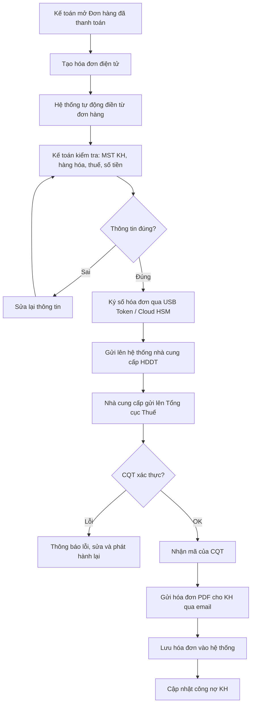
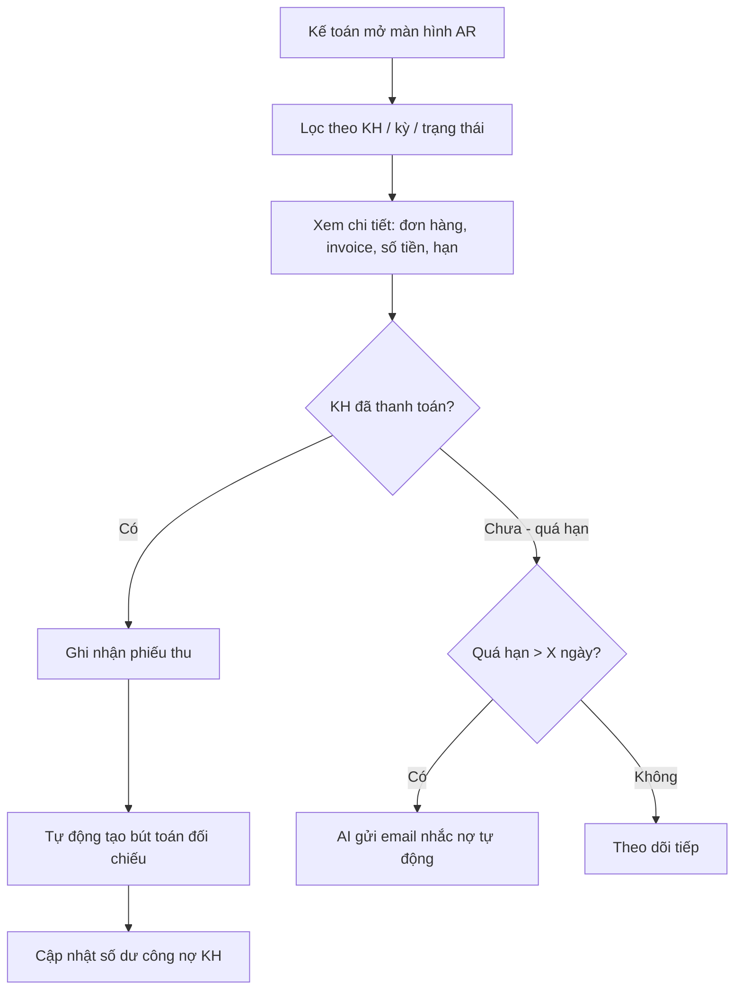
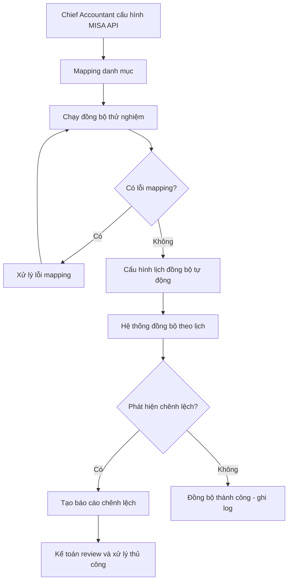

# SRS — Phân hệ Accounting

# Kế toán – Tài chính

**Phiên bản:** 1.0  
**Ngày tạo:** 09/05/2026  
**Tác giả:** Business Analyst  
**Sprint liên quan:** Sprint 11, Sprint 12  
**Trạng thái:** Hoàn chỉnh

---

## Mục lục

1. [Tổng quan phân hệ](#1-tổng-quan-phân-hệ)
2. [Đặc tả chức năng](#2-đặc-tả-chức-năng)
3. [Luồng nghiệp vụ](#3-luồng-nghiệp-vụ)
4. [Mô hình dữ liệu](#4-mô-hình-dữ-liệu)
5. [Validation và Business Rules](#5-validation-và-business-rules)
6. [Tích hợp và API](#6-tích-hợp-và-api)

---

## 1. Tổng quan phân hệ

### 1.1 Phạm vi và mục tiêu

Phân hệ **Accounting** phục vụ nghiệp vụ kế toán tài chính theo chuẩn Việt Nam (VAS), bao gồm hạch toán, quản lý công nợ, thu chi, hóa đơn điện tử và tích hợp với MISA, eTax.

**Mục tiêu:**

- Hạch toán kế toán theo chuẩn mực VAS và Thông tư 200/2014/TT-BTC
- Quản lý công nợ phải thu, phải trả theo thời gian
- Quản lý quỹ tiền mặt và tài khoản ngân hàng
- Phát hành và quản lý hóa đơn điện tử theo Nghị định 123/2020/NĐ-CP
- Tích hợp MISA AMIS và cổng thuế điện tử eTax

### 1.2 Actors

| Actor                                 | Mô tả                                                      |
| ------------------------------------- | ---------------------------------------------------------- |
| **Chief Accountant (Kế toán trưởng)** | Phê duyệt chứng từ lớn, khóa sổ, cấu hình kế toán          |
| **Accountant (Kế toán viên)**         | Nhập bút toán, tạo phiếu thu/chi, đối chiếu                |
| **Cashier (Thủ quỹ)**                 | Quản lý quỹ tiền mặt, thu chi tiền mặt                     |
| **Tenant Admin**                      | Cấu hình hệ thống kế toán: tài khoản, kỳ, ngưỡng phê duyệt |
| **Director/Manager**                  | Phê duyệt phiếu chi vượt ngưỡng                            |
| **AI Agent**                          | Gợi ý định khoản, phát hiện sai lệch, nhắc kê khai thuế    |
| **MISA System**                       | Hệ thống kế toán bên ngoài, đồng bộ dữ liệu                |
| **eTax (GDT)**                        | Cổng thuế điện tử, nhận hóa đơn và khai thuế               |

### 1.3 Use Case tổng quan

| Nhóm                | Use Case                           | Actor chính                  |
| ------------------- | ---------------------------------- | ---------------------------- |
| **Hạch toán**       | Tạo bút toán thủ công              | Accountant                   |
| **Hạch toán**       | Nhật ký chung                      | Accountant, Chief Accountant |
| **Hạch toán**       | Sổ cái                             | Accountant, Chief Accountant |
| **Hạch toán**       | Khóa kỳ kế toán                    | Chief Accountant             |
| **Công nợ**         | Xem và đối chiếu công nợ phải thu  | Accountant                   |
| **Công nợ**         | Xem và đối chiếu công nợ phải trả  | Accountant                   |
| **Công nợ**         | Nhắc nợ tự động khách hàng quá hạn | AI Agent / hệ thống tự động  |
| **Thu chi**         | Tạo phiếu thu                      | Cashier, Accountant          |
| **Thu chi**         | Tạo phiếu chi                      | Cashier, Accountant          |
| **Thu chi**         | Phê duyệt phiếu chi                | Chief Accountant, Director   |
| **Thu chi**         | Xem số dư quỹ                      | Cashier, Chief Accountant    |
| **Ngân hàng**       | Ghi nhận giao dịch ngân hàng       | Accountant                   |
| **Ngân hàng**       | Đối soát sao kê                    | Accountant                   |
| **Hóa đơn điện tử** | Phát hành hóa đơn điện tử          | Accountant                   |
| **Hóa đơn điện tử** | Điều chỉnh / Thay thế hóa đơn      | Chief Accountant             |
| **Hóa đơn điện tử** | Tra cứu hóa đơn                    | Accountant                   |
| **MISA**            | Đồng bộ dữ liệu với MISA           | Chief Accountant             |
| **eTax**            | Kê khai thuế VAT                   | Chief Accountant             |
| **AI**              | Gợi ý định khoản từ chứng từ       | Accountant (AI hỗ trợ)       |
| **AI**              | Cảnh báo bút toán bất thường       | Chief Accountant             |

---

## 2. Đặc tả chức năng

### 2.1 Nhóm: Danh mục Kế toán

#### F-AC-001: Quản lý Hệ thống Tài khoản Kế toán

| Thuộc tính         | Nội dung                                                                                                                              |
| ------------------ | ------------------------------------------------------------------------------------------------------------------------------------- |
| **ID**             | F-AC-001                                                                                                                              |
| **Tên**            | Quản lý danh mục tài khoản kế toán                                                                                                    |
| **Mô tả**          | Hệ thống tài khoản theo Thông tư 200/2014/TT-BTC (hoặc TT 133/2016 cho DN nhỏ). Tenant Admin có thể thêm tài khoản cấp 3, 4 tùy chỉnh |
| **Input**          | `accountCode`, `accountName`, `parentCode`, `type` (ASSET/LIABILITY/EQUITY/REVENUE/EXPENSE/CONTRA), `isDetailAccount`                 |
| **Output**         | Cây tài khoản kế toán                                                                                                                 |
| **Business Rules** | Tài khoản cấp 1-2: không xóa. Tài khoản đang có bút toán: không xóa. Mã tài khoản theo đúng quy định (3–9 ký tự số)                   |
| **Multi-tenancy**  | Hệ thống cung cấp chart of accounts mẫu. Tenant có thể tùy chỉnh thêm                                                                 |

#### F-AC-002: Cấu hình Kỳ Kế toán

| Thuộc tính         | Nội dung                                                                                                                             |
| ------------------ | ------------------------------------------------------------------------------------------------------------------------------------ |
| **ID**             | F-AC-002                                                                                                                             |
| **Tên**            | Cấu hình và quản lý kỳ kế toán                                                                                                       |
| **Input**          | `year`, `periodType` (MONTHLY/QUARTERLY), `periods[]`: `{ periodNumber, startDate, endDate, status }`                                |
| **Output**         | Các kỳ kế toán được tạo cho năm tài chính                                                                                            |
| **Business Rules** | Kỳ chỉ có 3 trạng thái: OPEN (nhập liệu), CLOSED (khóa sổ), REOPENED (mở lại với phê duyệt). Khóa kỳ → không nhập bút toán vào kỳ đó |
| **Multi-tenancy**  | Mỗi tenant cấu hình năm tài chính riêng                                                                                              |

---

### 2.2 Nhóm: Hạch toán và Chứng từ

#### F-AC-010: Tạo Bút toán (Journal Entry)

| Thuộc tính         | Nội dung                                                                                                                    |
| ------------------ | --------------------------------------------------------------------------------------------------------------------------- |
| **ID**             | F-AC-010                                                                                                                    |
| **Tên**            | Tạo bút toán kế toán                                                                                                        |
| **Input**          | `journalDate`, `description`, `reference`, `lines[]`: `{ accountCode, debit, credit, note, costCenterId }`, `attachments[]` |
| **Output**         | Bút toán lưu với số tự động (định dạng: NKC-{YYYY}-{NNN})                                                                   |
| **Business Rules** | BR-AC-003: Tổng Nợ = Tổng Có. Kỳ phải đang OPEN. AI gợi ý định khoản dựa trên description                                   |
| **Multi-tenancy**  | `tenantId` bắt buộc. Tài khoản kế toán thuộc tenant                                                                         |

#### F-AC-011: Nhật ký chung

| Thuộc tính         | Nội dung                                                       |
| ------------------ | -------------------------------------------------------------- |
| **ID**             | F-AC-011                                                       |
| **Tên**            | Xem nhật ký chung theo kỳ                                      |
| **Input**          | `period`, bộ lọc: `accountCode`, `dateRange`, `description`    |
| **Output**         | Danh sách bút toán theo thứ tự thời gian, tổng hợp cuối trang  |
| **Business Rules** | Chỉ hiển thị dữ liệu trong `tenantId`. Có thể export PDF/Excel |
| **Multi-tenancy**  | `tenantId` bắt buộc                                            |

#### F-AC-012: Sổ cái (General Ledger)

| Thuộc tính         | Nội dung                                                                        |
| ------------------ | ------------------------------------------------------------------------------- |
| **ID**             | F-AC-012                                                                        |
| **Tên**            | Xem sổ cái từng tài khoản                                                       |
| **Input**          | `accountCode`, `period` hoặc `dateRange`                                        |
| **Output**         | Số dư đầu kỳ, phát sinh Nợ, phát sinh Có, số dư cuối kỳ; chi tiết từng bút toán |
| **Business Rules** | Số dư tính theo phương pháp số dư đầu kỳ + phát sinh                            |
| **Multi-tenancy**  | `tenantId` bắt buộc                                                             |

---

### 2.3 Nhóm: Công nợ

#### F-AC-020: Công nợ Phải thu (AR)

| Thuộc tính         | Nội dung                                                                                                |
| ------------------ | ------------------------------------------------------------------------------------------------------- |
| **ID**             | F-AC-020                                                                                                |
| **Tên**            | Quản lý và đối chiếu công nợ phải thu khách hàng                                                        |
| **Input**          | Bộ lọc: `customerId`, `dueDate`, `status` (CURRENT/OVERDUE/PAID), `ageRange`                            |
| **Output**         | Danh sách AR: số hóa đơn/đơn hàng, số tiền, ngày đến hạn, số ngày quá hạn                               |
| **Business Rules** | Quá hạn được tính từ ngày đến hạn thanh toán. Tự động nhắc nợ qua email sau X ngày quá hạn (X cấu hình) |
| **Multi-tenancy**  | `tenantId` bắt buộc                                                                                     |

#### F-AC-021: Công nợ Phải trả (AP)

| Thuộc tính         | Nội dung                                                                 |
| ------------------ | ------------------------------------------------------------------------ |
| **ID**             | F-AC-021                                                                 |
| **Tên**            | Quản lý và đối chiếu công nợ phải trả nhà cung cấp                       |
| **Input**          | Bộ lọc: `supplierId`, `dueDate`, `status`                                |
| **Output**         | Danh sách AP: PO/hóa đơn NCC, số tiền, ngày đến hạn                      |
| **Business Rules** | Cảnh báo khi đến hạn thanh toán trong 7 ngày. Link với PO/phiếu nhập kho |
| **Multi-tenancy**  | `tenantId` bắt buộc                                                      |

---

### 2.4 Nhóm: Thu chi và Quỹ

#### F-AC-030: Phiếu Thu

| Thuộc tính         | Nội dung                                                                                                                                                                                                |
| ------------------ | ------------------------------------------------------------------------------------------------------------------------------------------------------------------------------------------------------- |
| **ID**             | F-AC-030                                                                                                                                                                                                |
| **Tên**            | Tạo và quản lý phiếu thu                                                                                                                                                                                |
| **Input**          | `receiptDate`, `payerId` (customerId hoặc nhập tay), `amount`, `currency`, `paymentMethod` (CASH/BANK_TRANSFER/CARD), `reason`, `accountCode`, `reference` (liên kết đơn hàng/invoice), `attachments[]` |
| **Output**         | Phiếu thu với số tự động (PT-{YYYY}-{NNN}), bút toán tự động tạo                                                                                                                                        |
| **Business Rules** | Số tiền > 0. Tự động tạo bút toán: Nợ TK Tiền / Có TK Phải thu. Link với đơn hàng nếu có                                                                                                                |
| **Multi-tenancy**  | `tenantId` bắt buộc                                                                                                                                                                                     |

#### F-AC-031: Phiếu Chi và Phê duyệt

| Thuộc tính         | Nội dung                                                                                                                                     |
| ------------------ | -------------------------------------------------------------------------------------------------------------------------------------------- |
| **ID**             | F-AC-031                                                                                                                                     |
| **Tên**            | Tạo phiếu chi với workflow phê duyệt                                                                                                         |
| **Input**          | `paymentDate`, `payeeId`, `amount`, `currency`, `paymentMethod`, `reason`, `accountCode`, `expenseCategoryId`, `approvedBy`, `attachments[]` |
| **Output**         | Phiếu chi với workflow approval (nếu vượt ngưỡng)                                                                                            |
| **Business Rules** | BR-AC-004: Vượt hạn mức phê duyệt → workflow approval. Sau phê duyệt → tạo bút toán tự động: Nợ TK Chi phí / Có TK Tiền                      |
| **Multi-tenancy**  | Hạn mức phê duyệt cấu hình riêng theo `tenantId`                                                                                             |

#### F-AC-032: Quản lý Quỹ tiền mặt

| Thuộc tính         | Nội dung                                                                |
| ------------------ | ----------------------------------------------------------------------- |
| **ID**             | F-AC-032                                                                |
| **Tên**            | Theo dõi số dư quỹ tiền mặt real-time                                   |
| **Input**          | Bộ lọc: `dateRange`, `transactionType`                                  |
| **Output**         | Số dư quỹ hiện tại, lịch sử thu/chi, cân đối quỹ                        |
| **Business Rules** | Số dư quỹ không được âm. Cảnh báo khi quỹ < ngưỡng tối thiểu (cấu hình) |
| **Multi-tenancy**  | `tenantId` bắt buộc                                                     |

---

### 2.5 Nhóm: Hóa đơn điện tử

#### F-AC-040: Phát hành Hóa đơn điện tử

| Thuộc tính         | Nội dung                                                                                                                                                                  |
| ------------------ | ------------------------------------------------------------------------------------------------------------------------------------------------------------------------- |
| **ID**             | F-AC-040                                                                                                                                                                  |
| **Tên**            | Tạo và ký số hóa đơn điện tử                                                                                                                                              |
| **Mô tả**          | Theo Nghị định 123/2020/NĐ-CP và Thông tư 78/2021/TT-BTC                                                                                                                  |
| **Input**          | `invoiceType` (VAT_INVOICE/SALES_INVOICE), `buyerTaxCode`, `buyerName`, `buyerAddress`, `items[]`: `{ description, unit, quantity, unitPrice, vatRate }`, `sourceOrderId` |
| **Output**         | Hóa đơn điện tử, ký số, gửi lên CQT, nhận mã CQT, gửi PDF cho khách hàng                                                                                                  |
| **Business Rules** | BR-AC-001: Không xóa sau khi ký. BR-AC-007: Ký hiệu hóa đơn theo đăng ký với CQT. Số hóa đơn tự động theo ký hiệu đã đăng ký                                              |
| **Multi-tenancy**  | Mỗi tenant có ký hiệu hóa đơn và serial đăng ký riêng                                                                                                                     |

#### F-AC-041: Điều chỉnh / Thay thế Hóa đơn

| Thuộc tính         | Nội dung                                                                                                            |
| ------------------ | ------------------------------------------------------------------------------------------------------------------- |
| **ID**             | F-AC-041                                                                                                            |
| **Tên**            | Xử lý hóa đơn sai sót theo quy định                                                                                 |
| **Input**          | `originalInvoiceId`, `adjustmentType` (ADJUST/REPLACE), `reason`, `newInvoiceData`                                  |
| **Output**         | Hóa đơn điều chỉnh/thay thế, hóa đơn gốc được đánh dấu                                                              |
| **Business Rules** | Điều chỉnh thông tin: dùng hóa đơn điều chỉnh. Sai số tiền/hàng hóa: dùng hóa đơn thay thế. Cả hai phải gửi lên CQT |
| **Multi-tenancy**  | `tenantId` bắt buộc                                                                                                 |

---

### 2.6 Nhóm: Tích hợp MISA và eTax

#### F-AC-050: Đồng bộ MISA

| Thuộc tính         | Nội dung                                                                                                    |
| ------------------ | ----------------------------------------------------------------------------------------------------------- |
| **ID**             | F-AC-050                                                                                                    |
| **Tên**            | Đồng bộ dữ liệu kế toán với MISA AMIS / SME.NET                                                             |
| **Input**          | Cấu hình: `apiEndpoint`, `apiKey`, `syncDirection` (PUSH/PULL/BOTH), `syncSchedule`                         |
| **Output**         | Dữ liệu được đồng bộ, báo cáo chênh lệch (nếu có)                                                           |
| **Business Rules** | Mapping tài khoản, khách hàng, hàng hóa cần cấu hình trước. Chênh lệch → hiển thị để kế toán xử lý thủ công |
| **Multi-tenancy**  | Mỗi tenant cấu hình kết nối MISA riêng                                                                      |

#### F-AC-051: Kết nối eTax (Cổng thuế điện tử)

| Thuộc tính         | Nội dung                                                                                                 |
| ------------------ | -------------------------------------------------------------------------------------------------------- |
| **ID**             | F-AC-051                                                                                                 |
| **Tên**            | Kê khai và nộp thuế điện tử qua cổng GDT                                                                 |
| **Input**          | `taxType` (VAT/CIT/PIT), `period`, `declarationData`                                                     |
| **Output**         | Tờ khai thuế điện tử gửi lên GDT, biên lai xác nhận                                                      |
| **Business Rules** | Tờ khai phải có chữ ký số của người đại diện pháp luật. Lưu lịch sử tờ khai tối thiểu 10 năm (BR-AC-005) |
| **Multi-tenancy**  | Mỗi tenant có MST và chứng thư số riêng                                                                  |

---

## 3. Luồng nghiệp vụ

### 3.1 Luồng: Phát hành Hóa đơn điện tử



---

### 3.2 Luồng: Đối chiếu Công nợ Phải thu



---

### 3.3 Luồng: Đồng bộ MISA



---

## 4. Mô hình dữ liệu

### 4.1 Collection: `chart_of_accounts`

| Trường            | Kiểu          | Bắt buộc | Mô tả                                                                    |
| ----------------- | ------------- | -------- | ------------------------------------------------------------------------ |
| `_id`             | ObjectId      | Có       |                                                                          |
| `tenantId`        | ObjectId      | Có       |                                                                          |
| `accountCode`     | string        | Có       | Mã tài khoản (unique trong tenant)                                       |
| `accountName`     | string        | Có       | Tên tài khoản                                                            |
| `parentCode`      | string        | Không    | Mã tài khoản cha                                                         |
| `level`           | number        | Có       | Cấp (1: TK tổng hợp, 2+: TK chi tiết)                                    |
| `type`            | string (enum) | Có       | `ASSET` \| `LIABILITY` \| `EQUITY` \| `REVENUE` \| `EXPENSE` \| `CONTRA` |
| `normalBalance`   | string (enum) | Có       | `DEBIT` \| `CREDIT`                                                      |
| `isDetailAccount` | boolean       | Có       | Có thể hạch toán trực tiếp                                               |
| `isActive`        | boolean       | Có       |                                                                          |
| `isSystem`        | boolean       | Có       | Không xóa được                                                           |
| `createdAt`       | Date          | Có       |                                                                          |

**Indexes:** `(tenantId, accountCode)` (unique), `(tenantId, parentCode)`

---

### 4.2 Collection: `accounting_periods`

| Trường         | Kiểu          | Bắt buộc | Mô tả                            |
| -------------- | ------------- | -------- | -------------------------------- |
| `_id`          | ObjectId      | Có       |                                  |
| `tenantId`     | ObjectId      | Có       |                                  |
| `year`         | number        | Có       |                                  |
| `periodNumber` | number        | Có       | 1–12 (tháng) hoặc 1–4 (quý)      |
| `startDate`    | Date          | Có       |                                  |
| `endDate`      | Date          | Có       |                                  |
| `status`       | string (enum) | Có       | `OPEN` \| `CLOSED` \| `REOPENED` |
| `closedAt`     | Date          | Không    |                                  |
| `closedBy`     | ObjectId      | Không    |                                  |

**Indexes:** `(tenantId, year, periodNumber)` (unique)

---

### 4.3 Collection: `journal_entries`

| Trường            | Kiểu          | Bắt buộc | Mô tả                                                                                                |
| ----------------- | ------------- | -------- | ---------------------------------------------------------------------------------------------------- |
| `_id`             | ObjectId      | Có       |                                                                                                      |
| `tenantId`        | ObjectId      | Có       |                                                                                                      |
| `entryNumber`     | string        | Có       | Số chứng từ (NKC-2026-001)                                                                           |
| `journalDate`     | Date          | Có       | Ngày hạch toán                                                                                       |
| `periodId`        | ObjectId      | Có       | Kỳ kế toán                                                                                           |
| `description`     | string        | Có       | Diễn giải                                                                                            |
| `reference`       | string        | Không    | Số chứng từ gốc                                                                                      |
| `sourceType`      | string        | Không    | `MANUAL` \| `SALES_ORDER` \| `PURCHASE_ORDER` \| `CASH_RECEIPT` \| `CASH_PAYMENT` \| `AI_SUGGESTION` |
| `sourceId`        | ObjectId      | Không    |                                                                                                      |
| `lines`           | array         | Có       | `[{ lineNumber, accountCode, debit, credit, note, costCenterId }]`                                   |
| `totalDebit`      | number        | Có       | Tổng Nợ (tính tự động)                                                                               |
| `totalCredit`     | number        | Có       | Tổng Có (tổng Nợ = tổng Có)                                                                          |
| `attachments`     | array         | Không    | URLs file đính kèm                                                                                   |
| `status`          | string (enum) | Có       | `DRAFT` \| `POSTED` \| `REVERSED`                                                                    |
| `postedBy`        | ObjectId      | Không    |                                                                                                      |
| `postedAt`        | Date          | Không    |                                                                                                      |
| `reversalEntryId` | ObjectId      | Không    | Bút toán đảo liên quan                                                                               |
| `createdBy`       | ObjectId      | Có       |                                                                                                      |
| `createdAt`       | Date          | Có       |                                                                                                      |
| `updatedAt`       | Date          | Có       |                                                                                                      |

**Indexes:** `(tenantId, entryNumber)` (unique), `(tenantId, periodId)`, `(tenantId, journalDate)`, `(tenantId, sourceType, sourceId)`

---

### 4.4 Collection: `vouchers` (Phiếu thu/chi)

| Trường              | Kiểu          | Bắt buộc | Mô tả                                                                  |
| ------------------- | ------------- | -------- | ---------------------------------------------------------------------- |
| `_id`               | ObjectId      | Có       |                                                                        |
| `tenantId`          | ObjectId      | Có       |                                                                        |
| `voucherNumber`     | string        | Có       | Số phiếu (PT-2026-001 hoặc PC-2026-001)                                |
| `voucherType`       | string (enum) | Có       | `RECEIPT` (phiếu thu) \| `PAYMENT` (phiếu chi)                         |
| `voucherDate`       | Date          | Có       |                                                                        |
| `periodId`          | ObjectId      | Có       |                                                                        |
| `counterpartyType`  | string (enum) | Có       | `CUSTOMER` \| `SUPPLIER` \| `EMPLOYEE` \| `OTHER`                      |
| `counterpartyId`    | ObjectId      | Không    |                                                                        |
| `counterpartyName`  | string        | Có       |                                                                        |
| `amount`            | number        | Có       |                                                                        |
| `currency`          | string        | Có       | Mặc định: VND                                                          |
| `exchangeRate`      | number        | Có       | Tỷ giá (1 nếu VND)                                                     |
| `paymentMethod`     | string (enum) | Có       | `CASH` \| `BANK_TRANSFER` \| `CARD`                                    |
| `bankAccountId`     | ObjectId      | Không    | TK ngân hàng (nếu BANK_TRANSFER)                                       |
| `reason`            | string        | Có       | Nội dung thu/chi                                                       |
| `expenseCategoryId` | ObjectId      | Không    |                                                                        |
| `sourceType`        | string        | Không    | Liên kết nguồn                                                         |
| `sourceId`          | ObjectId      | Không    |                                                                        |
| `status`            | string (enum) | Có       | `DRAFT` \| `PENDING_APPROVAL` \| `APPROVED` \| `POSTED` \| `CANCELLED` |
| `approvalInfo`      | object        | Không    | `{ approvedBy, approvedAt, comments }`                                 |
| `journalEntryId`    | ObjectId      | Không    | Bút toán tự động                                                       |
| `attachments`       | array         | Không    |                                                                        |
| `createdBy`         | ObjectId      | Có       |                                                                        |
| `createdAt`         | Date          | Có       |                                                                        |
| `updatedAt`         | Date          | Có       |                                                                        |

**Indexes:** `(tenantId, voucherNumber)` (unique), `(tenantId, voucherType, voucherDate)`, `(tenantId, counterpartyId)`, `(tenantId, status)`

---

### 4.5 Collection: `invoices` (Hóa đơn điện tử)

| Trường              | Kiểu          | Bắt buộc | Mô tả                                                                                                 |
| ------------------- | ------------- | -------- | ----------------------------------------------------------------------------------------------------- |
| `_id`               | ObjectId      | Có       | invoiceId                                                                                             |
| `tenantId`          | ObjectId      | Có       |                                                                                                       |
| `invoiceSerial`     | string        | Có       | Ký hiệu mẫu số + ký hiệu hóa đơn (VD: 1C23TAA)                                                        |
| `invoiceNumber`     | string        | Có       | Số hóa đơn                                                                                            |
| `invoiceType`       | string (enum) | Có       | `VAT_INVOICE` \| `SALES_INVOICE` \| `ADJUST` \| `REPLACE`                                             |
| `invoiceDate`       | Date          | Có       |                                                                                                       |
| `sellerTaxCode`     | string        | Có       | MST người bán                                                                                         |
| `buyerTaxCode`      | string        | Không    | MST người mua                                                                                         |
| `buyerName`         | string        | Có       |                                                                                                       |
| `buyerAddress`      | string        | Không    |                                                                                                       |
| `buyerBankAccount`  | string        | Không    |                                                                                                       |
| `items`             | array         | Có       | `[{ description, unit, quantity, unitPrice, vatRate, vatAmount, amount }]`                            |
| `subtotal`          | number        | Có       | Tổng trước thuế                                                                                       |
| `totalVat`          | number        | Có       | Tổng thuế VAT                                                                                         |
| `total`             | number        | Có       | Tổng cộng                                                                                             |
| `currency`          | string        | Có       |                                                                                                       |
| `exchangeRate`      | number        | Không    |                                                                                                       |
| `status`            | string (enum) | Có       | `DRAFT` \| `SIGNED` \| `SENT_TO_TAX` \| `CONFIRMED_BY_TAX` \| `ADJUSTED` \| `REPLACED` \| `CANCELLED` |
| `taxAuthorityCode`  | string        | Không    | Mã của CQT cấp                                                                                        |
| `signedAt`          | Date          | Không    |                                                                                                       |
| `sentToTaxAt`       | Date          | Không    |                                                                                                       |
| `confirmedAt`       | Date          | Không    |                                                                                                       |
| `pdfUrl`            | string        | Không    | URL file PDF hóa đơn                                                                                  |
| `xmlContent`        | string        | Không    | Nội dung XML (lưu nén)                                                                                |
| `originalInvoiceId` | ObjectId      | Không    | Hóa đơn gốc (với điều chỉnh/thay thế)                                                                 |
| `adjustmentReason`  | string        | Không    |                                                                                                       |
| `sourceOrderId`     | ObjectId      | Không    | Đơn hàng liên kết                                                                                     |
| `eInvoiceProvider`  | string        | Có       | `MISA_INVOICE` \| `VNPT` \| `VIETTEL` \| `BKAV` \| `FPT`                                              |
| `providerInvoiceId` | string        | Không    | ID hóa đơn tại nhà cung cấp                                                                           |
| `createdBy`         | ObjectId      | Có       |                                                                                                       |
| `createdAt`         | Date          | Có       |                                                                                                       |
| `updatedAt`         | Date          | Có       |                                                                                                       |

**Indexes:** `(tenantId, invoiceSerial, invoiceNumber)` (unique), `(tenantId, buyerTaxCode)`, `(tenantId, status)`, `(tenantId, invoiceDate)`

---

### 4.6 Collection: `bank_accounts`

| Trường           | Kiểu     | Bắt buộc | Mô tả                               |
| ---------------- | -------- | -------- | ----------------------------------- |
| `_id`            | ObjectId | Có       |                                     |
| `tenantId`       | ObjectId | Có       |                                     |
| `bankName`       | string   | Có       |                                     |
| `accountNumber`  | string   | Có       |                                     |
| `accountHolder`  | string   | Có       |                                     |
| `currency`       | string   | Có       |                                     |
| `currentBalance` | number   | Có       | Số dư hiện tại                      |
| `accountingCode` | string   | Có       | Tài khoản kế toán liên kết (112...) |
| `isActive`       | boolean  | Có       |                                     |
| `createdAt`      | Date     | Có       |                                     |

**Indexes:** `(tenantId, accountNumber)` (unique), `tenantId`

---

## 5. Validation và Business Rules

### 5.1 Validation Rules

| Trường                                      | Quy tắc                          | Thông báo lỗi                       |
| ------------------------------------------- | -------------------------------- | ----------------------------------- |
| `journal_entries.lines`                     | Tối thiểu 2 dòng; 1 Nợ, 1 Có     | "Bút toán phải có ít nhất 2 dòng"   |
| `journal_entries.totalDebit == totalCredit` | Bắt buộc bằng nhau               | "Tổng Nợ phải bằng tổng Có"         |
| `vouchers.amount`                           | > 0                              | "Số tiền phải lớn hơn 0"            |
| `invoices.items[].vatRate`                  | Enum: 0, 5, 8, 10                | "Thuế suất không hợp lệ"            |
| `invoices.buyerTaxCode`                     | 10 hoặc 13 chữ số                | "Mã số thuế người mua không hợp lệ" |
| `chart_of_accounts.accountCode`             | 3–9 ký tự số                     | "Mã tài khoản không hợp lệ"         |
| `accounting_periods` khi đóng               | Không có bút toán DRAFT trong kỳ | "Còn bút toán chưa post trong kỳ"   |

### 5.2 Business Rules

| Mã        | Rule                     | Chi tiết                                                                      |
| --------- | ------------------------ | ----------------------------------------------------------------------------- |
| BR-AC-001 | Hóa đơn điện tử bất biến | Sau khi ký và gửi CQT → không xóa. Chỉ điều chỉnh/thay thế theo quy định      |
| BR-AC-002 | Kỳ đã khóa không nhập    | Bút toán trong kỳ CLOSED → không cho phép. Phải tạo bút toán đảo trong kỳ mới |
| BR-AC-003 | Cân bằng bút toán        | Tổng Nợ = Tổng Có là điều kiện bắt buộc để lưu bút toán                       |
| BR-AC-004 | Phê duyệt phiếu chi      | Phiếu chi vượt hạn mức (cấu hình theo tenant) → workflow approval bắt buộc    |
| BR-AC-005 | Lưu trữ 10 năm           | Dữ liệu kế toán (bút toán, hóa đơn, tờ khai) không được xóa trong 10 năm      |
| BR-AC-006 | Thuế suất VAT            | Chỉ chấp nhận: 0%, 5%, 8%, 10% theo quy định hiện hành                        |
| BR-AC-007 | Ký hiệu hóa đơn          | Serial hóa đơn phải theo đúng ký hiệu đã đăng ký với CQT của tenant           |
| BR-AC-008 | Không âm quỹ             | Phiếu chi tiền mặt không được vượt số dư quỹ hiện có                          |

### 5.3 Quy tắc tính toán

**Số dư tài khoản:**

```
endingBalance = openingBalance + totalDebit - totalCredit  (tài khoản dư Nợ)
endingBalance = openingBalance + totalCredit - totalDebit  (tài khoản dư Có)
```

**Công nợ quá hạn:**

```
overdueDays = MAX(0, today - dueDate)
overdueStatus = overdueDays > 0 ? "OVERDUE" : "CURRENT"
```

**Tổng hóa đơn điện tử:**

```
subtotal = Σ (quantity × unitPrice)
totalVat = Σ (quantity × unitPrice × vatRate / 100)  -- theo từng nhóm VAT
total = subtotal + totalVat
```

---

## 6. Tích hợp và API

### 6.1 Tích hợp Nhà cung cấp Hóa đơn điện tử

| Nhà cung cấp     | Endpoint                          | Giao thức   | Ghi chú          |
| ---------------- | --------------------------------- | ----------- | ---------------- |
| MISA meInvoice   | `https://api.misainvoice.com.vn`  | REST + JSON | Cần token OAuth2 |
| VNPT Invoice     | `https://api.vnpt.vn/invoice`     | REST + JSON | Cần API key      |
| Viettel SInvoice | `https://sinvoice.viettel.vn/api` | REST + JSON | Cần tài khoản    |
| BKAV eInvoice    | `https://api.bkav.com.vn`         | REST + JSON |                  |
| FPT eInvoice     | `https://api.einvoice.fpt.com.vn` | REST + JSON |                  |

**Luồng tích hợp chung:**

1. Open ERP tạo XML hóa đơn theo chuẩn TCHC
2. Gọi API nhà cung cấp để ký số và gửi lên GDT
3. Nhận mã CQT từ GDT (qua nhà cung cấp)
4. Lưu trữ XML gốc + PDF + mã CQT

**Xử lý lỗi:**

- Timeout API nhà cung cấp: retry 3 lần, cách 5 phút
- GDT từ chối hóa đơn: hiển thị mã lỗi GDT, cho phép sửa và gửi lại
- Mất kết nối: lưu hóa đơn trạng thái PENDING, tự động retry

---

### 6.2 Tích hợp MISA AMIS

| Thành phần                    | Mô tả                                                                   |
| ----------------------------- | ----------------------------------------------------------------------- |
| **API Endpoint**              | `https://api.misa.vn/amis`                                              |
| **Xác thực**                  | OAuth2 client credentials                                               |
| **Đồng bộ dữ liệu sang MISA** | Bút toán, phiếu thu/chi, hóa đơn                                        |
| **Đồng bộ dữ liệu từ MISA**   | Số dư tài khoản, danh mục (nếu MISA là master)                          |
| **Mapping bắt buộc**          | Tài khoản kế toán, khách hàng, hàng hóa                                 |
| **Xử lý xung đột**            | Dữ liệu bị chỉnh sửa ở cả 2 nơi → cảnh báo, người dùng chọn bản nào giữ |

---

### 6.3 Tích hợp eTax (GDT)

| Thành phần    | Mô tả                                             |
| ------------- | ------------------------------------------------- |
| **Endpoint**  | `https://thuedientu.gdt.gov.vn/etaxnnt/api`       |
| **Xác thực**  | Chứng thư số USB Token / Cloud HSM                |
| **Chức năng** | Nộp tờ khai VAT (Mẫu 01/GTGT), tờ khai TNDN, TNCN |
| **Định dạng** | XML theo chuẩn GDT                                |
| **Biên lai**  | GDT trả về mã tiếp nhận tờ khai                   |

---

### 6.4 Tích hợp nội bộ

| Phân hệ          | Dữ liệu                                                  | Hướng                   |
| ---------------- | -------------------------------------------------------- | ----------------------- |
| Sale & Logistics | Đơn hàng hoàn thành → bút toán doanh thu                 | Nhận từ Sale            |
| Sale & Logistics | Đơn mua hàng → bút toán công nợ NCC                      | Nhận từ Sale            |
| HR               | Dữ liệu chấm công/tăng ca (phục vụ tính lương tương lai) | Đọc từ HR               |
| AI Agent         | Gợi ý định khoản, phát hiện bất thường                   | AI đọc + ghi suggestion |
| Dashboard        | KPI tài chính: doanh thu, chi phí, công nợ, dòng tiền    | Dashboard đọc           |
