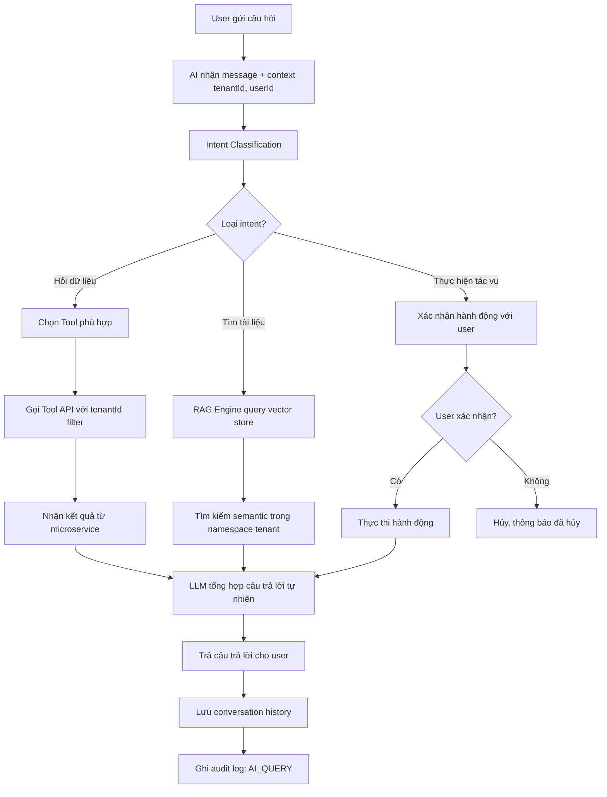
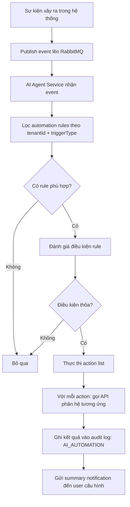
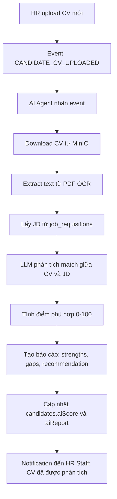

# SRS — Phân hệ AI Agent
# Trung tâm AI Điều phối Nghiệp vụ

**Phiên bản:** 1.0  
**Ngày tạo:** 09/05/2026  
**Tác giả:** Business Analyst  
**Sprint liên quan:** Sprint 13 (tích hợp toàn hệ thống); tích hợp từng phân hệ trong các sprint trước  
**Trạng thái:** Hoàn chỉnh  

---

## Mục lục

1. [Tổng quan phân hệ](#1-tổng-quan-phân-hệ)
2. [Đặc tả chức năng](#2-đặc-tả-chức-năng)
3. [Luồng nghiệp vụ](#3-luồng-nghiệp-vụ)
4. [Mô hình dữ liệu](#4-mô-hình-dữ-liệu)
5. [Validation và Business Rules](#5-validation-và-business-rules)
6. [Tích hợp và API](#6-tích-hợp-và-api)

---

## 1. Tổng quan phân hệ

### 1.1 Phạm vi và mục tiêu

**AI Agent** là thành phần xuyên suốt trong Open ERP, không phải phân hệ độc lập. Đây là lớp thông minh kết nối tất cả phân hệ, cung cấp khả năng tự động hóa nghiệp vụ, hỗ trợ ra quyết định và giao tiếp thông minh.

**5 nhiệm vụ cốt lõi:**

1. **Tự động hóa workflow**: Tự thực hiện các bước nghiệp vụ khi thỏa điều kiện
2. **Phân tích và cảnh báo**: Phát hiện bất thường, cảnh báo rủi ro sớm
3. **Hỗ trợ ra quyết định**: Cung cấp insight, dự báo, đề xuất hành động
4. **Giao tiếp thông minh**: Chatbot hỏi đáp nghiệp vụ bằng ngôn ngữ tự nhiên
5. **Tự động hóa báo cáo**: Sinh báo cáo, tóm tắt, biên bản

**Kiến trúc AI Agent:**

```
AI Agent Hub
├── Conversation Engine (OpenAI GPT-4 / Local LLM)
├── Tool Registry (công cụ theo phân hệ)
│   ├── system-admin-tools
│   ├── sale-logistics-tools
│   ├── hr-tools
│   ├── office-tools
│   ├── accounting-tools
│   └── dashboard-tools
├── Memory & Context (ngữ cảnh hội thoại)
│   ├── Short-term (session memory)
│   └── Long-term (user preference, tenant context)
├── RAG Engine (tìm kiếm tài liệu nội bộ)
│   └── Vector Store (Milvus / Qdrant)
└── Automation Scheduler (trigger-based workflow)
    ├── Event Triggers (từ RabbitMQ)
    ├── Schedule Triggers (cron)
    └── Condition Triggers (ngưỡng KPI)
```

### 1.2 Actors

| Actor | Mô tả |
|---|---|
| **Tất cả user** | Sử dụng AI Chatbot hỏi đáp nghiệp vụ |
| **Manager / Admin** | Cấu hình automation rules, nhận cảnh báo AI |
| **Tenant Admin** | Bật/tắt tính năng AI theo phân hệ |
| **System** | Nhận sự kiện từ các phân hệ → kích hoạt AI tự động |

### 1.3 Use Case tổng quan

| Nhóm | Use Case | Actor chính |
|---|---|---|
| **Chatbot** | Hỏi đáp dữ liệu nghiệp vụ | Tất cả user |
| **Chatbot** | Thực hiện tác vụ qua hội thoại | Tất cả user |
| **Chatbot** | Tra cứu tài liệu nội bộ (RAG) | Tất cả user |
| **Nhắc việc** | Nhắc deadline task sắp đến | AI tự động |
| **Nhắc việc** | Nhắc hợp đồng sắp hết hạn | AI tự động |
| **Nhắc việc** | Nhắc lịch kê khai thuế | AI tự động |
| **Cảnh báo** | Cảnh báo đăng nhập bất thường | AI tự động → Admin |
| **Cảnh báo** | Cảnh báo tồn kho thiếu/dư thừa | AI tự động → Manager |
| **Cảnh báo** | Cảnh báo bút toán sai lệch | AI tự động → Kế toán |
| **Cảnh báo** | Cảnh báo nhân viên rủi ro nghỉ việc | AI tự động → HR |
| **Phân tích** | Dự báo doanh số | Sale Manager |
| **Phân tích** | Dự báo dòng tiền | Chief Accountant |
| **Phân tích** | Phân tích KPI nhân sự | HR Manager |
| **Tự động hóa** | Sàng lọc CV tự động | AI tự động → HR |
| **Tự động hóa** | Tóm tắt văn bản/họp | AI tự động |
| **Tự động hóa** | Gợi ý định khoản kế toán | AI → Accountant |
| **Tự động hóa** | Gợi ý phân quyền theo chức danh | AI → Tenant Admin |
| **Báo cáo** | Sinh báo cáo tóm tắt điều hành | AI tự động theo lịch |
| **Cấu hình** | Bật/tắt tính năng AI | Tenant Admin |
| **Cấu hình** | Tạo automation rule | Tenant Admin, Manager |

---

## 2. Đặc tả chức năng

### 2.1 Nhóm: AI Chatbot Nghiệp vụ

#### F-AI-001: Hỏi đáp Nghiệp vụ (Conversational AI)

| Thuộc tính | Nội dung |
|---|---|
| **ID** | F-AI-001 |
| **Tên** | AI Chatbot hỏi đáp bằng ngôn ngữ tự nhiên |
| **Mô tả** | Người dùng đặt câu hỏi về dữ liệu nghiệp vụ; AI hiểu ý định, gọi tools phù hợp, trả lời bằng tiếng Việt |
| **Input** | `message` (string), `conversationId`, `tenantId`, `userId`, `activeModule` |
| **Output** | `response` (string), `sources` (danh sách nguồn dữ liệu), `suggestedActions` |
| **Ví dụ câu hỏi** | "Tháng này doanh số phòng sale bao nhiêu?", "Còn bao nhiêu ngày phép của tôi?", "Đơn hàng #DH-2026-001 đang ở đâu?" |
| **Business Rules** | AI chỉ trả lời dữ liệu user có quyền xem. Không tiết lộ dữ liệu tenant khác. BR-AI-004: Dữ liệu nhạy cảm không gửi ra LLM public nếu không được cấu hình |
| **Multi-tenancy** | Mọi query AI đều có `tenantId` trong context |

#### F-AI-002: Thực hiện Tác vụ qua Chat

| Thuộc tính | Nội dung |
|---|---|
| **ID** | F-AI-002 |
| **Tên** | AI thực hiện tác vụ khi người dùng yêu cầu qua chat |
| **Mô tả** | AI có thể tạo task, gửi nhắc nhở, tạo báo cáo... khi được yêu cầu rõ ràng |
| **Input** | `message` chứa lệnh rõ ràng (VD: "Tạo task nhắc họp sáng mai lúc 9h cho team sale") |
| **Output** | Xác nhận hành động sẽ thực hiện + yêu cầu người dùng confirm trước khi thực thi |
| **Business Rules** | BR-AI-001: AI phải xin xác nhận trước khi tạo/sửa/xóa dữ liệu. BR-AI-005: Không được bypass workflow approval |
| **Multi-tenancy** | Hành động thực hiện trong `tenantId` của user |

#### F-AI-003: Tra cứu Tài liệu Nội bộ (RAG)

| Thuộc tính | Nội dung |
|---|---|
| **ID** | F-AI-003 |
| **Tên** | Tìm kiếm và tổng hợp từ tài liệu nội bộ của tenant |
| **Mô tả** | Tài liệu của tenant được index vào vector store; AI tra cứu và tổng hợp câu trả lời kèm trích dẫn |
| **Input** | `query`, `filter`: `{ module, dateRange, documentType }` |
| **Output** | Câu trả lời tổng hợp + danh sách tài liệu nguồn có link |
| **Business Rules** | Chỉ index tài liệu user có quyền đọc. Dữ liệu vector store phân tách theo `tenantId` |
| **Multi-tenancy** | Vector store có namespace riêng theo `tenantId` |

---

### 2.2 Nhóm: Nhắc việc Thông minh (Smart Reminders)

#### F-AI-010: Nhắc Deadline Task

| Thuộc tính | Nội dung |
|---|---|
| **ID** | F-AI-010 |
| **Tên** | Tự động nhắc deadline task sắp đến hạn |
| **Mô tả** | AI xem xét deadline, load công việc hiện tại của assignee và ưu tiên để gửi nhắc việc thông minh |
| **Trigger** | Cron job mỗi 1 giờ, hoặc event khi task được tạo/cập nhật |
| **Output** | In-app notification + email (nếu priority HIGH) |
| **Business Rules** | Nhắc trước deadline: 24h, 2h. Nếu đã escalate → không nhắc lại. Tính toán "tải công việc" trước khi quyết định mức độ khẩn |
| **Multi-tenancy** | `tenantId` bắt buộc |

#### F-AI-011: Nhắc Hợp đồng Hết hạn

| Thuộc tính | Nội dung |
|---|---|
| **ID** | F-AI-011 |
| **Tên** | Nhắc hợp đồng lao động sắp hết hạn |
| **Trigger** | Cron hàng ngày 7:00 SA |
| **Output** | Notification + email đến HR Manager danh sách hợp đồng hết hạn trong 30 ngày và 7 ngày |
| **Business Rules** | Hai lần nhắc: 30 ngày và 7 ngày trước. Không nhắc hợp đồng đã được gia hạn |
| **Multi-tenancy** | Riêng theo `tenantId` |

#### F-AI-012: Nhắc Kê khai Thuế

| Thuộc tính | Nội dung |
|---|---|
| **ID** | F-AI-012 |
| **Tên** | Nhắc lịch kê khai và nộp thuế |
| **Trigger** | Cron hàng ngày, so sánh với lịch thuế định sẵn |
| **Output** | Notification đến Chief Accountant |
| **Lịch nhắc** | VAT hàng tháng: nhắc trước 5 ngày (deadline ngày 20 tháng sau). TNDN quý: nhắc trước 7 ngày |
| **Multi-tenancy** | Riêng theo `tenantId` |

---

### 2.3 Nhóm: Phát hiện Bất thường và Cảnh báo

#### F-AI-020: Cảnh báo Đăng nhập Bất thường

| Thuộc tính | Nội dung |
|---|---|
| **ID** | F-AI-020 |
| **Tên** | Phát hiện hành vi đăng nhập đáng ngờ |
| **Trigger** | Event từ auth-service sau mỗi lần đăng nhập |
| **Phát hiện** | IP khác quốc gia thường xuyên, giờ đăng nhập bất thường (nửa đêm), nhiều thiết bị cùng lúc, nhiều lần sai mật khẩu |
| **Output** | Cảnh báo in-app + email đến user và Tenant Admin |
| **Business Rules** | Xây dựng baseline hành vi đăng nhập 30 ngày gần nhất. Deviation > 2 standard deviations → cảnh báo |
| **Multi-tenancy** | `tenantId` và `userId` bắt buộc |

#### F-AI-021: Cảnh báo Tồn kho

| Thuộc tính | Nội dung |
|---|---|
| **ID** | F-AI-021 |
| **Tên** | Cảnh báo tồn kho thiếu hoặc dư thừa |
| **Trigger** | Sau mỗi phiếu nhập/xuất kho, hoặc cron hàng ngày |
| **Phát hiện** | `available < minStockLevel` → thiếu hàng. `available > maxStockLevel` → dư thừa (tính từ doanh số trung bình) |
| **Output** | Cảnh báo đến Warehouse Manager, gợi ý số lượng cần nhập thêm |
| **Business Rules** | `minStockLevel` cấu hình trên từng sản phẩm. Cảnh báo thiếu hàng ưu tiên cao hơn dư thừa |
| **Multi-tenancy** | `tenantId`, `warehouseId` |

#### F-AI-022: Phát hiện Bút toán Bất thường

| Thuộc tính | Nội dung |
|---|---|
| **ID** | F-AI-022 |
| **Tên** | Phát hiện bút toán kế toán bất thường |
| **Trigger** | Sau mỗi bút toán được POST |
| **Phát hiện** | Số tiền vượt ngưỡng bất thường (> mean + 3σ), định khoản trái chiều thông lệ, bút toán trùng lặp |
| **Output** | Cảnh báo đến Chief Accountant với giải thích lý do |
| **Business Rules** | BR-AI-003: Kèm giải thích tại sao AI cho rằng bất thường |
| **Multi-tenancy** | `tenantId` bắt buộc |

#### F-AI-023: Cảnh báo Rủi ro Nghỉ việc

| Thuộc tính | Nội dung |
|---|---|
| **ID** | F-AI-023 |
| **Tên** | Dự đoán nhân viên có nguy cơ nghỉ việc cao |
| **Trigger** | Cron hàng tuần |
| **Phân tích** | Tần suất nghỉ phép, đánh giá KPI thấp liên tiếp, thời gian làm việc tại công ty, biến động phòng ban gần đây |
| **Output** | Danh sách nhân viên rủi ro cao (top 10%), gửi confidential đến HR Manager |
| **Business Rules** | Điểm rủi ro 0–100. ≥ 70 → rủi ro cao. Không hiển thị cho manager trực tiếp (tránh bias) |
| **Multi-tenancy** | `tenantId` bắt buộc |

---

### 2.4 Nhóm: Hỗ trợ Quyết định và Dự báo

#### F-AI-030: Dự báo Doanh số

| Thuộc tính | Nội dung |
|---|---|
| **ID** | F-AI-030 |
| **Tên** | Dự báo doanh số cho kỳ tới |
| **Input** | `forecastPeriod` (next month/quarter), `department` hoặc `saleStaff` |
| **Output** | Dự báo doanh số kèm khoảng tin cậy 80%, yếu tố ảnh hưởng |
| **Business Rules** | Cần tối thiểu 6 tháng dữ liệu lịch sử. Xem xét seasonality, xu hướng, dữ liệu pipeline |
| **Multi-tenancy** | `tenantId` bắt buộc |

#### F-AI-031: Dự báo Dòng tiền

| Thuộc tính | Nội dung |
|---|---|
| **ID** | F-AI-031 |
| **Tên** | Dự báo dòng tiền vào/ra |
| **Input** | `forecastWeeks` (1–12 tuần) |
| **Output** | Chart dự báo thu/chi theo tuần, cảnh báo khi dự báo âm quỹ |
| **Business Rules** | Dựa trên: công nợ phải thu theo hạn, công nợ phải trả theo hạn, doanh số trung bình, chi phí cố định |
| **Multi-tenancy** | `tenantId` bắt buộc |

#### F-AI-032: Gợi ý Định khoản Kế toán

| Thuộc tính | Nội dung |
|---|---|
| **ID** | F-AI-032 |
| **Tên** | AI gợi ý định khoản từ nội dung chứng từ |
| **Input** | `description`, `amount`, `voucherType`, `counterpartyType` |
| **Output** | Gợi ý 1–3 bộ định khoản (debit/credit) kèm độ tin cậy (%) |
| **Business Rules** | BR-AI-001: Chỉ gợi ý, người dùng phải xác nhận. Học từ lịch sử định khoản của tenant |
| **Multi-tenancy** | Model học theo `tenantId` (không chia sẻ giữa tenants) |

#### F-AI-033: Sàng lọc CV Tự động

| Thuộc tính | Nội dung |
|---|---|
| **ID** | F-AI-033 |
| **Tên** | AI sàng lọc và chấm điểm CV ứng viên |
| **Trigger** | Tự động khi HR upload CV mới |
| **Input** | `cvFileUrl` (PDF), `jobRequisitionId` (JD) |
| **Output** | Điểm phù hợp 0–100, điểm mạnh/yếu so với JD, đề xuất stage (tiến/loại) |
| **Business Rules** | Điểm dựa trên: kỹ năng match, kinh nghiệm, học vấn. Không phân biệt theo giới tính/tuổi. Kết quả chỉ là tham khảo, HR quyết định cuối |
| **Multi-tenancy** | JD thuộc `tenantId` |

---

### 2.5 Nhóm: Tự động hóa và Báo cáo

#### F-AI-040: Tóm tắt Văn bản / Họp

| Thuộc tính | Nội dung |
|---|---|
| **ID** | F-AI-040 |
| **Tên** | AI tự động tóm tắt nội dung tài liệu và cuộc họp |
| **Input** | `contentType` (DOCUMENT/MEETING_TRANSCRIPT), `content` hoặc `fileId` |
| **Output** | Bản tóm tắt 200–500 từ, các điểm chính (key points), action items (với họp) |
| **Business Rules** | Tài liệu dài > 5 trang → tóm tắt theo phần. Họp > 60 phút → tóm tắt theo từng agenda item |
| **Multi-tenancy** | `tenantId` bắt buộc |

#### F-AI-041: Sinh Báo cáo Điều hành Tự động

| Thuộc tính | Nội dung |
|---|---|
| **ID** | F-AI-041 |
| **Tên** | Tự động sinh báo cáo điều hành định kỳ |
| **Trigger** | Cron: mỗi thứ Hai 8:00 SA (báo cáo tuần), mùng 1 hàng tháng (báo cáo tháng) |
| **Output** | Báo cáo gồm: highlight kỳ vừa qua, so sánh với kỳ trước, cảnh báo cần chú ý, gợi ý hành động |
| **Business Rules** | Gửi email đến CEO, các trưởng phòng trong danh sách cấu hình. Có thể preview trước khi gửi |
| **Multi-tenancy** | Riêng theo `tenantId`, theo cấu hình người nhận |

#### F-AI-042: Automation Rules

| Thuộc tính | Nội dung |
|---|---|
| **ID** | F-AI-042 |
| **Tên** | Tạo và quản lý quy tắc tự động hóa |
| **Mô tả** | Tenant Admin tạo rule: khi [điều kiện] → AI thực hiện [hành động] |
| **Input** | `triggerType` (EVENT/SCHEDULE/CONDITION), `triggerConfig`, `conditionRules[]`, `actions[]`: `{ actionType, params }` |
| **Output** | Rule được lưu và kích hoạt |
| **Ví dụ rule** | "Khi đơn hàng vượt 100 triệu → tạo task phê duyệt cho Sale Director"; "Mỗi thứ Sáu → gửi tóm tắt tiến độ dự án cho PM" |
| **Business Rules** | BR-AI-005: Automation không được bypass workflow approval. Tối đa 50 rules/tenant |
| **Multi-tenancy** | Rules thuộc `tenantId` |

---

## 3. Luồng nghiệp vụ

### 3.1 Luồng: AI Chatbot xử lý câu hỏi nghiệp vụ



---

### 3.2 Luồng: Automation Rule kích hoạt



---

### 3.3 Luồng: Sàng lọc CV tự động



---

## 4. Mô hình dữ liệu

### 4.1 Collection: `ai_conversations`

| Trường | Kiểu | Bắt buộc | Mô tả |
|---|---|---|---|
| `_id` | ObjectId | Có | conversationId |
| `tenantId` | ObjectId | Có | |
| `userId` | ObjectId | Có | |
| `title` | string | Không | Tiêu đề cuộc hội thoại (auto-generated) |
| `messages` | array | Có | `[{ role: 'user'/'assistant'/'system', content, createdAt, toolCalls, sources }]` |
| `context` | object | Không | `{ activeModule, relatedEntityId }` |
| `totalTokens` | number | Không | Theo dõi chi phí API |
| `isActive` | boolean | Có | |
| `createdAt` | Date | Có | |
| `updatedAt` | Date | Có | |

**Indexes:** `(tenantId, userId)`, `(tenantId, createdAt)`

---

### 4.2 Collection: `ai_automation_rules`

| Trường | Kiểu | Bắt buộc | Mô tả |
|---|---|---|---|
| `_id` | ObjectId | Có | ruleId |
| `tenantId` | ObjectId | Có | |
| `name` | string | Có | |
| `description` | string | Không | |
| `isActive` | boolean | Có | |
| `triggerType` | string (enum) | Có | `EVENT` \| `SCHEDULE` \| `CONDITION` |
| `triggerConfig` | object | Có | Theo `triggerType`: eventName / cronExpression / conditionExpression |
| `conditions` | array | Không | `[{ field, operator, value }]` |
| `actions` | array | Có | `[{ actionType, targetService, params }]` |
| `lastTriggeredAt` | Date | Không | |
| `triggerCount` | number | Có | Đếm số lần kích hoạt |
| `createdBy` | ObjectId | Có | |
| `createdAt` | Date | Có | |
| `updatedAt` | Date | Có | |

**Indexes:** `(tenantId, isActive)`, `(tenantId, triggerType)`

---

### 4.3 Collection: `ai_insights`

| Trường | Kiểu | Bắt buộc | Mô tả |
|---|---|---|---|
| `_id` | ObjectId | Có | |
| `tenantId` | ObjectId | Có | |
| `insightType` | string (enum) | Có | `ALERT` \| `FORECAST` \| `RECOMMENDATION` \| `ANOMALY` |
| `module` | string | Có | Phân hệ liên quan |
| `title` | string | Có | |
| `content` | string | Có | Nội dung chi tiết |
| `severity` | string (enum) | Không | `INFO` \| `WARNING` \| `CRITICAL` |
| `data` | object | Không | Dữ liệu hỗ trợ (biểu đồ, số liệu) |
| `isRead` | boolean | Có | |
| `targetUserIds` | ObjectId[] | Có | Người nhận |
| `expiresAt` | Date | Không | |
| `createdAt` | Date | Có | |

**Indexes:** `(tenantId, module, insightType)`, `(tenantId, targetUserIds, isRead)`, `createdAt` (TTL: 90 ngày)

---

### 4.4 Collection: `ai_suggestion_feedback`

| Trường | Kiểu | Bắt buộc | Mô tả |
|---|---|---|---|
| `_id` | ObjectId | Có | |
| `tenantId` | ObjectId | Có | |
| `userId` | ObjectId | Có | |
| `suggestionType` | string | Có | `JOURNAL_ENTRY` \| `PERMISSION` \| `TASK_ASSIGNEE` \| ... |
| `suggestionData` | object | Có | Nội dung gợi ý ban đầu |
| `wasAccepted` | boolean | Có | Người dùng chấp nhận hay từ chối |
| `actualData` | object | Không | Dữ liệu thực tế người dùng nhập (để học) |
| `createdAt` | Date | Có | |

**Indexes:** `(tenantId, suggestionType, wasAccepted)`, `(tenantId, userId)`

---

### 4.5 Collection: `ai_token_usage`

| Trường | Kiểu | Bắt buộc | Mô tả |
|---|---|---|---|
| `_id` | ObjectId | Có | |
| `tenantId` | ObjectId | Có | |
| `userId` | ObjectId | Không | |
| `feature` | string | Có | Tính năng dùng token |
| `model` | string | Có | LLM model sử dụng |
| `promptTokens` | number | Có | |
| `completionTokens` | number | Có | |
| `totalTokens` | number | Có | |
| `cost` | number | Không | Chi phí ước tính (USD) |
| `createdAt` | Date | Có | |

**Indexes:** `(tenantId, createdAt)`, `(tenantId, feature)` — TTL: 1 năm

---

## 5. Validation và Business Rules

### 5.1 Business Rules

| Mã | Rule | Chi tiết |
|---|---|---|
| BR-AI-001 | AI chỉ đề xuất, không tự thực thi tài chính/nhân sự | Mọi hành động tác động dữ liệu phải có xác nhận người dùng |
| BR-AI-002 | Audit log cho AI actions | Mọi hành động AI thực hiện → audit log với `actorType: AI_AGENT` |
| BR-AI-003 | Explainability | AI phải giải thích được lý do đề xuất khi người dùng hỏi |
| BR-AI-004 | Bảo mật dữ liệu nhạy cảm | Dữ liệu lương, CCCD, tài khoản ngân hàng không được gửi sang LLM public |
| BR-AI-005 | Không bypass workflow | AI automation không thể phê duyệt thay con người trong workflow approval |
| BR-AI-006 | Tenant control | Tenant Admin có thể tắt từng tính năng AI. Khi tắt → tất cả trigger liên quan bị disable |
| BR-AI-007 | Rate limiting | Tối đa 100 AI requests/user/giờ. Tối đa 1.000 requests/tenant/giờ |
| BR-AI-008 | Token budget | Mỗi tenant có monthly token budget theo gói dịch vụ. Khi vượt 80% → cảnh báo Admin |

### 5.2 Dữ liệu nhạy cảm không được gửi ra OpenAI

| Loại dữ liệu | Mô tả |
|---|---|
| Số CCCD/CMND | Thông tin cá nhân nhạy cảm |
| Số tài khoản ngân hàng | Thông tin tài chính |
| Mức lương cụ thể | Thông tin nhân sự nhạy cảm |
| Mã số thuế cá nhân | Thông tin pháp lý |
| Mật khẩu, token, API key | Bí mật bảo mật |

**Xử lý:** Anonymize/mask trước khi gửi LLM; dùng Local LLM cho queries liên quan.

---

## 6. Tích hợp và API

### 6.1 Tích hợp LLM

| Provider | Mục đích | Ghi chú |
|---|---|---|
| **OpenAI GPT-4o** | Conversational AI, tóm tắt, phân tích | Default provider |
| **OpenAI text-embedding-3-small** | Tạo vector cho RAG | |
| **Local LLM (Ollama + Llama 3)** | Dữ liệu nhạy cảm | Optional, phụ thuộc cấu hình |

**LangChain framework:** Orchestration, tool calling, memory management, RAG chain

### 6.2 Vector Store

| Thành phần | Mô tả |
|---|---|
| **Qdrant / Milvus** | Vector database để lưu embeddings tài liệu |
| **Namespace** | Mỗi tenant có namespace riêng trong vector store |
| **Index** | Tài liệu Office, wiki nội bộ, FAQ, SOP |
| **Refresh** | Re-index khi tài liệu cập nhật |

### 6.3 Tools Registry (danh sách tools AI có thể gọi)

| Tool | Phân hệ | Mô tả |
|---|---|---|
| `get_sales_kpi` | Sale | Lấy KPI doanh số |
| `get_inventory_status` | Sale | Kiểm tra tồn kho |
| `get_my_tasks` | Office | Danh sách task của user |
| `create_task` | Office | Tạo task mới (cần confirm) |
| `get_leave_balance` | HR | Số ngày phép còn lại |
| `get_employee_list` | HR | Danh sách nhân viên |
| `get_ar_summary` | Accounting | Tóm tắt công nợ phải thu |
| `suggest_journal_entry` | Accounting | Gợi ý định khoản |
| `get_audit_log` | System Admin | Xem audit log gần nhất |
| `send_notification` | Office | Gửi thông báo (cần confirm) |

### 6.4 Event Topics (RabbitMQ)

| Topic | Trigger AI | Mô tả |
|---|---|---|
| `auth.login.success` | F-AI-020 | Phân tích hành vi đăng nhập |
| `inventory.movement.confirmed` | F-AI-021 | Kiểm tra ngưỡng tồn kho |
| `accounting.journal.posted` | F-AI-022 | Phát hiện bút toán bất thường |
| `hr.candidate.cv_uploaded` | F-AI-033 | Sàng lọc CV tự động |
| `office.meeting.completed` | F-AI-040 | Tóm tắt họp |
| `sale.order.created` | Automation | Kiểm tra automation rules |
| `hr.contract.expiry_approaching` | F-AI-011 | Nhắc gia hạn hợp đồng |

### 6.5 API nội bộ AI Agent xuất ra

| Endpoint | Method | Mô tả |
|---|---|---|
| `/ai/chat` | POST | Gửi tin nhắn đến chatbot |
| `/ai/chat/{conversationId}/history` | GET | Lịch sử hội thoại |
| `/ai/insights` | GET | Danh sách AI insights |
| `/ai/automation-rules` | GET/POST | Quản lý automation rules |
| `/ai/summarize` | POST | Yêu cầu tóm tắt tài liệu |
| `/ai/suggest/journal-entry` | POST | Gợi ý định khoản |
| `/ai/forecast/sales` | GET | Dự báo doanh số |
| `/ai/forecast/cashflow` | GET | Dự báo dòng tiền |
