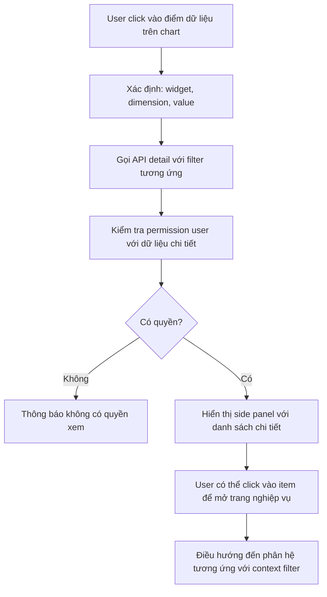

# SRS — Phân hệ Dashboard

# Bảng điều khiển và Báo cáo Thời gian thực

**Phiên bản:** 1.0  
**Ngày tạo:** 09/05/2026  
**Tác giả:** Business Analyst  
**Sprint liên quan:** Sprint 14  
**Trạng thái:** Hoàn chỉnh

---

## Mục lục

1. [Tổng quan phân hệ](#1-tổng-quan-phân-hệ)
2. [Đặc tả chức năng](#2-đặc-tả-chức-năng)
3. [Luồng nghiệp vụ](#3-luồng-nghiệp-vụ)
4. [Mô hình dữ liệu](#4-mô-hình-dữ-liệu)
5. [Validation và Business Rules](#5-validation-và-business-rules)
6. [Tích hợp và API](#6-tích-hợp-và-api)

---

## 1. Tổng quan phân hệ

### 1.1 Phạm vi và mục tiêu

Phân hệ **Dashboard** là lớp trình bày dữ liệu tổng hợp từ tất cả phân hệ, cung cấp cái nhìn toàn diện về tình trạng hoạt động của doanh nghiệp theo thời gian thực.

**Mục tiêu:**

- Cung cấp dashboard cá nhân hóa theo vai trò người dùng
- Hiển thị KPI quan trọng theo thời gian thực với khả năng drill-down
- Hỗ trợ ra quyết định qua AI insights tích hợp
- Cho phép tùy chỉnh widget, bố cục theo nhu cầu cá nhân
- Hỗ trợ export PDF/Excel, chia sẻ báo cáo

**Nguyên tắc thiết kế:**

- **Read-only**: Dashboard chỉ đọc dữ liệu, không tác động nghiệp vụ
- **Performance**: Dữ liệu nặng dùng materialized views (pre-computed), cập nhật định kỳ
- **Real-time**: KPI quan trọng cập nhật qua Socket.IO (mỗi 30 giây)
- **Permission-scoped**: Mỗi widget chỉ hiển thị dữ liệu user có quyền xem

### 1.2 Actors

| Actor                      | Dashboard mặc định   | Ghi chú                                |
| -------------------------- | -------------------- | -------------------------------------- |
| **CEO / Giám đốc**         | Executive Dashboard  | Tổng quan toàn công ty                 |
| **Sale Manager**           | Sales Dashboard      | Doanh số, pipeline, KPI sale           |
| **HR Manager**             | HR Dashboard         | Nhân sự, chấm công, tuyển dụng         |
| **Chief Accountant**       | Accounting Dashboard | Tài chính, công nợ, dòng tiền          |
| **Warehouse Manager**      | Inventory Dashboard  | Tồn kho, nhập xuất                     |
| **Project Manager**        | Office Dashboard     | Tiến độ dự án, task                    |
| **Nhân viên thông thường** | My Dashboard         | Cá nhân: task của tôi, lịch, thông báo |
| **Tenant Admin**           | Admin Dashboard      | Hệ thống, người dùng, sử dụng          |

### 1.3 Use Case tổng quan

| Nhóm                  | Use Case                        | Actor chính       |
| --------------------- | ------------------------------- | ----------------- |
| **Xem Dashboard**     | Xem Executive Dashboard         | CEO               |
| **Xem Dashboard**     | Xem Sales Dashboard             | Sale Manager      |
| **Xem Dashboard**     | Xem HR Dashboard                | HR Manager        |
| **Xem Dashboard**     | Xem Accounting Dashboard        | Chief Accountant  |
| **Xem Dashboard**     | Xem Inventory Dashboard         | Warehouse Manager |
| **Xem Dashboard**     | Xem My Dashboard                | Mọi user          |
| **Tùy chỉnh**         | Thêm/xóa/sắp xếp widget         | Mọi user          |
| **Tùy chỉnh**         | Lưu layout cá nhân              | Mọi user          |
| **Tùy chỉnh**         | Tạo dashboard custom            | Manager trở lên   |
| **Lọc và Drill-down** | Lọc theo khoảng thời gian       | Mọi user          |
| **Lọc và Drill-down** | Click vào chart → xem chi tiết  | Mọi user          |
| **Lọc và Drill-down** | So sánh kỳ hiện tại vs kỳ trước | Mọi user          |
| **Export**            | Xuất PDF / Excel                | Manager trở lên   |
| **Chia sẻ**           | Chia sẻ báo cáo snapshot        | Manager trở lên   |
| **Cảnh báo KPI**      | Cấu hình ngưỡng cảnh báo KPI    | Manager           |
| **AI Insights**       | Xem gợi ý và phân tích từ AI    | Manager trở lên   |

---

## 2. Đặc tả chức năng

### 2.1 Nhóm: Dashboard Theo Vai trò

#### F-DB-001: Executive Dashboard (CEO)

| Thuộc tính           | Nội dung                                                      |
| -------------------- | ------------------------------------------------------------- |
| **ID**               | F-DB-001                                                      |
| **Tên**              | Bảng điều khiển điều hành                                     |
| **Đối tượng**        | CEO, Giám đốc, Board                                          |
| **Widgets mặc định** | (xem chi tiết bên dưới)                                       |
| **Business Rules**   | Hiển thị dữ liệu toàn công ty. CEO thấy được tất cả phòng ban |

**Danh sách widgets mặc định:**

| Widget                             | Nguồn dữ liệu               | Loại biểu đồ         |
| ---------------------------------- | --------------------------- | -------------------- |
| Doanh thu tháng này vs tháng trước | `kpi_snapshots` (Sale)      | KPI card + sparkline |
| Doanh thu tích lũy năm             | `journal_entries` (AC)      | Area chart           |
| Số nhân viên hiện tại + biến động  | `employees` (HR)            | KPI card             |
| Top 5 sản phẩm bán chạy            | `sales_orders` (SL)         | Horizontal bar chart |
| Công nợ phải thu quá hạn           | `kpi_snapshots` (AC)        | KPI card + danh sách |
| Công nợ phải trả sắp đến hạn       | `kpi_snapshots` (AC)        | KPI card             |
| Tỷ lệ hoàn thành KPI nhân sự       | `kpi_snapshots` (HR)        | Gauge chart          |
| Task quan trọng chưa hoàn thành    | `tasks` (OF)                | Danh sách            |
| AI Insights & Cảnh báo             | `ai_insights`               | Alert list           |
| Dự báo doanh số tháng tới          | `ai_insights` (AI forecast) | Line chart           |

---

#### F-DB-002: Sales Dashboard

| Thuộc tính    | Nội dung                 |
| ------------- | ------------------------ |
| **ID**        | F-DB-002                 |
| **Tên**       | Bảng điều khiển bán hàng |
| **Đối tượng** | Sale Manager, Sale Staff |

**Danh sách widgets:**

| Widget                                    | Nguồn dữ liệu          | Loại biểu đồ        |
| ----------------------------------------- | ---------------------- | ------------------- |
| Doanh số cá nhân / team                   | `sales_orders` (SL)    | KPI card, bar chart |
| Pipeline: số lượng báo giá theo giai đoạn | `sales_orders` (SL)    | Funnel chart        |
| Tỷ lệ chuyển đổi báo giá → đơn hàng       | `kpi_snapshots`        | KPI card + trend    |
| Top khách hàng theo doanh số              | `sales_orders`         | Horizontal bar      |
| Đơn hàng cần xử lý hôm nay                | `sales_orders`         | Danh sách           |
| Tồn kho các mặt hàng bán chạy             | `kpi_snapshots` (SL)   | Table               |
| Đơn giao đang trễ                         | `delivery_orders` (SL) | Alert list          |
| Dự báo doanh số 30 ngày tới               | `ai_insights`          | Line chart          |

---

#### F-DB-003: HR Dashboard

| Thuộc tính    | Nội dung                |
| ------------- | ----------------------- |
| **ID**        | F-DB-003                |
| **Tên**       | Bảng điều khiển nhân sự |
| **Đối tượng** | HR Manager              |

**Danh sách widgets:**

| Widget                           | Nguồn dữ liệu               | Loại biểu đồ         |
| -------------------------------- | --------------------------- | -------------------- |
| Tổng nhân viên / Biến động tháng | `employees` (HR)            | KPI card             |
| Tỷ lệ chấm công hôm nay          | `attendance_records` (HR)   | Gauge + bar          |
| Đơn nghỉ phép chờ duyệt          | `leave_requests` (HR)       | KPI card + danh sách |
| Hợp đồng hết hạn trong 30 ngày   | `employment_contracts` (HR) | Alert list           |
| Vị trí tuyển dụng đang mở        | `job_requisitions` (HR)     | KPI card             |
| CV mới nhận tuần này             | `job_candidates` (HR)       | KPI card             |
| Phân bố nhân sự theo phòng ban   | `employees`                 | Pie chart            |
| Nhân viên rủi ro nghỉ việc (AI)  | `ai_insights`               | Confidential list    |

---

#### F-DB-004: Accounting Dashboard

| Thuộc tính    | Nội dung                     |
| ------------- | ---------------------------- |
| **ID**        | F-DB-004                     |
| **Tên**       | Bảng điều khiển kế toán      |
| **Đối tượng** | Chief Accountant, Accountant |

**Danh sách widgets:**

| Widget                               | Nguồn dữ liệu        | Loại biểu đồ    |
| ------------------------------------ | -------------------- | --------------- |
| Dòng tiền vào/ra tháng này           | `kpi_snapshots` (AC) | Waterfall chart |
| Công nợ phải thu quá hạn (phân nhóm) | `kpi_snapshots` (AC) | Stacked bar     |
| Công nợ phải trả sắp đến hạn         | `kpi_snapshots` (AC) | Timeline        |
| Số dư quỹ tiền mặt                   | `kpi_snapshots` (AC) | KPI card        |
| Số dư tài khoản ngân hàng            | `bank_accounts` (AC) | KPI card list   |
| Hóa đơn điện tử chờ ký / lỗi         | `invoices` (AC)      | Alert list      |
| Chi phí theo danh mục tháng này      | `kpi_snapshots` (AC) | Donut chart     |
| Trạng thái kê khai thuế              | `ai_insights` (AI)   | Alert list      |
| Dự báo dòng tiền 4 tuần              | `ai_insights` (AI)   | Line chart      |

---

#### F-DB-005: My Dashboard (Nhân viên)

| Thuộc tính    | Nội dung                |
| ------------- | ----------------------- |
| **ID**        | F-DB-005                |
| **Tên**       | Bảng điều khiển cá nhân |
| **Đối tượng** | Mọi nhân viên           |

**Danh sách widgets:**

| Widget                       | Nguồn dữ liệu             | Loại biểu đồ       |
| ---------------------------- | ------------------------- | ------------------ |
| Task của tôi hôm nay         | `tasks` (OF)              | Danh sách ưu tiên  |
| Task trễ deadline            | `tasks` (OF)              | Alert list         |
| Lịch họp hôm nay và ngày mai | `meetings` (OF)           | Calendar mini      |
| Ngày phép còn lại            | `leave_balances` (HR)     | KPI card           |
| Thông báo chưa đọc           | `notifications`           | Count badge + list |
| Chấm công tháng này          | `attendance_records` (HR) | Calendar heatmap   |

---

### 2.2 Nhóm: Tùy chỉnh Dashboard

#### F-DB-010: Quản lý Widget và Layout

| Thuộc tính         | Nội dung                                                             |
| ------------------ | -------------------------------------------------------------------- |
| **ID**             | F-DB-010                                                             |
| **Tên**            | Kéo-thả, thêm/xóa widget, thay đổi kích thước                        |
| **Input**          | `dashboardId`, `widgets[]`: `{ widgetId, position: { x, y, w, h } }` |
| **Output**         | Layout được lưu cho user, hiển thị ngay lập tức                      |
| **Business Rules** | Lưu layout per user per dashboard. User có thể reset về default      |
| **Multi-tenancy**  | `tenantId` + `userId`                                                |

#### F-DB-011: Bộ lọc Thời gian và Phạm vi

| Thuộc tính         | Nội dung                                                                                               |
| ------------------ | ------------------------------------------------------------------------------------------------------ |
| **ID**             | F-DB-011                                                                                               |
| **Tên**            | Lọc toàn dashboard theo khoảng thời gian và phạm vi                                                    |
| **Input**          | `dateRange` (preset: TODAY/THIS_WEEK/THIS_MONTH/THIS_QUARTER/THIS_YEAR/CUSTOM), `department`, `branch` |
| **Output**         | Tất cả widgets refresh với dữ liệu trong bộ lọc                                                        |
| **Business Rules** | CUSTOM range tối đa 365 ngày. Bộ lọc áp dụng real-time, không cần reload trang                         |
| **Multi-tenancy**  | `tenantId`, phạm vi phòng ban theo quyền                                                               |

#### F-DB-012: So sánh Kỳ

| Thuộc tính         | Nội dung                                                                  |
| ------------------ | ------------------------------------------------------------------------- |
| **ID**             | F-DB-012                                                                  |
| **Tên**            | So sánh dữ liệu hiện tại với kỳ trước                                     |
| **Input**          | `comparisonType`: `PREVIOUS_PERIOD` \| `SAME_PERIOD_LAST_YEAR`            |
| **Output**         | Trên mỗi KPI card: số hiện tại + số kỳ so sánh + % thay đổi + trend arrow |
| **Business Rules** | Màu xanh: tăng tốt (doanh thu tăng, chi phí giảm). Màu đỏ: ngược lại      |
| **Multi-tenancy**  | `tenantId`                                                                |

---

### 2.3 Nhóm: Drill-down và Chi tiết

#### F-DB-020: Drill-down từ Chart

| Thuộc tính         | Nội dung                                                                                                                                                |
| ------------------ | ------------------------------------------------------------------------------------------------------------------------------------------------------- |
| **ID**             | F-DB-020                                                                                                                                                |
| **Tên**            | Click vào điểm dữ liệu trên chart để xem chi tiết                                                                                                       |
| **Mô tả**          | Click vào bar "Doanh số tháng 5" → mở side panel danh sách đơn hàng tháng 5. Click vào pie slice "Chi phí thuê văn phòng" → danh sách phiếu chi loại đó |
| **Output**         | Side panel hoặc modal với danh sách chi tiết, có thể click tiếp để đến trang nghiệp vụ                                                                  |
| **Business Rules** | Chi tiết chỉ hiển thị dữ liệu user có quyền. Link đến trang nghiệp vụ mở trong tab mới                                                                  |
| **Multi-tenancy**  | `tenantId` + permissions                                                                                                                                |

---

### 2.4 Nhóm: Export và Chia sẻ

#### F-DB-030: Export Báo cáo

| Thuộc tính         | Nội dung                                                        |
| ------------------ | --------------------------------------------------------------- |
| **ID**             | F-DB-030                                                        |
| **Tên**            | Xuất dashboard hiện tại ra PDF hoặc Excel                       |
| **Input**          | `format` (PDF/EXCEL), `includedWidgets[]`, `dateRange`          |
| **Output**         | File tải về với đầy đủ số liệu và biểu đồ                       |
| **Business Rules** | PDF: render chart thành ảnh. Excel: data tables của từng widget |
| **Multi-tenancy**  | File xuất thuộc `tenantId`                                      |

#### F-DB-031: Cảnh báo KPI

| Thuộc tính         | Nội dung                                                                                                  |
| ------------------ | --------------------------------------------------------------------------------------------------------- |
| **ID**             | F-DB-031                                                                                                  |
| **Tên**            | Cấu hình ngưỡng cảnh báo cho KPI                                                                          |
| **Input**          | `kpiId`, `threshold`, `conditionType` (BELOW/ABOVE/CHANGE_PERCENT), `notificationChannels` (IN_APP/EMAIL) |
| **Output**         | Cảnh báo khi KPI vượt/thấp hơn ngưỡng                                                                     |
| **Business Rules** | Không cảnh báo quá 1 lần/giờ cho cùng 1 KPI. Cảnh báo gửi đến user cấu hình và manager trực tiếp          |
| **Multi-tenancy**  | `tenantId`, `userId`                                                                                      |

---

## 3. Luồng nghiệp vụ

### 3.1 Luồng: Tải và hiển thị Dashboard

```mermaid
flowchart TD
    A[User truy cập Dashboard] --> B[Hệ thống xác định role của user]
    B --> C[Load cấu hình dashboard: dashboardId, widgetLayout]
    C --> D[Với mỗi widget song song]
    D --> E1[Widget 1: Query kpi_snapshots]
    D --> E2[Widget 2: Query live data APIs]
    D --> E3[Widget N: Query AI insights]
    E1 --> F[Kiểm tra permission: tenantId + userPermissions]
    E2 --> F
    E3 --> F
    F --> G{Có quyền xem?}
    G -->|Không| H[Widget hiển thị locked/hidden]
    G -->|Có| I[Render chart/card/list]
    I --> J[Dashboard hiển thị đầy đủ]
    J --> K[Subscribe Socket.IO room: dashboard-{tenantId}]
    K --> L[Tự động refresh khi nhận event]
```

---

### 3.2 Luồng: Real-time Update qua Socket.IO

```mermaid
flowchart TD
    A[Sự kiện nghiệp vụ xảy ra] --> B[Microservice publish event lên RabbitMQ]
    B --> C[Dashboard Aggregator Service nhận event]
    C --> D[Cập nhật kpi_snapshots trong MongoDB]
    D --> E[Publish event qua Socket.IO]
    E --> F[Socket.IO phát đến room: dashboard-{tenantId}]
    F --> G[Browser nhận event: dashboard:kpi_updated]
    G --> H[Xác định widget nào cần refresh]
    H --> I[Fetch dữ liệu mới cho widget đó]
    I --> J[Cập nhật chart/card không reload trang]
```

---

### 3.3 Luồng: Drill-down Chi tiết



---

## 4. Mô hình dữ liệu

### 4.1 Collection: `dashboard_configs`

| Trường          | Kiểu          | Bắt buộc | Mô tả                                                                                         |
| --------------- | ------------- | -------- | --------------------------------------------------------------------------------------------- |
| `_id`           | ObjectId      | Có       |                                                                                               |
| `tenantId`      | ObjectId      | Có       |                                                                                               |
| `userId`        | ObjectId      | Có       |                                                                                               |
| `dashboardType` | string (enum) | Có       | `EXECUTIVE` \| `SALES` \| `HR` \| `ACCOUNTING` \| `INVENTORY` \| `OFFICE` \| `MY` \| `CUSTOM` |
| `name`          | string        | Có       | Tên dashboard                                                                                 |
| `isDefault`     | boolean       | Có       | Dashboard mặc định của role                                                                   |
| `widgets`       | array         | Có       | `[{ widgetId, widgetType, position: { x, y, w, h }, config: {...}, isVisible }]`              |
| `filters`       | object        | Không    | `{ dateRange, department, branch }` — bộ lọc mặc định                                         |
| `theme`         | string        | Không    | Light/dark/custom                                                                             |
| `createdAt`     | Date          | Có       |                                                                                               |
| `updatedAt`     | Date          | Có       |                                                                                               |

**Indexes:** `(tenantId, userId, dashboardType)` (unique per user per type), `(tenantId, userId)`

---

### 4.2 Collection: `kpi_snapshots`

| Trường          | Kiểu     | Bắt buộc | Mô tả                                                           |
| --------------- | -------- | -------- | --------------------------------------------------------------- |
| `_id`           | ObjectId | Có       |                                                                 |
| `tenantId`      | ObjectId | Có       |                                                                 |
| `kpiKey`        | string   | Có       | Key định danh KPI (VD: `sales.monthly_revenue`, `hr.headcount`) |
| `module`        | string   | Có       | Phân hệ nguồn                                                   |
| `dimension`     | object   | Không    | `{ period, department, warehouse, ... }` — chiều phân tích      |
| `value`         | number   | Có       | Giá trị KPI                                                     |
| `previousValue` | number   | Không    | Giá trị kỳ trước                                                |
| `changePercent` | number   | Không    | % thay đổi                                                      |
| `metadata`      | object   | Không    | Dữ liệu bổ sung (top items, breakdown...)                       |
| `computedAt`    | Date     | Có       | Thời điểm tính                                                  |
| `validUntil`    | Date     | Không    | TTL cho snapshot                                                |

**Indexes:** `(tenantId, kpiKey, dimension.period)` (unique), `(tenantId, module)`, `computedAt` (TTL: 2 năm)

---

### 4.3 Collection: `kpi_alert_configs`

| Trường          | Kiểu          | Bắt buộc | Mô tả                                                                  |
| --------------- | ------------- | -------- | ---------------------------------------------------------------------- |
| `_id`           | ObjectId      | Có       |                                                                        |
| `tenantId`      | ObjectId      | Có       |                                                                        |
| `userId`        | ObjectId      | Có       | Người cấu hình                                                         |
| `kpiKey`        | string        | Có       |                                                                        |
| `threshold`     | number        | Có       |                                                                        |
| `conditionType` | string (enum) | Có       | `BELOW` \| `ABOVE` \| `CHANGE_PERCENT_BELOW` \| `CHANGE_PERCENT_ABOVE` |
| `channels`      | string[]      | Có       | `['IN_APP', 'EMAIL']`                                                  |
| `isActive`      | boolean       | Có       |                                                                        |
| `lastAlertedAt` | Date          | Không    |                                                                        |
| `createdAt`     | Date          | Có       |                                                                        |

**Indexes:** `(tenantId, userId, kpiKey)` (unique), `(tenantId, isActive)`

---

## 5. Validation và Business Rules

### 5.1 Business Rules

| Mã        | Rule                       | Chi tiết                                                                      |
| --------- | -------------------------- | ----------------------------------------------------------------------------- |
| BR-DB-001 | Phạm vi dữ liệu theo quyền | Widget chỉ hiển thị dữ liệu user có quyền xem theo RBAC                       |
| BR-DB-002 | Tối đa 30 giây refresh     | Tự động refresh real-time không quá mỗi 30 giây để tránh tải server           |
| BR-DB-003 | Không bypass permissions   | Click drill-down không được hiển thị dữ liệu vượt quyền user                  |
| BR-DB-004 | Nhất quán với nguồn        | Số liệu dashboard phải nhất quán với dữ liệu nguồn (sai lệch < 5 phút)        |
| BR-DB-005 | Tối đa widget              | Mỗi dashboard tối đa 20 widgets. Thêm quá giới hạn → thông báo lỗi            |
| BR-DB-006 | Chia sẻ snapshot           | Báo cáo chia sẻ là snapshot tại thời điểm tạo. Người nhận không cần tài khoản |

### 5.2 KPI Performance

| Loại dữ liệu                        | Nguồn                        | Tần suất cập nhật          |
| ----------------------------------- | ---------------------------- | -------------------------- |
| KPI tổng hợp (doanh thu, headcount) | `kpi_snapshots`              | Mỗi 5 phút (scheduled job) |
| KPI real-time (đơn hàng mới, task)  | Live API                     | Khi có event từ Socket.IO  |
| Dữ liệu nặng (chart xu hướng)       | `kpi_snapshots` pre-computed | Mỗi 15 phút                |
| AI Insights                         | `ai_insights`                | Theo lịch AI               |

---

## 6. Tích hợp và API

### 6.1 Nguồn dữ liệu cho từng Dashboard

| Dashboard  | Microservice nguồn                                               |
| ---------- | ---------------------------------------------------------------- |
| Executive  | sale-service, hr-service, accounting-service, office-service     |
| Sales      | sale-service, inventory-service, ai-service                      |
| HR         | hr-service, ai-service                                           |
| Accounting | accounting-service, ai-service                                   |
| Inventory  | inventory-service, sale-service                                  |
| My         | office-service (tasks), hr-service (leave), notification-service |

### 6.2 Socket.IO Events nhận

| Event                   | Khi nào                        | Widget cập nhật                |
| ----------------------- | ------------------------------ | ------------------------------ |
| `dashboard:kpi_updated` | Sau khi snapshot được tính lại | Tất cả KPI cards               |
| `sale.order.created`    | Đơn hàng mới                   | Doanh số hôm nay, đơn hàng mới |
| `office.task.updated`   | Task thay đổi trạng thái       | My tasks, project progress     |
| `hr.leave.approved`     | Nghỉ phép được duyệt           | Tỷ lệ chấm công                |
| `ai.insight.new`        | AI tạo insight mới             | AI Insights widget             |
| `notification:new`      | Thông báo mới                  | Notification count badge       |

### 6.3 API Dashboard Service xuất ra

| Endpoint                             | Method   | Mô tả                              |
| ------------------------------------ | -------- | ---------------------------------- |
| `/dashboard/config`                  | GET/PUT  | Lấy và cập nhật cấu hình dashboard |
| `/dashboard/widgets/{widgetId}/data` | GET      | Lấy dữ liệu cho widget cụ thể      |
| `/dashboard/kpis`                    | GET      | Danh sách KPI snapshots            |
| `/dashboard/drill-down`              | GET      | Dữ liệu chi tiết khi drill-down    |
| `/dashboard/export`                  | POST     | Xuất PDF/Excel                     |
| `/dashboard/alerts`                  | GET/POST | Quản lý cảnh báo KPI               |
| `/dashboard/share`                   | POST     | Tạo link chia sẻ snapshot          |

### 6.4 Caching Strategy

| Loại             | Cache | TTL    |
| ---------------- | ----- | ------ |
| KPI snapshots    | Redis | 5 phút |
| Dashboard config | Redis | 1 giờ  |
| Drill-down data  | Redis | 2 phút |
| Export files     | MinIO | 24 giờ |
