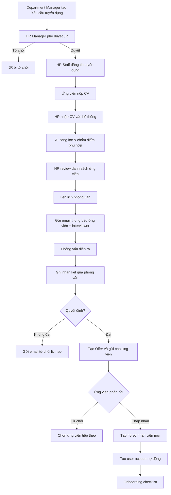
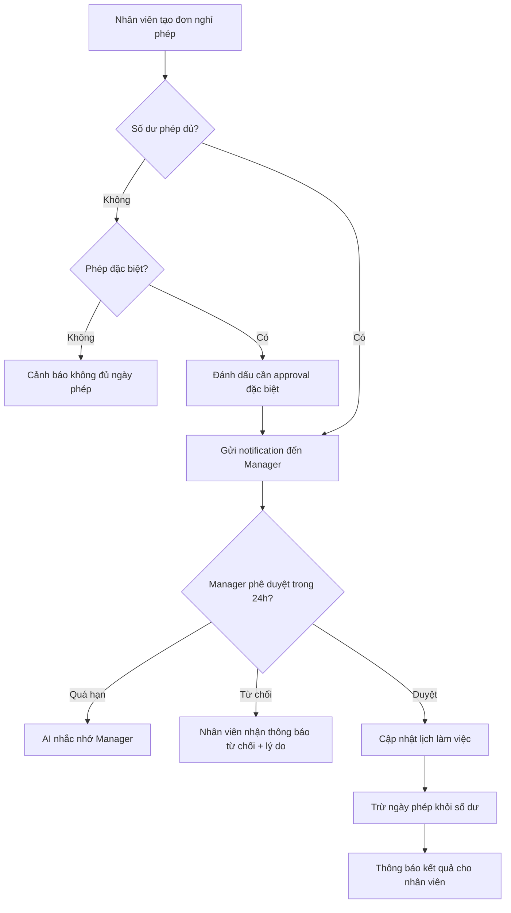
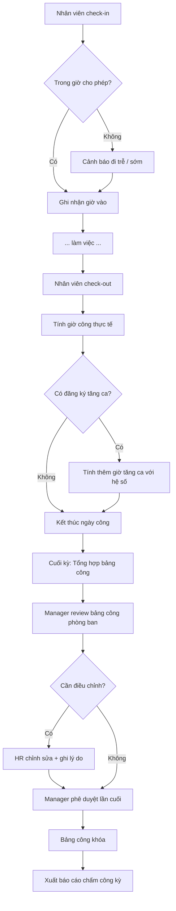
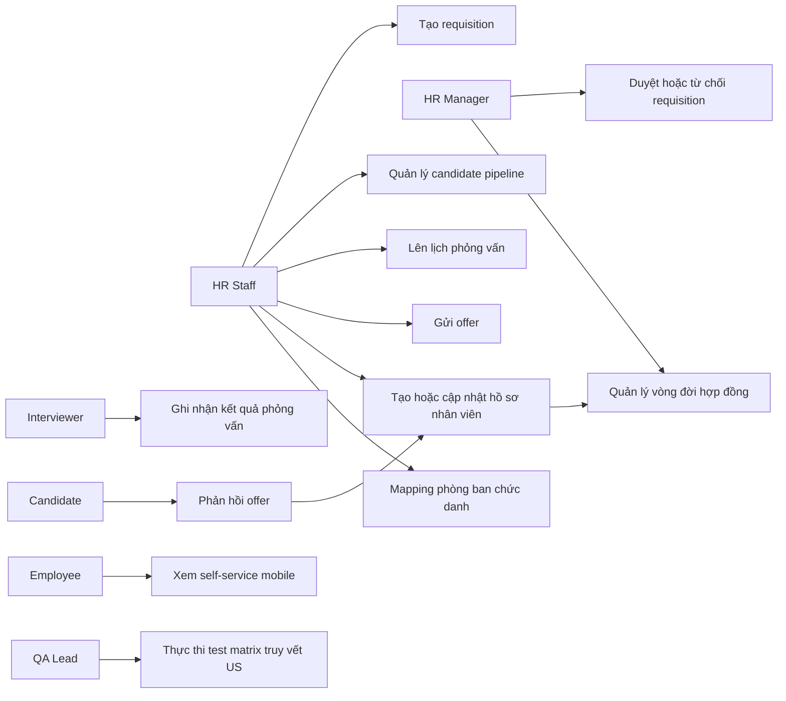
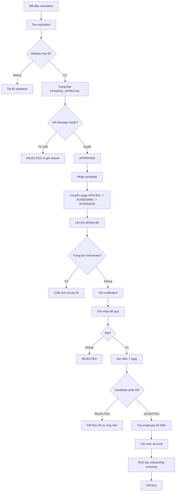

# SRS — Phân hệ HR
# Quản lý Nhân sự

**Phiên bản:** 1.0  
**Ngày tạo:** 09/05/2026  
**Tác giả:** Business Analyst  
**Sprint liên quan:** Sprint 03, Sprint 04  
**Trạng thái:** Hoàn chỉnh  

---

## Mục lục

1. [Tổng quan phân hệ](#1-tổng-quan-phân-hệ)
2. [Đặc tả chức năng](#2-đặc-tả-chức-năng)
3. [Luồng nghiệp vụ](#3-luồng-nghiệp-vụ)
4. [Mô hình dữ liệu](#4-mô-hình-dữ-liệu)
5. [Validation và Business Rules](#5-validation-và-business-rules)
6. [Tích hợp và API](#6-tích-hợp-và-api)
7. [SRS chi tiết Sprint 03 (HR Core)](#7-srs-chi-tiết-sprint-03-hr-core)

---

## 1. Tổng quan phân hệ

### 1.1 Phạm vi và mục tiêu

Phân hệ **HR** số hóa toàn bộ vòng đời nhân sự: từ tuyển dụng, quản lý hồ sơ, hợp đồng, chấm công đến đánh giá hiệu suất.

**Mục tiêu:**
- Quản lý hồ sơ nhân viên tập trung, đầy đủ
- Tự động hóa quy trình chấm công và quản lý phép
- Hỗ trợ tuyển dụng từ đăng tuyển đến onboarding
- Đánh giá KPI nhân viên định kỳ

### 1.2 Actors

| Actor | Mô tả |
|---|---|
| **HR Manager** | Quản lý nhân sự, phê duyệt tuyển dụng, hợp đồng |
| **HR Staff** | Nhập liệu hồ sơ, xử lý chấm công, nghỉ phép |
| **Department Manager** | Phê duyệt nghỉ phép, tăng ca của nhân viên phòng mình |
| **Employee** | Xem hồ sơ cá nhân, đăng ký nghỉ phép, tăng ca, check-in/out |
| **Tenant Admin** | Cấu hình HR: loại phép, ca làm việc, chính sách |
| **AI Agent** | Sàng lọc CV, cảnh báo rủi ro nghỉ việc, cân đối lịch |

### 1.3 Use Case tổng quan

| Nhóm | Use Case | Actor chính |
|---|---|---|
| **Tuyển dụng** | Tạo nhu cầu tuyển dụng | Department Manager, HR Manager |
| **Tuyển dụng** | Đăng tin tuyển dụng | HR Staff |
| **Tuyển dụng** | Nhập và quản lý hồ sơ ứng viên | HR Staff |
| **Tuyển dụng** | Lên lịch phỏng vấn | HR Staff |
| **Tuyển dụng** | Ghi nhận kết quả phỏng vấn | HR Staff, Department Manager |
| **Tuyển dụng** | Gửi offer và onboarding | HR Staff |
| **Nhân viên** | Tạo hồ sơ nhân viên | HR Staff |
| **Nhân viên** | Cập nhật thông tin nhân viên | HR Staff, Employee (phần cá nhân) |
| **Nhân viên** | Xem hồ sơ nhân viên | HR Manager, HR Staff, Employee (của mình) |
| **Hợp đồng** | Tạo hợp đồng lao động | HR Staff |
| **Hợp đồng** | Ký hợp đồng | HR Manager (ký doanh nghiệp), Employee (ký cá nhân) |
| **Hợp đồng** | Gia hạn / Thanh lý hợp đồng | HR Staff, HR Manager |
| **Chấm công** | Cấu hình ca làm việc | Tenant Admin, HR Manager |
| **Chấm công** | Phân ca cho nhân viên | HR Staff |
| **Chấm công** | Check-in / Check-out | Employee |
| **Chấm công** | Xem bảng công | HR Staff, Department Manager, Employee |
| **Chấm công** | Phê duyệt bảng công | Department Manager, HR Manager |
| **Nghỉ phép** | Đăng ký nghỉ phép | Employee |
| **Nghỉ phép** | Phê duyệt / Từ chối nghỉ phép | Department Manager |
| **Nghỉ phép** | Xem số ngày phép còn lại | Employee |
| **Tăng ca** | Đăng ký tăng ca | Employee |
| **Tăng ca** | Phê duyệt tăng ca | Department Manager |
| **Đánh giá** | Đặt mục tiêu KPI | Department Manager, Employee |
| **Đánh giá** | Đánh giá kỳ | Department Manager |
| **Đánh giá** | Xem lịch sử đánh giá | HR Manager, Employee |
| **AI** | AI sàng lọc CV | HR Staff (AI hỗ trợ) |
| **AI** | Cảnh báo rủi ro nghỉ việc | HR Manager |

---

## 2. Đặc tả chức năng

### 2.1 Nhóm: Tuyển dụng

#### F-HR-001: Quản lý Yêu cầu Tuyển dụng (Job Requisition)

| Thuộc tính | Nội dung |
|---|---|
| **ID** | F-HR-001 |
| **Tên** | Tạo và quản lý yêu cầu tuyển dụng |
| **Input** | `jobTitle`, `departmentId`, `numberOfPositions`, `jobDescription`, `requirements`, `salaryRange`, `deadline`, `requestedBy` |
| **Output** | Yêu cầu tuyển dụng tạo với trạng thái `PENDING_APPROVAL` |
| **Business Rules** | Phải được HR Manager phê duyệt trước khi đăng tin. Số vị trí ≥ 1 |
| **Multi-tenancy** | `tenantId` bắt buộc |

#### F-HR-002: Quản lý Hồ sơ Ứng viên

| Thuộc tính | Nội dung |
|---|---|
| **ID** | F-HR-002 |
| **Tên** | Nhập và quản lý CV ứng viên |
| **Input** | `fullName`, `email`, `phone`, `jobRequisitionId`, `cvFile` (PDF), `source` (email/walk-in/referral/website), `notes` |
| **Output** | Hồ sơ ứng viên lưu vào hệ thống, AI sàng lọc tự động |
| **Business Rules** | CV phải liên kết với job requisition. AI chấm điểm phù hợp 0–100 |
| **Multi-tenancy** | `tenantId` bắt buộc |

#### F-HR-003: Lên lịch Phỏng vấn

| Thuộc tính | Nội dung |
|---|---|
| **ID** | F-HR-003 |
| **Tên** | Tạo và quản lý lịch phỏng vấn |
| **Input** | `candidateId`, `interviewType` (PHONE/ONLINE/IN_PERSON), `scheduledAt`, `interviewers[]`, `location/link` |
| **Output** | Lịch phỏng vấn, email thông báo gửi ứng viên và người phỏng vấn |
| **Business Rules** | Thông báo trước tối thiểu 24 giờ. Không trùng lịch với phỏng vấn khác của cùng interviewer |
| **Multi-tenancy** | `tenantId` bắt buộc |

#### F-HR-004: Quyết định Tuyển dụng và Onboarding

| Thuộc tính | Nội dung |
|---|---|
| **ID** | F-HR-004 |
| **Tên** | Gửi offer và khởi tạo onboarding |
| **Input** | `candidateId`, `offerSalary`, `startDate`, `contractType`, `benefits` |
| **Output** | Email offer gửi ứng viên; nếu chấp nhận → tạo hồ sơ nhân viên mới + tài khoản hệ thống |
| **Business Rules** | Offer hết hạn sau 7 ngày nếu không phản hồi. Khi accept → tự động tạo `users` + `employees` record |
| **Multi-tenancy** | `tenantId` bắt buộc |

---

### 2.2 Nhóm: Quản lý Nhân viên

#### F-HR-010: Hồ sơ Nhân viên

| Thuộc tính | Nội dung |
|---|---|
| **ID** | F-HR-010 |
| **Tên** | Tạo và quản lý hồ sơ nhân viên |
| **Input** | `fullName`, `dateOfBirth`, `gender`, `nationalId`, `nationalIdIssueDate`, `nationalIdIssuePlace`, `email`, `phone`, `address`, `departmentId`, `positionId`, `managerId`, `startDate`, `employeeCode`, `photo`, `documents[]` |
| **Output** | Hồ sơ nhân viên đầy đủ |
| **Business Rules** | `employeeCode` duy nhất trong tenant. `nationalId` duy nhất trong tenant. Khi tạo nhân viên mới → tự động gửi invite tạo user account |
| **Multi-tenancy** | `tenantId` bắt buộc |

#### F-HR-011: Quản lý Hợp đồng Lao động

| Thuộc tính | Nội dung |
|---|---|
| **ID** | F-HR-011 |
| **Tên** | Tạo, ký và quản lý hợp đồng lao động |
| **Input** | `employeeId`, `contractType` (PROBATION/DEFINITE/INDEFINITE), `startDate`, `endDate`, `salary`, `allowances[]`, `contractFile` |
| **Output** | Hợp đồng với trạng thái `DRAFT` → sau ký: `ACTIVE` |
| **Business Rules** | BR-HR-002: Cảnh báo tự động khi còn 30 ngày hết hạn. Hợp đồng đã ký là bất biến (BR-HR-007) |
| **Multi-tenancy** | `tenantId` bắt buộc |

#### F-HR-012: Quản lý Khen thưởng / Kỷ luật

| Thuộc tính | Nội dung |
|---|---|
| **ID** | F-HR-012 |
| **Tên** | Ghi nhận khen thưởng, kỷ luật cho nhân viên |
| **Input** | `employeeId`, `type` (REWARD/DISCIPLINE), `date`, `description`, `decisionDocument`, `approvedBy` |
| **Output** | Bản ghi khen thưởng/kỷ luật trong lịch sử nhân sự |
| **Business Rules** | Bất biến sau khi phê duyệt. Lưu vào lịch sử vĩnh viễn |
| **Multi-tenancy** | `tenantId` bắt buộc |

---

### 2.3 Nhóm: Chấm công

#### F-HR-020: Cấu hình Ca làm việc

| Thuộc tính | Nội dung |
|---|---|
| **ID** | F-HR-020 |
| **Tên** | Định nghĩa và quản lý ca làm việc |
| **Input** | `shiftName`, `startTime`, `endTime`, `breakDuration` (phút), `workingDays[]` (0-6: CN-T7), `lateToleranceMinutes`, `earlyLeaveToleranceMinutes` |
| **Output** | Ca làm việc được lưu, sẵn sàng phân công |
| **Business Rules** | Ca không được chồng chéo thời gian. Thời gian làm việc không quá 12 giờ/ca |
| **Multi-tenancy** | `tenantId` bắt buộc |

#### F-HR-021: Phân ca cho Nhân viên

| Thuộc tính | Nội dung |
|---|---|
| **ID** | F-HR-021 |
| **Tên** | Gán ca làm việc cho nhân viên theo kỳ |
| **Input** | `employeeId`, `shiftId`, `effectiveFrom`, `effectiveTo` |
| **Output** | Lịch phân ca của nhân viên |
| **Business Rules** | Nhân viên chỉ có 1 ca chính tại một thời điểm. Ca tăng ca là riêng biệt |
| **Multi-tenancy** | `tenantId` bắt buộc |

#### F-HR-022: Check-in / Check-out

| Thuộc tính | Nội dung |
|---|---|
| **ID** | F-HR-022 |
| **Tên** | Ghi nhận thời gian vào/ra của nhân viên |
| **Input** | `employeeId`, `type` (CHECK_IN/CHECK_OUT), `timestamp`, `method` (APP/WEB/DEVICE), `location` (lat, lng - tùy chọn), `photo` (tùy chọn) |
| **Output** | Bản ghi chấm công, cập nhật trạng thái ngày công |
| **Business Rules** | Chỉ được check-in trong giờ cho phép (ca ± 60 phút). Check-out phải sau check-in. Quên check-out → cảnh báo sau 2 giờ kể từ giờ kết thúc ca |
| **Multi-tenancy** | `tenantId` bắt buộc |

#### F-HR-023: Tổng hợp và Phê duyệt Bảng công

| Thuộc tính | Nội dung |
|---|---|
| **ID** | F-HR-023 |
| **Tên** | Tổng hợp bảng công theo kỳ và phê duyệt |
| **Input** | `departmentId`, `period` (YYYY-MM), `approvedBy` |
| **Output** | Bảng công tổng hợp: số ngày công, ngày vắng, nghỉ phép, tăng ca |
| **Business Rules** | Bảng công bị khóa sau khi phê duyệt. Sửa sau khi khóa cần quyền đặc biệt và tạo audit trail |
| **Multi-tenancy** | `tenantId` bắt buộc |

---

### 2.4 Nhóm: Nghỉ phép

#### F-HR-030: Cấu hình Loại phép

| Thuộc tính | Nội dung |
|---|---|
| **ID** | F-HR-030 |
| **Tên** | Định nghĩa các loại phép và chính sách |
| **Input** | `leaveName`, `totalDaysPerYear`, `isPaidLeave`, `carryOverAllowed`, `maxCarryOverDays`, `advanceNoticeDays`, `requireApproval` |
| **Output** | Loại phép được cấu hình cho tenant |
| **Business Rules** | Các loại phép cơ bản theo Bộ luật Lao động: phép năm (12 ngày), phép ốm, phép thai sản, phép cưới... |
| **Multi-tenancy** | `tenantId` bắt buộc |

#### F-HR-031: Đăng ký Nghỉ phép

| Thuộc tính | Nội dung |
|---|---|
| **ID** | F-HR-031 |
| **Tên** | Nhân viên tạo đơn nghỉ phép |
| **Input** | `leaveTypeId`, `startDate`, `endDate`, `reason`, `handoverNote` |
| **Output** | Đơn nghỉ phép trạng thái `PENDING`, thông báo đến manager |
| **Business Rules** | BR-HR-003: Số ngày không vượt số dư. BR-HR-004: Vượt số dư → flag approval đặc biệt. Không được nghỉ trùng với nhân viên khác trong cùng phòng ban quá X% (cấu hình) |
| **Multi-tenancy** | `tenantId` bắt buộc |

#### F-HR-032: Phê duyệt Nghỉ phép

| Thuộc tính | Nội dung |
|---|---|
| **ID** | F-HR-032 |
| **Tên** | Manager phê duyệt hoặc từ chối đơn nghỉ phép |
| **Input** | `leaveRequestId`, `action` (APPROVE/REJECT), `comments` |
| **Output** | Trạng thái đơn cập nhật, nhân viên nhận thông báo, số dư phép giảm (nếu approve) |
| **Business Rules** | Manager chỉ phê duyệt được nhân viên trong phòng ban mình. Phê duyệt trong vòng 24 giờ theo SLA |
| **Multi-tenancy** | `tenantId` bắt buộc |

---

### 2.5 Nhóm: Tăng ca

#### F-HR-040: Đăng ký Tăng ca

| Thuộc tính | Nội dung |
|---|---|
| **ID** | F-HR-040 |
| **Tên** | Nhân viên đăng ký làm thêm giờ |
| **Input** | `date`, `startTime`, `endTime`, `reason`, `requestedBy` |
| **Output** | Yêu cầu tăng ca, thông báo manager |
| **Business Rules** | BR-HR-005: Tăng ca phải đăng ký và phê duyệt trước (ngoại lệ: có thể cấu hình approve sau). Tổng tăng ca không vượt 200 giờ/năm (theo luật) |
| **Multi-tenancy** | `tenantId` bắt buộc |

---

### 2.6 Nhóm: Đánh giá Hiệu suất (KPI)

#### F-HR-050: Đặt mục tiêu KPI

| Thuộc tính | Nội dung |
|---|---|
| **ID** | F-HR-050 |
| **Tên** | Thiết lập mục tiêu KPI cho nhân viên |
| **Input** | `employeeId`, `period`, `objectives[]`: `{ title, targetValue, unit, weight }` |
| **Output** | Bộ mục tiêu KPI cho kỳ |
| **Business Rules** | Tổng trọng số (weight) = 100%. Phải có ít nhất 1 mục tiêu |
| **Multi-tenancy** | `tenantId` bắt buộc |

#### F-HR-051: Đánh giá định kỳ

| Thuộc tính | Nội dung |
|---|---|
| **ID** | F-HR-051 |
| **Tên** | Manager đánh giá KPI nhân viên cuối kỳ |
| **Input** | `kpiSetId`, `actualValues[]`, `managerScore` (1-5), `selfScore` (1-5, nếu có), `comments` |
| **Output** | Kết quả đánh giá, điểm tổng hợp |
| **Business Rules** | Đánh giá sau khi kỳ kết thúc. Lịch sử đánh giá là bất biến sau khi submit |
| **Multi-tenancy** | `tenantId` bắt buộc |

---

## 3. Luồng nghiệp vụ

### 3.1 Luồng: Tuyển dụng đầy đủ



---

### 3.2 Luồng: Nghỉ phép



---

### 3.3 Luồng: Chấm công và Tổng hợp



---

## 4. Mô hình dữ liệu

### 4.1 Collection: `employees`

| Trường | Kiểu | Bắt buộc | Mô tả |
|---|---|---|---|
| `_id` | ObjectId | Có | employeeId |
| `tenantId` | ObjectId | Có | |
| `userId` | ObjectId | Không | Liên kết user account (null khi chưa active) |
| `employeeCode` | string | Có | Mã nhân viên (unique trong tenant) |
| `fullName` | string | Có | Họ và tên |
| `dateOfBirth` | Date | Có | |
| `gender` | string (enum) | Có | `MALE` \| `FEMALE` \| `OTHER` |
| `nationalId` | string | Có | Số CCCD/CMND (mã hóa AES-256) |
| `nationalIdIssueDate` | Date | Không | |
| `nationalIdIssuePlace` | string | Không | |
| `email` | string | Có | |
| `phone` | string | Có | |
| `address` | object | Không | `{ permanent, current }` |
| `photo` | string | Không | URL ảnh (MinIO) |
| `departmentId` | ObjectId | Có | Phòng ban chính |
| `positionId` | ObjectId | Có | Chức danh |
| `managerId` | ObjectId | Không | Quản lý trực tiếp |
| `startDate` | Date | Có | Ngày bắt đầu làm việc |
| `endDate` | Date | Không | Ngày cuối làm việc (null = đang làm) |
| `status` | string (enum) | Có | `ACTIVE` \| `ON_LEAVE` \| `RESIGNED` \| `TERMINATED` \| `PROBATION` |
| `employmentType` | string (enum) | Có | `FULL_TIME` \| `PART_TIME` \| `CONTRACT` \| `INTERN` |
| `documents` | array | Không | `[{ type, fileName, url, uploadedAt }]` |
| `bankAccount` | object | Không | `{ bankName, accountNumber, accountHolder }` — mã hóa AES-256 |
| `taxCode` | string | Không | Mã số thuế cá nhân |
| `createdAt` | Date | Có | |
| `updatedAt` | Date | Có | |

**Indexes:** `(tenantId, employeeCode)` (unique), `(tenantId, userId)`, `(tenantId, departmentId)`, `(tenantId, status)`, `(tenantId, nationalId)` (unique)

---

### 4.2 Collection: `employment_contracts`

| Trường | Kiểu | Bắt buộc | Mô tả |
|---|---|---|---|
| `_id` | ObjectId | Có | contractId |
| `tenantId` | ObjectId | Có | |
| `employeeId` | ObjectId | Có | |
| `contractNumber` | string | Có | Số hợp đồng |
| `contractType` | string (enum) | Có | `PROBATION` \| `DEFINITE` \| `INDEFINITE` |
| `startDate` | Date | Có | |
| `endDate` | Date | Không | Null với hợp đồng không xác định thời hạn |
| `status` | string (enum) | Có | `DRAFT` \| `ACTIVE` \| `EXPIRED` \| `TERMINATED` |
| `basicSalary` | number | Có | Lương cơ bản (VND) |
| `allowances` | array | Không | `[{ type, amount }]` |
| `probationPeriodDays` | number | Không | Thời gian thử việc (ngày) |
| `workingHoursPerWeek` | number | Có | |
| `signedDate` | Date | Không | |
| `signedByCompany` | ObjectId | Không | userId người ký phía công ty |
| `signedByEmployee` | boolean | Có | Nhân viên đã ký chưa |
| `contractFile` | string | Không | URL file hợp đồng (MinIO) |
| `terminationReason` | string | Không | Lý do thanh lý |
| `createdAt` | Date | Có | |
| `updatedAt` | Date | Có | |

**Indexes:** `(tenantId, employeeId)`, `(tenantId, contractNumber)` (unique), `(tenantId, status)`, `endDate` (để cảnh báo)

---

### 4.3 Collection: `work_shifts`

| Trường | Kiểu | Bắt buộc | Mô tả |
|---|---|---|---|
| `_id` | ObjectId | Có | shiftId |
| `tenantId` | ObjectId | Có | |
| `name` | string | Có | Tên ca (VD: Ca sáng, Ca chiều) |
| `startTime` | string | Có | HH:mm |
| `endTime` | string | Có | HH:mm |
| `breakDuration` | number | Có | Phút nghỉ giữa ca |
| `workingDays` | number[] | Có | [1,2,3,4,5] — 0=CN, 1=T2, ..., 6=T7 |
| `lateToleranceMinutes` | number | Có | Phút cho phép đến trễ (mặc định 0) |
| `earlyLeaveToleranceMinutes` | number | Có | Phút cho phép về sớm (mặc định 0) |
| `isActive` | boolean | Có | |
| `createdAt` | Date | Có | |

**Indexes:** `(tenantId, name)` (unique), `tenantId`

---

### 4.4 Collection: `attendance_records`

| Trường | Kiểu | Bắt buộc | Mô tả |
|---|---|---|---|
| `_id` | ObjectId | Có | |
| `tenantId` | ObjectId | Có | |
| `employeeId` | ObjectId | Có | |
| `date` | Date | Có | Ngày làm việc (YYYY-MM-DD) |
| `shiftId` | ObjectId | Có | Ca được phân công |
| `checkIn` | Date | Không | Thời điểm check-in thực tế |
| `checkOut` | Date | Không | Thời điểm check-out thực tế |
| `checkInMethod` | string | Không | `APP` \| `WEB` \| `DEVICE` |
| `checkInLocation` | object | Không | `{ lat, lng }` |
| `workingMinutes` | number | Không | Số phút làm việc (tính tự động) |
| `overtimeMinutes` | number | Không | Số phút tăng ca |
| `status` | string (enum) | Có | `PRESENT` \| `ABSENT` \| `LATE` \| `EARLY_LEAVE` \| `ON_LEAVE` \| `HOLIDAY` |
| `lateMinutes` | number | Không | Số phút đến trễ |
| `earlyLeaveMinutes` | number | Không | Số phút về sớm |
| `notes` | string | Không | Ghi chú (lý do vắng, điều chỉnh...) |
| `adjustedBy` | ObjectId | Không | userId điều chỉnh thủ công |
| `createdAt` | Date | Có | |
| `updatedAt` | Date | Có | |

**Indexes:** `(tenantId, employeeId, date)` (unique composite), `(tenantId, date)`, `(tenantId, status)`

---

### 4.5 Collection: `leave_requests`

| Trường | Kiểu | Bắt buộc | Mô tả |
|---|---|---|---|
| `_id` | ObjectId | Có | |
| `tenantId` | ObjectId | Có | |
| `employeeId` | ObjectId | Có | |
| `leaveTypeId` | ObjectId | Có | |
| `startDate` | Date | Có | |
| `endDate` | Date | Có | |
| `totalDays` | number | Có | Số ngày thực tế nghỉ (tính theo lịch làm việc) |
| `reason` | string | Có | |
| `status` | string (enum) | Có | `PENDING` \| `APPROVED` \| `REJECTED` \| `CANCELLED` |
| `approvedBy` | ObjectId | Không | managerId |
| `approvedAt` | Date | Không | |
| `comments` | string | Không | Ý kiến của manager |
| `handoverNote` | string | Không | Ghi chú bàn giao công việc |
| `createdAt` | Date | Có | |
| `updatedAt` | Date | Có | |

**Indexes:** `(tenantId, employeeId)`, `(tenantId, startDate, endDate)`, `(tenantId, status)`

---

### 4.6 Collection: `leave_balances`

| Trường | Kiểu | Bắt buộc | Mô tả |
|---|---|---|---|
| `_id` | ObjectId | Có | |
| `tenantId` | ObjectId | Có | |
| `employeeId` | ObjectId | Có | |
| `leaveTypeId` | ObjectId | Có | |
| `year` | number | Có | Năm dương lịch |
| `allocated` | number | Có | Số ngày được cấp |
| `used` | number | Có | Số ngày đã dùng |
| `pending` | number | Có | Số ngày đang chờ duyệt |
| `remaining` | number | Có | `= allocated - used - pending` |
| `carryOver` | number | Không | Số ngày chuyển từ năm trước |
| `updatedAt` | Date | Có | |

**Indexes:** `(tenantId, employeeId, leaveTypeId, year)` (unique composite)

---

### 4.7 Collection: `job_candidates`

| Trường | Kiểu | Bắt buộc | Mô tả |
|---|---|---|---|
| `_id` | ObjectId | Có | candidateId |
| `tenantId` | ObjectId | Có | |
| `jobRequisitionId` | ObjectId | Có | |
| `fullName` | string | Có | |
| `email` | string | Có | |
| `phone` | string | Không | |
| `cvFileUrl` | string | Không | URL CV (MinIO) |
| `source` | string (enum) | Có | `EMAIL` \| `WALK_IN` \| `REFERRAL` \| `WEBSITE` \| `HEADHUNT` |
| `aiScore` | number | Không | Điểm AI sàng lọc (0–100) |
| `stage` | string (enum) | Có | `APPLIED` \| `SCREENING` \| `INTERVIEW` \| `OFFER` \| `HIRED` \| `REJECTED` |
| `interviews` | array | Không | `[{ interviewId, scheduledAt, type, result, score, notes }]` |
| `offerAmount` | number | Không | |
| `offerSentAt` | Date | Không | |
| `offerAcceptedAt` | Date | Không | |
| `createdAt` | Date | Có | |
| `updatedAt` | Date | Có | |

**Indexes:** `(tenantId, jobRequisitionId)`, `(tenantId, email)`, `(tenantId, stage)`

---

## 5. Validation và Business Rules

### 5.1 Validation Rules

| Trường | Quy tắc | Thông báo lỗi |
|---|---|---|
| `employees.nationalId` | 9, 12 hoặc 15 chữ số | "Số CCCD/CMND không hợp lệ" |
| `employees.dateOfBirth` | Phải ≥ 16 tuổi (tuổi lao động tối thiểu) | "Tuổi nhân viên phải từ 16 trở lên" |
| `employment_contracts.basicSalary` | ≥ Lương tối thiểu vùng hiện hành | "Lương thấp hơn mức tối thiểu vùng" |
| `leave_requests.endDate` | ≥ startDate | "Ngày kết thúc phải sau ngày bắt đầu" |
| `work_shifts.startTime` | Định dạng HH:mm | "Giờ bắt đầu ca không hợp lệ" |
| `attendance_records.checkOut` | > checkIn | "Giờ ra phải sau giờ vào" |

### 5.2 Business Rules

| Mã | Rule | Chi tiết |
|---|---|---|
| BR-HR-001 | Phòng ban chính duy nhất | Nhân viên chỉ có 1 `departmentId` chính. Có thể tham gia nhóm/dự án phụ |
| BR-HR-002 | Cảnh báo hợp đồng hết hạn | 30 ngày trước `endDate` → alert HR + Manager. 7 ngày → alert lần 2 |
| BR-HR-003 | Số dư phép | Không cho phép nghỉ vượt `remaining` trừ khi có flag `requireSpecialApproval` |
| BR-HR-004 | Nghỉ phép đặc biệt | Vượt số dư → workflow approval với HR Manager và cấp trên |
| BR-HR-005 | Tăng ca phê duyệt trước | Tăng ca phải có approval trước khi thực hiện (cấu hình được) |
| BR-HR-006 | Vô hiệu hóa tài khoản khi nghỉ việc | Nhân viên `RESIGNED`/`TERMINATED` → `userId` chuyển sang `INACTIVE` sau `endDate` |
| BR-HR-007 | Lịch sử nhân sự bất biến | Hợp đồng đã ký, quyết định khen thưởng/kỷ luật không được sửa/xóa |
| BR-HR-008 | Tổng tăng ca | Không vượt 200 giờ/năm và 40 giờ/tháng theo Bộ luật Lao động |

### 5.3 Quy tắc tính toán

**Số ngày nghỉ phép trong khoảng:**
```
totalDays = (workingDays trong [startDate, endDate]) - holidayDays
workingDays = các ngày trong workingDays của ca làm việc nhân viên
holidayDays = ngày lễ chính thức trùng với workingDays
```

**Giờ làm việc thực tế:**
```
workingMinutes = MAX(0, checkOut - checkIn - breakDuration - lateMinutes)
overtimeMinutes = MAX(0, workingMinutes - scheduledMinutes)
```

---

## 6. Tích hợp và API

### 6.1 Tích hợp nội bộ

| Phân hệ | Dữ liệu trao đổi | Hướng |
|---|---|---|
| System Admin | Khi tạo employee → tạo user account | Ghi sang System Admin |
| System Admin | Nhân viên nghỉ → vô hiệu hóa user | Ghi sang System Admin |
| Office | Danh sách nhân viên, phòng ban | HR cung cấp cho Office đọc |
| Sale & Logistics | Danh sách nhân viên sale, kho | HR cung cấp |
| Accounting | Dữ liệu chấm công, tăng ca | HR cung cấp cho Accounting |
| AI Agent | Dữ liệu nhân sự → phân tích rủi ro, sàng lọc CV | Đọc |
| Dashboard | KPI nhân sự, biến động | Đọc |

### 6.2 API nội bộ xuất cho microservices

| Endpoint | Method | Mô tả |
|---|---|---|
| `/internal/employees` | GET | Danh sách nhân viên (có filter `departmentId`, `status`) |
| `/internal/employees/{id}` | GET | Chi tiết nhân viên |
| `/internal/employees/{id}/attendance-summary` | GET | Tóm tắt chấm công kỳ |

### 6.3 Tích hợp tương lai

| Hệ thống | Mục đích |
|---|---|
| Máy chấm công sinh trắc học | Tự động nhận dữ liệu check-in/out qua API/SDK |
| Bảo hiểm xã hội điện tử | Khai báo lao động, đóng BHXH (ngoài phạm vi v1.0) |

---

## 7. SRS chi tiết Sprint 03 (HR Core)

### 7.1 Phạm vi Sprint 03 và truy vết User Story

Sprint 03 tập trung vào HR Core gồm: requisition, candidate pipeline, interview, offer/onboarding init, hồ sơ nhân viên, vòng đời hợp đồng, mapping cơ cấu/chức danh, web UI HR Core, mobile self-service tối thiểu và test plan tích hợp.

#### 7.1.1 Danh mục chức năng Sprint 03 (Feature Specs)

| Mã tính năng | Tên tính năng | Mô tả | Độ ưu tiên | User story liên quan |
|---|---|---|---|---|
| F-HR-001 | Quản lý requisition | Tạo, duyệt/từ chối, xuất bản nhu cầu tuyển dụng theo tenant | Must Have | US-HR-001, US-HR-007, US-HR-012 |
| F-HR-002 | Quản lý ứng viên | Tiếp nhận hồ sơ ứng viên, quản lý stage pipeline | Must Have | US-HR-002, US-HR-007, US-HR-012 |
| F-HR-003 | Quản lý phỏng vấn | Lên lịch phỏng vấn, kiểm tra xung đột, ghi nhận kết quả | Must Have | US-HR-002, US-HR-007, US-HR-012 |
| F-HR-004 | Offer và onboarding init | Gửi offer, xử lý phản hồi, khởi tạo employee/user/onboarding init | Must Have | US-HR-003, US-HR-007, US-HR-012 |
| F-HR-010 | Hồ sơ nhân viên | Tạo/cập nhật/tra cứu hồ sơ nhân viên và dữ liệu nhạy cảm theo quyền | Must Have | US-HR-004, US-HR-008, US-HR-011, US-HR-012 |
| F-HR-011 | Vòng đời hợp đồng lao động | Quản lý trạng thái DRAFT/ACTIVE/EXPIRED/TERMINATED, cảnh báo 30/7 ngày | Must Have | US-HR-005, US-HR-009, US-HR-011, US-HR-012 |
| F-HR-060 | Mapping cơ cấu/chức danh HR | Đồng bộ department/position/manager relation phục vụ HR Core | Must Have | US-HR-006, US-HR-008, US-HR-010, US-HR-012 |
| F-HR-061 | Web tuyển dụng HR Core | Giao diện web cho requisition, pipeline, interview, offer | Must Have | US-HR-007 |
| F-HR-062 | Web hồ sơ nhân viên | Giao diện web danh sách, chi tiết, chỉnh sửa profile theo quyền | Must Have | US-HR-008 |
| F-HR-063 | Web hợp đồng lao động | Giao diện web quản lý lifecycle hợp đồng và cảnh báo hết hạn | Must Have | US-HR-009 |
| F-HR-064 | Web cơ cấu HR | Giao diện cây tổ chức/chức danh và điều hướng hồ sơ liên quan | Should Have | US-HR-010 |
| F-HR-065 | Mobile self-service HR basic | Mobile cho profile cá nhân, contract summary, onboarding summary | Should Have | US-HR-011 |
| F-HR-066 | Testability và traceability Sprint 03 | Ma trận test P0/P1 và truy vết US-FE-BE-Mobile | Must Have | US-HR-012 |

#### 7.1.2 Mapping US-HR-001..012 sang SRS và Task Sprint 03

| User Story | Tính năng SRS chính | Tính năng SRS phụ trợ | Task Sprint 03 liên quan |
|---|---|---|---|
| US-HR-001 | F-HR-001 | F-HR-061, F-HR-066 | TASK-SPRINT-03-HR_RECRUITMENT-001, TASK-SPRINT-03-FRONTEND-001, TASK-SPRINT-03-TESTING-001 |
| US-HR-002 | F-HR-002, F-HR-003 | F-HR-061, F-HR-066 | TASK-SPRINT-03-HR_RECRUITMENT-002, TASK-SPRINT-03-FRONTEND-001, TASK-SPRINT-03-TESTING-001 |
| US-HR-003 | F-HR-004 | F-HR-010, F-HR-061, F-HR-066 | TASK-SPRINT-03-HR_RECRUITMENT-003, TASK-SPRINT-03-HR_EMPLOYEE-001, TASK-SPRINT-03-FRONTEND-001, TASK-SPRINT-03-TESTING-001 |
| US-HR-004 | F-HR-010 | F-HR-060, F-HR-062, F-HR-065, F-HR-066 | TASK-SPRINT-03-HR_EMPLOYEE-001, TASK-SPRINT-03-HR_ORG-001, TASK-SPRINT-03-FRONTEND-002, TASK-SPRINT-03-MOBILE-001, TASK-SPRINT-03-TESTING-001 |
| US-HR-005 | F-HR-011 | F-HR-063, F-HR-065, F-HR-066 | TASK-SPRINT-03-HR_CONTRACT-001, TASK-SPRINT-03-FRONTEND-003, TASK-SPRINT-03-MOBILE-001, TASK-SPRINT-03-TESTING-001 |
| US-HR-006 | F-HR-060 | F-HR-062, F-HR-064, F-HR-066 | TASK-SPRINT-03-HR_ORG-001, TASK-SPRINT-03-FRONTEND-002, TASK-SPRINT-03-FRONTEND-004, TASK-SPRINT-03-TESTING-001 |
| US-HR-007 | F-HR-061 | F-HR-001, F-HR-002, F-HR-003, F-HR-004 | TASK-SPRINT-03-FRONTEND-001 |
| US-HR-008 | F-HR-062 | F-HR-010, F-HR-060 | TASK-SPRINT-03-FRONTEND-002 |
| US-HR-009 | F-HR-063 | F-HR-011 | TASK-SPRINT-03-FRONTEND-003 |
| US-HR-010 | F-HR-064 | F-HR-060 | TASK-SPRINT-03-FRONTEND-004 |
| US-HR-011 | F-HR-065 | F-HR-010, F-HR-011 | TASK-SPRINT-03-MOBILE-001 |
| US-HR-012 | F-HR-066 | F-HR-001, F-HR-002, F-HR-003, F-HR-004, F-HR-010, F-HR-011, F-HR-060 | TASK-SPRINT-03-TESTING-001 |

### 7.2 Flow và Use Case Sprint 03

#### 7.2.1 Use case diagram (Mermaid)



#### 7.2.2 Flow chi tiết theo use case (happy path, alternate, exception)

| Use case | Điều kiện tiên quyết | Happy path | Alternate flow | Exception flow |
|---|---|---|---|---|
| Tuyển dụng 01: Requisition | HR Staff có quyền tạo requisition; department và position còn hiệu lực | 1) HR Staff tạo requisition<br>2) Trạng thái `PENDING_APPROVAL`<br>3) HR Manager duyệt<br>4) Trạng thái `APPROVED`<br>5) HR Staff publish requisition | A1: HR Manager từ chối, trạng thái `REJECTED`, HR Staff chỉnh sửa và gửi duyệt lại | E1: `numberOfPositions < 1` hoặc `deadline <= currentDate` thì chặn tạo; E2: thiếu `tenantId` thì từ chối truy cập |
| Tuyển dụng 02: Candidate + Interview | Requisition ở trạng thái `APPROVED` hoặc `PUBLISHED` | 1) HR Staff nhập candidate<br>2) Stage `APPLIED`<br>3) Chuyển `SCREENING` -> `INTERVIEW` hợp lệ<br>4) Lên lịch phỏng vấn >= 24h<br>5) Notification gửi interviewer/candidate<br>6) Ghi nhận kết quả | A1: Candidate không đạt tại screening chuyển `REJECTED` và kết thúc<br>A2: Candidate đạt phỏng vấn chuyển `OFFER` | E1: Chuyển stage không hợp lệ thì trả lỗi nghiệp vụ; E2: interviewer bị trùng lịch thì chặn tạo lịch |
| Tuyển dụng 03: Offer + Onboarding init | Candidate đang ở stage `OFFER`; offer chưa hết hạn | 1) HR Staff gửi offer, mặc định hạn 7 ngày<br>2) Candidate phản hồi `ACCEPTED`<br>3) Hệ thống tạo employee tối thiểu<br>4) Gọi tạo user account<br>5) Khởi tạo onboarding summary | A1: Candidate phản hồi `REJECTED` thì giữ candidate ở trạng thái `REJECTED` hoặc quay lại pool | E1: Offer quá hạn > 7 ngày chuyển `EXPIRED`, không cho accept; E2: callback lặp dùng idempotency key để không tạo trùng employee/user |
| Nhân sự 01: Employee profile | Có metadata department/position hợp lệ theo tenant | 1) HR Staff tạo hồ sơ nhân viên<br>2) Validate unique `employeeCode`, `nationalId`<br>3) Lưu hồ sơ `ACTIVE` hoặc `PROBATION`<br>4) Web/mobile hiển thị theo quyền | A1: Employee tự cập nhật thông tin liên hệ qua mobile (chỉ các trường cho phép) | E1: trùng `employeeCode` hoặc `nationalId` trả lỗi 409; E2: vai trò không đủ quyền xem dữ liệu nhạy cảm thì mask dữ liệu |
| Nhân sự 02: Contract lifecycle | Employee tồn tại và thuộc cùng tenant | 1) HR Staff tạo contract `DRAFT`<br>2) Ký phía công ty và nhân viên<br>3) Chuyển `ACTIVE`<br>4) Job cảnh báo 30 ngày và 7 ngày trước `endDate`<br>5) Hết hạn chuyển `EXPIRED` hoặc thanh lý `TERMINATED` | A1: Gia hạn bằng cách tạo version hợp đồng mới và liên kết hợp đồng trước đó | E1: Contract `ACTIVE` không cho sửa trường nội dung chính; E2: `endDate < startDate` chặn lưu |
| Nhân sự 03: Org/position mapping | Dữ liệu catalog từ System Admin đã đồng bộ | 1) HR Staff tải metadata department/position<br>2) Chọn manager theo cây tổ chức hợp lệ<br>3) Gán vào hồ sơ nhân viên | A1: Node inactive vẫn hiển thị cho dữ liệu lịch sử nhưng không cho gán mới | E1: manager khác tenant hoặc không hợp lệ theo cây thì từ chối |

#### 7.2.3 Activity diagram cho flow tuyển dụng Sprint 03



### 7.3 Mockup mức SRS (wireframe luồng chính Sprint 03)

#### 7.3.1 Màn hình Web tuyển dụng tổng hợp (F-HR-061)

```text
+--------------------------------------------------------------------------------+
| HR Recruitment Workspace                                                       |
+--------------------------------------------------------------------------------+
| [Tab: Requisition] [Tab: Pipeline] [Tab: Interviews] [Tab: Offers]            |
|--------------------------------------------------------------------------------|
| Bộ lọc: Department [v] Status [v] Date range [   ] Search [................]  |
|--------------------------------------------------------------------------------|
| Left panel: Requisition list                  | Right panel: Candidate pipeline |
| - REQ-001 Sales Executive (APPROVED)          | APPLIED    | SCREENING          |
| - REQ-002 HRBP (PENDING_APPROVAL)             | INTERVIEW  | OFFER              |
|--------------------------------------------------------------------------------|
| Candidate detail drawer: profile, CV, interview, stage actions, offer action  |
+--------------------------------------------------------------------------------+
```

Hành vi chính:
- Nút chuyển stage chỉ bật khi transition hợp lệ.
- Nút gửi offer chỉ bật khi candidate ở stage `OFFER`.
- Khi đặt lịch phỏng vấn, hệ thống kiểm tra xung đột trước khi cho lưu.

#### 7.3.2 Màn hình Web hồ sơ nhân viên (F-HR-062) và hợp đồng (F-HR-063)

```text
+--------------------------------------------------------------+
| Employee Profile                                             |
+--------------------------------------------------------------+
| Header: EMP-000123 | Nguyen Van A | ACTIVE | Department/Role |
| Tabs: [Thong tin ca nhan] [Hop dong] [Tai lieu] [Lich su]    |
|--------------------------------------------------------------|
| Form profile fields + metadata department/position/manager   |
| Contract timeline: DRAFT -> ACTIVE -> EXPIRED/TERMINATED     |
| Alert block: Contracts due in 30 days / 7 days               |
+--------------------------------------------------------------+
```

Hành vi chính:
- Trường nhạy cảm (CCCD, bank account) hiển thị mask nếu không đủ quyền.
- Khi hợp đồng ở `ACTIVE`, form chuyển về read-only cho trường nội dung chính.

#### 7.3.3 Màn hình Mobile self-service (F-HR-065)

```text
+------------------------------+
| My HR                        |
+------------------------------+
| [Profile] [Contracts] [Onboarding]
|------------------------------|
| Profile: phone, email, address (editable)
| Sensitive fields: read-only or hidden
|------------------------------|
| Contracts summary: status, startDate, endDate
| Onboarding summary: checklist and due dates
+------------------------------+
```

Hành vi chính:
- Mobile chỉ truy cập `employeeId` thuộc user đăng nhập.
- Hỗ trợ trạng thái loading/error/offline cho từng màn hình.

### 7.4 Validation và Business Rules áp dụng cho Sprint 03

#### 7.4.1 Validation theo từng nhóm nghiệp vụ

| Nhóm | Trường | Quy tắc validate | Mã lỗi gợi ý |
|---|---|---|---|
| Requisition | `numberOfPositions` | `>= 1` | `HR_REQUISITION_INVALID_POSITIONS` |
| Requisition | `deadline` | Lớn hơn ngày hiện tại | `HR_REQUISITION_INVALID_DEADLINE` |
| Candidate | `jobRequisitionId` | Phải tồn tại và cùng tenant | `HR_CANDIDATE_REQUISITION_NOT_FOUND` |
| Candidate | `stage` | Chỉ nhận các giá trị stage hợp lệ | `HR_CANDIDATE_INVALID_STAGE` |
| Interview | `scheduledAt` | Tối thiểu 24h sau thời điểm hiện tại | `HR_INTERVIEW_LEAD_TIME_INVALID` |
| Interview | `interviewers[]` | Không trùng lịch theo time slot | `HR_INTERVIEW_CONFLICT` |
| Offer | `expiresAt` | Mặc định `sentAt + 7 ngày` | `HR_OFFER_INVALID_EXPIRY` |
| Offer accept | `idempotencyKey` | Bắt buộc với callback accept | `HR_OFFER_IDEMPOTENCY_REQUIRED` |
| Employee | `employeeCode` | Unique trong tenant | `HR_EMPLOYEE_CODE_DUPLICATED` |
| Employee | `nationalId` | Unique trong tenant, định dạng 9/12/15 số | `HR_EMPLOYEE_NATIONAL_ID_INVALID` |
| Employee | `dateOfBirth` | Tuổi tối thiểu 16 | `HR_EMPLOYEE_UNDERAGE` |
| Contract | `startDate`, `endDate` | `endDate >= startDate` (nếu có endDate) | `HR_CONTRACT_DATE_INVALID` |
| Contract | `status transition` | Chỉ transition theo ma trận lifecycle | `HR_CONTRACT_INVALID_TRANSITION` |
| Org mapping | `managerId` | Cùng tenant, hợp lệ theo cây tổ chức | `HR_ORG_MANAGER_INVALID` |

#### 7.4.2 Business Rules Sprint 03

| Mã rule | Nội dung |
|---|---|
| BR-HR-S03-R01 | Requisition chỉ được publish khi trạng thái `APPROVED` |
| BR-HR-S03-R02 | Requisition lifecycle: `PENDING_APPROVAL` -> `APPROVED`/`REJECTED` -> `PUBLISHED` -> `CLOSED` |
| BR-HR-S03-R04 | Candidate phải gắn với requisition hợp lệ và cùng tenant |
| BR-HR-S03-R05 | Một interviewer không được có hai lịch phỏng vấn trùng time slot |
| BR-HR-S03-R06 | Stage transition phải theo ma trận hợp lệ, có lưu lịch sử |
| BR-HR-S03-R07 | Offer hết hạn sau 7 ngày kể từ thời điểm gửi |
| BR-HR-S03-R08 | Một offer chỉ được accept hợp lệ một lần |
| BR-HR-S03-R09 | Candidate sau khi accept phải liên kết bất biến với employee |
| BR-HR-S03-E01 | `employeeCode` và `nationalId` duy nhất trong tenant |
| BR-HR-S03-E02 | Dữ liệu nhạy cảm chỉ hiển thị cho vai trò được ủy quyền |
| BR-HR-S03-C01 | Cảnh báo hợp đồng ở mốc 30 ngày và 7 ngày trước hạn |
| BR-HR-S03-O01 | Department/position inactive không được gán mới nhưng vẫn giữ lịch sử |
| BR-HR-S03-O02 | `managerId` phải hợp lệ trong cây tổ chức tenant |
| BR-HR-S03-M01 | Mobile self-service chỉ đọc/ghi dữ liệu của chính nhân viên đăng nhập |
| BR-HR-S03-M02 | Mobile Sprint 03 không cho sửa trường nhạy cảm |
| BR-HR-S03-T02 | Mọi kết quả test phải truy vết được tới user story tương ứng |

### 7.5 Contract API mức SRS cho Sprint 03

#### 7.5.1 Nhóm Requisition

| API | Method | Mục đích | Request chính | Response chính | Ghi chú rule |
|---|---|---|---|---|---|
| `/api/hr/requisitions` | POST | Tạo requisition | `jobTitle`, `departmentId`, `positionId`, `numberOfPositions`, `deadline`, `description` | `requisitionId`, `status=PENDING_APPROVAL` | Tenant bắt buộc từ JWT |
| `/api/hr/requisitions/{id}/approve` | POST | Duyệt requisition | `reason` (optional) | `status=APPROVED`, `approvedBy`, `approvedAt` | Chỉ HR Manager |
| `/api/hr/requisitions/{id}/reject` | POST | Từ chối requisition | `reason` (required) | `status=REJECTED` | Lưu audit metadata |
| `/api/hr/requisitions/{id}/publish` | POST | Đăng tuyển | none | `status=PUBLISHED` | Chỉ cho phép khi đã `APPROVED` |
| `/api/hr/requisitions` | GET | Danh sách requisition | Query: `status`, `departmentId`, `deadlineFrom`, `deadlineTo`, `page`, `limit` | Danh sách + phân trang | Filter theo tenant |

#### 7.5.2 Nhóm Candidate và Interview

| API | Method | Mục đích | Request chính | Response chính | Ghi chú rule |
|---|---|---|---|---|---|
| `/api/hr/candidates` | POST | Tạo hồ sơ ứng viên | `jobRequisitionId`, `fullName`, `email`, `phone`, `source`, `cvFileUrl` | `candidateId`, `stage=APPLIED` | Requisition phải tồn tại |
| `/api/hr/candidates/{id}/stage` | PATCH | Chuyển stage | `toStage`, `reason` | Stage mới + lịch sử stage | Chặn transition không hợp lệ |
| `/api/hr/interviews` | POST | Tạo lịch phỏng vấn | `candidateId`, `scheduledAt`, `interviewType`, `interviewers[]`, `locationOrMeetingLink` | `interviewId`, `status=SCHEDULED` | Lead time >= 24h, không trùng interviewer |
| `/api/hr/interviews/{id}/result` | PATCH | Ghi kết quả phỏng vấn | `result`, `score`, `notes` | `status=COMPLETED` | Cập nhật pipeline theo kết quả |
| `/api/hr/interviews` | GET | Danh sách lịch phỏng vấn | Query: `from`, `to`, `interviewerId`, `candidateId` | Danh sách lịch | Dùng cho UI lịch và kiểm tra xung đột |

#### 7.5.3 Nhóm Offer và Onboarding init

| API | Method | Mục đích | Request chính | Response chính | Ghi chú rule |
|---|---|---|---|---|---|
| `/api/hr/offers` | POST | Gửi offer | `candidateId`, `offeredPositionId`, `salary`, `startDate`, `expiresInDays` (default=7) | `offerId`, `status=SENT`, `expiresAt` | Offer mặc định 7 ngày |
| `/api/hr/offers/{id}/response` | POST | Candidate phản hồi offer | `decision` (`ACCEPTED`/`REJECTED`), `idempotencyKey` | `status`, `respondedAt` | Accept chỉ 1 lần hợp lệ |
| `/api/hr/onboarding-init/{offerId}` | GET | Lấy summary onboarding init | none | Checklist onboarding tối thiểu | Chỉ trả khi offer đã `ACCEPTED` |

#### 7.5.4 Nhóm Employee profile, Contract lifecycle, Org mapping

| API | Method | Mục đích | Request chính | Response chính | Ghi chú rule |
|---|---|---|---|---|---|
| `/api/hr/employees` | POST | Tạo hồ sơ nhân viên | Trường profile chuẩn HR Core | `employeeId`, `employeeCode` | Unique `employeeCode`, `nationalId` |
| `/api/hr/employees/{id}` | PATCH | Cập nhật hồ sơ | Trường cho phép cập nhật theo role | Hồ sơ cập nhật | Mask dữ liệu nhạy cảm theo quyền |
| `/api/hr/employees/{id}` | GET | Xem chi tiết nhân viên | none | Hồ sơ chi tiết + thông tin gán org | Tenant isolation bắt buộc |
| `/api/hr/contracts` | POST | Tạo hợp đồng | `employeeId`, `contractType`, `startDate`, `endDate`, `basicSalary` | `contractId`, `status=DRAFT` | Validate ngày hiệu lực |
| `/api/hr/contracts/{id}/activate` | POST | Kích hoạt hợp đồng đã ký | `signedByCompany`, `signedByEmployee` | `status=ACTIVE` | Sau `ACTIVE` không sửa nội dung chính |
| `/api/hr/contracts/{id}/terminate` | POST | Thanh lý hợp đồng | `terminationDate`, `terminationReason` | `status=TERMINATED` | Ghi lịch sử bất biến |
| `/api/hr/contracts/expiring` | GET | Danh sách sắp hết hạn | Query: `days=30|7` | Danh sách contract cảnh báo | Dùng cho dashboard cảnh báo |
| `/api/hr/org/departments` | GET | Lấy danh sách phòng ban | Query: `includeInactive` | Danh sách department | Inactive chỉ cho lịch sử |
| `/api/hr/org/positions` | GET | Lấy danh sách chức danh | Query: `departmentId`, `includeInactive` | Danh sách position | Đồng bộ từ System Admin |
| `/api/hr/org/managers/candidates` | GET | Gợi ý manager hợp lệ | Query: `departmentId`, `positionId` | Danh sách manager hợp lệ | Áp dụng rule cây tổ chức |

### 7.6 Data model phạm vi Sprint 03

#### 7.6.1 Danh sách entity cốt lõi Sprint 03

| Entity | Mục đích | Trạng thái chính | Quan hệ |
|---|---|---|---|
| `job_requisitions` | Lưu nhu cầu tuyển dụng | `PENDING_APPROVAL`, `APPROVED`, `REJECTED`, `PUBLISHED`, `CLOSED` | 1 requisition - N candidates |
| `job_candidates` | Lưu hồ sơ ứng viên và stage | `APPLIED`, `SCREENING`, `INTERVIEW`, `OFFER`, `HIRED`, `REJECTED` | N candidates - 1 requisition |
| `interviews` | Lưu lịch và kết quả phỏng vấn | `SCHEDULED`, `COMPLETED`, `CANCELLED` | N interviews - 1 candidate |
| `job_offers` | Lưu offer và phản hồi ứng viên | `SENT`, `ACCEPTED`, `REJECTED`, `EXPIRED` | 1 offer - 1 candidate |
| `onboarding_inits` | Lưu checklist onboarding khởi tạo | `PENDING`, `IN_PROGRESS`, `DONE` | 1 onboarding_init - 1 employee |
| `employees` | Hồ sơ nhân viên chuẩn | `PROBATION`, `ACTIVE`, `TERMINATED` | 1 employee - N contracts |
| `employment_contracts` | Vòng đời hợp đồng | `DRAFT`, `ACTIVE`, `EXPIRED`, `TERMINATED` | N contracts - 1 employee |
| `org_mappings` | Snapshot mapping phòng ban/chức danh/quản lý | `ACTIVE`, `INACTIVE` | 1 employee - 1 mapping hiệu lực |

#### 7.6.2 Trường dữ liệu và validation trọng yếu (Sprint 03)

| Entity | Trường | Kiểu dữ liệu | Bắt buộc | Giá trị mặc định | Quy tắc validate | Thông báo lỗi |
|---|---|---|---|---|---|---|
| `job_requisitions` | `numberOfPositions` | number | Có | 1 | `>= 1` | "Số lượng tuyển phải lớn hơn hoặc bằng 1" |
| `job_requisitions` | `deadline` | date | Có | none | `deadline > currentDate` | "Hạn tuyển phải lớn hơn ngày hiện tại" |
| `job_candidates` | `email` | string | Có | none | Định dạng email hợp lệ | "Email ứng viên không hợp lệ" |
| `job_candidates` | `stage` | enum | Có | `APPLIED` | Theo tập stage cho phép | "Stage ứng viên không hợp lệ" |
| `interviews` | `scheduledAt` | datetime | Có | none | `>= now + 24h` | "Lịch phỏng vấn phải trước tối thiểu 24 giờ" |
| `job_offers` | `expiresAt` | datetime | Có | `sentAt + 7 ngày` | Không nhỏ hơn `sentAt` | "Thời hạn offer không hợp lệ" |
| `employees` | `employeeCode` | string | Có | Sinh theo tenant rule | Unique theo tenant | "Mã nhân viên đã tồn tại" |
| `employees` | `nationalId` | string | Có | none | 9/12/15 số, unique theo tenant | "CCCD hoặc CMND không hợp lệ hoặc đã tồn tại" |
| `employment_contracts` | `status` | enum | Có | `DRAFT` | Transition hợp lệ theo lifecycle | "Chuyển trạng thái hợp đồng không hợp lệ" |
| `org_mappings` | `managerId` | objectId | Không | null | Cùng tenant, không tạo vòng lặp quản lý | "Quản lý trực tiếp không hợp lệ" |

#### 7.6.3 Quan hệ dữ liệu và bảo mật dữ liệu nhạy cảm

- `job_candidates.jobRequisitionId` bắt buộc tham chiếu requisition cùng tenant.
- `job_offers.candidateId` là duy nhất theo offer đang hiệu lực để tránh song song nhiều offer cùng lúc.
- `employees.nationalId` và `employees.bankAccount` là dữ liệu nhạy cảm, bắt buộc mã hóa ở tầng lưu trữ và mask theo quyền khi trả về API.
- `employment_contracts` lưu lịch sử version hoặc liên kết `previousContractId` để bảo toàn tính bất biến lịch sử.
- Mọi entity Sprint 03 bắt buộc có `tenantId`, `createdAt`, `updatedAt`.

#### 7.6.4 Chỉ mục dữ liệu đề xuất cho Sprint 03

| Collection | Chỉ mục |
|---|---|
| `job_requisitions` | `(tenantId, status)`, `(tenantId, departmentId, status)`, `(tenantId, deadline)` |
| `job_candidates` | `(tenantId, jobRequisitionId, stage)`, `(tenantId, email)`, `(tenantId, createdAt)` |
| `interviews` | `(tenantId, scheduledAt)`, `(tenantId, interviewers, scheduledAt)`, `(tenantId, candidateId)` |
| `job_offers` | `(tenantId, candidateId)`, `(tenantId, status, expiresAt)` |
| `employees` | `(tenantId, employeeCode)` unique, `(tenantId, nationalId)` unique, `(tenantId, departmentId)` |
| `employment_contracts` | `(tenantId, employeeId, status)`, `(tenantId, endDate)`, `(tenantId, contractNumber)` unique |
| `org_mappings` | `(tenantId, employeeId)` unique, `(tenantId, managerId)`, `(tenantId, departmentId, positionId)` |
