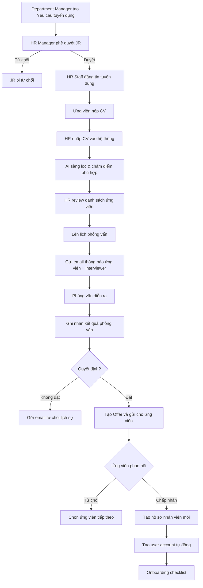
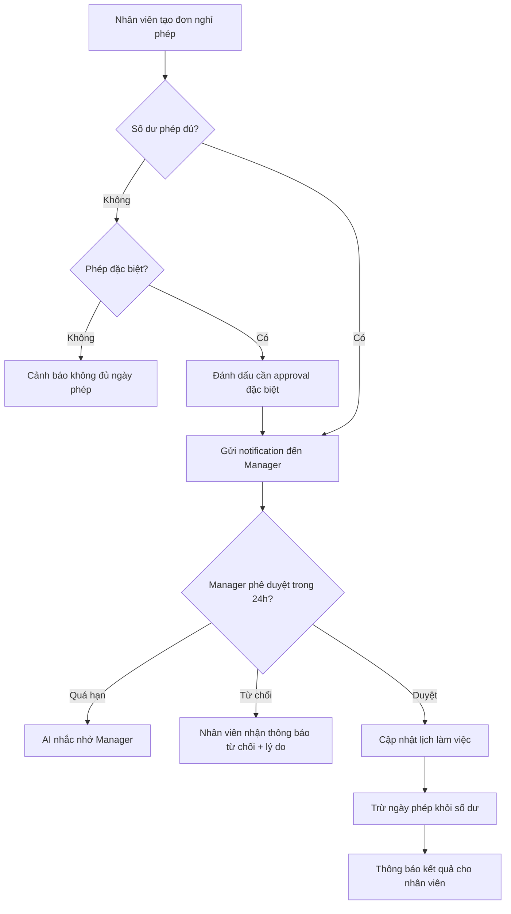
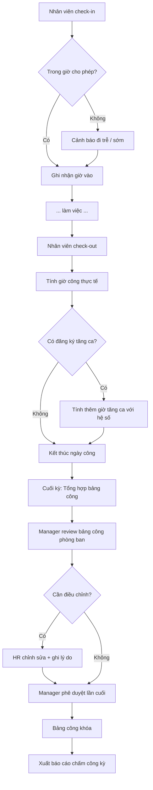

# SRS — Phân hệ HR
# Quản lý Nhân sự

**Phiên bản:** 1.0  
**Ngày tạo:** 09/05/2026  
**Tác giả:** Business Analyst  
**Sprint liên quan:** Sprint 03, Sprint 04  
**Trạng thái:** Hoàn chỉnh  

---

## Mục lục

1. [Tổng quan phân hệ](#1-tổng-quan-phân-hệ)
2. [Đặc tả chức năng](#2-đặc-tả-chức-năng)
3. [Luồng nghiệp vụ](#3-luồng-nghiệp-vụ)
4. [Mô hình dữ liệu](#4-mô-hình-dữ-liệu)
5. [Validation và Business Rules](#5-validation-và-business-rules)
6. [Tích hợp và API](#6-tích-hợp-và-api)

---

## 1. Tổng quan phân hệ

### 1.1 Phạm vi và mục tiêu

Phân hệ **HR** số hóa toàn bộ vòng đời nhân sự: từ tuyển dụng, quản lý hồ sơ, hợp đồng, chấm công đến đánh giá hiệu suất.

**Mục tiêu:**
- Quản lý hồ sơ nhân viên tập trung, đầy đủ
- Tự động hóa quy trình chấm công và quản lý phép
- Hỗ trợ tuyển dụng từ đăng tuyển đến onboarding
- Đánh giá KPI nhân viên định kỳ

### 1.2 Actors

| Actor | Mô tả |
|---|---|
| **HR Manager** | Quản lý nhân sự, phê duyệt tuyển dụng, hợp đồng |
| **HR Staff** | Nhập liệu hồ sơ, xử lý chấm công, nghỉ phép |
| **Department Manager** | Phê duyệt nghỉ phép, tăng ca của nhân viên phòng mình |
| **Employee** | Xem hồ sơ cá nhân, đăng ký nghỉ phép, tăng ca, check-in/out |
| **Tenant Admin** | Cấu hình HR: loại phép, ca làm việc, chính sách |
| **AI Agent** | Sàng lọc CV, cảnh báo rủi ro nghỉ việc, cân đối lịch |

### 1.3 Use Case tổng quan

| Nhóm | Use Case | Actor chính |
|---|---|---|
| **Tuyển dụng** | Tạo nhu cầu tuyển dụng | Department Manager, HR Manager |
| **Tuyển dụng** | Đăng tin tuyển dụng | HR Staff |
| **Tuyển dụng** | Nhập và quản lý hồ sơ ứng viên | HR Staff |
| **Tuyển dụng** | Lên lịch phỏng vấn | HR Staff |
| **Tuyển dụng** | Ghi nhận kết quả phỏng vấn | HR Staff, Department Manager |
| **Tuyển dụng** | Gửi offer và onboarding | HR Staff |
| **Nhân viên** | Tạo hồ sơ nhân viên | HR Staff |
| **Nhân viên** | Cập nhật thông tin nhân viên | HR Staff, Employee (phần cá nhân) |
| **Nhân viên** | Xem hồ sơ nhân viên | HR Manager, HR Staff, Employee (của mình) |
| **Hợp đồng** | Tạo hợp đồng lao động | HR Staff |
| **Hợp đồng** | Ký hợp đồng | HR Manager (ký doanh nghiệp), Employee (ký cá nhân) |
| **Hợp đồng** | Gia hạn / Thanh lý hợp đồng | HR Staff, HR Manager |
| **Chấm công** | Cấu hình ca làm việc | Tenant Admin, HR Manager |
| **Chấm công** | Phân ca cho nhân viên | HR Staff |
| **Chấm công** | Check-in / Check-out | Employee |
| **Chấm công** | Xem bảng công | HR Staff, Department Manager, Employee |
| **Chấm công** | Phê duyệt bảng công | Department Manager, HR Manager |
| **Nghỉ phép** | Đăng ký nghỉ phép | Employee |
| **Nghỉ phép** | Phê duyệt / Từ chối nghỉ phép | Department Manager |
| **Nghỉ phép** | Xem số ngày phép còn lại | Employee |
| **Tăng ca** | Đăng ký tăng ca | Employee |
| **Tăng ca** | Phê duyệt tăng ca | Department Manager |
| **Đánh giá** | Đặt mục tiêu KPI | Department Manager, Employee |
| **Đánh giá** | Đánh giá kỳ | Department Manager |
| **Đánh giá** | Xem lịch sử đánh giá | HR Manager, Employee |
| **AI** | AI sàng lọc CV | HR Staff (AI hỗ trợ) |
| **AI** | Cảnh báo rủi ro nghỉ việc | HR Manager |

---

## 2. Đặc tả chức năng

### 2.1 Nhóm: Tuyển dụng

#### F-HR-001: Quản lý Yêu cầu Tuyển dụng (Job Requisition)

| Thuộc tính | Nội dung |
|---|---|
| **ID** | F-HR-001 |
| **Tên** | Tạo và quản lý yêu cầu tuyển dụng |
| **Input** | `jobTitle`, `departmentId`, `numberOfPositions`, `jobDescription`, `requirements`, `salaryRange`, `deadline`, `requestedBy` |
| **Output** | Yêu cầu tuyển dụng tạo với trạng thái `PENDING_APPROVAL` |
| **Business Rules** | Phải được HR Manager phê duyệt trước khi đăng tin. Số vị trí ≥ 1 |
| **Multi-tenancy** | `tenantId` bắt buộc |

#### F-HR-002: Quản lý Hồ sơ Ứng viên

| Thuộc tính | Nội dung |
|---|---|
| **ID** | F-HR-002 |
| **Tên** | Nhập và quản lý CV ứng viên |
| **Input** | `fullName`, `email`, `phone`, `jobRequisitionId`, `cvFile` (PDF), `source` (email/walk-in/referral/website), `notes` |
| **Output** | Hồ sơ ứng viên lưu vào hệ thống, AI sàng lọc tự động |
| **Business Rules** | CV phải liên kết với job requisition. AI chấm điểm phù hợp 0–100 |
| **Multi-tenancy** | `tenantId` bắt buộc |

#### F-HR-003: Lên lịch Phỏng vấn

| Thuộc tính | Nội dung |
|---|---|
| **ID** | F-HR-003 |
| **Tên** | Tạo và quản lý lịch phỏng vấn |
| **Input** | `candidateId`, `interviewType` (PHONE/ONLINE/IN_PERSON), `scheduledAt`, `interviewers[]`, `location/link` |
| **Output** | Lịch phỏng vấn, email thông báo gửi ứng viên và người phỏng vấn |
| **Business Rules** | Thông báo trước tối thiểu 24 giờ. Không trùng lịch với phỏng vấn khác của cùng interviewer |
| **Multi-tenancy** | `tenantId` bắt buộc |

#### F-HR-004: Quyết định Tuyển dụng và Onboarding

| Thuộc tính | Nội dung |
|---|---|
| **ID** | F-HR-004 |
| **Tên** | Gửi offer và khởi tạo onboarding |
| **Input** | `candidateId`, `offerSalary`, `startDate`, `contractType`, `benefits` |
| **Output** | Email offer gửi ứng viên; nếu chấp nhận → tạo hồ sơ nhân viên mới + tài khoản hệ thống |
| **Business Rules** | Offer hết hạn sau 7 ngày nếu không phản hồi. Khi accept → tự động tạo `users` + `employees` record |
| **Multi-tenancy** | `tenantId` bắt buộc |

---

### 2.2 Nhóm: Quản lý Nhân viên

#### F-HR-010: Hồ sơ Nhân viên

| Thuộc tính | Nội dung |
|---|---|
| **ID** | F-HR-010 |
| **Tên** | Tạo và quản lý hồ sơ nhân viên |
| **Input** | `fullName`, `dateOfBirth`, `gender`, `nationalId`, `nationalIdIssueDate`, `nationalIdIssuePlace`, `email`, `phone`, `address`, `departmentId`, `positionId`, `managerId`, `startDate`, `employeeCode`, `photo`, `documents[]` |
| **Output** | Hồ sơ nhân viên đầy đủ |
| **Business Rules** | `employeeCode` duy nhất trong tenant. `nationalId` duy nhất trong tenant. Khi tạo nhân viên mới → tự động gửi invite tạo user account |
| **Multi-tenancy** | `tenantId` bắt buộc |

#### F-HR-011: Quản lý Hợp đồng Lao động

| Thuộc tính | Nội dung |
|---|---|
| **ID** | F-HR-011 |
| **Tên** | Tạo, ký và quản lý hợp đồng lao động |
| **Input** | `employeeId`, `contractType` (PROBATION/DEFINITE/INDEFINITE), `startDate`, `endDate`, `salary`, `allowances[]`, `contractFile` |
| **Output** | Hợp đồng với trạng thái `DRAFT` → sau ký: `ACTIVE` |
| **Business Rules** | BR-HR-002: Cảnh báo tự động khi còn 30 ngày hết hạn. Hợp đồng đã ký là bất biến (BR-HR-007) |
| **Multi-tenancy** | `tenantId` bắt buộc |

#### F-HR-012: Quản lý Khen thưởng / Kỷ luật

| Thuộc tính | Nội dung |
|---|---|
| **ID** | F-HR-012 |
| **Tên** | Ghi nhận khen thưởng, kỷ luật cho nhân viên |
| **Input** | `employeeId`, `type` (REWARD/DISCIPLINE), `date`, `description`, `decisionDocument`, `approvedBy` |
| **Output** | Bản ghi khen thưởng/kỷ luật trong lịch sử nhân sự |
| **Business Rules** | Bất biến sau khi phê duyệt. Lưu vào lịch sử vĩnh viễn |
| **Multi-tenancy** | `tenantId` bắt buộc |

---

### 2.3 Nhóm: Chấm công

#### F-HR-020: Cấu hình Ca làm việc

| Thuộc tính | Nội dung |
|---|---|
| **ID** | F-HR-020 |
| **Tên** | Định nghĩa và quản lý ca làm việc |
| **Input** | `shiftName`, `startTime`, `endTime`, `breakDuration` (phút), `workingDays[]` (0-6: CN-T7), `lateToleranceMinutes`, `earlyLeaveToleranceMinutes` |
| **Output** | Ca làm việc được lưu, sẵn sàng phân công |
| **Business Rules** | Ca không được chồng chéo thời gian. Thời gian làm việc không quá 12 giờ/ca |
| **Multi-tenancy** | `tenantId` bắt buộc |

#### F-HR-021: Phân ca cho Nhân viên

| Thuộc tính | Nội dung |
|---|---|
| **ID** | F-HR-021 |
| **Tên** | Gán ca làm việc cho nhân viên theo kỳ |
| **Input** | `employeeId`, `shiftId`, `effectiveFrom`, `effectiveTo` |
| **Output** | Lịch phân ca của nhân viên |
| **Business Rules** | Nhân viên chỉ có 1 ca chính tại một thời điểm. Ca tăng ca là riêng biệt |
| **Multi-tenancy** | `tenantId` bắt buộc |

#### F-HR-022: Check-in / Check-out

| Thuộc tính | Nội dung |
|---|---|
| **ID** | F-HR-022 |
| **Tên** | Ghi nhận thời gian vào/ra của nhân viên |
| **Input** | `employeeId`, `type` (CHECK_IN/CHECK_OUT), `timestamp`, `method` (APP/WEB/DEVICE), `location` (lat, lng - tùy chọn), `photo` (tùy chọn) |
| **Output** | Bản ghi chấm công, cập nhật trạng thái ngày công |
| **Business Rules** | Chỉ được check-in trong giờ cho phép (ca ± 60 phút). Check-out phải sau check-in. Quên check-out → cảnh báo sau 2 giờ kể từ giờ kết thúc ca |
| **Multi-tenancy** | `tenantId` bắt buộc |

#### F-HR-023: Tổng hợp và Phê duyệt Bảng công

| Thuộc tính | Nội dung |
|---|---|
| **ID** | F-HR-023 |
| **Tên** | Tổng hợp bảng công theo kỳ và phê duyệt |
| **Input** | `departmentId`, `period` (YYYY-MM), `approvedBy` |
| **Output** | Bảng công tổng hợp: số ngày công, ngày vắng, nghỉ phép, tăng ca |
| **Business Rules** | Bảng công bị khóa sau khi phê duyệt. Sửa sau khi khóa cần quyền đặc biệt và tạo audit trail |
| **Multi-tenancy** | `tenantId` bắt buộc |

---

### 2.4 Nhóm: Nghỉ phép

#### F-HR-030: Cấu hình Loại phép

| Thuộc tính | Nội dung |
|---|---|
| **ID** | F-HR-030 |
| **Tên** | Định nghĩa các loại phép và chính sách |
| **Input** | `leaveName`, `totalDaysPerYear`, `isPaidLeave`, `carryOverAllowed`, `maxCarryOverDays`, `advanceNoticeDays`, `requireApproval` |
| **Output** | Loại phép được cấu hình cho tenant |
| **Business Rules** | Các loại phép cơ bản theo Bộ luật Lao động: phép năm (12 ngày), phép ốm, phép thai sản, phép cưới... |
| **Multi-tenancy** | `tenantId` bắt buộc |

#### F-HR-031: Đăng ký Nghỉ phép

| Thuộc tính | Nội dung |
|---|---|
| **ID** | F-HR-031 |
| **Tên** | Nhân viên tạo đơn nghỉ phép |
| **Input** | `leaveTypeId`, `startDate`, `endDate`, `reason`, `handoverNote` |
| **Output** | Đơn nghỉ phép trạng thái `PENDING`, thông báo đến manager |
| **Business Rules** | BR-HR-003: Số ngày không vượt số dư. BR-HR-004: Vượt số dư → flag approval đặc biệt. Không được nghỉ trùng với nhân viên khác trong cùng phòng ban quá X% (cấu hình) |
| **Multi-tenancy** | `tenantId` bắt buộc |

#### F-HR-032: Phê duyệt Nghỉ phép

| Thuộc tính | Nội dung |
|---|---|
| **ID** | F-HR-032 |
| **Tên** | Manager phê duyệt hoặc từ chối đơn nghỉ phép |
| **Input** | `leaveRequestId`, `action` (APPROVE/REJECT), `comments` |
| **Output** | Trạng thái đơn cập nhật, nhân viên nhận thông báo, số dư phép giảm (nếu approve) |
| **Business Rules** | Manager chỉ phê duyệt được nhân viên trong phòng ban mình. Phê duyệt trong vòng 24 giờ theo SLA |
| **Multi-tenancy** | `tenantId` bắt buộc |

---

### 2.5 Nhóm: Tăng ca

#### F-HR-040: Đăng ký Tăng ca

| Thuộc tính | Nội dung |
|---|---|
| **ID** | F-HR-040 |
| **Tên** | Nhân viên đăng ký làm thêm giờ |
| **Input** | `date`, `startTime`, `endTime`, `reason`, `requestedBy` |
| **Output** | Yêu cầu tăng ca, thông báo manager |
| **Business Rules** | BR-HR-005: Tăng ca phải đăng ký và phê duyệt trước (ngoại lệ: có thể cấu hình approve sau). Tổng tăng ca không vượt 200 giờ/năm (theo luật) |
| **Multi-tenancy** | `tenantId` bắt buộc |

---

### 2.6 Nhóm: Đánh giá Hiệu suất (KPI)

#### F-HR-050: Đặt mục tiêu KPI

| Thuộc tính | Nội dung |
|---|---|
| **ID** | F-HR-050 |
| **Tên** | Thiết lập mục tiêu KPI cho nhân viên |
| **Input** | `employeeId`, `period`, `objectives[]`: `{ title, targetValue, unit, weight }` |
| **Output** | Bộ mục tiêu KPI cho kỳ |
| **Business Rules** | Tổng trọng số (weight) = 100%. Phải có ít nhất 1 mục tiêu |
| **Multi-tenancy** | `tenantId` bắt buộc |

#### F-HR-051: Đánh giá định kỳ

| Thuộc tính | Nội dung |
|---|---|
| **ID** | F-HR-051 |
| **Tên** | Manager đánh giá KPI nhân viên cuối kỳ |
| **Input** | `kpiSetId`, `actualValues[]`, `managerScore` (1-5), `selfScore` (1-5, nếu có), `comments` |
| **Output** | Kết quả đánh giá, điểm tổng hợp |
| **Business Rules** | Đánh giá sau khi kỳ kết thúc. Lịch sử đánh giá là bất biến sau khi submit |
| **Multi-tenancy** | `tenantId` bắt buộc |

---

## 3. Luồng nghiệp vụ

### 3.1 Luồng: Tuyển dụng đầy đủ



---

### 3.2 Luồng: Nghỉ phép



---

### 3.3 Luồng: Chấm công và Tổng hợp



---

## 4. Mô hình dữ liệu

### 4.1 Collection: `employees`

| Trường | Kiểu | Bắt buộc | Mô tả |
|---|---|---|---|
| `_id` | ObjectId | Có | employeeId |
| `tenantId` | ObjectId | Có | |
| `userId` | ObjectId | Không | Liên kết user account (null khi chưa active) |
| `employeeCode` | string | Có | Mã nhân viên (unique trong tenant) |
| `fullName` | string | Có | Họ và tên |
| `dateOfBirth` | Date | Có | |
| `gender` | string (enum) | Có | `MALE` \| `FEMALE` \| `OTHER` |
| `nationalId` | string | Có | Số CCCD/CMND (mã hóa AES-256) |
| `nationalIdIssueDate` | Date | Không | |
| `nationalIdIssuePlace` | string | Không | |
| `email` | string | Có | |
| `phone` | string | Có | |
| `address` | object | Không | `{ permanent, current }` |
| `photo` | string | Không | URL ảnh (MinIO) |
| `departmentId` | ObjectId | Có | Phòng ban chính |
| `positionId` | ObjectId | Có | Chức danh |
| `managerId` | ObjectId | Không | Quản lý trực tiếp |
| `startDate` | Date | Có | Ngày bắt đầu làm việc |
| `endDate` | Date | Không | Ngày cuối làm việc (null = đang làm) |
| `status` | string (enum) | Có | `ACTIVE` \| `ON_LEAVE` \| `RESIGNED` \| `TERMINATED` \| `PROBATION` |
| `employmentType` | string (enum) | Có | `FULL_TIME` \| `PART_TIME` \| `CONTRACT` \| `INTERN` |
| `documents` | array | Không | `[{ type, fileName, url, uploadedAt }]` |
| `bankAccount` | object | Không | `{ bankName, accountNumber, accountHolder }` — mã hóa AES-256 |
| `taxCode` | string | Không | Mã số thuế cá nhân |
| `createdAt` | Date | Có | |
| `updatedAt` | Date | Có | |

**Indexes:** `(tenantId, employeeCode)` (unique), `(tenantId, userId)`, `(tenantId, departmentId)`, `(tenantId, status)`, `(tenantId, nationalId)` (unique)

---

### 4.2 Collection: `employment_contracts`

| Trường | Kiểu | Bắt buộc | Mô tả |
|---|---|---|---|
| `_id` | ObjectId | Có | contractId |
| `tenantId` | ObjectId | Có | |
| `employeeId` | ObjectId | Có | |
| `contractNumber` | string | Có | Số hợp đồng |
| `contractType` | string (enum) | Có | `PROBATION` \| `DEFINITE` \| `INDEFINITE` |
| `startDate` | Date | Có | |
| `endDate` | Date | Không | Null với hợp đồng không xác định thời hạn |
| `status` | string (enum) | Có | `DRAFT` \| `ACTIVE` \| `EXPIRED` \| `TERMINATED` |
| `basicSalary` | number | Có | Lương cơ bản (VND) |
| `allowances` | array | Không | `[{ type, amount }]` |
| `probationPeriodDays` | number | Không | Thời gian thử việc (ngày) |
| `workingHoursPerWeek` | number | Có | |
| `signedDate` | Date | Không | |
| `signedByCompany` | ObjectId | Không | userId người ký phía công ty |
| `signedByEmployee` | boolean | Có | Nhân viên đã ký chưa |
| `contractFile` | string | Không | URL file hợp đồng (MinIO) |
| `terminationReason` | string | Không | Lý do thanh lý |
| `createdAt` | Date | Có | |
| `updatedAt` | Date | Có | |

**Indexes:** `(tenantId, employeeId)`, `(tenantId, contractNumber)` (unique), `(tenantId, status)`, `endDate` (để cảnh báo)

---

### 4.3 Collection: `work_shifts`

| Trường | Kiểu | Bắt buộc | Mô tả |
|---|---|---|---|
| `_id` | ObjectId | Có | shiftId |
| `tenantId` | ObjectId | Có | |
| `name` | string | Có | Tên ca (VD: Ca sáng, Ca chiều) |
| `startTime` | string | Có | HH:mm |
| `endTime` | string | Có | HH:mm |
| `breakDuration` | number | Có | Phút nghỉ giữa ca |
| `workingDays` | number[] | Có | [1,2,3,4,5] — 0=CN, 1=T2, ..., 6=T7 |
| `lateToleranceMinutes` | number | Có | Phút cho phép đến trễ (mặc định 0) |
| `earlyLeaveToleranceMinutes` | number | Có | Phút cho phép về sớm (mặc định 0) |
| `isActive` | boolean | Có | |
| `createdAt` | Date | Có | |

**Indexes:** `(tenantId, name)` (unique), `tenantId`

---

### 4.4 Collection: `attendance_records`

| Trường | Kiểu | Bắt buộc | Mô tả |
|---|---|---|---|
| `_id` | ObjectId | Có | |
| `tenantId` | ObjectId | Có | |
| `employeeId` | ObjectId | Có | |
| `date` | Date | Có | Ngày làm việc (YYYY-MM-DD) |
| `shiftId` | ObjectId | Có | Ca được phân công |
| `checkIn` | Date | Không | Thời điểm check-in thực tế |
| `checkOut` | Date | Không | Thời điểm check-out thực tế |
| `checkInMethod` | string | Không | `APP` \| `WEB` \| `DEVICE` |
| `checkInLocation` | object | Không | `{ lat, lng }` |
| `workingMinutes` | number | Không | Số phút làm việc (tính tự động) |
| `overtimeMinutes` | number | Không | Số phút tăng ca |
| `status` | string (enum) | Có | `PRESENT` \| `ABSENT` \| `LATE` \| `EARLY_LEAVE` \| `ON_LEAVE` \| `HOLIDAY` |
| `lateMinutes` | number | Không | Số phút đến trễ |
| `earlyLeaveMinutes` | number | Không | Số phút về sớm |
| `notes` | string | Không | Ghi chú (lý do vắng, điều chỉnh...) |
| `adjustedBy` | ObjectId | Không | userId điều chỉnh thủ công |
| `createdAt` | Date | Có | |
| `updatedAt` | Date | Có | |

**Indexes:** `(tenantId, employeeId, date)` (unique composite), `(tenantId, date)`, `(tenantId, status)`

---

### 4.5 Collection: `leave_requests`

| Trường | Kiểu | Bắt buộc | Mô tả |
|---|---|---|---|
| `_id` | ObjectId | Có | |
| `tenantId` | ObjectId | Có | |
| `employeeId` | ObjectId | Có | |
| `leaveTypeId` | ObjectId | Có | |
| `startDate` | Date | Có | |
| `endDate` | Date | Có | |
| `totalDays` | number | Có | Số ngày thực tế nghỉ (tính theo lịch làm việc) |
| `reason` | string | Có | |
| `status` | string (enum) | Có | `PENDING` \| `APPROVED` \| `REJECTED` \| `CANCELLED` |
| `approvedBy` | ObjectId | Không | managerId |
| `approvedAt` | Date | Không | |
| `comments` | string | Không | Ý kiến của manager |
| `handoverNote` | string | Không | Ghi chú bàn giao công việc |
| `createdAt` | Date | Có | |
| `updatedAt` | Date | Có | |

**Indexes:** `(tenantId, employeeId)`, `(tenantId, startDate, endDate)`, `(tenantId, status)`

---

### 4.6 Collection: `leave_balances`

| Trường | Kiểu | Bắt buộc | Mô tả |
|---|---|---|---|
| `_id` | ObjectId | Có | |
| `tenantId` | ObjectId | Có | |
| `employeeId` | ObjectId | Có | |
| `leaveTypeId` | ObjectId | Có | |
| `year` | number | Có | Năm dương lịch |
| `allocated` | number | Có | Số ngày được cấp |
| `used` | number | Có | Số ngày đã dùng |
| `pending` | number | Có | Số ngày đang chờ duyệt |
| `remaining` | number | Có | `= allocated - used - pending` |
| `carryOver` | number | Không | Số ngày chuyển từ năm trước |
| `updatedAt` | Date | Có | |

**Indexes:** `(tenantId, employeeId, leaveTypeId, year)` (unique composite)

---

### 4.7 Collection: `job_candidates`

| Trường | Kiểu | Bắt buộc | Mô tả |
|---|---|---|---|
| `_id` | ObjectId | Có | candidateId |
| `tenantId` | ObjectId | Có | |
| `jobRequisitionId` | ObjectId | Có | |
| `fullName` | string | Có | |
| `email` | string | Có | |
| `phone` | string | Không | |
| `cvFileUrl` | string | Không | URL CV (MinIO) |
| `source` | string (enum) | Có | `EMAIL` \| `WALK_IN` \| `REFERRAL` \| `WEBSITE` \| `HEADHUNT` |
| `aiScore` | number | Không | Điểm AI sàng lọc (0–100) |
| `stage` | string (enum) | Có | `APPLIED` \| `SCREENING` \| `INTERVIEW` \| `OFFER` \| `HIRED` \| `REJECTED` |
| `interviews` | array | Không | `[{ interviewId, scheduledAt, type, result, score, notes }]` |
| `offerAmount` | number | Không | |
| `offerSentAt` | Date | Không | |
| `offerAcceptedAt` | Date | Không | |
| `createdAt` | Date | Có | |
| `updatedAt` | Date | Có | |

**Indexes:** `(tenantId, jobRequisitionId)`, `(tenantId, email)`, `(tenantId, stage)`

---

## 5. Validation và Business Rules

### 5.1 Validation Rules

| Trường | Quy tắc | Thông báo lỗi |
|---|---|---|
| `employees.nationalId` | 9, 12 hoặc 15 chữ số | "Số CCCD/CMND không hợp lệ" |
| `employees.dateOfBirth` | Phải ≥ 16 tuổi (tuổi lao động tối thiểu) | "Tuổi nhân viên phải từ 16 trở lên" |
| `employment_contracts.basicSalary` | ≥ Lương tối thiểu vùng hiện hành | "Lương thấp hơn mức tối thiểu vùng" |
| `leave_requests.endDate` | ≥ startDate | "Ngày kết thúc phải sau ngày bắt đầu" |
| `work_shifts.startTime` | Định dạng HH:mm | "Giờ bắt đầu ca không hợp lệ" |
| `attendance_records.checkOut` | > checkIn | "Giờ ra phải sau giờ vào" |

### 5.2 Business Rules

| Mã | Rule | Chi tiết |
|---|---|---|
| BR-HR-001 | Phòng ban chính duy nhất | Nhân viên chỉ có 1 `departmentId` chính. Có thể tham gia nhóm/dự án phụ |
| BR-HR-002 | Cảnh báo hợp đồng hết hạn | 30 ngày trước `endDate` → alert HR + Manager. 7 ngày → alert lần 2 |
| BR-HR-003 | Số dư phép | Không cho phép nghỉ vượt `remaining` trừ khi có flag `requireSpecialApproval` |
| BR-HR-004 | Nghỉ phép đặc biệt | Vượt số dư → workflow approval với HR Manager và cấp trên |
| BR-HR-005 | Tăng ca phê duyệt trước | Tăng ca phải có approval trước khi thực hiện (cấu hình được) |
| BR-HR-006 | Vô hiệu hóa tài khoản khi nghỉ việc | Nhân viên `RESIGNED`/`TERMINATED` → `userId` chuyển sang `INACTIVE` sau `endDate` |
| BR-HR-007 | Lịch sử nhân sự bất biến | Hợp đồng đã ký, quyết định khen thưởng/kỷ luật không được sửa/xóa |
| BR-HR-008 | Tổng tăng ca | Không vượt 200 giờ/năm và 40 giờ/tháng theo Bộ luật Lao động |

### 5.3 Quy tắc tính toán

**Số ngày nghỉ phép trong khoảng:**
```
totalDays = (workingDays trong [startDate, endDate]) - holidayDays
workingDays = các ngày trong workingDays của ca làm việc nhân viên
holidayDays = ngày lễ chính thức trùng với workingDays
```

**Giờ làm việc thực tế:**
```
workingMinutes = MAX(0, checkOut - checkIn - breakDuration - lateMinutes)
overtimeMinutes = MAX(0, workingMinutes - scheduledMinutes)
```

---

## 6. Tích hợp và API

### 6.1 Tích hợp nội bộ

| Phân hệ | Dữ liệu trao đổi | Hướng |
|---|---|---|
| System Admin | Khi tạo employee → tạo user account | Ghi sang System Admin |
| System Admin | Nhân viên nghỉ → vô hiệu hóa user | Ghi sang System Admin |
| Office | Danh sách nhân viên, phòng ban | HR cung cấp cho Office đọc |
| Sale & Logistics | Danh sách nhân viên sale, kho | HR cung cấp |
| Accounting | Dữ liệu chấm công, tăng ca | HR cung cấp cho Accounting |
| AI Agent | Dữ liệu nhân sự → phân tích rủi ro, sàng lọc CV | Đọc |
| Dashboard | KPI nhân sự, biến động | Đọc |

### 6.2 API nội bộ xuất cho microservices

| Endpoint | Method | Mô tả |
|---|---|---|
| `/internal/employees` | GET | Danh sách nhân viên (có filter `departmentId`, `status`) |
| `/internal/employees/{id}` | GET | Chi tiết nhân viên |
| `/internal/employees/{id}/attendance-summary` | GET | Tóm tắt chấm công kỳ |

### 6.3 Tích hợp tương lai

| Hệ thống | Mục đích |
|---|---|
| Máy chấm công sinh trắc học | Tự động nhận dữ liệu check-in/out qua API/SDK |
| Bảo hiểm xã hội điện tử | Khai báo lao động, đóng BHXH (ngoài phạm vi v1.0) |
