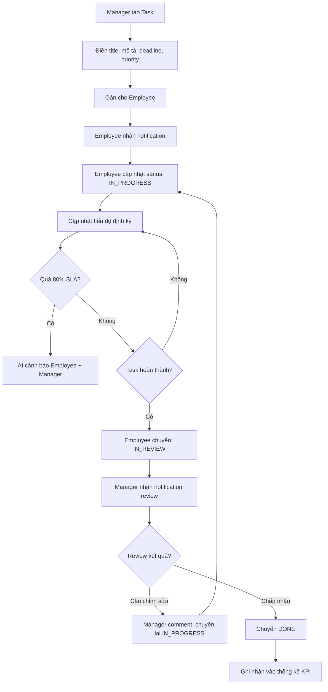
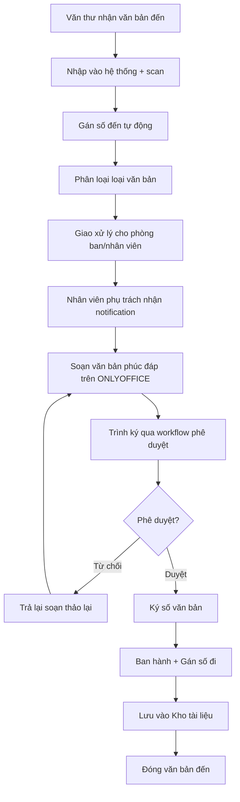
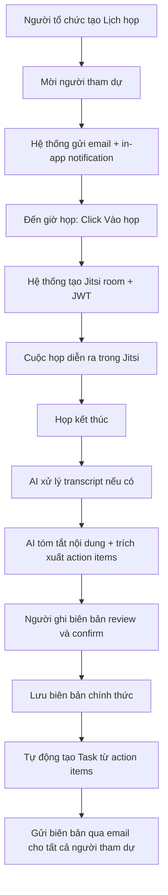

# SRS — Phân hệ Office

# Điều hành và Cộng tác Nội bộ

**Phiên bản:** 1.0  
**Ngày tạo:** 09/05/2026  
**Tác giả:** Business Analyst  
**Sprint liên quan:** Sprint 09, Sprint 10  
**Trạng thái:** Hoàn chỉnh

---

## Mục lục

1. [Tổng quan phân hệ](#1-tổng-quan-phân-hệ)
2. [Đặc tả chức năng](#2-đặc-tả-chức-năng)
3. [Luồng nghiệp vụ](#3-luồng-nghiệp-vụ)
4. [Mô hình dữ liệu](#4-mô-hình-dữ-liệu)
5. [Validation và Business Rules](#5-validation-và-business-rules)
6. [Tích hợp và API](#6-tích-hợp-và-api)

---

## 1. Tổng quan phân hệ

### 1.1 Phạm vi và mục tiêu

Phân hệ **Office** là trung tâm cộng tác và điều hành nội bộ, tích hợp quản lý công việc, văn bản, soạn thảo tài liệu, họp trực tuyến và chat nội bộ trong một nền tảng thống nhất.

**Mục tiêu:**

- Số hóa quy trình giao việc và theo dõi tiến độ
- Quản lý văn bản đến/đi và lưu trữ tài liệu
- Cộng tác soạn thảo tài liệu với ONLYOFFICE
- Họp trực tuyến với Jitsi Meet
- Giao tiếp nội bộ qua chat

### 1.2 Actors

| Actor            | Mô tả                                                     |
| ---------------- | --------------------------------------------------------- |
| **Manager**      | Tạo và giao công việc, quản lý tiến độ, phê duyệt văn bản |
| **Employee**     | Nhận và thực hiện công việc, soạn thảo tài liệu           |
| **Admin**        | Cấu hình workflow, loại văn bản                           |
| **Tenant Admin** | Cấu hình module Office                                    |
| **AI Agent**     | Tóm tắt văn bản/họp, nhắc việc, tạo task tự động          |
| **ONLYOFFICE**   | Dịch vụ ngoài, thực hiện co-editing tài liệu              |
| **Jitsi Meet**   | Dịch vụ ngoài, thực hiện video conference                 |

### 1.3 Use Case tổng quan

| Nhóm          | Use Case                              | Actor chính             |
| ------------- | ------------------------------------- | ----------------------- |
| **Công việc** | Tạo task                              | Manager, Employee       |
| **Công việc** | Gán task cho nhân viên                | Manager                 |
| **Công việc** | Cập nhật tiến độ task                 | Employee                |
| **Công việc** | Phê duyệt task hoàn thành             | Manager                 |
| **Công việc** | Xem bảng Kanban / timeline            | Manager, Employee       |
| **Công việc** | Escalate task quá hạn                 | AI Agent tự động        |
| **Workflow**  | Cấu hình luồng phê duyệt đa cấp       | Admin, Tenant Admin     |
| **Workflow**  | Thực hiện phê duyệt                   | Manager (theo cấu hình) |
| **Văn bản**   | Nhập văn bản đến                      | Văn thư (Employee)      |
| **Văn bản**   | Tạo văn bản đi                        | Employee                |
| **Văn bản**   | Phê duyệt và ban hành văn bản         | Manager, Director       |
| **Văn bản**   | Tra cứu văn bản                       | Tất cả user có quyền    |
| **Tài liệu**  | Upload và quản lý file                | Employee                |
| **Tài liệu**  | Soạn thảo DOCX/XLSX/PPTX (ONLYOFFICE) | Employee                |
| **Tài liệu**  | Chia sẻ tài liệu với phân quyền       | Employee, Manager       |
| **Tài liệu**  | Xem lịch sử phiên bản                 | Employee                |
| **Họp**       | Tạo lịch họp                          | Manager, Employee       |
| **Họp**       | Mời người tham dự                     | Manager                 |
| **Họp**       | Tổ chức họp Jitsi Meet                | Manager, Employee       |
| **Họp**       | Ghi biên bản họp                      | Employee, AI Agent      |
| **Chat**      | Nhắn tin cá nhân                      | Employee                |
| **Chat**      | Nhắn tin nhóm/kênh                    | Employee                |
| **Chat**      | Chia sẻ file qua chat                 | Employee                |
| **Thông báo** | Nhận thông báo in-app real-time       | Tất cả user             |
| **Thông báo** | Nhận email thông báo                  | Tất cả user             |

---

## 2. Đặc tả chức năng

### 2.1 Nhóm: Quản lý Công việc (Task Management)

#### F-OF-001: Tạo và quản lý Task

| Thuộc tính         | Nội dung                                                                                                                                          |
| ------------------ | ------------------------------------------------------------------------------------------------------------------------------------------------- |
| **ID**             | F-OF-001                                                                                                                                          |
| **Tên**            | Tạo, sửa, xóa task                                                                                                                                |
| **Input**          | `title`, `description`, `assigneeIds[]`, `dueDate`, `priority` (LOW/MEDIUM/HIGH/URGENT), `parentTaskId`, `projectId`, `labels[]`, `attachments[]` |
| **Output**         | Task được tạo, notification gửi assignee                                                                                                          |
| **Business Rules** | Deadline phải là ngày trong tương lai. Sub-task kế thừa `projectId` từ parent. Không xóa task có sub-task chưa hoàn thành                         |
| **Multi-tenancy**  | `tenantId` bắt buộc                                                                                                                               |

#### F-OF-002: Cập nhật tiến độ Task

| Thuộc tính         | Nội dung                                                                                       |
| ------------------ | ---------------------------------------------------------------------------------------------- |
| **ID**             | F-OF-002                                                                                       |
| **Tên**            | Cập nhật trạng thái và tiến độ task                                                            |
| **Input**          | `taskId`, `status` (TODO/IN_PROGRESS/IN_REVIEW/DONE/CANCELLED), `progress` (0–100%), `comment` |
| **Output**         | Trạng thái task cập nhật, timeline ghi nhận, notification đến creator                          |
| **Business Rules** | Chỉ assignee hoặc creator mới cập nhật được. Chuyển sang DONE → creator phải review            |
| **Multi-tenancy**  | `tenantId` bắt buộc                                                                            |

#### F-OF-003: SLA Tracking và Escalation

| Thuộc tính         | Nội dung                                                                                                                  |
| ------------------ | ------------------------------------------------------------------------------------------------------------------------- |
| **ID**             | F-OF-003                                                                                                                  |
| **Tên**            | Theo dõi SLA và tự động escalate khi quá hạn                                                                              |
| **Mô tả**          | Hệ thống tính toán thời gian còn lại theo giờ làm việc (dựa trên lịch tenant) và escalate khi vượt SLA                    |
| **Business Rules** | SLA cảnh báo tại 80% thời gian đã qua. Quá 100% → AI escalate đến manager. Giờ làm việc tính theo lịch tenant (BR-OF-004) |
| **Multi-tenancy**  | Lịch làm việc theo cấu hình `tenantId`                                                                                    |

#### F-OF-004: Kanban và Timeline view

| Thuộc tính         | Nội dung                                                       |
| ------------------ | -------------------------------------------------------------- |
| **ID**             | F-OF-004                                                       |
| **Tên**            | Hiển thị task theo dạng Kanban board và Timeline               |
| **Input**          | `projectId`, `filter` (assignee, label, priority, date)        |
| **Output**         | Kanban: task phân cột theo status. Timeline: Gantt view cơ bản |
| **Business Rules** | Chỉ hiển thị task user có quyền xem                            |
| **Multi-tenancy**  | `tenantId` bắt buộc                                            |

---

### 2.2 Nhóm: Workflow Phê duyệt

#### F-OF-010: Cấu hình Workflow

| Thuộc tính         | Nội dung                                                                                                                          |
| ------------------ | --------------------------------------------------------------------------------------------------------------------------------- |
| **ID**             | F-OF-010                                                                                                                          |
| **Tên**            | Thiết kế luồng phê duyệt đa cấp                                                                                                   |
| **Input**          | `workflowName`, `targetType` (TASK/DOCUMENT/LEAVE/EXPENSE), `steps[]`: `{ order, approverRole/approverIds, condition, slaHours }` |
| **Output**         | Workflow template được lưu, áp dụng tự động cho đối tượng chỉ định                                                                |
| **Business Rules** | Tối đa 10 cấp phê duyệt. Mỗi cấp có SLA riêng. Có thể cấu hình "bất kỳ một người trong nhóm" hoặc "tất cả"                        |
| **Multi-tenancy**  | `tenantId` bắt buộc                                                                                                               |

#### F-OF-011: Thực hiện Phê duyệt

| Thuộc tính         | Nội dung                                                                                  |
| ------------------ | ----------------------------------------------------------------------------------------- |
| **ID**             | F-OF-011                                                                                  |
| **Tên**            | Phê duyệt hoặc từ chối yêu cầu                                                            |
| **Input**          | `approvalRequestId`, `action` (APPROVE/REJECT/REQUEST_CHANGE), `comments`                 |
| **Output**         | Trạng thái request cập nhật; nếu APPROVE → chuyển cấp tiếp; nếu REJECT → trả về người tạo |
| **Business Rules** | Approver chỉ thấy request trong phạm vi phân quyền. Từ chối phải có comment               |
| **Multi-tenancy**  | `tenantId` bắt buộc                                                                       |

---

### 2.3 Nhóm: Quản lý Văn bản

#### F-OF-020: Văn bản Đến

| Thuộc tính         | Nội dung                                                                                                                            |
| ------------------ | ----------------------------------------------------------------------------------------------------------------------------------- |
| **ID**             | F-OF-020                                                                                                                            |
| **Tên**            | Nhập và xử lý văn bản đến                                                                                                           |
| **Input**          | `documentDate`, `senderOrg`, `subject`, `documentTypeId`, `scannedFile`, `receivedDate`, `secretLevel` (NORMAL/CONFIDENTIAL/SECRET) |
| **Output**         | Văn bản đến được số hóa, gán số đến, phân công xử lý                                                                                |
| **Business Rules** | BR-OF-001: Mỗi văn bản đến phải có số đến và người xử lý trước khi đóng. Số đến tự động, không được sửa                             |
| **Multi-tenancy**  | `tenantId` bắt buộc                                                                                                                 |

#### F-OF-021: Văn bản Đi và Phê duyệt

| Thuộc tính         | Nội dung                                                                                            |
| ------------------ | --------------------------------------------------------------------------------------------------- |
| **ID**             | F-OF-021                                                                                            |
| **Tên**            | Soạn thảo và ban hành văn bản đi                                                                    |
| **Input**          | `documentTypeId`, `subject`, `recipient`, `contentFileId` (soạn trên ONLYOFFICE), `signerIds[]`     |
| **Output**         | Văn bản đi qua workflow phê duyệt → ký số → ban hành → lưu kho                                      |
| **Business Rules** | BR-OF-002: Sau khi ban hành không được sửa nội dung. BR-OF-003: Phải đủ số cấp ký theo loại văn bản |
| **Multi-tenancy**  | `tenantId` bắt buộc                                                                                 |

#### F-OF-022: Tra cứu Văn bản

| Thuộc tính         | Nội dung                                                                           |
| ------------------ | ---------------------------------------------------------------------------------- |
| **ID**             | F-OF-022                                                                           |
| **Tên**            | Tìm kiếm và xem văn bản trong hệ thống                                             |
| **Input**          | Bộ lọc: `type` (đến/đi), `dateRange`, `senderOrg`, `subject`, `status`, `keywords` |
| **Output**         | Danh sách văn bản phù hợp, có thể xem file                                         |
| **Business Rules** | Phân quyền theo mức độ mật (SECRET chỉ người được chỉ định)                        |
| **Multi-tenancy**  | `tenantId` bắt buộc                                                                |

---

### 2.4 Nhóm: Lưu trữ Tài liệu (Document Storage)

#### F-OF-030: Quản lý File và Thư mục

| Thuộc tính         | Nội dung                                                                                                                                               |
| ------------------ | ------------------------------------------------------------------------------------------------------------------------------------------------------ |
| **ID**             | F-OF-030                                                                                                                                               |
| **Tên**            | Upload, tổ chức và quản lý file                                                                                                                        |
| **Input**          | `file` (binary), `folderId`, `name`, `permissions[]`: `{ userId/roleId, access: VIEW/EDIT/MANAGE }`                                                    |
| **Output**         | File được lưu vào MinIO, metadata lưu trong DB                                                                                                         |
| **Business Rules** | BR-OF-005: Kiểm tra virus scan (ClamAV hoặc tương đương). Giới hạn size theo quota tenant. Hỗ trợ định dạng: DOCX, XLSX, PPTX, PDF, JPG, PNG, MP4, ZIP |
| **Multi-tenancy**  | File lưu vào `tenant-{tenantId}/documents/` trong MinIO                                                                                                |

#### F-OF-031: Soạn thảo với ONLYOFFICE

| Thuộc tính         | Nội dung                                                                                                                                  |
| ------------------ | ----------------------------------------------------------------------------------------------------------------------------------------- |
| **ID**             | F-OF-031                                                                                                                                  |
| **Tên**            | Mở và soạn thảo DOCX/XLSX/PPTX trực tiếp trong trình duyệt                                                                                |
| **Mô tả**          | Tích hợp ONLYOFFICE Document Server: tạo JWT token ngắn hạn, trả về URL editor                                                            |
| **Input**          | `fileId`, `mode` (VIEW/EDIT)                                                                                                              |
| **Output**         | URL ONLYOFFICE editor với JWT token                                                                                                       |
| **Business Rules** | JWT cho ONLYOFFICE hết hạn sau 60 phút. Co-editing real-time hỗ trợ tối đa 10 người đồng thời/file. Lưu phiên bản mới mỗi khi đóng editor |
| **Multi-tenancy**  | ONLYOFFICE server chia sẻ, JWT chứa `tenantId` để phân biệt                                                                               |

#### F-OF-032: Version Control Tài liệu

| Thuộc tính         | Nội dung                                                                                        |
| ------------------ | ----------------------------------------------------------------------------------------------- |
| **ID**             | F-OF-032                                                                                        |
| **Tên**            | Quản lý lịch sử phiên bản tài liệu                                                              |
| **Input**          | `fileId`                                                                                        |
| **Output**         | Danh sách phiên bản với ngày, người chỉnh sửa, mô tả thay đổi                                   |
| **Business Rules** | Lưu tối đa 50 phiên bản/file. Phiên bản cũ có thể khôi phục (tạo phiên bản mới từ phiên bản cũ) |
| **Multi-tenancy**  | `tenantId` bắt buộc                                                                             |

---

### 2.5 Nhóm: Họp trực tuyến

#### F-OF-040: Quản lý Lịch họp

| Thuộc tính         | Nội dung                                                                                                           |
| ------------------ | ------------------------------------------------------------------------------------------------------------------ |
| **ID**             | F-OF-040                                                                                                           |
| **Tên**            | Tạo và quản lý lịch họp                                                                                            |
| **Input**          | `title`, `description`, `startTime`, `endTime`, `invitees[]`, `agendaItems[]`, `isRecurring`, `recurrenceRule`     |
| **Output**         | Lịch họp, email thông báo gửi invitees, thêm vào calendar                                                          |
| **Business Rules** | Không trùng lịch với họp khác của cùng người tổ chức. Thông báo trước tối thiểu 30 phút. Tối đa 100 người/cuộc họp |
| **Multi-tenancy**  | `tenantId` bắt buộc                                                                                                |

#### F-OF-041: Tích hợp Jitsi Meet

| Thuộc tính         | Nội dung                                                                                                                             |
| ------------------ | ------------------------------------------------------------------------------------------------------------------------------------ |
| **ID**             | F-OF-041                                                                                                                             |
| **Tên**            | Khởi tạo và tham gia cuộc họp video qua Jitsi Meet                                                                                   |
| **Mô tả**          | Tạo phòng họp Jitsi với JWT xác thực, nhúng vào iframe hoặc mở app Jitsi                                                             |
| **Input**          | `meetingId`                                                                                                                          |
| **Output**         | Jitsi room URL với JWT token, nhúng trong giao diện                                                                                  |
| **Business Rules** | BR-OF-006: Record chỉ khi tất cả người tham gia đồng ý. JWT Jitsi hết hạn sau cuộc họp. Phòng họp tự đóng sau 60 phút không có người |
| **Multi-tenancy**  | Room name theo pattern: `tenant-{tenantId}-meeting-{meetingId}`                                                                      |

#### F-OF-042: Biên bản Họp

| Thuộc tính         | Nội dung                                                                                                     |
| ------------------ | ------------------------------------------------------------------------------------------------------------ |
| **ID**             | F-OF-042                                                                                                     |
| **Tên**            | Ghi và quản lý biên bản họp                                                                                  |
| **Input**          | `meetingId`, `attendees[]` (thực tế), `minutesContent`, `actionItems[]`: `{ task, assignee, deadline }`      |
| **Output**         | Biên bản họp lưu vào hệ thống; action items → tạo task tự động                                               |
| **Business Rules** | Biên bản gửi email cho tất cả người tham dự sau khi lưu. Action items tự động tạo task trong task management |
| **Multi-tenancy**  | `tenantId` bắt buộc                                                                                          |

---

### 2.6 Nhóm: Chat Nội bộ

#### F-OF-050: Chat cá nhân (Direct Message)

| Thuộc tính         | Nội dung                                                                                   |
| ------------------ | ------------------------------------------------------------------------------------------ |
| **ID**             | F-OF-050                                                                                   |
| **Tên**            | Nhắn tin trực tiếp giữa hai người                                                          |
| **Input**          | `recipientId`, `content` (text/file/image), `replyToMessageId`                             |
| **Output**         | Tin nhắn gửi real-time qua Socket.IO                                                       |
| **Business Rules** | Người nhận phải trong cùng tenant. Nội dung tin nhắn không được rỗng. File đính kèm ≤ 50MB |
| **Multi-tenancy**  | Conversation chỉ giữa user cùng `tenantId`                                                 |

#### F-OF-051: Chat nhóm / Kênh

| Thuộc tính         | Nội dung                                                                                                               |
| ------------------ | ---------------------------------------------------------------------------------------------------------------------- |
| **ID**             | F-OF-051                                                                                                               |
| **Tên**            | Nhắn tin theo nhóm hoặc kênh chủ đề                                                                                    |
| **Input**          | `channelId`, `content`, `attachments[]`                                                                                |
| **Output**         | Tin nhắn broadcast đến tất cả thành viên kênh qua Socket.IO                                                            |
| **Business Rules** | Kênh công khai: tất cả user trong tenant tham gia. Kênh riêng: chỉ được mời. Kênh mặc định: `general`, `announcements` |
| **Multi-tenancy**  | Channel thuộc `tenantId`                                                                                               |

---

### 2.7 Nhóm: Thông báo (Notifications)

#### F-OF-060: Thông báo In-app Real-time

| Thuộc tính         | Nội dung                                                                                                             |
| ------------------ | -------------------------------------------------------------------------------------------------------------------- |
| **ID**             | F-OF-060                                                                                                             |
| **Tên**            | Gửi và nhận thông báo trong ứng dụng theo thời gian thực                                                             |
| **Input**          | `userId`, `type`, `title`, `content`, `priority` (NORMAL/HIGH), `actionUrl`                                          |
| **Output**         | Notification push qua Socket.IO, lưu vào DB, badge count tăng                                                        |
| **Business Rules** | BR-OF-007: Notification ưu tiên cao (deadline hôm nay) gửi cả email. Lưu lịch sử 90 ngày. Đánh dấu đã đọc theo batch |
| **Multi-tenancy**  | Notification chỉ gửi đến user trong cùng `tenantId`                                                                  |

---

## 3. Luồng nghiệp vụ

### 3.1 Luồng: Giao và xử lý Công việc (Happy Path)

---

### 3.2 Luồng: Xử lý Văn bản Đến

---

### 3.3 Luồng: Họp Jitsi và Biên bản tự động

---

## 4. Mô hình dữ liệu

### 4.1 Collection: `tasks`

| Trường         | Kiểu          | Bắt buộc | Mô tả                                                           |
| -------------- | ------------- | -------- | --------------------------------------------------------------- |
| `_id`          | ObjectId      | Có       | taskId                                                          |
| `tenantId`     | ObjectId      | Có       |                                                                 |
| `title`        | string        | Có       |                                                                 |
| `description`  | string        | Không    |                                                                 |
| `status`       | string (enum) | Có       | `TODO` \| `IN_PROGRESS` \| `IN_REVIEW` \| `DONE` \| `CANCELLED` |
| `priority`     | string (enum) | Có       | `LOW` \| `MEDIUM` \| `HIGH` \| `URGENT`                         |
| `creatorId`    | ObjectId      | Có       | userId người tạo                                                |
| `assigneeIds`  | ObjectId[]    | Có       | Danh sách người được giao                                       |
| `dueDate`      | Date          | Không    | Deadline                                                        |
| `startDate`    | Date          | Không    |                                                                 |
| `progress`     | number        | Có       | 0–100 (%)                                                       |
| `parentTaskId` | ObjectId      | Không    | Task cha (nếu là sub-task)                                      |
| `projectId`    | ObjectId      | Không    | Dự án liên kết                                                  |
| `labels`       | string[]      | Không    | Nhãn phân loại                                                  |
| `attachments`  | array         | Không    | `[{ fileId, fileName, url }]`                                   |
| `workflowId`   | ObjectId      | Không    | Workflow phê duyệt áp dụng                                      |
| `slaDeadline`  | Date          | Không    | Hạn chót tính theo SLA                                          |
| `isEscalated`  | boolean       | Có       | Đã escalate chưa                                                |
| `comments`     | array         | Không    | `[{ userId, content, createdAt }]` — thường query riêng         |
| `sourceType`   | string        | Không    | Nguồn tạo: MANUAL/MEETING/SALE_ORDER/AI                         |
| `sourceId`     | string        | Không    | ID nguồn                                                        |
| `createdAt`    | Date          | Có       |                                                                 |
| `updatedAt`    | Date          | Có       |                                                                 |

**Indexes:** `(tenantId, assigneeIds)`, `(tenantId, status)`, `(tenantId, dueDate)`, `(tenantId, projectId)`, `(tenantId, creatorId)`

---

### 4.2 Collection: `documents` (Văn bản)

| Trường                | Kiểu          | Bắt buộc | Mô tả                                                          |
| --------------------- | ------------- | -------- | -------------------------------------------------------------- |
| `_id`                 | ObjectId      | Có       | documentId                                                     |
| `tenantId`            | ObjectId      | Có       |                                                                |
| `documentType`        | string (enum) | Có       | `INCOMING` \| `OUTGOING` \| `INTERNAL`                         |
| `documentNumber`      | string        | Có       | Số văn bản (auto cho đến/đi)                                   |
| `subject`             | string        | Có       | Trích yếu                                                      |
| `documentTypeId`      | ObjectId      | Có       | Loại văn bản (từ catalog)                                      |
| `status`              | string (enum) | Có       | `DRAFT` \| `IN_APPROVAL` \| `APPROVED` \| `ISSUED` \| `CLOSED` |
| `secretLevel`         | string (enum) | Có       | `NORMAL` \| `CONFIDENTIAL` \| `SECRET`                         |
| `documentDate`        | Date          | Không    | Ngày trên văn bản                                              |
| `receivedDate`        | Date          | Không    | Ngày nhận (văn bản đến)                                        |
| `senderOrg`           | string        | Không    | Cơ quan gửi (văn bản đến)                                      |
| `recipientOrg`        | string        | Không    | Nơi gửi đến (văn bản đi)                                       |
| `fileIds`             | ObjectId[]    | Không    | File đính kèm                                                  |
| `contentFileId`       | ObjectId      | Không    | File nội dung chính (ONLYOFFICE)                               |
| `handlerId`           | ObjectId      | Không    | Người xử lý chính                                              |
| `handlerDepartmentId` | ObjectId      | Không    | Phòng ban xử lý                                                |
| `workflowInstanceId`  | ObjectId      | Không    | Instance workflow phê duyệt                                    |
| `issuedAt`            | Date          | Không    | Thời điểm ban hành                                             |
| `closedAt`            | Date          | Không    |                                                                |
| `createdBy`           | ObjectId      | Có       |                                                                |
| `createdAt`           | Date          | Có       |                                                                |
| `updatedAt`           | Date          | Có       |                                                                |

**Indexes:** `(tenantId, documentNumber)` (unique), `(tenantId, documentType, status)`, `(tenantId, handlerId)`

---

### 4.3 Collection: `files` (Kho tài liệu)

| Trường            | Kiểu          | Bắt buộc | Mô tả                                                               |
| ----------------- | ------------- | -------- | ------------------------------------------------------------------- |
| `_id`             | ObjectId      | Có       | fileId                                                              |
| `tenantId`        | ObjectId      | Có       |                                                                     |
| `name`            | string        | Có       | Tên file                                                            |
| `originalName`    | string        | Có       | Tên gốc khi upload                                                  |
| `mimeType`        | string        | Có       | MIME type                                                           |
| `size`            | number        | Có       | Kích thước byte                                                     |
| `storagePath`     | string        | Có       | Đường dẫn trong MinIO                                               |
| `folderId`        | ObjectId      | Không    | Thư mục chứa                                                        |
| `ownerId`         | ObjectId      | Có       | Người upload                                                        |
| `permissions`     | array         | Không    | `[{ subjectType: USER/ROLE, subjectId, access: VIEW/EDIT/MANAGE }]` |
| `currentVersion`  | number        | Có       | Số version hiện tại                                                 |
| `isPublic`        | boolean       | Có       |                                                                     |
| `virusScanStatus` | string (enum) | Có       | `PENDING` \| `CLEAN` \| `INFECTED` \| `ERROR`                       |
| `createdAt`       | Date          | Có       |                                                                     |
| `updatedAt`       | Date          | Có       |                                                                     |

**Indexes:** `(tenantId, folderId)`, `(tenantId, ownerId)`, `storagePath`

---

### 4.4 Collection: `file_versions`

| Trường              | Kiểu     | Bắt buộc | Mô tả                           |
| ------------------- | -------- | -------- | ------------------------------- |
| `_id`               | ObjectId | Có       |                                 |
| `tenantId`          | ObjectId | Có       |                                 |
| `fileId`            | ObjectId | Có       |                                 |
| `version`           | number   | Có       | Số thứ tự version               |
| `storagePath`       | string   | Có       | Đường dẫn MinIO của version này |
| `size`              | number   | Có       |                                 |
| `changedBy`         | ObjectId | Có       |                                 |
| `changeDescription` | string   | Không    |                                 |
| `createdAt`         | Date     | Có       |                                 |

**Indexes:** `(tenantId, fileId, version)` (unique composite)

---

### 4.5 Collection: `meetings`

| Trường                 | Kiểu          | Bắt buộc | Mô tả                                                      |
| ---------------------- | ------------- | -------- | ---------------------------------------------------------- |
| `_id`                  | ObjectId      | Có       | meetingId                                                  |
| `tenantId`             | ObjectId      | Có       |                                                            |
| `title`                | string        | Có       |                                                            |
| `description`          | string        | Không    |                                                            |
| `organizerId`          | ObjectId      | Có       |                                                            |
| `inviteeIds`           | ObjectId[]    | Có       |                                                            |
| `startTime`            | Date          | Có       |                                                            |
| `endTime`              | Date          | Có       |                                                            |
| `jitsiRoomName`        | string        | Không    | Tên phòng Jitsi                                            |
| `status`               | string (enum) | Có       | `SCHEDULED` \| `IN_PROGRESS` \| `COMPLETED` \| `CANCELLED` |
| `agendaItems`          | array         | Không    | `[{ order, title, duration }]`                             |
| `actualAttendees`      | ObjectId[]    | Không    | Người thực sự tham dự                                      |
| `minutesId`            | ObjectId      | Không    | Biên bản họp                                               |
| `recordingUrl`         | string        | Không    |                                                            |
| `isRecordingConsented` | boolean       | Có       |                                                            |
| `isRecurring`          | boolean       | Có       |                                                            |
| `recurrenceRule`       | string        | Không    | iCal RRULE                                                 |
| `createdAt`            | Date          | Có       |                                                            |
| `updatedAt`            | Date          | Có       |                                                            |

**Indexes:** `(tenantId, organizerId)`, `(tenantId, inviteeIds)`, `(tenantId, startTime)`

---

### 4.6 Collection: `chat_channels`

| Trường               | Kiểu          | Bắt buộc | Mô tả                                             |
| -------------------- | ------------- | -------- | ------------------------------------------------- |
| `_id`                | ObjectId      | Có       | channelId                                         |
| `tenantId`           | ObjectId      | Có       |                                                   |
| `type`               | string (enum) | Có       | `DIRECT` \| `GROUP` \| `PUBLIC` \| `ANNOUNCEMENT` |
| `name`               | string        | Không    | Tên kênh (null với DIRECT)                        |
| `memberIds`          | ObjectId[]    | Có       |                                                   |
| `createdBy`          | ObjectId      | Có       |                                                   |
| `lastMessageAt`      | Date          | Không    |                                                   |
| `lastMessagePreview` | string        | Không    |                                                   |
| `isDefault`          | boolean       | Có       | Kênh mặc định không xóa được                      |
| `createdAt`          | Date          | Có       |                                                   |

**Indexes:** `(tenantId, memberIds)`, `(tenantId, type)`, `(tenantId, lastMessageAt)` (sắp xếp inbox)

---

### 4.7 Collection: `chat_messages`

| Trường        | Kiểu          | Bắt buộc | Mô tả                                         |
| ------------- | ------------- | -------- | --------------------------------------------- |
| `_id`         | ObjectId      | Có       |                                               |
| `tenantId`    | ObjectId      | Có       |                                               |
| `channelId`   | ObjectId      | Có       |                                               |
| `senderId`    | ObjectId      | Có       |                                               |
| `content`     | string        | Không    | Nội dung text                                 |
| `contentType` | string (enum) | Có       | `TEXT` \| `FILE` \| `IMAGE` \| `SYSTEM`       |
| `attachments` | array         | Không    | `[{ fileId, fileName, url, mimeType, size }]` |
| `replyToId`   | ObjectId      | Không    |                                               |
| `readBy`      | array         | Có       | `[{ userId, readAt }]`                        |
| `isDeleted`   | boolean       | Có       | Soft delete                                   |
| `deletedAt`   | Date          | Không    |                                               |
| `createdAt`   | Date          | Có       |                                               |

**Indexes:** `(tenantId, channelId, createdAt)`, `(tenantId, senderId)`

---

### 4.8 Collection: `notifications`

| Trường        | Kiểu          | Bắt buộc | Mô tả                                                |
| ------------- | ------------- | -------- | ---------------------------------------------------- |
| `_id`         | ObjectId      | Có       |                                                      |
| `tenantId`    | ObjectId      | Có       |                                                      |
| `recipientId` | ObjectId      | Có       |                                                      |
| `type`        | string        | Có       | Loại notification (TASK_ASSIGNED, LEAVE_APPROVED...) |
| `title`       | string        | Có       |                                                      |
| `content`     | string        | Có       |                                                      |
| `priority`    | string (enum) | Có       | `NORMAL` \| `HIGH`                                   |
| `actionUrl`   | string        | Không    | Deep link                                            |
| `isRead`      | boolean       | Có       |                                                      |
| `readAt`      | Date          | Không    |                                                      |
| `source`      | object        | Không    | `{ module, entityId }`                               |
| `createdAt`   | Date          | Có       |                                                      |

**Indexes:** `(tenantId, recipientId, isRead)`, `(tenantId, recipientId, createdAt)`, `createdAt` (TTL: 90 ngày)

---

## 5. Validation và Business Rules

### 5.1 Validation Rules

| Trường                  | Quy tắc                                      | Thông báo lỗi                                |
| ----------------------- | -------------------------------------------- | -------------------------------------------- |
| `tasks.title`           | 3–200 ký tự, không rỗng                      | "Tiêu đề task không hợp lệ"                  |
| `tasks.dueDate`         | > now                                        | "Deadline phải là thời điểm trong tương lai" |
| `tasks.progress`        | 0–100, số nguyên                             | "Tiến độ phải từ 0 đến 100%"                 |
| `meetings.endTime`      | > startTime, khoảng cách tối thiểu 15 phút   | "Thời gian họp tối thiểu 15 phút"            |
| `files.size`            | ≤ quota tenant cho file đơn (mặc định 100MB) | "File vượt giới hạn kích thước"              |
| `chat_messages.content` | Không rỗng (nếu không có attachment)         | "Tin nhắn không được rỗng"                   |
| `documents.subject`     | 5–500 ký tự                                  | "Trích yếu không hợp lệ"                     |

### 5.2 Business Rules

| Mã        | Rule                          | Chi tiết                                                                      |
| --------- | ----------------------------- | ----------------------------------------------------------------------------- |
| BR-OF-001 | Văn bản đến đầy đủ            | Số đến, loại văn bản, người xử lý — bắt buộc trước khi đóng                   |
| BR-OF-002 | Văn bản bất biến sau ban hành | File nội dung không được sửa sau khi status = ISSUED                          |
| BR-OF-003 | Workflow phê duyệt bắt buộc   | Văn bản đi phải đủ số cấp phê duyệt theo loại văn bản                         |
| BR-OF-004 | SLA theo giờ làm việc         | Tính thời gian xử lý chỉ tính giờ làm việc, không tính ngoài giờ và ngày nghỉ |
| BR-OF-005 | Kiểm tra virus file           | File upload phải qua virus scan trước khi cho phép download/view              |
| BR-OF-006 | Đồng ý ghi hình cuộc họp      | Ghi hình chỉ bắt đầu khi 100% người trong phòng đồng ý                        |
| BR-OF-007 | Notification ưu tiên cao      | Priority=HIGH: gửi cả in-app + email. Priority=NORMAL: chỉ in-app             |
| BR-OF-008 | Xóa tin nhắn                  | Tin nhắn chỉ được "thu hồi" (soft delete) trong vòng 10 phút sau khi gửi      |

---

## 6. Tích hợp và API

### 6.1 Tích hợp ONLYOFFICE Docs Server

| Thành phần           | Mô tả                                                                                           |
| -------------------- | ----------------------------------------------------------------------------------------------- |
| **Endpoint**         | `https://onlyoffice.internal/` (self-hosted)                                                    |
| **Xác thực**         | JWT token (secret key chia sẻ giữa Open ERP và ONLYOFFICE)                                      |
| **Tạo editor token** | Open ERP tạo JWT chứa: `document.url`, `document.key`, `editorConfig.user`, `editorConfig.mode` |
| **Callback**         | ONLYOFFICE gọi về `https://api.openrp.vn/internal/onlyoffice/callback` khi save                 |
| **Lưu file**         | Callback chứa URL download file mới → Open ERP download và lưu vào MinIO                        |
| **Xử lý lỗi**        | Callback thất bại → retry 3 lần → alert admin                                                   |

### 6.2 Tích hợp Jitsi Meet

| Thành phần      | Mô tả                                                                            |
| --------------- | -------------------------------------------------------------------------------- |
| **Endpoint**    | `https://jitsi.internal/` (self-hosted)                                          |
| **Xác thực**    | JWT token (Jitsi JWT)                                                            |
| **Tạo room**    | Room name: `tenant-{tenantId}-{meetingId}`                                       |
| **JWT payload** | `{ sub: roomName, iss: appId, exp, context: { user: { name, email, avatar } } }` |
| **Nhúng**       | Jitsi IFrame API nhúng vào trang web                                             |
| **Mobile**      | Mở bằng Jitsi Meet app qua deep link                                             |

### 6.3 Tích hợp nội bộ

| Phân hệ              | Dữ liệu                               | Hướng                   |
| -------------------- | ------------------------------------- | ----------------------- |
| HR                   | Danh sách nhân viên, lịch làm việc    | Đọc từ HR               |
| Sale & Logistics     | Tạo task từ đơn hàng cần xử lý        | Nhận từ Sale            |
| AI Agent             | Tóm tắt văn bản/họp, tạo action items | AI gọi Office           |
| Notification Service | Gửi email notification                | Office gọi Notification |
| Accounting           | Văn bản kế toán, phê duyệt chi phí    | Đọc từ Accounting       |

### 6.4 Socket.IO Events (Real-time)

| Event              | Mô tả                                |
| ------------------ | ------------------------------------ |
| `task:updated`     | Task được cập nhật                   |
| `notification:new` | Có notification mới                  |
| `chat:message`     | Tin nhắn mới trong channel           |
| `chat:typing`      | User đang gõ                         |
| `document:edited`  | Tài liệu đang được sửa bởi user khác |
| `meeting:started`  | Cuộc họp bắt đầu                     |
