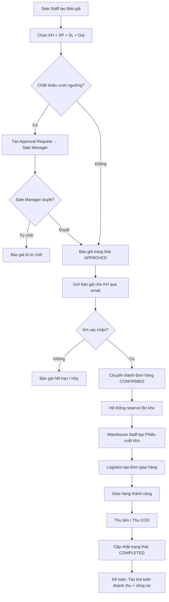
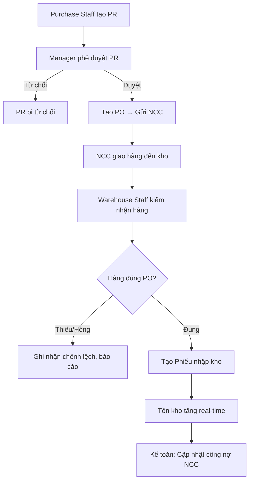
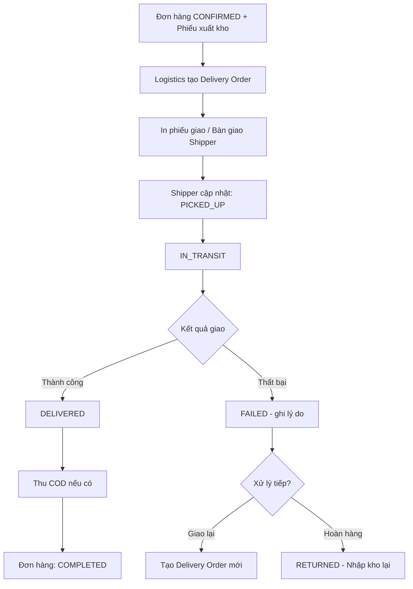

# SRS — Phân hệ Sale & Logistics

# Bán hàng và Kho vận

**Phiên bản:** 1.0  
**Ngày tạo:** 09/05/2026  
**Tác giả:** Business Analyst  
**Sprint liên quan:** Sprint 05, Sprint 06, Sprint 07, Sprint 08  
**Trạng thái:** Hoàn chỉnh

---

## Mục lục

1. [Tổng quan phân hệ](#1-tổng-quan-phân-hệ)
2. [Đặc tả chức năng](#2-đặc-tả-chức-năng)
3. [Luồng nghiệp vụ](#3-luồng-nghiệp-vụ)
4. [Mô hình dữ liệu](#4-mô-hình-dữ-liệu)
5. [Validation và Business Rules](#5-validation-và-business-rules)
6. [Tích hợp và API](#6-tích-hợp-và-api)

---

## 1. Tổng quan phân hệ

### 1.1 Phạm vi và mục tiêu

Phân hệ **Sale & Logistics** quản lý toàn bộ chuỗi hoạt động thương mại: từ quản lý khách hàng, sản phẩm, quy trình bán hàng, quản lý kho cho đến vận chuyển và thanh toán.

**Mục tiêu:**

- Số hóa quy trình bán hàng: báo giá → đơn hàng → xuất kho → giao hàng → thanh toán
- Quản lý tồn kho real-time, nhiều kho
- Quản lý mua hàng và nhà cung cấp
- KPI vận hành: doanh số, tồn kho, giao hàng

### 1.2 Actors

| Actor               | Mô tả                                                   |
| ------------------- | ------------------------------------------------------- |
| **Tenant Admin**    | Cấu hình sản phẩm, kho, chính sách giá                  |
| **Sale Manager**    | Quản lý đội sale, xem KPI, duyệt chiết khấu vượt ngưỡng |
| **Sale Staff**      | Tạo báo giá, đơn hàng, quản lý khách hàng               |
| **Warehouse Staff** | Nhập/xuất kho, kiểm tra tồn kho                         |
| **Purchase Staff**  | Tạo đơn mua hàng, quản lý nhà cung cấp                  |
| **Logistics Staff** | Quản lý giao hàng, tracking, đối soát COD               |
| **AI Agent**        | Dự báo doanh số, cảnh báo tồn kho, gợi ý cross-sell     |

### 1.3 Use Case tổng quan

| Nhóm           | Use Case                              | Actor chính                     |
| -------------- | ------------------------------------- | ------------------------------- |
| **Khách hàng** | Tạo/sửa/xóa hồ sơ khách hàng          | Sale Staff                      |
| **Khách hàng** | Phân nhóm khách hàng                  | Sale Manager                    |
| **Khách hàng** | Xem lịch sử giao dịch                 | Sale Staff, Sale Manager        |
| **Sản phẩm**   | Quản lý danh mục sản phẩm             | Tenant Admin                    |
| **Sản phẩm**   | Tạo/sửa SKU, giá, đơn vị tính         | Tenant Admin, Sale Manager      |
| **Bán hàng**   | Tạo báo giá                           | Sale Staff                      |
| **Bán hàng**   | Chuyển báo giá thành đơn hàng         | Sale Staff                      |
| **Bán hàng**   | Quản lý trạng thái đơn hàng           | Sale Staff, Sale Manager        |
| **Bán hàng**   | Phê duyệt chiết khấu                  | Sale Manager                    |
| **Kho**        | Nhập kho từ đơn mua hàng              | Warehouse Staff                 |
| **Kho**        | Xuất kho theo đơn hàng                | Warehouse Staff                 |
| **Kho**        | Chuyển kho                            | Warehouse Staff                 |
| **Kho**        | Xem tồn kho real-time                 | Warehouse Staff, Sale Staff     |
| **Mua hàng**   | Tạo yêu cầu mua hàng                  | Purchase Staff, Warehouse Staff |
| **Mua hàng**   | Tạo và quản lý đơn mua hàng           | Purchase Staff                  |
| **Mua hàng**   | Quản lý nhà cung cấp                  | Purchase Staff                  |
| **Vận chuyển** | Tạo đơn giao hàng                     | Logistics Staff                 |
| **Vận chuyển** | Theo dõi trạng thái giao hàng         | Logistics Staff, Sale Staff     |
| **Vận chuyển** | Đối soát COD                          | Logistics Staff                 |
| **KPI**        | Xem KPI doanh số                      | Sale Manager                    |
| **AI**         | Xem dự báo doanh số, cảnh báo tồn kho | Sale Manager, Warehouse Staff   |

---

## 2. Đặc tả chức năng

### 2.1 Nhóm: Quản lý Khách hàng (CRM cơ bản)

#### F-SL-001: Quản lý hồ sơ khách hàng

| Thuộc tính         | Nội dung                                                                                                      |
| ------------------ | ------------------------------------------------------------------------------------------------------------- |
| **ID**             | F-SL-001                                                                                                      |
| **Tên**            | Tạo, cập nhật, xem hồ sơ khách hàng                                                                           |
| **Mô tả**          | Quản lý thông tin khách hàng bao gồm cá nhân và doanh nghiệp                                                  |
| **Input**          | `customerType` (INDIVIDUAL/BUSINESS), `name`, `taxCode`, `email`, `phone`, `address`, `groupId`, `notes`      |
| **Output**         | Hồ sơ khách hàng được tạo/cập nhật                                                                            |
| **Business Rules** | Nếu `customerType=BUSINESS` thì `taxCode` bắt buộc. Email duy nhất trong tenant (cảnh báo trùng, không block) |
| **Multi-tenancy**  | `tenantId` bắt buộc. Khách hàng chỉ thuộc 1 tenant                                                            |

#### F-SL-002: Xem lịch sử giao dịch khách hàng

| Thuộc tính         | Nội dung                                               |
| ------------------ | ------------------------------------------------------ |
| **ID**             | F-SL-002                                               |
| **Tên**            | Lịch sử đơn hàng, công nợ, tương tác của khách hàng    |
| **Input**          | `customerId`, bộ lọc thời gian                         |
| **Output**         | Timeline các đơn hàng, thanh toán, giao hàng           |
| **Business Rules** | Hiển thị tổng nợ hiện tại, tổng doanh thu, số đơn hàng |
| **Multi-tenancy**  | Chỉ hiển thị data trong `tenantId`                     |

---

### 2.2 Nhóm: Quản lý Sản phẩm

#### F-SL-010: Quản lý danh mục sản phẩm

| Thuộc tính         | Nội dung                                                             |
| ------------------ | -------------------------------------------------------------------- |
| **ID**             | F-SL-010                                                             |
| **Tên**            | Tạo, sửa, xóa danh mục sản phẩm dạng cây                             |
| **Input**          | `name`, `code`, `parentId`, `description`, `image`                   |
| **Output**         | Danh mục sản phẩm được cập nhật                                      |
| **Business Rules** | Không xóa danh mục có sản phẩm đang hoạt động. Tối đa 3 cấp danh mục |
| **Multi-tenancy**  | `tenantId` bắt buộc                                                  |

#### F-SL-011: Quản lý Sản phẩm và SKU

| Thuộc tính         | Nội dung                                                                                                                                                                             |
| ------------------ | ------------------------------------------------------------------------------------------------------------------------------------------------------------------------------------ |
| **ID**             | F-SL-011                                                                                                                                                                             |
| **Tên**            | Tạo, sửa sản phẩm và các biến thể SKU                                                                                                                                                |
| **Input**          | `name`, `code` (SKU), `barcode`, `categoryId`, `unit` (đơn vị tính), `costPrice` (giá vốn), `salePrice` (giá bán), `vatRate`, `attributes` (màu, size...), `images[]`, `description` |
| **Output**         | Sản phẩm/SKU được tạo, khả dụng cho bán hàng và kho                                                                                                                                  |
| **Business Rules** | SKU code duy nhất trong tenant. `barcode` duy nhất nếu có. `salePrice >= costPrice` (cảnh báo nếu vi phạm)                                                                           |
| **Multi-tenancy**  | `tenantId` bắt buộc                                                                                                                                                                  |

#### F-SL-012: Quản lý Bảng giá

| Thuộc tính         | Nội dung                                                                                                      |
| ------------------ | ------------------------------------------------------------------------------------------------------------- |
| **ID**             | F-SL-012                                                                                                      |
| **Tên**            | Tạo bảng giá theo nhóm khách hàng hoặc kênh bán                                                               |
| **Input**          | `priceListName`, `currency`, `validFrom`, `validTo`, `items[]`: `{ productId, unitPrice }`                    |
| **Output**         | Bảng giá được áp dụng tự động khi tạo báo giá/đơn hàng                                                        |
| **Business Rules** | Một khách hàng chỉ áp dụng 1 bảng giá tại một thời điểm. Nếu không có bảng giá riêng → dùng bảng giá mặc định |
| **Multi-tenancy**  | `tenantId` bắt buộc                                                                                           |

---

### 2.3 Nhóm: Bán hàng

#### F-SL-020: Tạo Báo giá (Quotation)

| Thuộc tính         | Nội dung                                                                                                               |
| ------------------ | ---------------------------------------------------------------------------------------------------------------------- |
| **ID**             | F-SL-020                                                                                                               |
| **Tên**            | Tạo và quản lý báo giá                                                                                                 |
| **Input**          | `customerId`, `validUntil`, `items[]`: `{ productId, quantity, unitPrice, discount }`, `notes`, `paymentTerms`         |
| **Output**         | Báo giá với số tự động, trạng thái `DRAFT`                                                                             |
| **Business Rules** | Hệ thống tự động điền giá theo bảng giá khách hàng. Chiết khấu vượt `maxDiscountPercent` (cấu hình) → pending approval |
| **Multi-tenancy**  | `tenantId` trong mọi document                                                                                          |

#### F-SL-021: Chuyển Báo giá thành Đơn hàng

| Thuộc tính         | Nội dung                                                                                               |
| ------------------ | ------------------------------------------------------------------------------------------------------ |
| **ID**             | F-SL-021                                                                                               |
| **Tên**            | Xác nhận báo giá và tạo đơn hàng bán                                                                   |
| **Input**          | `quotationId`, xác nhận từ khách hàng                                                                  |
| **Output**         | Đơn hàng được tạo với trạng thái `CONFIRMED`, tồn kho được reserve                                     |
| **Business Rules** | BR-SL-001: Kiểm tra tồn kho trước khi confirm. Nếu thiếu → cảnh báo. Báo giá hết hạn không chuyển được |
| **Multi-tenancy**  | `tenantId` bắt buộc                                                                                    |

#### F-SL-022: Quản lý trạng thái Đơn hàng

| Thuộc tính         | Nội dung                                                                                                             |
| ------------------ | -------------------------------------------------------------------------------------------------------------------- |
| **ID**             | F-SL-022                                                                                                             |
| **Tên**            | Theo dõi và cập nhật trạng thái đơn hàng                                                                             |
| **Mô tả**          | Đơn hàng trải qua các trạng thái: DRAFT → CONFIRMED → PROCESSING → SHIPPED → DELIVERED → COMPLETED; hoặc → CANCELLED |
| **Input**          | `orderId`, `newStatus`, `note`                                                                                       |
| **Output**         | Trạng thái cập nhật, audit log, notification gửi đến khách hàng                                                      |
| **Business Rules** | BR-SL-002: Không xóa đơn đã CONFIRMED, chỉ CANCEL. Chuyển CANCELLED → hoàn tồn kho tự động                           |
| **Multi-tenancy**  | `tenantId` bắt buộc                                                                                                  |

#### F-SL-023: Phê duyệt Chiết khấu

| Thuộc tính         | Nội dung                                                                           |
| ------------------ | ---------------------------------------------------------------------------------- |
| **ID**             | F-SL-023                                                                           |
| **Tên**            | Quy trình phê duyệt chiết khấu vượt ngưỡng                                         |
| **Input**          | `orderId/quotationId`, `discountPercent`, `reason`                                 |
| **Output**         | Approval request gửi đến Sale Manager; sau khi duyệt → đơn tiếp tục                |
| **Business Rules** | BR-SL-004: Ngưỡng chiết khấu cấu hình theo tenant. Vượt ngưỡng → workflow approval |
| **Multi-tenancy**  | Ngưỡng chiết khấu cấu hình riêng theo `tenantId`                                   |

---

### 2.4 Nhóm: Quản lý Kho (Inventory)

#### F-SL-030: Nhập kho

| Thuộc tính         | Nội dung                                                                                                                                                      |
| ------------------ | ------------------------------------------------------------------------------------------------------------------------------------------------------------- |
| **ID**             | F-SL-030                                                                                                                                                      |
| **Tên**            | Tạo phiếu nhập kho                                                                                                                                            |
| **Input**          | `warehouseId`, `sourceType` (PURCHASE_ORDER/RETURN/ADJUSTMENT/TRANSFER_IN), `sourceId`, `items[]`: `{ productId, quantity, unitCost, lotNumber, expiryDate }` |
| **Output**         | Phiếu nhập kho, tồn kho tăng real-time                                                                                                                        |
| **Business Rules** | BR-SL-006: Mỗi lần nhập phải có chứng từ (PO hoặc lý do điều chỉnh). Tồn kho được cập nhật ngay khi confirm phiếu nhập                                        |
| **Multi-tenancy**  | `tenantId`, `warehouseId` bắt buộc                                                                                                                            |

#### F-SL-031: Xuất kho

| Thuộc tính         | Nội dung                                                                                                                              |
| ------------------ | ------------------------------------------------------------------------------------------------------------------------------------- |
| **ID**             | F-SL-031                                                                                                                              |
| **Tên**            | Tạo phiếu xuất kho                                                                                                                    |
| **Input**          | `warehouseId`, `sourceType` (SALE_ORDER/TRANSFER_OUT/ADJUSTMENT/DAMAGED), `sourceId`, `items[]`: `{ productId, quantity, lotNumber }` |
| **Output**         | Phiếu xuất kho, tồn kho giảm real-time                                                                                                |
| **Business Rules** | BR-SL-001: Tồn kho không được âm (trừ khi tenant bật "oversell"). FIFO/FEFO cho lô hàng                                               |
| **Multi-tenancy**  | `tenantId`, `warehouseId` bắt buộc                                                                                                    |

#### F-SL-032: Chuyển kho

| Thuộc tính         | Nội dung                                                                         |
| ------------------ | -------------------------------------------------------------------------------- |
| **ID**             | F-SL-032                                                                         |
| **Tên**            | Chuyển hàng từ kho này sang kho khác                                             |
| **Input**          | `fromWarehouseId`, `toWarehouseId`, `items[]`: `{ productId, quantity }`, `note` |
| **Output**         | Phiếu chuyển kho, trừ tồn kho nguồn, cộng tồn kho đích                           |
| **Business Rules** | Tồn kho nguồn phải đủ hàng. Kho nguồn và đích phải cùng `tenantId`               |
| **Multi-tenancy**  | `tenantId` bắt buộc                                                              |

#### F-SL-033: Xem tồn kho

| Thuộc tính         | Nội dung                                                                                     |
| ------------------ | -------------------------------------------------------------------------------------------- |
| **ID**             | F-SL-033                                                                                     |
| **Tên**            | Xem tồn kho real-time theo kho và sản phẩm                                                   |
| **Input**          | Bộ lọc: `warehouseId`, `productId`, `categoryId`                                             |
| **Output**         | Danh sách tồn kho: `{ product, warehouse, onHand, reserved, available }`                     |
| **Business Rules** | `available = onHand - reserved`. Reserved là số lượng trong đơn hàng CONFIRMED chưa xuất kho |
| **Multi-tenancy**  | Chỉ xem kho trong `tenantId`                                                                 |

---

### 2.5 Nhóm: Mua hàng (Purchasing)

#### F-SL-040: Quản lý Nhà cung cấp

| Thuộc tính         | Nội dung                                                                                      |
| ------------------ | --------------------------------------------------------------------------------------------- |
| **ID**             | F-SL-040                                                                                      |
| **Tên**            | Tạo, sửa hồ sơ nhà cung cấp                                                                   |
| **Input**          | `name`, `taxCode`, `email`, `phone`, `address`, `bankAccount`, `paymentTerms`, `creditLimit`  |
| **Output**         | Hồ sơ nhà cung cấp được lưu                                                                   |
| **Business Rules** | `taxCode` duy nhất trong tenant (cảnh báo trùng). Hồ sơ NCC lưu thông tin tài khoản ngân hàng |
| **Multi-tenancy**  | `tenantId` bắt buộc                                                                           |

#### F-SL-041: Quy trình Mua hàng

| Thuộc tính         | Nội dung                                                                                            |
| ------------------ | --------------------------------------------------------------------------------------------------- |
| **ID**             | F-SL-041                                                                                            |
| **Tên**            | Tạo yêu cầu mua hàng và đơn mua hàng (PO)                                                           |
| **Mô tả**          | Quy trình: Purchase Request (PR) → Phê duyệt → Purchase Order (PO) → Gửi NCC → Nhận hàng → Nhập kho |
| **Input PR**       | `items[]`: `{ productId, quantityNeeded, reason }`, `requestedBy`, `neededByDate`                   |
| **Input PO**       | `supplierId`, `items[]`: `{ productId, quantity, unitPrice }`, `deliveryDate`, `paymentTerms`       |
| **Output**         | PR/PO với số tự động, trạng thái luồng                                                              |
| **Business Rules** | PO phải liên kết với PR được duyệt. Không thể xóa PO đã gửi cho NCC                                 |
| **Multi-tenancy**  | `tenantId` bắt buộc                                                                                 |

---

### 2.6 Nhóm: Vận chuyển (Logistics)

#### F-SL-050: Quản lý Đơn giao hàng

| Thuộc tính         | Nội dung                                                                                      |
| ------------------ | --------------------------------------------------------------------------------------------- |
| **ID**             | F-SL-050                                                                                      |
| **Tên**            | Tạo và theo dõi đơn giao hàng                                                                 |
| **Input**          | `orderId`, `carrierId` (đối tác vận chuyển), `shippingAddress`, `codAmount` (nếu COD), `note` |
| **Output**         | Đơn giao hàng với mã vận đơn tự động, trạng thái `CREATED`                                    |
| **Business Rules** | Một đơn hàng có thể tách thành nhiều đơn giao. COD amount ≤ tổng tiền đơn hàng                |
| **Multi-tenancy**  | `tenantId` bắt buộc                                                                           |

#### F-SL-051: Tracking giao hàng

| Thuộc tính         | Nội dung                                                                                          |
| ------------------ | ------------------------------------------------------------------------------------------------- |
| **ID**             | F-SL-051                                                                                          |
| **Tên**            | Theo dõi trạng thái giao hàng                                                                     |
| **Input**          | `deliveryOrderId`, `status` (PICKED_UP/IN_TRANSIT/DELIVERED/FAILED/RETURNED), `timestamp`, `note` |
| **Output**         | Timeline trạng thái giao hàng, notification cho khách hàng                                        |
| **Business Rules** | Trạng thái DELIVERED → kích hoạt hoàn tất đơn hàng, cập nhật công nợ                              |
| **Multi-tenancy**  | `tenantId` bắt buộc                                                                               |

#### F-SL-052: Đối soát COD

| Thuộc tính         | Nội dung                                                                                      |
| ------------------ | --------------------------------------------------------------------------------------------- |
| **ID**             | F-SL-052                                                                                      |
| **Tên**            | Đối soát thu hộ tiền COD với đối tác vận chuyển                                               |
| **Input**          | `carrierId`, `reconciliationPeriod`, `actualReceivedAmount`                                   |
| **Output**         | Báo cáo đối soát, danh sách đơn khớp/chênh lệch                                               |
| **Business Rules** | BR-SL-007: Đối soát theo ca làm việc hoặc theo ngày. Chênh lệch > 0 → alert Logistics Manager |
| **Multi-tenancy**  | `tenantId` bắt buộc                                                                           |

---

## 3. Luồng nghiệp vụ

### 3.1 Luồng: Quy trình Bán hàng đầy đủ (Happy Path)



**Luồng ngoại lệ:**

- Tồn kho không đủ → Cảnh báo, cho phép tạo đơn mua hàng bổ sung
- Giao hàng thất bại → Tạo yêu cầu giao lại hoặc hoàn hàng
- Khách hủy đơn đã CONFIRMED → Workflow hủy đơn, hoàn tồn kho, ghi lý do

---

### 3.2 Luồng: Nhập kho từ Đơn mua hàng



---

### 3.3 Luồng: Giao hàng và Tracking



---

## 4. Mô hình dữ liệu

### 4.1 Collection: `customers`

| Trường           | Kiểu          | Bắt buộc | Mô tả                                        |
| ---------------- | ------------- | -------- | -------------------------------------------- |
| `_id`            | ObjectId      | Có       | customerId                                   |
| `tenantId`       | ObjectId      | Có       |                                              |
| `customerType`   | string (enum) | Có       | `INDIVIDUAL` \| `BUSINESS`                   |
| `name`           | string        | Có       | Tên khách hàng / công ty                     |
| `taxCode`        | string        | Không    | MST (bắt buộc nếu BUSINESS)                  |
| `email`          | string        | Không    |                                              |
| `phone`          | string        | Có       |                                              |
| `address`        | object        | Không    | `{ street, ward, district, city, province }` |
| `groupId`        | ObjectId      | Không    | Nhóm khách hàng                              |
| `priceListId`    | ObjectId      | Không    | Bảng giá áp dụng                             |
| `creditLimit`    | number        | Không    | Hạn mức công nợ (VND)                        |
| `totalDebt`      | number        | Có       | Tổng nợ hiện tại (tính toán)                 |
| `assignedSaleId` | ObjectId      | Không    | Nhân viên sale phụ trách                     |
| `isActive`       | boolean       | Có       |                                              |
| `notes`          | string        | Không    |                                              |
| `createdAt`      | Date          | Có       |                                              |
| `updatedAt`      | Date          | Có       |                                              |

**Indexes:** `(tenantId, taxCode)`, `(tenantId, phone)`, `tenantId`

---

### 4.2 Collection: `products`

| Trường           | Kiểu     | Bắt buộc | Mô tả                                 |
| ---------------- | -------- | -------- | ------------------------------------- |
| `_id`            | ObjectId | Có       | productId                             |
| `tenantId`       | ObjectId | Có       |                                       |
| `sku`            | string   | Có       | Mã SKU (unique trong tenant)          |
| `name`           | string   | Có       | Tên sản phẩm                          |
| `barcode`        | string   | Không    | EAN/QR code                           |
| `categoryId`     | ObjectId | Không    | Danh mục                              |
| `unit`           | string   | Có       | Đơn vị tính (cái, kg, m, ...)         |
| `costPrice`      | number   | Có       | Giá vốn (VND)                         |
| `salePrice`      | number   | Có       | Giá bán mặc định (VND)                |
| `vatRate`        | number   | Có       | Thuế suất VAT: 0, 5, 8, 10            |
| `attributes`     | object   | Không    | Thuộc tính linh hoạt (màu, size, ...) |
| `images`         | string[] | Không    | URLs ảnh (MinIO)                      |
| `description`    | string   | Không    |                                       |
| `isActive`       | boolean  | Có       |                                       |
| `minStockLevel`  | number   | Không    | Ngưỡng tồn kho tối thiểu (cảnh báo)   |
| `trackInventory` | boolean  | Có       | Có quản lý tồn kho không              |
| `createdAt`      | Date     | Có       |                                       |
| `updatedAt`      | Date     | Có       |                                       |

**Indexes:** `(tenantId, sku)` (unique composite), `(tenantId, barcode)`, `tenantId`

---

### 4.3 Collection: `sales_orders`

| Trường            | Kiểu          | Bắt buộc | Mô tả                                                                                                                                |
| ----------------- | ------------- | -------- | ------------------------------------------------------------------------------------------------------------------------------------ |
| `_id`             | ObjectId      | Có       | orderId                                                                                                                              |
| `tenantId`        | ObjectId      | Có       |                                                                                                                                      |
| `orderNumber`     | string        | Có       | Số đơn hàng (auto, duy nhất trong tenant)                                                                                            |
| `orderType`       | string (enum) | Có       | `QUOTATION` \| `ORDER`                                                                                                               |
| `status`          | string (enum) | Có       | `DRAFT` \| `PENDING_APPROVAL` \| `APPROVED` \| `CONFIRMED` \| `PROCESSING` \| `SHIPPED` \| `DELIVERED` \| `COMPLETED` \| `CANCELLED` |
| `customerId`      | ObjectId      | Có       |                                                                                                                                      |
| `saleStaffId`     | ObjectId      | Có       | Nhân viên tạo                                                                                                                        |
| `items`           | array         | Có       | `[{ productId, quantity, unitPrice, discount, subtotal, vatAmount }]`                                                                |
| `subtotal`        | number        | Có       | Tổng trước thuế và chiết khấu                                                                                                        |
| `discountAmount`  | number        | Có       | Tổng chiết khấu                                                                                                                      |
| `taxAmount`       | number        | Có       | Tổng thuế VAT                                                                                                                        |
| `totalAmount`     | number        | Có       | Tổng cộng (VND)                                                                                                                      |
| `paymentStatus`   | string (enum) | Có       | `UNPAID` \| `PARTIAL` \| `PAID`                                                                                                      |
| `paymentTerms`    | string        | Không    | Điều khoản thanh toán                                                                                                                |
| `shippingAddress` | object        | Không    | Địa chỉ giao hàng                                                                                                                    |
| `notes`           | string        | Không    |                                                                                                                                      |
| `validUntil`      | Date          | Không    | Hạn hiệu lực (với báo giá)                                                                                                           |
| `cancelReason`    | string        | Không    | Lý do hủy                                                                                                                            |
| `approvalInfo`    | object        | Không    | `{ approvedBy, approvedAt, comments }`                                                                                               |
| `createdAt`       | Date          | Có       |                                                                                                                                      |
| `updatedAt`       | Date          | Có       |                                                                                                                                      |

**Indexes:** `(tenantId, orderNumber)` (unique composite), `(tenantId, customerId)`, `(tenantId, status)`, `(tenantId, saleStaffId)`

---

### 4.4 Collection: `warehouses`

| Trường      | Kiểu     | Bắt buộc | Mô tả                        |
| ----------- | -------- | -------- | ---------------------------- |
| `_id`       | ObjectId | Có       | warehouseId                  |
| `tenantId`  | ObjectId | Có       |                              |
| `name`      | string   | Có       |                              |
| `code`      | string   | Có       | Mã kho (unique trong tenant) |
| `address`   | object   | Không    | Địa chỉ kho                  |
| `managerId` | ObjectId | Không    |                              |
| `isActive`  | boolean  | Có       |                              |
| `isDefault` | boolean  | Có       | Kho mặc định                 |
| `createdAt` | Date     | Có       |                              |

**Indexes:** `(tenantId, code)` (unique composite), `tenantId`

---

### 4.5 Collection: `inventory_items` (Tồn kho)

| Trường           | Kiểu     | Bắt buộc | Mô tả                                   |
| ---------------- | -------- | -------- | --------------------------------------- |
| `_id`            | ObjectId | Có       |                                         |
| `tenantId`       | ObjectId | Có       |                                         |
| `warehouseId`    | ObjectId | Có       |                                         |
| `productId`      | ObjectId | Có       |                                         |
| `onHand`         | number   | Có       | Số lượng thực tế trong kho              |
| `reserved`       | number   | Có       | Số lượng đang được reserve bởi đơn hàng |
| `available`      | number   | Có       | `= onHand - reserved`                   |
| `avgCost`        | number   | Có       | Giá vốn bình quân (tính tự động)        |
| `lastMovementAt` | Date     | Không    | Lần xuất/nhập cuối                      |
| `updatedAt`      | Date     | Có       |                                         |

**Indexes:** `(tenantId, warehouseId, productId)` (unique composite), `(tenantId, productId)`

---

### 4.6 Collection: `inventory_movements` (Phiếu nhập/xuất)

| Trường           | Kiểu          | Bắt buộc | Mô tả                                                              |
| ---------------- | ------------- | -------- | ------------------------------------------------------------------ |
| `_id`            | ObjectId      | Có       |                                                                    |
| `tenantId`       | ObjectId      | Có       |                                                                    |
| `movementNumber` | string        | Có       | Số phiếu (auto)                                                    |
| `movementType`   | string (enum) | Có       | `IN` \| `OUT` \| `TRANSFER` \| `ADJUSTMENT`                        |
| `sourceType`     | string        | Có       | `SALE_ORDER`, `PURCHASE_ORDER`, `TRANSFER`, `RETURN`, `ADJUSTMENT` |
| `sourceId`       | ObjectId      | Không    | ID chứng từ liên kết                                               |
| `warehouseId`    | ObjectId      | Có       |                                                                    |
| `toWarehouseId`  | ObjectId      | Không    | Kho đích (với TRANSFER)                                            |
| `items`          | array         | Có       | `[{ productId, quantity, unitCost, lotNumber, expiryDate }]`       |
| `status`         | string (enum) | Có       | `DRAFT` \| `CONFIRMED` \| `CANCELLED`                              |
| `confirmedBy`    | ObjectId      | Không    |                                                                    |
| `confirmedAt`    | Date          | Không    |                                                                    |
| `notes`          | string        | Không    |                                                                    |
| `createdAt`      | Date          | Có       |                                                                    |

**Indexes:** `(tenantId, movementNumber)` (unique), `(tenantId, sourceType, sourceId)`, `(tenantId, warehouseId)`, `(tenantId, movementType)`

---

### 4.7 Collection: `purchase_orders`

| Trường                 | Kiểu          | Bắt buộc | Mô tả                                                                                                    |
| ---------------------- | ------------- | -------- | -------------------------------------------------------------------------------------------------------- |
| `_id`                  | ObjectId      | Có       |                                                                                                          |
| `tenantId`             | ObjectId      | Có       |                                                                                                          |
| `poNumber`             | string        | Có       | Số PO (auto)                                                                                             |
| `status`               | string (enum) | Có       | `DRAFT` \| `PENDING_APPROVAL` \| `APPROVED` \| `SENT` \| `PARTIAL_RECEIVED` \| `RECEIVED` \| `CANCELLED` |
| `supplierId`           | ObjectId      | Có       |                                                                                                          |
| `items`                | array         | Có       | `[{ productId, quantity, unitPrice, receivedQty }]`                                                      |
| `totalAmount`          | number        | Có       |                                                                                                          |
| `expectedDeliveryDate` | Date          | Không    |                                                                                                          |
| `purchaseRequestId`    | ObjectId      | Không    | PR liên kết                                                                                              |
| `createdAt`            | Date          | Có       |                                                                                                          |
| `updatedAt`            | Date          | Có       |                                                                                                          |

**Indexes:** `(tenantId, poNumber)` (unique), `(tenantId, supplierId)`, `(tenantId, status)`

---

### 4.8 Collection: `delivery_orders`

| Trường            | Kiểu          | Bắt buộc | Mô tả                                                                             |
| ----------------- | ------------- | -------- | --------------------------------------------------------------------------------- |
| `_id`             | ObjectId      | Có       |                                                                                   |
| `tenantId`        | ObjectId      | Có       |                                                                                   |
| `deliveryNumber`  | string        | Có       | Số vận đơn                                                                        |
| `orderId`         | ObjectId      | Có       | Đơn hàng liên kết                                                                 |
| `carrierId`       | ObjectId      | Không    | Đối tác vận chuyển                                                                |
| `status`          | string (enum) | Có       | `CREATED` \| `PICKED_UP` \| `IN_TRANSIT` \| `DELIVERED` \| `FAILED` \| `RETURNED` |
| `shippingAddress` | object        | Có       |                                                                                   |
| `codAmount`       | number        | Không    | Số tiền thu hộ                                                                    |
| `codCollected`    | number        | Không    | Số tiền thực thu                                                                  |
| `trackingEvents`  | array         | Có       | `[{ status, timestamp, location, note }]`                                         |
| `createdAt`       | Date          | Có       |                                                                                   |
| `updatedAt`       | Date          | Có       |                                                                                   |

**Indexes:** `(tenantId, orderId)`, `(tenantId, status)`, `tenantId`

---

## 5. Validation và Business Rules

### 5.1 Validation Rules

| Trường                                 | Quy tắc                       | Thông báo lỗi                      |
| -------------------------------------- | ----------------------------- | ---------------------------------- |
| `sales_orders.items[].quantity`        | Số nguyên dương, ≥ 1          | "Số lượng phải ≥ 1"                |
| `sales_orders.items[].unitPrice`       | Số thực ≥ 0                   | "Đơn giá không hợp lệ"             |
| `sales_orders.items[].discount`        | 0–100 (%)                     | "Chiết khấu phải từ 0% đến 100%"   |
| `products.sku`                         | 3–50 ký tự, `[A-Za-z0-9_-]`   | "Mã SKU không hợp lệ"              |
| `products.vatRate`                     | Enum: 0, 5, 8, 10             | "Thuế suất không hợp lệ"           |
| `products.salePrice`                   | ≥ 0, cảnh báo nếu < costPrice | "Giá bán thấp hơn giá vốn"         |
| `inventory_movements.items[].quantity` | Số nguyên dương               | "Số lượng phải là số nguyên dương" |

### 5.2 Business Rules

| Mã        | Rule                          | Chi tiết                                                                              |
| --------- | ----------------------------- | ------------------------------------------------------------------------------------- |
| BR-SL-001 | Tồn kho không âm              | Xuất kho không được vượt `available`. Ngoại lệ: tenant bật `allowOversell`            |
| BR-SL-002 | Đơn hàng bất biến sau confirm | Đơn CONFIRMED trở đi không xóa được, chỉ CANCEL với lý do và approval                 |
| BR-SL-003 | Cảnh báo giá vốn              | Giá bán < giá vốn → cảnh báo. Tenant có thể chọn cảnh báo hoặc block                  |
| BR-SL-004 | Chiết khấu vượt ngưỡng        | Vượt `maxDiscountPercent` → tạo approval request                                      |
| BR-SL-005 | Hoàn tồn kho khi hủy          | Đơn CANCELLED → giải phóng reserve, cộng lại `available`                              |
| BR-SL-006 | Chứng từ bắt buộc             | Mọi phiếu nhập/xuất phải có `sourceType` và `sourceId` hợp lệ (hoặc lý do điều chỉnh) |
| BR-SL-007 | Đối soát COD                  | COD được đối soát theo ngày hoặc ca. Chênh lệch > threshold → alert                   |
| BR-SL-008 | Tồn kho real-time             | `available` được cập nhật ngay khi confirm phiếu nhập/xuất (không batch)              |

### 5.3 Quy tắc tính toán

**Tổng đơn hàng:**

```
subtotal = Σ (quantity × unitPrice)
discountAmount = Σ (quantity × unitPrice × discountPercent / 100)
taxableAmount = subtotal - discountAmount
taxAmount = Σ (taxableAmount_by_vatRate × vatRate / 100)
totalAmount = taxableAmount + taxAmount
```

**Giá vốn bình quân (avgCost):**

```
newAvgCost = (currentOnHand × currentAvgCost + receivedQty × unitCost) / (currentOnHand + receivedQty)
```

---

## 6. Tích hợp và API

### 6.1 Tích hợp nội bộ

| Phân hệ      | Dữ liệu trao đổi                                                    | Hướng               |
| ------------ | ------------------------------------------------------------------- | ------------------- |
| System Admin | User info, permissions, departments                                 | Đọc                 |
| Accounting   | Đơn hàng hoàn thành → bút toán doanh thu; PO → bút toán công nợ NCC | Ghi sang Accounting |
| HR           | Danh sách nhân viên sale, kho                                       | Đọc                 |
| AI Agent     | Dữ liệu lịch sử bán hàng, tồn kho → dự báo                          | Đọc                 |
| Office       | Tạo task từ đơn hàng cần xử lý                                      | Ghi sang Office     |
| Dashboard    | KPI doanh số, tồn kho, giao hàng                                    | Đọc                 |

### 6.2 Đối tác vận chuyển (tích hợp tương lai)

| Đối tác                    | API      | Chức năng                       |
| -------------------------- | -------- | ------------------------------- |
| Giao Hàng Nhanh (GHN)      | REST API | Tạo vận đơn, tracking, đối soát |
| Giao Hàng Tiết Kiệm (GHTK) | REST API | Tạo vận đơn, tracking           |
| Viettel Post               | REST API | Tạo vận đơn, tracking           |
| J&T Express                | REST API | Tạo vận đơn, tracking           |

**Lưu ý:** Tích hợp đối tác vận chuyển thực tế nằm ngoài phạm vi Sprint 07-08; sử dụng manual tracking trước.

### 6.3 Xử lý lỗi tích hợp

| Lỗi                                | Xử lý                                                            |
| ---------------------------------- | ---------------------------------------------------------------- |
| Accounting service không phản hồi  | Đưa vào message queue RabbitMQ, retry 3 lần                      |
| Tồn kho race condition (đồng thời) | Dùng MongoDB transaction để cập nhật atomic `onHand`, `reserved` |
| Giá vốn bình quân tính sai         | Sử dụng MongoDB session để đảm bảo tính nhất quán                |
