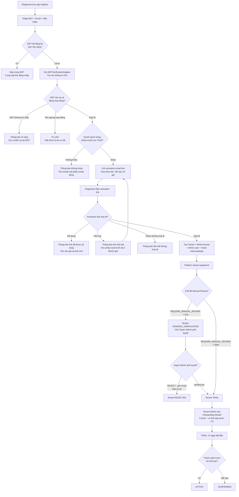
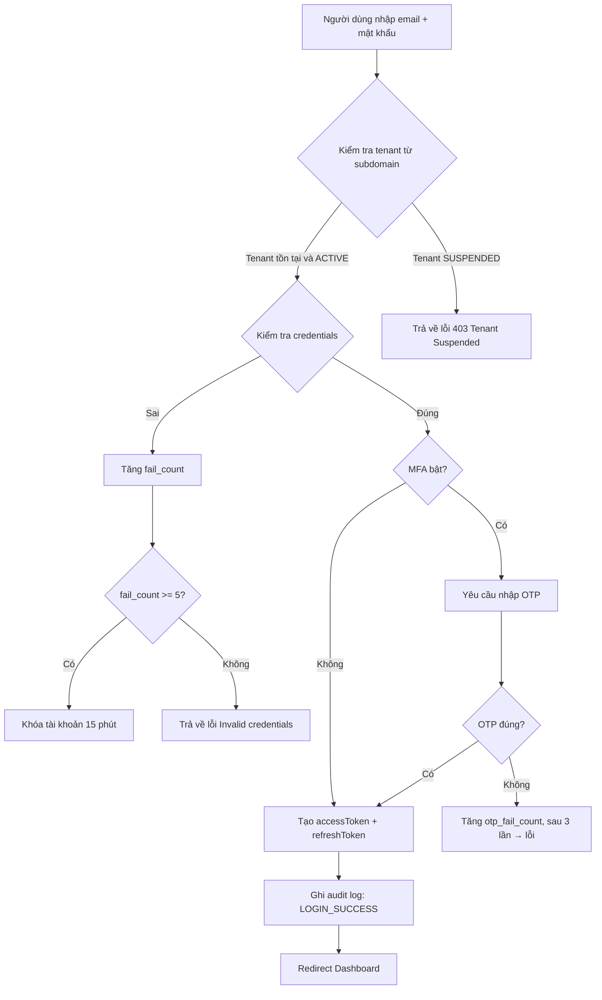
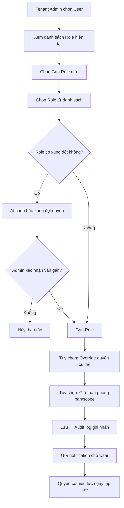
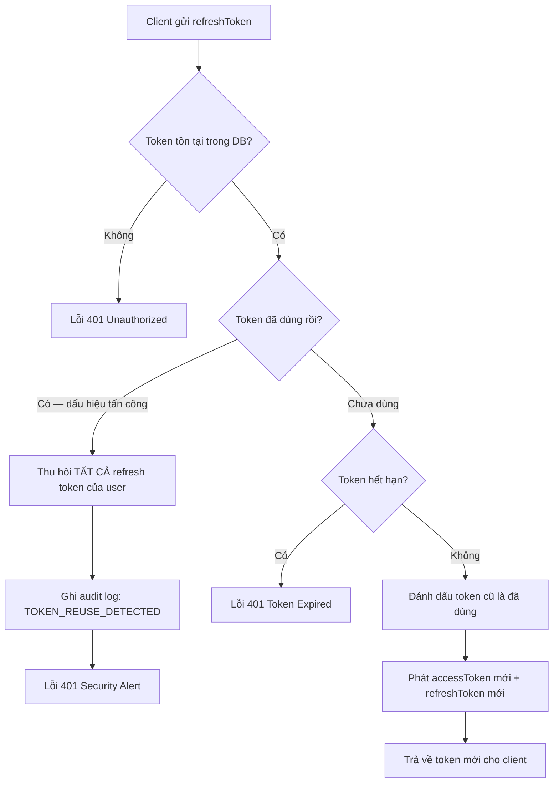
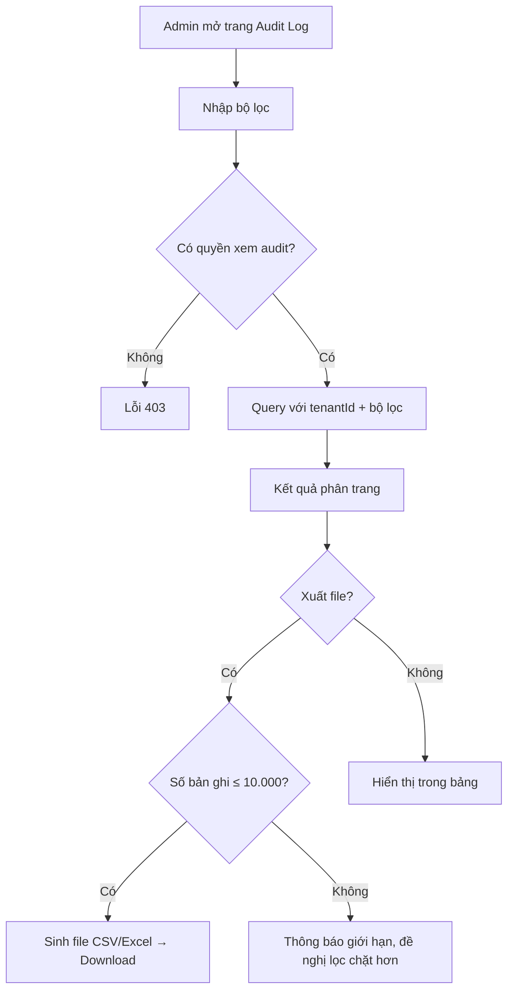

# SRS — Phân hệ System Administration
# Quản trị Hệ thống SaaS & Quản trị Doanh nghiệp

**Phiên bản:** 1.1  
**Ngày tạo:** 09/05/2026  
**Ngày cập nhật:** 09/05/2026  
**Tác giả:** Business Analyst  
**Sprint liên quan:** Sprint 01, Sprint 02  
**Trạng thái:** Hoàn chỉnh  

---

## Mục lục

1. [Tổng quan phân hệ](#1-tổng-quan-phân-hệ)
2. [Đặc tả chức năng](#2-đặc-tả-chức-năng)
3. [Luồng nghiệp vụ](#3-luồng-nghiệp-vụ)
4. [Mô hình dữ liệu](#4-mô-hình-dữ-liệu)
5. [Validation và Business Rules](#5-validation-và-business-rules)
6. [Tích hợp và API](#6-tích-hợp-và-api)

---

## 1. Tổng quan phân hệ

### 1.1 Phạm vi và mục tiêu

Phân hệ **System Administration** là nền tảng lõi của toàn bộ hệ thống Open ERP. Mọi phân hệ khác đều phụ thuộc vào phân hệ này để xác thực, phân quyền và quản lý tenant.

**Mục tiêu:**

- Quản trị nền tảng SaaS: vận hành multi-tenant, quản lý gói dịch vụ và quota
- Xác thực và bảo mật: JWT, OAuth2, MFA, session management
- Phân quyền chi tiết: RBAC theo module, hành động, dữ liệu, phòng ban
- Danh mục và cấu hình: danh mục dùng chung, biểu mẫu động, cấu hình tenant
- Giám sát và kiểm toán: audit log bất biến toàn diện

### 1.2 Actors

| Actor | Mô tả | Quyền chính |
|---|---|---|
| **Super Admin** | Quản trị viên nền tảng SaaS | Tạo/xóa tenant, xem tất cả audit log, quản lý gói dịch vụ |
| **Tenant Admin** | Quản trị viên của một doanh nghiệp | Quản lý user, role, phòng ban, danh mục trong tenant của mình |
| **Manager** | Trưởng phòng/Quản lý | Xem danh sách user phòng ban, phân quyền giới hạn |
| **Employee** | Nhân viên thông thường | Quản lý profile cá nhân, đổi mật khẩu, xem quyền của mình |
| **AI Agent** | Hệ thống AI | Đọc dữ liệu user/role để gợi ý; ghi audit log qua service |
| **External System** | Hệ thống bên ngoài | Gọi API với API Key được cấp phép |
| **Registrant (Đại diện DN đăng ký)** | Người đại diện doanh nghiệp thực hiện đăng ký tài khoản SaaS lần đầu, chưa có tài khoản trên hệ thống | Đăng ký tài khoản, xác thực MST qua API Cục Thuế, kích hoạt email qua activation link, hoàn tất Onboarding Wizard |

### 1.3 Use Case tổng quan

| Nhóm | Use Case | Actor chính |
|---|---|---|
| **Xác thực** | Đăng nhập bằng email/mật khẩu | Employee, Manager, Tenant Admin |
| **Xác thực** | Đăng nhập bằng Google/Microsoft (OAuth2) | Employee, Manager, Tenant Admin |
| **Xác thực** | Xác thực MFA (TOTP/OTP email) | Employee, Manager, Tenant Admin |
| **Xác thực** | Làm mới access token (refresh token) | Tất cả user đã đăng nhập |
| **Xác thực** | Đăng xuất đơn thiết bị / tất cả thiết bị | Tất cả user đã đăng nhập |
| **Xác thực** | Quên mật khẩu / đặt lại mật khẩu | Employee, Manager, Tenant Admin |
| **Đăng ký DN** | Đăng ký tài khoản doanh nghiệp (tự phục vụ) | Registrant |
| **Đăng ký DN** | Xác thực Mã số thuế qua Cục Thuế | Hệ thống (tự động sau bước đăng ký) |
| **Đăng ký DN** | Kích hoạt email qua activation link | Registrant |
| **Đăng ký DN** | Hoàn tất Onboarding Wizard | Registrant, Tenant Admin |
| **Đăng ký DN** | Phê duyệt / Từ chối đăng ký mới | Super Admin |
| **Quản lý Tenant** | Tạo tenant thủ công (Enterprise/Sales) | Super Admin |
| **Quản lý Tenant** | Cập nhật thông tin tenant | Super Admin, Tenant Admin |
| **Quản lý Tenant** | Kích hoạt / tạm ngưng / hủy tenant | Super Admin |
| **Quản lý Tenant** | Xem thống kê sử dụng quota | Super Admin, Tenant Admin |
| **Quản lý Tenant** | Cấu hình onboarding ban đầu | Tenant Admin |
| **Quản lý User** | Tạo tài khoản người dùng | Tenant Admin |
| **Quản lý User** | Chỉnh sửa thông tin người dùng | Tenant Admin, bản thân User |
| **Quản lý User** | Kích hoạt / vô hiệu hóa tài khoản | Tenant Admin |
| **Quản lý User** | Gán / gỡ role cho user | Tenant Admin |
| **Quản lý User** | Mời người dùng qua email | Tenant Admin |
| **Quản lý User** | Xem lịch sử đăng nhập | Tenant Admin, bản thân User |
| **Phân quyền RBAC** | Tạo/sửa/xóa role | Tenant Admin |
| **Phân quyền RBAC** | Gán quyền vào role | Tenant Admin |
| **Phân quyền RBAC** | Phân quyền theo dữ liệu/phòng ban | Tenant Admin |
| **Phân quyền RBAC** | Xem quyền hiệu lực của user | Tenant Admin, Manager |
| **Cơ cấu tổ chức** | Tạo/sửa/xóa phòng ban | Tenant Admin |
| **Cơ cấu tổ chức** | Định nghĩa cây tổ chức (org chart) | Tenant Admin |
| **Cơ cấu tổ chức** | Gán người dùng vào phòng ban | Tenant Admin |
| **Danh mục** | Quản lý danh mục dùng chung | Tenant Admin |
| **Danh mục** | Tạo biểu mẫu động | Tenant Admin |
| **Danh mục** | Quản lý API Key | Tenant Admin |
| **Audit Log** | Xem audit log theo bộ lọc | Super Admin, Tenant Admin |
| **Audit Log** | Xuất audit log (CSV/Excel) | Super Admin, Tenant Admin |
| **AI** | Gợi ý phân quyền theo chức danh | Tenant Admin (AI hỗ trợ) |
| **AI** | Cảnh báo hành vi đăng nhập bất thường | Super Admin, Tenant Admin |

---

## 2. Đặc tả chức năng

### 2.1 Nhóm: Xác thực (Authentication)

#### F-SA-001: Đăng nhập bằng Email/Mật khẩu

| Thuộc tính | Nội dung |
|---|---|
| **ID** | F-SA-001 |
| **Tên** | Đăng nhập bằng email và mật khẩu |
| **Mô tả** | Người dùng nhập email và mật khẩu để đăng nhập vào hệ thống trong phạm vi tenant xác định |
| **Input** | `email` (string), `password` (string), `tenantSubdomain` hoặc `tenantId` (xác định từ domain/subdomain) |
| **Output** | `accessToken` (JWT, 15 phút), `refreshToken` (HttpOnly cookie, 7 ngày), thông tin user cơ bản |
| **Business Rules** | BR-SA-004, BR-SA-005, BR-SA-006 |
| **Multi-tenancy** | `tenantId` được resolve từ subdomain/domain của request. JWT chứa `tenantId` |

#### F-SA-002: Đăng nhập OAuth2 (Google / Microsoft)

| Thuộc tính | Nội dung |
|---|---|
| **ID** | F-SA-002 |
| **Tên** | Đăng nhập bằng tài khoản Google hoặc Microsoft |
| **Mô tả** | Redirect sang trang OAuth2 của provider, nhận authorization code, exchange lấy user info, tạo hoặc liên kết tài khoản |
| **Input** | Provider (google/microsoft), authorization code từ callback |
| **Output** | `accessToken`, `refreshToken`, thông tin user |
| **Business Rules** | Email từ OAuth2 phải tồn tại trong hệ thống hoặc thuộc domain được whitelist của tenant |
| **Multi-tenancy** | Tenant phải enable OAuth2 provider tương ứng trong cấu hình |

#### F-SA-003: Xác thực MFA

| Thuộc tính | Nội dung |
|---|---|
| **ID** | F-SA-003 |
| **Tên** | Xác thực đa yếu tố (MFA) |
| **Mô tả** | Sau khi xác thực mật khẩu thành công, nếu user bật MFA, yêu cầu nhập OTP |
| **Input** | `sessionToken` tạm (từ bước 1), `otpCode` (6 chữ số) |
| **Output** | `accessToken`, `refreshToken` (nếu OTP đúng) |
| **Business Rules** | TOTP theo RFC 6238 (30 giây, 6 chữ số). Cho phép clock skew ±30 giây. Sau 3 lần sai OTP, phải đăng nhập lại |
| **Multi-tenancy** | MFA có thể bật bắt buộc theo cấu hình tenant |

#### F-SA-004: Làm mới Access Token

| Thuộc tính | Nội dung |
|---|---|
| **ID** | F-SA-004 |
| **Tên** | Làm mới access token bằng refresh token |
| **Mô tả** | Client gửi refresh token (HttpOnly cookie) để nhận access token mới |
| **Input** | `refreshToken` (từ cookie) |
| **Output** | `accessToken` mới, `refreshToken` mới (token rotation) |
| **Business Rules** | BR-SA-007: Refresh token xoay vòng — token cũ bị hủy sau khi dùng. Phát hiện token tái sử dụng → hủy toàn bộ session |
| **Multi-tenancy** | Refresh token liên kết với `tenantId` cụ thể |

#### F-SA-005: Đăng xuất

| Thuộc tính | Nội dung |
|---|---|
| **ID** | F-SA-005 |
| **Tên** | Đăng xuất |
| **Mô tả** | Hủy session hiện tại hoặc tất cả session của user |
| **Input** | `mode`: `single` (thiết bị hiện tại) hoặc `all` (tất cả thiết bị) |
| **Output** | HTTP 200, xóa cookie refresh token |
| **Business Rules** | BR-SA-008: Đăng xuất đơn chỉ hủy refresh token hiện tại. Đăng xuất tất cả hủy toàn bộ refresh token của user |
| **Multi-tenancy** | Chỉ hủy session trong tenant scope của user |

#### F-SA-006: Quên mật khẩu / Đặt lại mật khẩu

| Thuộc tính | Nội dung |
|---|---|
| **ID** | F-SA-006 |
| **Tên** | Đặt lại mật khẩu qua email |
| **Mô tả** | Gửi email chứa link đặt lại mật khẩu (token hết hạn sau 1 giờ) |
| **Input** | Bước 1: `email`. Bước 2: `resetToken`, `newPassword`, `confirmPassword` |
| **Output** | Email gửi thành công; sau bước 2: mật khẩu mới được lưu |
| **Business Rules** | Reset token là UUID v4, hết hạn 1 giờ, chỉ dùng 1 lần. Sau khi đặt lại → hủy tất cả session cũ |
| **Multi-tenancy** | Email phải tồn tại trong tenant xác định |

---

### 2.2 Nhóm: Quản lý Tenant

#### 2.2.1 Đăng ký Doanh nghiệp (Self-Service Registration)

> **Kiến trúc mới (v1.1):** Doanh nghiệp tự đăng ký qua `/register` mà không cần Super Admin tạo thủ công. Quy trình gồm 3 bước xác thực tuần tự: **xác thực MST → gửi email kích hoạt (activation link) → kích hoạt thành công và tạo tenant tự động**. Super Admin chỉ can thiệp nếu platform bật chế độ Manual Review.

#### F-SA-010: Đăng ký Doanh nghiệp Tự phục vụ (Self-Service Registration)

| Thuộc tính | Nội dung |
|---|---|
| **ID** | F-SA-010 |
| **Tên** | Đăng ký Doanh nghiệp Tự phục vụ (Self-Service Registration) |
| **Actor** | Registrant (Đại diện DN đăng ký) |
| **Mô tả** | Đại diện doanh nghiệp tự đăng ký tài khoản SaaS mà không cần Super Admin can thiệp. Nhập MST, email đã đăng ký tại Cục Thuế và mật khẩu để bắt đầu quy trình xác thực |
| **Input** | `taxCode` (MST 10 hoặc 13 chữ số), `email` (email đã đăng ký tại Cục Thuế), `password`, `phone` (tùy chọn) |
| **Output** | Bản ghi `tenant_registrations` được tạo với trạng thái `PENDING_TAX`; khởi động quy trình xác thực MST tự động |
| **Business Rules** | MST phải là 10 hoặc 13 chữ số; MST không được trùng với tenant đang hoạt động trên nền tảng; rate limit 5 lần đăng ký/IP/giờ; password tối thiểu 8 ký tự bao gồm chữ hoa, chữ thường và chữ số |
| **Multi-tenancy** | Chưa có tenantId ở bước này — tạo bản ghi tạm trong `tenant_registrations` |

#### F-SA-011: Xác thực Mã số thuế (MST Verification)

| Thuộc tính | Nội dung |
|---|---|
| **ID** | F-SA-011 |
| **Tên** | Xác thực Mã số thuế (MST Verification) |
| **Actor** | Hệ thống (tự động sau F-SA-010) |
| **Mô tả** | Tra cứu thông tin doanh nghiệp theo MST qua MSTVerificationAdapter (masothue.com hoặc API Cục Thuế chính thức), sau đó so khớp email người dùng nhập với email đã đăng ký tại Cục Thuế |
| **Input** | `taxCode` từ bước F-SA-010 |
| **Output** | Thông tin doanh nghiệp: `legalName` (tên pháp lý), `address` (địa chỉ), `taxStatus` (trạng thái hoạt động), `registrationEmail`, `registrationPhone` |
| **Business Rules** | MST không tìm thấy trong hệ thống Cục Thuế → từ chối và thông báo rõ ràng, gợi ý kiểm tra lại; DN có trạng thái ngừng hoạt động hoặc đã giải thể → từ chối và giải thích lý do cụ thể; email người dùng PHẢI khớp email đăng ký Cục Thuế (so sánh case-insensitive); áp dụng Adapter Pattern để có thể thay đổi provider linh hoạt mà không ảnh hưởng business logic; tương lai bổ sung xác thực qua số điện thoại Cục Thuế |
| **Multi-tenancy** | Không yêu cầu tenantId |

#### F-SA-012: Kích hoạt Email qua Activation Link

| Thuộc tính | Nội dung |
|---|---|
| **ID** | F-SA-012 |
| **Tên** | Kích hoạt Email qua Activation Link |
| **Actor** | Registrant (Đại diện DN đăng ký) |
| **Mô tả** | Sau khi MST được xác thực thành công, hệ thống gửi activation email chứa liên kết một lần để Registrant xác nhận quyền sở hữu email |
| **Input** | Email đã xác minh ở F-SA-011; `activationToken` trong liên kết; `redirectUrl` hợp lệ theo danh sách allowlist |
| **Output** | Trạng thái `emailVerified = true`, `status = ACTIVATED` trong bản ghi `tenant_registrations` |
| **Business Rules** | Activation link là one-time token, hết hạn sau 24 giờ; token chỉ dùng 1 lần; click lại link đã dùng trả về trạng thái `LINK_ALREADY_USED`; link hết hạn trả về `LINK_EXPIRED`; Registrant được yêu cầu gửi lại tối đa 3 lần/24 giờ, mỗi lần gửi lại vô hiệu hóa token cũ ngay lập tức |
| **Multi-tenancy** | Không yêu cầu tenantId |

#### F-SA-013: Tạo Tenant và Admin user tự động

| Thuộc tính | Nội dung |
|---|---|
| **ID** | F-SA-013 |
| **Tên** | Tạo Tenant và Admin user tự động |
| **Actor** | Hệ thống (tự động sau khi F-SA-012 xác thực thành công) |
| **Mô tả** | Sau khi xác thực MST và kích hoạt email thành công, hệ thống tự động tạo tenant, Admin user đầu tiên, MinIO bucket và seed dữ liệu khởi tạo |
| **Input** | Dữ liệu đã xác thực từ F-SA-010 (taxCode, email, passwordHash), F-SA-011 (taxInfo), F-SA-012 (`emailVerified = true`, `status = ACTIVATED`) |
| **Output** | Tenant mới với trạng thái `TRIAL` hoặc `PENDING_VERIFICATION`; Admin user đầu tiên; MinIO bucket `tenant-{tenantId}/`; roles mặc định (TENANT_ADMIN, MANAGER, EMPLOYEE); danh mục seed |
| **Business Rules** | Hai chế độ theo cấu hình platform: `REQUIRE_MANUAL_REVIEW = false` → tenant `TRIAL`; `REQUIRE_MANUAL_REVIEW = true` → tenant `PENDING_VERIFICATION`; subdomain tự động sinh từ MST hoặc tên doanh nghiệp (slugify, kiểm tra duy nhất toàn hệ thống); publish events: `tenant.registered`, `user.created`, `rbac.roles_seeded` |
| **Multi-tenancy** | `tenantId` mới được tạo tại bước này |

#### F-SA-014: Onboarding Wizard (Tự phục vụ)

| Thuộc tính | Nội dung |
|---|---|
| **ID** | F-SA-014 |
| **Tên** | Onboarding Wizard (Tự phục vụ) |
| **Actor** | Tenant Admin (Registrant sau khi đăng ký thành công) |
| **Mô tả** | Hướng dẫn Tenant Admin thiết lập hệ thống lần đầu sau khi đăng ký tự phục vụ, gồm 5 bước tuần tự |
| **Input** | Bước 1: xác nhận/bổ sung thông tin DN từ MST lookup; Bước 2: múi giờ `Asia/Ho_Chi_Minh`, ngôn ngữ `vi-VN`, tiền tệ `VND`, logo; Bước 3: tạo phòng ban sơ bộ (có thể skip); Bước 4: mời nhân viên đầu tiên qua email (có thể skip); Bước 5: chọn phân hệ kích hoạt theo gói subscription (có thể skip) |
| **Output** | Cấu hình tenant được lưu; TRIAL 14 ngày bắt đầu; event `tenant.onboarded` được publish |
| **Business Rules** | Wizard hiển thị 1 lần duy nhất sau khi đăng ký thành công; Tenant Admin có thể bỏ qua bước 3, 4, 5 và quay lại hoàn thành sau; tiến trình wizard được lưu và khôi phục khi quay lại; chỉ hiển thị phân hệ phù hợp với gói subscription đã đăng ký |
| **Multi-tenancy** | Áp dụng riêng cho từng tenant mới |

#### F-SA-015: Super Admin phê duyệt đăng ký (Manual Review Mode)

| Thuộc tính | Nội dung |
|---|---|
| **ID** | F-SA-015 |
| **Tên** | Super Admin phê duyệt đăng ký (Manual Review Mode) |
| **Actor** | Super Admin |
| **Mô tả** | Khi platform cấu hình ở chế độ Manual Review (`REQUIRE_MANUAL_REVIEW = true`), Super Admin xem xét và phê duyệt hoặc từ chối các đăng ký mới trước khi tenant được kích hoạt |
| **Input** | Danh sách tenant với trạng thái `PENDING_VERIFICATION`; `tenantId`, `decision` (APPROVE/REJECT), `rejectionReason` (bắt buộc khi từ chối) |
| **Output** | APPROVE → tenant `TRIAL`, publish `tenant.activated`, gửi email chào mừng; REJECT → tenant `REJECTED`, gửi email thông báo kèm lý do cụ thể |
| **Business Rules** | Bắt buộc nhập lý do khi từ chối; email thông báo từ chối phải kèm lý do để Registrant hiểu và có thể bổ sung thông tin; khi phê duyệt → publish `tenant.activated` để notification-service gửi email chào mừng |
| **Multi-tenancy** | Chỉ Super Admin được thực hiện; không bị ràng buộc tenantId cụ thể |

---

#### 2.2.2 Quản lý Tenant (Thủ công và Vận hành)

#### F-SA-016: Tạo Tenant thủ công (Super Admin)

| Thuộc tính | Nội dung |
|---|---|
| **ID** | F-SA-016 |
| **Tên** | Tạo tenant thủ công bởi Super Admin |
| **Actor** | Super Admin |
| **Mô tả** | Super Admin tạo tài khoản doanh nghiệp mới trực tiếp, dùng cho trường hợp đặc biệt như khách hàng Enterprise, onboarding qua sales team hoặc migration từ hệ thống cũ |
| **Input** | `companyName`, `subdomain`, `adminEmail`, `plan` (starter/business/enterprise), `trialDays` |
| **Output** | Tenant được tạo với trạng thái `PENDING_SETUP`, email mời Tenant Admin được gửi |
| **Business Rules** | `subdomain` phải duy nhất trong toàn hệ thống; chỉ cho phép chữ thường, số và dấu gạch ngang; độ dài 3–30 ký tự |
| **Multi-tenancy** | Tạo `tenantId` mới (ObjectId). Tạo cấu hình mặc định. Tạo MinIO bucket `tenant-{tenantId}` |

#### F-SA-017: Cập nhật thông tin Tenant

| Thuộc tính | Nội dung |
|---|---|
| **ID** | F-SA-017 |
| **Tên** | Cập nhật thông tin doanh nghiệp |
| **Mô tả** | Tenant Admin cập nhật thông tin công ty: tên, địa chỉ, MST, logo, múi giờ, ngôn ngữ, các module được kích hoạt |
| **Input** | Các trường thông tin công ty (xem Data Model) |
| **Output** | Tenant được cập nhật, audit log ghi nhận |
| **Business Rules** | MST phải đúng định dạng Việt Nam (10 hoặc 13 chữ số). Thay đổi `subdomain` không được phép sau khi kích hoạt |
| **Multi-tenancy** | Tenant Admin chỉ cập nhật được tenant của chính mình |

#### F-SA-018: Quản lý trạng thái Tenant

| Thuộc tính | Nội dung |
|---|---|
| **ID** | F-SA-018 |
| **Tên** | Kích hoạt / Tạm ngưng / Hủy tenant |
| **Mô tả** | Super Admin thay đổi trạng thái vận hành của tenant |
| **Input** | `tenantId`, `newStatus` (ACTIVE/SUSPENDED/TERMINATED), `reason` |
| **Output** | Trạng thái tenant cập nhật; nếu SUSPENDED → tất cả user bị từ chối truy cập |
| **Business Rules** | TERMINATED yêu cầu xác nhận 2 bước. Dữ liệu tenant TERMINATED được soft-delete, xóa vĩnh viễn sau 30 ngày |
| **Multi-tenancy** | Chỉ Super Admin được thực hiện |

#### F-SA-019: Onboarding Wizard (Sau khi Tenant tạo thủ công)

| Thuộc tính | Nội dung |
|---|---|
| **ID** | F-SA-019 |
| **Tên** | Onboarding Wizard (Sau khi tạo thủ công) |
| **Actor** | Tenant Admin |
| **Mô tả** | Sau khi Super Admin tạo tenant thủ công và Tenant Admin đăng nhập lần đầu, hướng dẫn qua 5 bước cấu hình cơ bản |
| **Input** | Thông tin từng bước: (1) thông tin doanh nghiệp, (2) múi giờ/ngôn ngữ, (3) phòng ban đầu tiên, (4) mời user, (5) chọn module |
| **Output** | Tenant chuyển sang trạng thái `ACTIVE` (hoặc `TRIAL`), dữ liệu ban đầu được khởi tạo |
| **Business Rules** | Có thể bỏ qua (skip) bước 3–5 và hoàn thành sau. Bước 1–2 khuyến nghị hoàn thành ngay |
| **Multi-tenancy** | Áp dụng riêng cho từng tenant |

---

### 2.3 Nhóm: Quản lý Người dùng

#### F-SA-020: Tạo tài khoản người dùng

| Thuộc tính | Nội dung |
|---|---|
| **ID** | F-SA-020 |
| **Tên** | Tạo tài khoản người dùng mới |
| **Mô tả** | Tenant Admin tạo tài khoản cho nhân viên; hệ thống gửi email mời kích hoạt |
| **Input** | `email`, `fullName`, `phone`, `departmentId`, `roleIds[]`, `position` |
| **Output** | User được tạo với trạng thái `PENDING_ACTIVATION`, email mời được gửi |
| **Business Rules** | Email phải duy nhất trong tenant. Số user không vượt quota tenant. Link kích hoạt hết hạn sau 24 giờ |
| **Multi-tenancy** | User chỉ thuộc một `tenantId` duy nhất. Quota kiểm tra theo `tenantId` |

#### F-SA-021: Cập nhật thông tin người dùng

| Thuộc tính | Nội dung |
|---|---|
| **ID** | F-SA-021 |
| **Tên** | Cập nhật thông tin người dùng |
| **Mô tả** | Tenant Admin sửa thông tin user; User tự sửa profile cá nhân của mình |
| **Input** | Các trường profile (fullName, phone, avatar, position...) |
| **Output** | Profile được cập nhật, audit log ghi nhận |
| **Business Rules** | User chỉ sửa được các trường được phép (email không được tự đổi). Tenant Admin sửa được tất cả |
| **Multi-tenancy** | Chỉ sửa được user trong cùng `tenantId` |

#### F-SA-022: Kích hoạt / Vô hiệu hóa tài khoản

| Thuộc tính | Nội dung |
|---|---|
| **ID** | F-SA-022 |
| **Tên** | Kích hoạt hoặc vô hiệu hóa tài khoản người dùng |
| **Mô tả** | Tenant Admin bật/tắt quyền truy cập hệ thống của người dùng |
| **Input** | `userId`, `status` (ACTIVE/INACTIVE), `reason` |
| **Output** | Trạng thái user cập nhật. Nếu INACTIVE → tất cả session bị hủy ngay lập tức |
| **Business Rules** | Không thể vô hiệu hóa chính mình. Không thể vô hiệu hóa Super Admin |
| **Multi-tenancy** | Chỉ thao tác trên user trong cùng `tenantId` |

#### F-SA-023: Mời người dùng qua Email

| Thuộc tính | Nội dung |
|---|---|
| **ID** | F-SA-023 |
| **Tên** | Mời người dùng tham gia tenant qua email |
| **Mô tả** | Tenant Admin gửi email mời, người được mời click link để tạo mật khẩu và kích hoạt tài khoản |
| **Input** | `email`, `fullName`, `roleIds[]`, `departmentId` |
| **Output** | Email mời được gửi, user ở trạng thái `PENDING_ACTIVATION` |
| **Business Rules** | Link mời hết hạn sau 48 giờ. Có thể gửi lại tối đa 3 lần/ngày cho cùng email |
| **Multi-tenancy** | Email mời chứa `tenantId` để link kích hoạt đúng tenant |

---

### 2.4 Nhóm: Phân quyền RBAC

#### F-SA-030: Quản lý Role

| Thuộc tính | Nội dung |
|---|---|
| **ID** | F-SA-030 |
| **Tên** | Tạo, sửa, xóa vai trò (Role) |
| **Mô tả** | Tenant Admin quản lý danh sách role trong tenant |
| **Input** | `name`, `description`, `permissions[]` |
| **Output** | Role được tạo/cập nhật/xóa |
| **Business Rules** | BR-SA-009: Không thể xóa role hệ thống (isSystem = true). Khi xóa role → user được gán role đó mất quyền ngay. Role name duy nhất trong tenant |
| **Multi-tenancy** | Role thuộc `tenantId`. Hệ thống cung cấp sẵn role mặc định: TENANT_ADMIN, MANAGER, EMPLOYEE |

#### F-SA-031: Cấu hình quyền chi tiết (Permissions)

| Thuộc tính | Nội dung |
|---|---|
| **ID** | F-SA-031 |
| **Tên** | Gán quyền chi tiết vào role |
| **Mô tả** | Định nghĩa quyền theo: module, hành động (action), phạm vi dữ liệu (scope) |
| **Input** | `roleId`, `permissions[]`: mỗi permission có `module`, `action`, `scope` |
| **Output** | Permission matrix được cập nhật |
| **Business Rules** | BR-SA-010: Nguyên tắc least privilege. Scope có thể là: ALL (toàn bộ), OWN_DEPARTMENT (phòng ban mình), OWN (của mình) |
| **Multi-tenancy** | Permission chỉ áp dụng trong `tenantId` |

**Danh sách Action chuẩn:**

| Action | Mô tả |
|---|---|
| CREATE | Tạo mới |
| READ | Đọc / xem |
| UPDATE | Chỉnh sửa |
| DELETE | Xóa |
| APPROVE | Phê duyệt |
| EXPORT | Xuất dữ liệu |
| IMPORT | Nhập dữ liệu |
| MANAGE | Quản lý tổng thể (bao gồm tất cả) |

---

### 2.5 Nhóm: Cơ cấu Tổ chức

#### F-SA-040: Quản lý Phòng ban

| Thuộc tính | Nội dung |
|---|---|
| **ID** | F-SA-040 |
| **Tên** | Tạo, sửa, xóa phòng ban / chi nhánh |
| **Mô tả** | Xây dựng cây cơ cấu tổ chức của doanh nghiệp |
| **Input** | `name`, `code`, `parentId` (phòng ban cha), `managerId`, `type` (DEPARTMENT/BRANCH/DIVISION) |
| **Output** | Cây tổ chức được cập nhật |
| **Business Rules** | Cây có tối đa 5 cấp. Không thể xóa phòng ban còn user đang thuộc. Mỗi phòng ban có tối đa 1 trưởng phòng |
| **Multi-tenancy** | Cơ cấu tổ chức riêng biệt theo `tenantId` |

---

### 2.6 Nhóm: Danh mục và Cấu hình

#### F-SA-050: Quản lý Danh mục động

| Thuộc tính | Nội dung |
|---|---|
| **ID** | F-SA-050 |
| **Tên** | Quản lý danh mục dùng chung (Master Data) |
| **Mô tả** | Tenant Admin tạo và quản lý các danh mục nghiệp vụ tùy chỉnh (loại văn bản, trạng thái, nhóm khách hàng...) |
| **Input** | `categoryType`, `name`, `code`, `description`, `isActive`, `sortOrder`, `metadata` (JSON tùy chỉnh) |
| **Output** | Danh mục được tạo/cập nhật, khả dụng cho các phân hệ khác |
| **Business Rules** | Code duy nhất trong cùng categoryType và tenant. Không thể xóa danh mục đang được sử dụng |
| **Multi-tenancy** | Danh mục thuộc `tenantId`. Có thể kế thừa danh mục hệ thống (system catalog) |

#### F-SA-051: Quản lý Biểu mẫu động (Dynamic Forms)

| Thuộc tính | Nội dung |
|---|---|
| **ID** | F-SA-051 |
| **Tên** | Tạo và quản lý biểu mẫu tùy chỉnh |
| **Mô tả** | Tenant Admin thiết kế form với các trường tùy chỉnh cho nghiệp vụ |
| **Input** | `formName`, `module`, `fields[]`: mỗi field có `name`, `type` (text/number/date/select/file/...), `required`, `validation`, `options` |
| **Output** | Form schema được lưu, có thể dùng trong module chỉ định |
| **Business Rules** | Tối đa 50 trường/form. Không thể xóa form đang có dữ liệu |
| **Multi-tenancy** | Form thuộc `tenantId` |

#### F-SA-052: Quản lý API Key

| Thuộc tính | Nội dung |
|---|---|
| **ID** | F-SA-052 |
| **Tên** | Cấp phát và quản lý API Key |
| **Mô tả** | Tenant Admin tạo API Key cho tích hợp bên ngoài, cấu hình quyền và rate limit |
| **Input** | `name`, `permissions[]`, `expiresAt`, `allowedIPs[]`, `rateLimit` |
| **Output** | API Key (hiển thị 1 lần duy nhất khi tạo), thông tin key được lưu |
| **Business Rules** | Key được hash (SHA-256) trước khi lưu. Chỉ hiển thị key đầy đủ một lần. Tối đa 10 API Key/tenant |
| **Multi-tenancy** | API Key liên kết với `tenantId` |

---

### 2.7 Nhóm: Audit Log

#### F-SA-060: Xem và tìm kiếm Audit Log

| Thuộc tính | Nội dung |
|---|---|
| **ID** | F-SA-060 |
| **Tên** | Xem audit log với bộ lọc |
| **Mô tả** | Admin xem toàn bộ lịch sử thao tác với bộ lọc đa điều kiện |
| **Input** | Bộ lọc: `userId`, `module`, `action`, `resourceType`, `resourceId`, `dateFrom`, `dateTo`, `ipAddress`, `result` |
| **Output** | Danh sách log phân trang, mỗi entry gồm đủ thông tin |
| **Business Rules** | BR-SA-013: Audit log chỉ đọc, không sửa/xóa. Phân trang tối đa 100 bản ghi/trang |
| **Multi-tenancy** | Tenant Admin chỉ thấy log của `tenantId` mình. Super Admin thấy tất cả |

#### F-SA-061: Xuất Audit Log

| Thuộc tính | Nội dung |
|---|---|
| **ID** | F-SA-061 |
| **Tên** | Xuất audit log ra CSV/Excel |
| **Mô tả** | Xuất kết quả tìm kiếm audit log ra file |
| **Input** | Bộ lọc (giống F-SA-060), `format` (csv/excel) |
| **Output** | File download |
| **Business Rules** | Giới hạn xuất 10.000 bản ghi/lần. Yêu cầu quyền EXPORT trên module audit |
| **Multi-tenancy** | Dữ liệu xuất chỉ thuộc tenant của người xuất |

---

## 3. Luồng nghiệp vụ

### 3.1 Luồng: Đăng ký Doanh nghiệp Tự phục vụ (Happy Path)



**Luồng happy path — 6 bước tuần tự:**

1. Registrant truy cập `/register`, nhập MST + email + password
2. Hệ thống gọi MSTAdapter tra cứu MST, so khớp email với thông tin Cục Thuế
3. Gửi activation email link một lần, hết hạn 24 giờ
4. Registrant bấm activation link hợp lệ
5. Hệ thống tạo tenant (`TRIAL` hoặc `PENDING_VERIFICATION`) + Admin user + MinIO bucket + seed roles/catalogs; Publish `tenant.registered`
6. Tenant Admin vào Onboarding Wizard (5 bước, có thể skip bước 3–5) → TRIAL 14 ngày bắt đầu

**Luồng ngoại lệ chi tiết:**

| Tình huống | Xử lý |
|---|---|
| MST không tìm thấy trong hệ thống Cục Thuế | Thông báo rõ ràng, gợi ý kiểm tra lại MST |
| MST đã được đăng ký trên nền tảng | Báo trùng MST, cung cấp link đăng nhập cho tenant hiện có |
| DN ngừng hoạt động hoặc đã giải thể | Từ chối, giải thích lý do cụ thể |
| Email không khớp thông tin Cục Thuế | Thông báo không khớp, che khuất một phần email đúng để gợi ý (ví dụ: `n***@company.vn`) |
| Activation link đã dùng | Thông báo link đã dùng, cho phép gửi lại activation email |
| Activation link hết hạn | Thông báo link hết hạn, cho phép gửi lại tối đa 3 lần/24 giờ |
| Activation token không hợp lệ | Từ chối kích hoạt, ghi audit bảo mật và hướng dẫn yêu cầu link mới |
| Rate limit đăng ký vượt quá | Thông báo thử lại sau 1 giờ |

---

### 3.2 Luồng: Đăng nhập và Xác thực (Happy Path)



**Luồng ngoại lệ:**
- Tài khoản bị INACTIVE → Lỗi "Tài khoản đã bị vô hiệu hóa, liên hệ admin"
- Tài khoản bị LOCKED → Lỗi "Tài khoản bị khóa tạm thời, thử lại sau X phút"
- OAuth2 email không tồn tại trong tenant → Lỗi "Email chưa được đăng ký"

---

### 3.3 Luồng: Phân quyền Người dùng



---

### 3.4 Luồng: Quản lý Refresh Token (Security Flow)



---

### 3.5 Luồng: Audit Log Query



---

## 4. Mô hình dữ liệu

### 4.1 Collection: `tenants`

| Trường | Kiểu | Bắt buộc | Mô tả |
|---|---|---|---|
| `_id` | ObjectId | Có | Định danh tenant (chính là tenantId) |
| `name` | string | Có | Tên doanh nghiệp |
| `subdomain` | string | Có | Subdomain duy nhất (unique index) |
| `taxCode` | string | Có (unique) | Mã số thuế — 10 chữ số (DN) hoặc 13 chữ số (chi nhánh); unique index toàn hệ thống |
| `taxVerified` | boolean | Có | MST đã được xác thực qua Cục Thuế (mặc định: false) |
| `taxInfo` | object | Không | Dữ liệu từ MST lookup: `{ legalName, address, taxStatus, registrationDate }` |
| `registrationEmail` | string | Không | Email đã xác minh khi đăng ký (khớp email đăng ký Cục Thuế) |
| `verificationMethod` | string (enum) | Có | Phương thức xác thực: `TAX_CODE_EMAIL` (hiện tại) \| `TAX_CODE_PHONE` (tương lai) |
| `registrationSource` | string (enum) | Có | Nguồn đăng ký: `SELF_REGISTER` \| `ADMIN_CREATED` |
| `address` | object | Không | `{ street, city, province, country }` |
| `phone` | string | Không | Số điện thoại doanh nghiệp |
| `email` | string | Có | Email liên hệ chính |
| `logo` | string | Không | URL logo (MinIO) |
| `status` | string (enum) | Có | `PENDING_SETUP` \| `PENDING_ACTIVATION` \| `TRIAL` \| `ACTIVE` \| `SUSPENDED` \| `TERMINATED` |
| `plan` | string (enum) | Có | `starter` \| `business` \| `enterprise` |
| `trialEndsAt` | Date | Không | Ngày hết hạn dùng thử |
| `settings` | object | Có | `{ timezone, language, currency, dateFormat, modules[] }` |
| `quota` | object | Có | `{ maxUsers, storageGB, apiCallsPerDay }` |
| `usage` | object | Có | `{ currentUsers, storageUsedGB }` |
| `oauthProviders` | array | Không | `[{ provider: 'google'|'microsoft', enabled, clientId }]` |
| `mfaRequired` | boolean | Có | Bắt buộc MFA cho tất cả user (mặc định: false) |
| `createdAt` | Date | Có | Thời điểm tạo |
| `updatedAt` | Date | Có | Thời điểm cập nhật cuối |
| `deletedAt` | Date | Không | Soft delete (khi TERMINATED) |

**Indexes:** `subdomain` (unique), `taxCode` (unique, sparse), `status`, `plan`, `registrationSource`

---

### 4.2 Collection: `users`

| Trường | Kiểu | Bắt buộc | Mô tả |
|---|---|---|---|
| `_id` | ObjectId | Có | userId |
| `tenantId` | ObjectId | Có | Tenant sở hữu user |
| `email` | string | Có | Email (unique trong tenant) |
| `passwordHash` | string | Không | bcrypt hash (null nếu chỉ dùng OAuth2) |
| `status` | string (enum) | Có | `PENDING_ACTIVATION` \| `ACTIVE` \| `INACTIVE` \| `LOCKED` |
| `lockUntil` | Date | Không | Thời điểm mở khóa tự động |
| `failedLoginAttempts` | number | Có | Đếm lần đăng nhập sai (reset khi thành công) |
| `profile` | object | Có | `{ fullName, avatar, phone, position, bio }` |
| `departmentId` | ObjectId | Không | Phòng ban chính |
| `roleIds` | ObjectId[] | Có | Danh sách role được gán |
| `permissionOverrides` | array | Không | Quyền override cụ thể ngoài role |
| `mfaEnabled` | boolean | Có | Đã bật MFA chưa |
| `mfaSecret` | string | Không | TOTP secret (mã hóa AES-256) |
| `oauthAccounts` | array | Không | `[{ provider, providerId, email }]` |
| `lastLoginAt` | Date | Không | Lần đăng nhập cuối |
| `lastLoginIp` | string | Không | IP lần đăng nhập cuối |
| `invitedBy` | ObjectId | Không | userId của người mời |
| `activatedAt` | Date | Không | Thời điểm kích hoạt |
| `createdAt` | Date | Có | |
| `updatedAt` | Date | Có | |

**Indexes:** `(tenantId, email)` (unique composite), `tenantId`, `departmentId`, `status`

---

### 4.3 Collection: `roles`

| Trường | Kiểu | Bắt buộc | Mô tả |
|---|---|---|---|
| `_id` | ObjectId | Có | roleId |
| `tenantId` | ObjectId | Có | Tenant sở hữu role |
| `name` | string | Có | Tên role (unique trong tenant) |
| `description` | string | Không | Mô tả |
| `isSystem` | boolean | Có | Không được xóa nếu true |
| `permissions` | array | Có | `[{ module, action, scope, conditions }]` |
| `createdBy` | ObjectId | Có | userId tạo |
| `createdAt` | Date | Có | |
| `updatedAt` | Date | Có | |

**Indexes:** `(tenantId, name)` (unique composite), `tenantId`, `isSystem`

**Permission object:**

```json
{
  "module": "sale",
  "action": "CREATE",
  "scope": "OWN_DEPARTMENT",
  "conditions": {}
}
```

---

### 4.4 Collection: `departments`

| Trường | Kiểu | Bắt buộc | Mô tả |
|---|---|---|---|
| `_id` | ObjectId | Có | departmentId |
| `tenantId` | ObjectId | Có | Tenant sở hữu |
| `name` | string | Có | Tên phòng ban |
| `code` | string | Có | Mã phòng ban (unique trong tenant) |
| `parentId` | ObjectId | Không | Phòng ban cha (null = cấp gốc) |
| `managerId` | ObjectId | Không | userId trưởng phòng |
| `type` | string (enum) | Có | `DEPARTMENT` \| `BRANCH` \| `DIVISION` \| `TEAM` |
| `level` | number | Có | Cấp trong cây (1 = gốc) |
| `path` | string | Có | Đường dẫn cây (ví dụ: `/root/marketing/digital`) |
| `isActive` | boolean | Có | Đang hoạt động |
| `createdAt` | Date | Có | |
| `updatedAt` | Date | Có | |

**Indexes:** `(tenantId, code)` (unique composite), `(tenantId, parentId)`, `tenantId`

---

### 4.5 Collection: `refresh_tokens`

| Trường | Kiểu | Bắt buộc | Mô tả |
|---|---|---|---|
| `_id` | ObjectId | Có | |
| `tenantId` | ObjectId | Có | |
| `userId` | ObjectId | Có | |
| `tokenHash` | string | Có | SHA-256 hash của refresh token |
| `isUsed` | boolean | Có | Đã dùng chưa (token rotation) |
| `deviceInfo` | object | Không | `{ userAgent, platform }` |
| `ipAddress` | string | Có | IP tạo token |
| `expiresAt` | Date | Có | TTL index |
| `createdAt` | Date | Có | |

**Indexes:** `tokenHash` (unique), `(tenantId, userId)`, `expiresAt` (TTL index)

---

### 4.6 Collection: `audit_logs`

| Trường | Kiểu | Bắt buộc | Mô tả |
|---|---|---|---|
| `_id` | ObjectId | Có | logId |
| `tenantId` | ObjectId | Có | Tenant của thao tác |
| `userId` | ObjectId | Không | userId (null nếu system/AI) |
| `actorType` | string (enum) | Có | `USER` \| `AI_AGENT` \| `SYSTEM` \| `API_KEY` |
| `actorId` | string | Có | userId hoặc apiKeyId |
| `timestamp` | Date | Có | Thời điểm xảy ra (UTC) |
| `ipAddress` | string | Không | IP address |
| `userAgent` | string | Không | Browser/app info |
| `module` | string | Có | Tên phân hệ (system_admin, sale, hr...) |
| `action` | string (enum) | Có | `CREATE` \| `READ` \| `UPDATE` \| `DELETE` \| `LOGIN` \| `LOGOUT` \| `EXPORT` \| `APPROVE` \| ... |
| `resourceType` | string | Có | Loại tài nguyên (User, Order, Employee...) |
| `resourceId` | string | Không | ID tài nguyên |
| `description` | string | Không | Mô tả ngắn hành động |
| `dataBefore` | object | Không | Dữ liệu trước thay đổi |
| `dataAfter` | object | Không | Dữ liệu sau thay đổi |
| `result` | string (enum) | Có | `SUCCESS` \| `FAILED` \| `PARTIAL` |
| `errorMessage` | string | Không | Thông tin lỗi (nếu FAILED) |

**Indexes:** `(tenantId, timestamp)`, `(tenantId, userId, timestamp)`, `(tenantId, module, action)`, `timestamp` (TTL: 2 năm)  
**Lưu ý:** Collection này chỉ INSERT, không cho phép UPDATE hoặc DELETE (enforce ở application layer)

---

### 4.7 Collection: `catalogs` (Danh mục)

| Trường | Kiểu | Bắt buộc | Mô tả |
|---|---|---|---|
| `_id` | ObjectId | Có | |
| `tenantId` | ObjectId | Có | |
| `categoryType` | string | Có | Loại danh mục (DOCUMENT_TYPE, CUSTOMER_GROUP, ...) |
| `code` | string | Có | Mã (unique trong type+tenant) |
| `name` | string | Có | Tên hiển thị |
| `description` | string | Không | Mô tả |
| `parentId` | ObjectId | Không | Danh mục cha (nếu có hierarchy) |
| `isActive` | boolean | Có | |
| `sortOrder` | number | Có | Thứ tự sắp xếp |
| `metadata` | object | Không | Dữ liệu mở rộng (JSON) |
| `isSystem` | boolean | Có | Danh mục hệ thống, không xóa được |
| `createdAt` | Date | Có | |
| `updatedAt` | Date | Có | |

**Indexes:** `(tenantId, categoryType, code)` (unique composite), `(tenantId, categoryType)`, `isActive`

---

### 4.8 Collection: `api_keys`

| Trường | Kiểu | Bắt buộc | Mô tả |
|---|---|---|---|
| `_id` | ObjectId | Có | |
| `tenantId` | ObjectId | Có | |
| `name` | string | Có | Tên mô tả |
| `keyHash` | string | Có | SHA-256 hash của API key |
| `keyPrefix` | string | Có | 8 ký tự đầu (hiển thị) |
| `permissions` | array | Có | Quyền được phép |
| `allowedIPs` | string[] | Không | Whitelist IP (null = không hạn chế) |
| `rateLimit` | number | Không | Req/phút (null = theo cấu hình mặc định) |
| `expiresAt` | Date | Không | Ngày hết hạn (null = không hết hạn) |
| `lastUsedAt` | Date | Không | |
| `isActive` | boolean | Có | |
| `createdBy` | ObjectId | Có | |
| `createdAt` | Date | Có | |

**Indexes:** `keyHash` (unique), `(tenantId, isActive)`

---

### 4.9 Collection: `tenant_registrations`

> Collection này lưu trữ các phiên đăng ký chưa hoàn tất. Bản ghi tự động xóa sau 24 giờ (TTL index) nếu không được phê duyệt thành tenant.

| Trường | Kiểu | Bắt buộc | Mô tả |
|---|---|---|---|
| `_id` | ObjectId | Có | Định danh phiên đăng ký |
| `taxCode` | string | Có | Mã số thuế 10 hoặc 13 chữ số |
| `email` | string | Có | Email đăng ký (phải khớp email Cục Thuế) |
| `passwordHash` | string | Có | bcrypt hash của mật khẩu đăng ký |
| `taxVerified` | boolean | Có | MST đã xác thực qua Adapter (mặc định: false) |
| `emailVerified` | boolean | Có | Email đã xác minh qua activation link (mặc định: false) |
| `taxInfo` | object | Không | Dữ liệu từ MST lookup: `{ legalName, address, taxStatus, registrationDate }` |
| `activationTokenHash` | string | Không | SHA-256 hash của activation token hiện tại |
| `activationTokenExpiresAt` | Date | Không | Thời điểm hết hạn activation link (mặc định 24 giờ) |
| `activationSentAt` | Date | Không | Thời điểm gửi activation email gần nhất |
| `activationResendCount` | number | Có | Số lần gửi lại activation email trong 24 giờ (mặc định: 0, tối đa: 3) |
| `activatedAt` | Date | Không | Thời điểm bấm activation link thành công |
| `status` | string (enum) | Có | `PENDING_TAX` \| `PENDING_ACTIVATION` \| `ACTIVATED` \| `PENDING_REVIEW` \| `APPROVED` \| `REJECTED` \| `ACTIVATION_EXPIRED` |
| `rejectionReason` | string | Không | Lý do từ chối (khi status = REJECTED) |
| `ipAddress` | string | Có | IP address của Registrant |
| `expiresAt` | Date | Có | TTL 24 giờ — bản ghi tự động xóa sau 24 giờ |
| `createdAt` | Date | Có | Thời điểm tạo phiên đăng ký |
| `updatedAt` | Date | Có | Thời điểm cập nhật cuối |

**Indexes:**
- `{ taxCode: 1 }` — unique (chặn đăng ký trùng MST)
- `{ email: 1 }` — tìm kiếm theo email
- `{ ipAddress: 1 }` — hỗ trợ rate limiting theo IP
- `{ expiresAt: 1 }` — TTL index, tự động xóa sau 24 giờ

---

## 5. Validation và Business Rules

### 5.1 Validation Rules

| Trường | Quy tắc Validation | Thông báo lỗi |
|---|---|---|
| `email` | RFC 5322, độ dài ≤ 255 ký tự | "Email không hợp lệ" |
| `password` | Tối thiểu 8 ký tự; có ít nhất 1 chữ hoa, 1 chữ thường, 1 chữ số, 1 ký tự đặc biệt | "Mật khẩu chưa đủ độ mạnh" |
| `subdomain` | Chỉ `[a-z0-9-]`, độ dài 3–30 ký tự, không bắt đầu/kết thúc bằng `-` | "Subdomain không hợp lệ" |
| `taxCode` | Regex `/^\d{10}(\d{3})?$/` — 10 chữ số (doanh nghiệp) hoặc 13 chữ số (chi nhánh); chỉ chứa chữ số | "Mã số thuế không hợp lệ — phải là 10 hoặc 13 chữ số" |
| `phone` | Định dạng số điện thoại Việt Nam: `0[3|5|7|8|9]xxxxxxxx` | "Số điện thoại không hợp lệ" |
| `fullName` | Độ dài 2–100 ký tự, không chứa ký tự đặc biệt nguy hiểm | "Họ tên không hợp lệ" |
| `departmentCode` | `[A-Z0-9_-]`, độ dài 2–20 ký tự | "Mã phòng ban không hợp lệ" |
| `activationToken` | Bắt buộc là token sinh từ hệ thống, độ dài tối thiểu 32 ký tự, chỉ chấp nhận token chưa dùng và chưa hết hạn | "Liên kết kích hoạt không hợp lệ hoặc đã hết hạn" |
| `redirectUrl` | Phải thuộc danh sách allowlist cấu hình trước | "Đường dẫn chuyển hướng sau kích hoạt không hợp lệ" |
| **Rate limit đăng ký** | Tối đa 5 lần đăng ký/IP/giờ; 3 lần gửi lại activation email/24 giờ cho mỗi phiên đăng ký | "Bạn đã gửi quá nhiều yêu cầu, vui lòng thử lại sau" |

### 5.2 Business Rules chi tiết

| Mã | Rule | Chi tiết |
|---|---|---|
| BR-SA-001 | Multi-tenant isolation | Mọi truy vấn DB bắt buộc có điều kiện `tenantId` khớp với JWT |
| BR-SA-002 | Super Admin isolation | Super Admin dùng giao diện riêng, không trộn data với tenant user |
| BR-SA-003 | Suspended tenant | Tenant SUSPENDED → 403 cho mọi API, trừ endpoint "xem thông báo suspension" |
| BR-SA-004 | Password strength | Bắt buộc theo quy tắc validation ở trên |
| BR-SA-005 | Login lockout | Sau 5 lần sai → khóa 15 phút. Sau khi hết 15 phút → tự mở. Không cần admin can thiệp |
| BR-SA-006 | Token expiry | Access token: 15 phút. Refresh token: 7 ngày |
| BR-SA-007 | Token rotation | Mỗi refresh token chỉ dùng 1 lần. Tái sử dụng → revoke tất cả token của user |
| BR-SA-008 | Single logout | Đăng xuất 1 thiết bị chỉ hủy session đó. "Đăng xuất tất cả" hủy tất cả |
| BR-SA-009 | System role | Role có `isSystem=true` không xóa được; chỉ sửa được `description` |
| BR-SA-010 | Least privilege | Mặc định user mới không có quyền nào (chờ admin gán role) |
| BR-SA-011 | Role deletion cascade | Xóa role → user mất quyền ngay (không có grace period) |
| BR-SA-012 | Data scope | Scope OWN_DEPARTMENT: chỉ xem/sửa data của phòng ban mình. Scope OWN: chỉ của bản thân |
| BR-SA-013 | Immutable audit log | Không có API UPDATE/DELETE cho audit log. Chỉ INSERT |
| BR-SA-014 | Audit log retention | Lưu tối thiểu 2 năm. Xóa tự động sau 2 năm qua TTL index |
| BR-SA-015 | Audit log completeness | Mọi thao tác CRUD phải có audit log. Thiếu log → coi là lỗi hệ thống |
| BR-SA-016 | Activation link one-time | Mỗi activation token chỉ dùng đúng 1 lần; dùng lại trả về trạng thái `LINK_ALREADY_USED` |
| BR-SA-017 | Activation link expiry | Activation link hết hạn sau 24 giờ kể từ `activationSentAt`; hết hạn chuyển `tenant_registrations.status = ACTIVATION_EXPIRED` |
| BR-SA-018 | Activation resend control | Tối đa 3 lần gửi lại activation email trong 24 giờ; mỗi lần resend phải vô hiệu token trước đó |
| BR-SA-019 | Activation gating | Chỉ cho phép tạo tenant sau khi `tenant_registrations.status = ACTIVATED`; mọi request tạo tenant trước đó phải bị từ chối |

### 5.3 Quy tắc Quota

| Gói dịch vụ | Số user tối đa | Storage | API calls/ngày |
|---|---|---|---|
| Starter | 10 | 5 GB | 10.000 |
| Business | 100 | 50 GB | 100.000 |
| Enterprise | Không giới hạn | 500 GB | Không giới hạn |

- Khi đạt 90% quota → cảnh báo email cho Tenant Admin
- Khi đạt 100% → block create mới (user, file), hiển thị thông báo nâng cấp

---

## 6. Tích hợp và API

### 6.1 API nội bộ (xuất cho microservices khác)

| Endpoint nội bộ | Method | Mô tả |
|---|---|---|
| `/internal/auth/verify-token` | POST | Microservice khác dùng để verify JWT |
| `/internal/users/{userId}/permissions` | GET | Lấy permission matrix của user |
| `/internal/tenants/{tenantId}/status` | GET | Kiểm tra trạng thái tenant |
| `/internal/audit/log` | POST | Các service khác gửi audit event |
| `/internal/departments/{departmentId}` | GET | Lấy thông tin phòng ban |
| `/internal/users/batch` | POST | Lấy thông tin nhiều user cùng lúc |

### 6.2 Tích hợp OAuth2 (Google / Microsoft)

| Bước | Mô tả |
|---|---|
| Cấu hình | Tenant Admin nhập Client ID/Secret của Google/Microsoft app |
| Authorization URL | `https://accounts.google.com/o/oauth2/auth` (Google) |
| Callback | `https://{subdomain}.openrp.vn/api/auth/callback/{provider}` |
| Scopes yêu cầu | `email`, `profile` |
| Xử lý lỗi | Nếu email từ OAuth không tồn tại trong tenant → lỗi "Tài khoản chưa được đăng ký" |

### 6.3 Tích hợp Dịch vụ Email

- Provider: SendGrid / SMTP tùy chỉnh
- Các email hệ thống: mời user, đặt lại mật khẩu, activation email link đăng ký doanh nghiệp, cảnh báo bảo mật, thông báo suspension
- Template được cấu hình theo `language` của tenant (tiếng Việt / tiếng Anh)

### 6.4 Xử lý lỗi tích hợp

| Lỗi | Xử lý |
|---|---|
| OAuth2 provider không phản hồi | Timeout 30 giây, trả về lỗi "Đăng nhập thất bại, thử lại sau" |
| Email service không gửi được | Retry 3 lần cách nhau 5 phút; ghi lỗi vào log |
| MinIO không tạo được bucket | Retry 3 lần, nếu thất bại → tenant ở trạng thái `PENDING_SETUP`, alert admin |

### 6.5 Chuẩn i18n cho API Response

- Backend không trả chuỗi thông điệp đã dịch cho frontend web/mobile.
- Backend trả cấu trúc chuẩn: `messageKey` + `metadata`.
- Frontend sử dụng Transloco để render thông điệp theo locale hiện tại (`vi`, `en`) từ dữ liệu backend trả về.

**Ví dụ payload lỗi chuẩn:**

```json
{
    "code": "ACTIVATION_LINK_EXPIRED",
    "messageKey": "auth.activation.linkExpired",
    "metadata": {
        "severity": "warning",
        "domain": "system-administration",
        "canResend": true,
        "remainingResend": 1
    }
}
```
