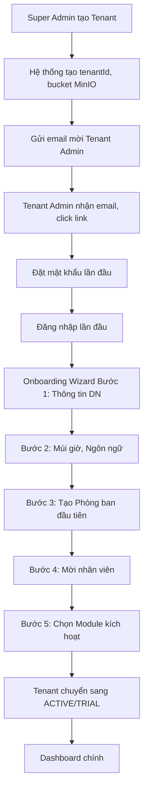
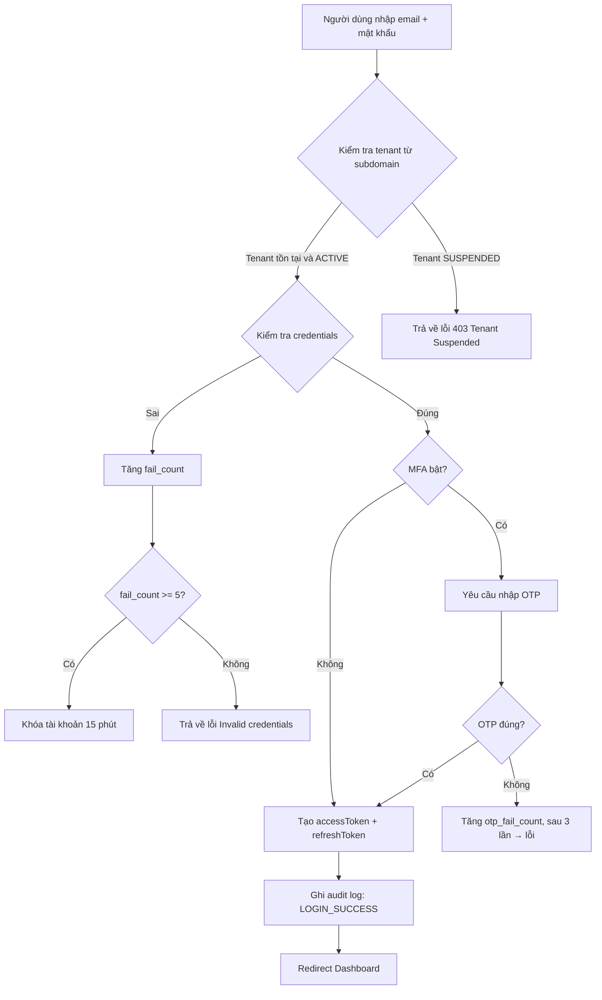
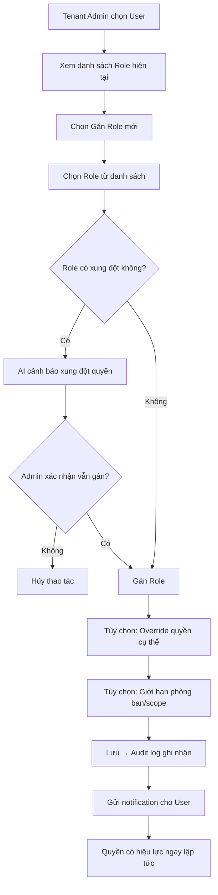
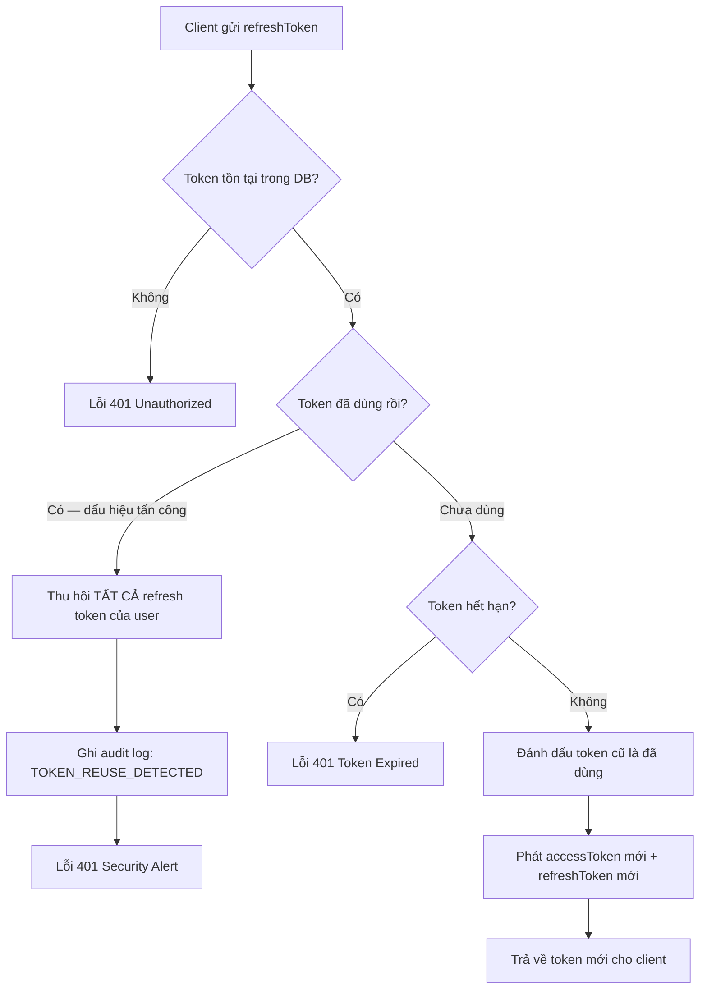
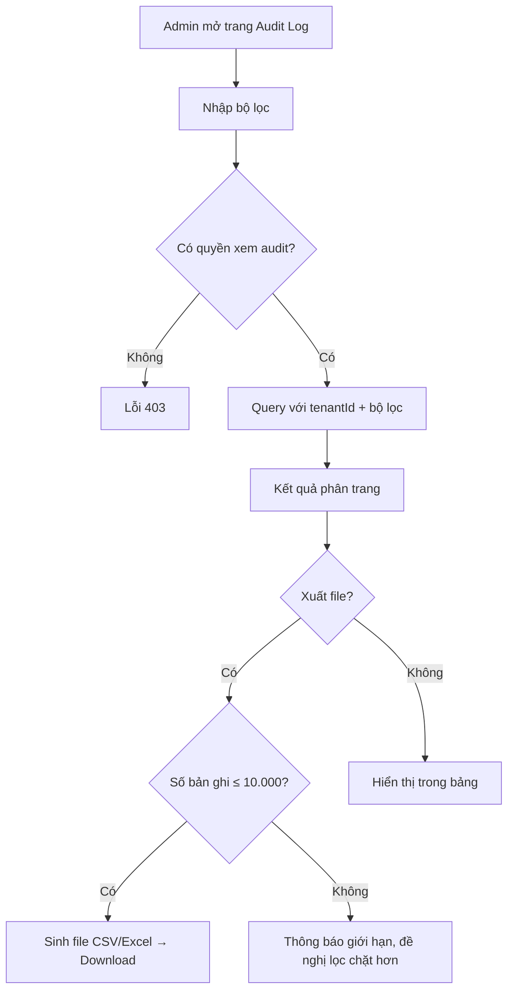

# SRS — Phân hệ System Administration
# Quản trị Hệ thống SaaS & Quản trị Doanh nghiệp

**Phiên bản:** 1.0  
**Ngày tạo:** 09/05/2026  
**Tác giả:** Business Analyst  
**Sprint liên quan:** Sprint 01, Sprint 02  
**Trạng thái:** Hoàn chỉnh  

---

## Mục lục

1. [Tổng quan phân hệ](#1-tổng-quan-phân-hệ)
2. [Đặc tả chức năng](#2-đặc-tả-chức-năng)
3. [Luồng nghiệp vụ](#3-luồng-nghiệp-vụ)
4. [Mô hình dữ liệu](#4-mô-hình-dữ-liệu)
5. [Validation và Business Rules](#5-validation-và-business-rules)
6. [Tích hợp và API](#6-tích-hợp-và-api)

---

## 1. Tổng quan phân hệ

### 1.1 Phạm vi và mục tiêu

Phân hệ **System Administration** là nền tảng lõi của toàn bộ hệ thống Open ERP. Mọi phân hệ khác đều phụ thuộc vào phân hệ này để xác thực, phân quyền và quản lý tenant.

**Mục tiêu:**

- Quản trị nền tảng SaaS: vận hành multi-tenant, quản lý gói dịch vụ và quota
- Xác thực và bảo mật: JWT, OAuth2, MFA, session management
- Phân quyền chi tiết: RBAC theo module, hành động, dữ liệu, phòng ban
- Danh mục và cấu hình: danh mục dùng chung, biểu mẫu động, cấu hình tenant
- Giám sát và kiểm toán: audit log bất biến toàn diện

### 1.2 Actors

| Actor | Mô tả | Quyền chính |
|---|---|---|
| **Super Admin** | Quản trị viên nền tảng SaaS | Tạo/xóa tenant, xem tất cả audit log, quản lý gói dịch vụ |
| **Tenant Admin** | Quản trị viên của một doanh nghiệp | Quản lý user, role, phòng ban, danh mục trong tenant của mình |
| **Manager** | Trưởng phòng/Quản lý | Xem danh sách user phòng ban, phân quyền giới hạn |
| **Employee** | Nhân viên thông thường | Quản lý profile cá nhân, đổi mật khẩu, xem quyền của mình |
| **AI Agent** | Hệ thống AI | Đọc dữ liệu user/role để gợi ý; ghi audit log qua service |
| **External System** | Hệ thống bên ngoài | Gọi API với API Key được cấp phép |

### 1.3 Use Case tổng quan

| Nhóm | Use Case | Actor chính |
|---|---|---|
| **Xác thực** | Đăng nhập bằng email/mật khẩu | Employee, Manager, Tenant Admin |
| **Xác thực** | Đăng nhập bằng Google/Microsoft (OAuth2) | Employee, Manager, Tenant Admin |
| **Xác thực** | Xác thực MFA (TOTP/OTP email) | Employee, Manager, Tenant Admin |
| **Xác thực** | Làm mới access token (refresh token) | Tất cả user đã đăng nhập |
| **Xác thực** | Đăng xuất đơn thiết bị / tất cả thiết bị | Tất cả user đã đăng nhập |
| **Xác thực** | Quên mật khẩu / đặt lại mật khẩu | Employee, Manager, Tenant Admin |
| **Quản lý Tenant** | Tạo tenant mới | Super Admin |
| **Quản lý Tenant** | Cập nhật thông tin tenant | Super Admin, Tenant Admin |
| **Quản lý Tenant** | Kích hoạt / tạm ngưng / hủy tenant | Super Admin |
| **Quản lý Tenant** | Xem thống kê sử dụng quota | Super Admin, Tenant Admin |
| **Quản lý Tenant** | Cấu hình onboarding ban đầu | Tenant Admin |
| **Quản lý User** | Tạo tài khoản người dùng | Tenant Admin |
| **Quản lý User** | Chỉnh sửa thông tin người dùng | Tenant Admin, bản thân User |
| **Quản lý User** | Kích hoạt / vô hiệu hóa tài khoản | Tenant Admin |
| **Quản lý User** | Gán / gỡ role cho user | Tenant Admin |
| **Quản lý User** | Mời người dùng qua email | Tenant Admin |
| **Quản lý User** | Xem lịch sử đăng nhập | Tenant Admin, bản thân User |
| **Phân quyền RBAC** | Tạo/sửa/xóa role | Tenant Admin |
| **Phân quyền RBAC** | Gán quyền vào role | Tenant Admin |
| **Phân quyền RBAC** | Phân quyền theo dữ liệu/phòng ban | Tenant Admin |
| **Phân quyền RBAC** | Xem quyền hiệu lực của user | Tenant Admin, Manager |
| **Cơ cấu tổ chức** | Tạo/sửa/xóa phòng ban | Tenant Admin |
| **Cơ cấu tổ chức** | Định nghĩa cây tổ chức (org chart) | Tenant Admin |
| **Cơ cấu tổ chức** | Gán người dùng vào phòng ban | Tenant Admin |
| **Danh mục** | Quản lý danh mục dùng chung | Tenant Admin |
| **Danh mục** | Tạo biểu mẫu động | Tenant Admin |
| **Danh mục** | Quản lý API Key | Tenant Admin |
| **Audit Log** | Xem audit log theo bộ lọc | Super Admin, Tenant Admin |
| **Audit Log** | Xuất audit log (CSV/Excel) | Super Admin, Tenant Admin |
| **AI** | Gợi ý phân quyền theo chức danh | Tenant Admin (AI hỗ trợ) |
| **AI** | Cảnh báo hành vi đăng nhập bất thường | Super Admin, Tenant Admin |

---

## 2. Đặc tả chức năng

### 2.1 Nhóm: Xác thực (Authentication)

#### F-SA-001: Đăng nhập bằng Email/Mật khẩu

| Thuộc tính | Nội dung |
|---|---|
| **ID** | F-SA-001 |
| **Tên** | Đăng nhập bằng email và mật khẩu |
| **Mô tả** | Người dùng nhập email và mật khẩu để đăng nhập vào hệ thống trong phạm vi tenant xác định |
| **Input** | `email` (string), `password` (string), `tenantSubdomain` hoặc `tenantId` (xác định từ domain/subdomain) |
| **Output** | `accessToken` (JWT, 15 phút), `refreshToken` (HttpOnly cookie, 7 ngày), thông tin user cơ bản |
| **Business Rules** | BR-SA-004, BR-SA-005, BR-SA-006 |
| **Multi-tenancy** | `tenantId` được resolve từ subdomain/domain của request. JWT chứa `tenantId` |

#### F-SA-002: Đăng nhập OAuth2 (Google / Microsoft)

| Thuộc tính | Nội dung |
|---|---|
| **ID** | F-SA-002 |
| **Tên** | Đăng nhập bằng tài khoản Google hoặc Microsoft |
| **Mô tả** | Redirect sang trang OAuth2 của provider, nhận authorization code, exchange lấy user info, tạo hoặc liên kết tài khoản |
| **Input** | Provider (google/microsoft), authorization code từ callback |
| **Output** | `accessToken`, `refreshToken`, thông tin user |
| **Business Rules** | Email từ OAuth2 phải tồn tại trong hệ thống hoặc thuộc domain được whitelist của tenant |
| **Multi-tenancy** | Tenant phải enable OAuth2 provider tương ứng trong cấu hình |

#### F-SA-003: Xác thực MFA

| Thuộc tính | Nội dung |
|---|---|
| **ID** | F-SA-003 |
| **Tên** | Xác thực đa yếu tố (MFA) |
| **Mô tả** | Sau khi xác thực mật khẩu thành công, nếu user bật MFA, yêu cầu nhập OTP |
| **Input** | `sessionToken` tạm (từ bước 1), `otpCode` (6 chữ số) |
| **Output** | `accessToken`, `refreshToken` (nếu OTP đúng) |
| **Business Rules** | TOTP theo RFC 6238 (30 giây, 6 chữ số). Cho phép clock skew ±30 giây. Sau 3 lần sai OTP, phải đăng nhập lại |
| **Multi-tenancy** | MFA có thể bật bắt buộc theo cấu hình tenant |

#### F-SA-004: Làm mới Access Token

| Thuộc tính | Nội dung |
|---|---|
| **ID** | F-SA-004 |
| **Tên** | Làm mới access token bằng refresh token |
| **Mô tả** | Client gửi refresh token (HttpOnly cookie) để nhận access token mới |
| **Input** | `refreshToken` (từ cookie) |
| **Output** | `accessToken` mới, `refreshToken` mới (token rotation) |
| **Business Rules** | BR-SA-007: Refresh token xoay vòng — token cũ bị hủy sau khi dùng. Phát hiện token tái sử dụng → hủy toàn bộ session |
| **Multi-tenancy** | Refresh token liên kết với `tenantId` cụ thể |

#### F-SA-005: Đăng xuất

| Thuộc tính | Nội dung |
|---|---|
| **ID** | F-SA-005 |
| **Tên** | Đăng xuất |
| **Mô tả** | Hủy session hiện tại hoặc tất cả session của user |
| **Input** | `mode`: `single` (thiết bị hiện tại) hoặc `all` (tất cả thiết bị) |
| **Output** | HTTP 200, xóa cookie refresh token |
| **Business Rules** | BR-SA-008: Đăng xuất đơn chỉ hủy refresh token hiện tại. Đăng xuất tất cả hủy toàn bộ refresh token của user |
| **Multi-tenancy** | Chỉ hủy session trong tenant scope của user |

#### F-SA-006: Quên mật khẩu / Đặt lại mật khẩu

| Thuộc tính | Nội dung |
|---|---|
| **ID** | F-SA-006 |
| **Tên** | Đặt lại mật khẩu qua email |
| **Mô tả** | Gửi email chứa link đặt lại mật khẩu (token hết hạn sau 1 giờ) |
| **Input** | Bước 1: `email`. Bước 2: `resetToken`, `newPassword`, `confirmPassword` |
| **Output** | Email gửi thành công; sau bước 2: mật khẩu mới được lưu |
| **Business Rules** | Reset token là UUID v4, hết hạn 1 giờ, chỉ dùng 1 lần. Sau khi đặt lại → hủy tất cả session cũ |
| **Multi-tenancy** | Email phải tồn tại trong tenant xác định |

---

### 2.2 Nhóm: Quản lý Tenant

#### F-SA-010: Tạo Tenant mới

| Thuộc tính | Nội dung |
|---|---|
| **ID** | F-SA-010 |
| **Tên** | Tạo tenant mới |
| **Mô tả** | Super Admin tạo tài khoản doanh nghiệp mới trên nền tảng |
| **Input** | `companyName`, `subdomain`, `adminEmail`, `plan` (starter/business/enterprise), `trialDays` |
| **Output** | Tenant được tạo với trạng thái `PENDING_SETUP`, email mời Tenant Admin được gửi |
| **Business Rules** | `subdomain` phải duy nhất trong toàn hệ thống; chỉ cho phép chữ thường, số và dấu gạch ngang; 3–30 ký tự |
| **Multi-tenancy** | Tạo `tenantId` mới (UUID hoặc ObjectId). Tạo cấu hình mặc định. Tạo MinIO bucket `tenant-{tenantId}` |

#### F-SA-011: Cập nhật thông tin Tenant

| Thuộc tính | Nội dung |
|---|---|
| **ID** | F-SA-011 |
| **Tên** | Cập nhật thông tin doanh nghiệp |
| **Mô tả** | Tenant Admin cập nhật thông tin công ty: tên, địa chỉ, MST, logo, múi giờ, ngôn ngữ, các module được kích hoạt |
| **Input** | Các trường thông tin công ty (xem Data Model) |
| **Output** | Tenant được cập nhật, audit log ghi nhận |
| **Business Rules** | MST phải đúng định dạng Việt Nam (10 hoặc 13 chữ số). Thay đổi `subdomain` không được phép sau khi kích hoạt |
| **Multi-tenancy** | Tenant Admin chỉ cập nhật được tenant của chính mình |

#### F-SA-012: Quản lý trạng thái Tenant

| Thuộc tính | Nội dung |
|---|---|
| **ID** | F-SA-012 |
| **Tên** | Kích hoạt / Tạm ngưng / Hủy tenant |
| **Mô tả** | Super Admin thay đổi trạng thái vận hành của tenant |
| **Input** | `tenantId`, `newStatus` (ACTIVE/SUSPENDED/TERMINATED), `reason` |
| **Output** | Trạng thái tenant cập nhật; nếu SUSPENDED → tất cả user bị từ chối truy cập |
| **Business Rules** | TERMINATED yêu cầu xác nhận 2 bước. Dữ liệu tenant TERMINATED được soft-delete, xóa vĩnh viễn sau 30 ngày |
| **Multi-tenancy** | Chỉ Super Admin được thực hiện |

#### F-SA-013: Onboarding Wizard

| Thuộc tính | Nội dung |
|---|---|
| **ID** | F-SA-013 |
| **Tên** | Cấu hình ban đầu cho tenant mới (Onboarding Wizard) |
| **Mô tả** | Sau lần đăng nhập đầu tiên, Tenant Admin được hướng dẫn qua 5 bước cấu hình cơ bản |
| **Input** | Thông tin từng bước: (1) thông tin doanh nghiệp, (2) múi giờ/ngôn ngữ, (3) phòng ban đầu tiên, (4) mời user, (5) chọn module |
| **Output** | Tenant chuyển sang trạng thái `ACTIVE` (hoặc `TRIAL`), dữ liệu ban đầu được khởi tạo |
| **Business Rules** | Có thể bỏ qua (skip) bước 3–5 và hoàn thành sau. Bước 1–2 bắt buộc |
| **Multi-tenancy** | Áp dụng riêng cho từng tenant |

---

### 2.3 Nhóm: Quản lý Người dùng

#### F-SA-020: Tạo tài khoản người dùng

| Thuộc tính | Nội dung |
|---|---|
| **ID** | F-SA-020 |
| **Tên** | Tạo tài khoản người dùng mới |
| **Mô tả** | Tenant Admin tạo tài khoản cho nhân viên; hệ thống gửi email mời kích hoạt |
| **Input** | `email`, `fullName`, `phone`, `departmentId`, `roleIds[]`, `position` |
| **Output** | User được tạo với trạng thái `PENDING_ACTIVATION`, email mời được gửi |
| **Business Rules** | Email phải duy nhất trong tenant. Số user không vượt quota tenant. Link kích hoạt hết hạn sau 24 giờ |
| **Multi-tenancy** | User chỉ thuộc một `tenantId` duy nhất. Quota kiểm tra theo `tenantId` |

#### F-SA-021: Cập nhật thông tin người dùng

| Thuộc tính | Nội dung |
|---|---|
| **ID** | F-SA-021 |
| **Tên** | Cập nhật thông tin người dùng |
| **Mô tả** | Tenant Admin sửa thông tin user; User tự sửa profile cá nhân của mình |
| **Input** | Các trường profile (fullName, phone, avatar, position...) |
| **Output** | Profile được cập nhật, audit log ghi nhận |
| **Business Rules** | User chỉ sửa được các trường được phép (email không được tự đổi). Tenant Admin sửa được tất cả |
| **Multi-tenancy** | Chỉ sửa được user trong cùng `tenantId` |

#### F-SA-022: Kích hoạt / Vô hiệu hóa tài khoản

| Thuộc tính | Nội dung |
|---|---|
| **ID** | F-SA-022 |
| **Tên** | Kích hoạt hoặc vô hiệu hóa tài khoản người dùng |
| **Mô tả** | Tenant Admin bật/tắt quyền truy cập hệ thống của người dùng |
| **Input** | `userId`, `status` (ACTIVE/INACTIVE), `reason` |
| **Output** | Trạng thái user cập nhật. Nếu INACTIVE → tất cả session bị hủy ngay lập tức |
| **Business Rules** | Không thể vô hiệu hóa chính mình. Không thể vô hiệu hóa Super Admin |
| **Multi-tenancy** | Chỉ thao tác trên user trong cùng `tenantId` |

#### F-SA-023: Mời người dùng qua Email

| Thuộc tính | Nội dung |
|---|---|
| **ID** | F-SA-023 |
| **Tên** | Mời người dùng tham gia tenant qua email |
| **Mô tả** | Tenant Admin gửi email mời, người được mời click link để tạo mật khẩu và kích hoạt tài khoản |
| **Input** | `email`, `fullName`, `roleIds[]`, `departmentId` |
| **Output** | Email mời được gửi, user ở trạng thái `PENDING_ACTIVATION` |
| **Business Rules** | Link mời hết hạn sau 48 giờ. Có thể gửi lại tối đa 3 lần/ngày cho cùng email |
| **Multi-tenancy** | Email mời chứa `tenantId` để link kích hoạt đúng tenant |

---

### 2.4 Nhóm: Phân quyền RBAC

#### F-SA-030: Quản lý Role

| Thuộc tính | Nội dung |
|---|---|
| **ID** | F-SA-030 |
| **Tên** | Tạo, sửa, xóa vai trò (Role) |
| **Mô tả** | Tenant Admin quản lý danh sách role trong tenant |
| **Input** | `name`, `description`, `permissions[]` |
| **Output** | Role được tạo/cập nhật/xóa |
| **Business Rules** | BR-SA-009: Không thể xóa role hệ thống (isSystem = true). Khi xóa role → user được gán role đó mất quyền ngay. Role name duy nhất trong tenant |
| **Multi-tenancy** | Role thuộc `tenantId`. Hệ thống cung cấp sẵn role mặc định: TENANT_ADMIN, MANAGER, EMPLOYEE |

#### F-SA-031: Cấu hình quyền chi tiết (Permissions)

| Thuộc tính | Nội dung |
|---|---|
| **ID** | F-SA-031 |
| **Tên** | Gán quyền chi tiết vào role |
| **Mô tả** | Định nghĩa quyền theo: module, hành động (action), phạm vi dữ liệu (scope) |
| **Input** | `roleId`, `permissions[]`: mỗi permission có `module`, `action`, `scope` |
| **Output** | Permission matrix được cập nhật |
| **Business Rules** | BR-SA-010: Nguyên tắc least privilege. Scope có thể là: ALL (toàn bộ), OWN_DEPARTMENT (phòng ban mình), OWN (của mình) |
| **Multi-tenancy** | Permission chỉ áp dụng trong `tenantId` |

**Danh sách Action chuẩn:**

| Action | Mô tả |
|---|---|
| CREATE | Tạo mới |
| READ | Đọc / xem |
| UPDATE | Chỉnh sửa |
| DELETE | Xóa |
| APPROVE | Phê duyệt |
| EXPORT | Xuất dữ liệu |
| IMPORT | Nhập dữ liệu |
| MANAGE | Quản lý tổng thể (bao gồm tất cả) |

---

### 2.5 Nhóm: Cơ cấu Tổ chức

#### F-SA-040: Quản lý Phòng ban

| Thuộc tính | Nội dung |
|---|---|
| **ID** | F-SA-040 |
| **Tên** | Tạo, sửa, xóa phòng ban / chi nhánh |
| **Mô tả** | Xây dựng cây cơ cấu tổ chức của doanh nghiệp |
| **Input** | `name`, `code`, `parentId` (phòng ban cha), `managerId`, `type` (DEPARTMENT/BRANCH/DIVISION) |
| **Output** | Cây tổ chức được cập nhật |
| **Business Rules** | Cây có tối đa 5 cấp. Không thể xóa phòng ban còn user đang thuộc. Mỗi phòng ban có tối đa 1 trưởng phòng |
| **Multi-tenancy** | Cơ cấu tổ chức riêng biệt theo `tenantId` |

---

### 2.6 Nhóm: Danh mục và Cấu hình

#### F-SA-050: Quản lý Danh mục động

| Thuộc tính | Nội dung |
|---|---|
| **ID** | F-SA-050 |
| **Tên** | Quản lý danh mục dùng chung (Master Data) |
| **Mô tả** | Tenant Admin tạo và quản lý các danh mục nghiệp vụ tùy chỉnh (loại văn bản, trạng thái, nhóm khách hàng...) |
| **Input** | `categoryType`, `name`, `code`, `description`, `isActive`, `sortOrder`, `metadata` (JSON tùy chỉnh) |
| **Output** | Danh mục được tạo/cập nhật, khả dụng cho các phân hệ khác |
| **Business Rules** | Code duy nhất trong cùng categoryType và tenant. Không thể xóa danh mục đang được sử dụng |
| **Multi-tenancy** | Danh mục thuộc `tenantId`. Có thể kế thừa danh mục hệ thống (system catalog) |

#### F-SA-051: Quản lý Biểu mẫu động (Dynamic Forms)

| Thuộc tính | Nội dung |
|---|---|
| **ID** | F-SA-051 |
| **Tên** | Tạo và quản lý biểu mẫu tùy chỉnh |
| **Mô tả** | Tenant Admin thiết kế form với các trường tùy chỉnh cho nghiệp vụ |
| **Input** | `formName`, `module`, `fields[]`: mỗi field có `name`, `type` (text/number/date/select/file/...), `required`, `validation`, `options` |
| **Output** | Form schema được lưu, có thể dùng trong module chỉ định |
| **Business Rules** | Tối đa 50 trường/form. Không thể xóa form đang có dữ liệu |
| **Multi-tenancy** | Form thuộc `tenantId` |

#### F-SA-052: Quản lý API Key

| Thuộc tính | Nội dung |
|---|---|
| **ID** | F-SA-052 |
| **Tên** | Cấp phát và quản lý API Key |
| **Mô tả** | Tenant Admin tạo API Key cho tích hợp bên ngoài, cấu hình quyền và rate limit |
| **Input** | `name`, `permissions[]`, `expiresAt`, `allowedIPs[]`, `rateLimit` |
| **Output** | API Key (hiển thị 1 lần duy nhất khi tạo), thông tin key được lưu |
| **Business Rules** | Key được hash (SHA-256) trước khi lưu. Chỉ hiển thị key đầy đủ một lần. Tối đa 10 API Key/tenant |
| **Multi-tenancy** | API Key liên kết với `tenantId` |

---

### 2.7 Nhóm: Audit Log

#### F-SA-060: Xem và tìm kiếm Audit Log

| Thuộc tính | Nội dung |
|---|---|
| **ID** | F-SA-060 |
| **Tên** | Xem audit log với bộ lọc |
| **Mô tả** | Admin xem toàn bộ lịch sử thao tác với bộ lọc đa điều kiện |
| **Input** | Bộ lọc: `userId`, `module`, `action`, `resourceType`, `resourceId`, `dateFrom`, `dateTo`, `ipAddress`, `result` |
| **Output** | Danh sách log phân trang, mỗi entry gồm đủ thông tin |
| **Business Rules** | BR-SA-013: Audit log chỉ đọc, không sửa/xóa. Phân trang tối đa 100 bản ghi/trang |
| **Multi-tenancy** | Tenant Admin chỉ thấy log của `tenantId` mình. Super Admin thấy tất cả |

#### F-SA-061: Xuất Audit Log

| Thuộc tính | Nội dung |
|---|---|
| **ID** | F-SA-061 |
| **Tên** | Xuất audit log ra CSV/Excel |
| **Mô tả** | Xuất kết quả tìm kiếm audit log ra file |
| **Input** | Bộ lọc (giống F-SA-060), `format` (csv/excel) |
| **Output** | File download |
| **Business Rules** | Giới hạn xuất 10.000 bản ghi/lần. Yêu cầu quyền EXPORT trên module audit |
| **Multi-tenancy** | Dữ liệu xuất chỉ thuộc tenant của người xuất |

---

## 3. Luồng nghiệp vụ

### 3.1 Luồng: Tenant Onboarding (Happy Path)



**Luồng ngoại lệ:**
- Link mời hết hạn (> 48 giờ) → Tenant Admin báo Super Admin gửi lại
- Subdomain đã tồn tại → Báo lỗi, yêu cầu chọn subdomain khác
- Email admin đã tồn tại trong hệ thống → Liên kết tenant với account đã có (nếu cùng email)

---

### 3.2 Luồng: Đăng nhập và Xác thực (Happy Path)



**Luồng ngoại lệ:**
- Tài khoản bị INACTIVE → Lỗi "Tài khoản đã bị vô hiệu hóa, liên hệ admin"
- Tài khoản bị LOCKED → Lỗi "Tài khoản bị khóa tạm thời, thử lại sau X phút"
- OAuth2 email không tồn tại trong tenant → Lỗi "Email chưa được đăng ký"

---

### 3.3 Luồng: Phân quyền Người dùng



---

### 3.4 Luồng: Quản lý Refresh Token (Security Flow)



---

### 3.5 Luồng: Audit Log Query



---

## 4. Mô hình dữ liệu

### 4.1 Collection: `tenants`

| Trường | Kiểu | Bắt buộc | Mô tả |
|---|---|---|---|
| `_id` | ObjectId | Có | Định danh tenant (chính là tenantId) |
| `name` | string | Có | Tên doanh nghiệp |
| `subdomain` | string | Có | Subdomain duy nhất (unique index) |
| `taxCode` | string | Không | Mã số thuế (10 hoặc 13 chữ số) |
| `address` | object | Không | `{ street, city, province, country }` |
| `phone` | string | Không | Số điện thoại doanh nghiệp |
| `email` | string | Có | Email liên hệ chính |
| `logo` | string | Không | URL logo (MinIO) |
| `status` | string (enum) | Có | `PENDING_SETUP` \| `TRIAL` \| `ACTIVE` \| `SUSPENDED` \| `TERMINATED` |
| `plan` | string (enum) | Có | `starter` \| `business` \| `enterprise` |
| `trialEndsAt` | Date | Không | Ngày hết hạn dùng thử |
| `settings` | object | Có | `{ timezone, language, currency, dateFormat, modules[] }` |
| `quota` | object | Có | `{ maxUsers, storageGB, apiCallsPerDay }` |
| `usage` | object | Có | `{ currentUsers, storageUsedGB }` |
| `oauthProviders` | array | Không | `[{ provider: 'google'|'microsoft', enabled, clientId }]` |
| `mfaRequired` | boolean | Có | Bắt buộc MFA cho tất cả user (mặc định: false) |
| `createdAt` | Date | Có | Thời điểm tạo |
| `updatedAt` | Date | Có | Thời điểm cập nhật cuối |
| `deletedAt` | Date | Không | Soft delete (khi TERMINATED) |

**Indexes:** `subdomain` (unique), `status`, `plan`

---

### 4.2 Collection: `users`

| Trường | Kiểu | Bắt buộc | Mô tả |
|---|---|---|---|
| `_id` | ObjectId | Có | userId |
| `tenantId` | ObjectId | Có | Tenant sở hữu user |
| `email` | string | Có | Email (unique trong tenant) |
| `passwordHash` | string | Không | bcrypt hash (null nếu chỉ dùng OAuth2) |
| `status` | string (enum) | Có | `PENDING_ACTIVATION` \| `ACTIVE` \| `INACTIVE` \| `LOCKED` |
| `lockUntil` | Date | Không | Thời điểm mở khóa tự động |
| `failedLoginAttempts` | number | Có | Đếm lần đăng nhập sai (reset khi thành công) |
| `profile` | object | Có | `{ fullName, avatar, phone, position, bio }` |
| `departmentId` | ObjectId | Không | Phòng ban chính |
| `roleIds` | ObjectId[] | Có | Danh sách role được gán |
| `permissionOverrides` | array | Không | Quyền override cụ thể ngoài role |
| `mfaEnabled` | boolean | Có | Đã bật MFA chưa |
| `mfaSecret` | string | Không | TOTP secret (mã hóa AES-256) |
| `oauthAccounts` | array | Không | `[{ provider, providerId, email }]` |
| `lastLoginAt` | Date | Không | Lần đăng nhập cuối |
| `lastLoginIp` | string | Không | IP lần đăng nhập cuối |
| `invitedBy` | ObjectId | Không | userId của người mời |
| `activatedAt` | Date | Không | Thời điểm kích hoạt |
| `createdAt` | Date | Có | |
| `updatedAt` | Date | Có | |

**Indexes:** `(tenantId, email)` (unique composite), `tenantId`, `departmentId`, `status`

---

### 4.3 Collection: `roles`

| Trường | Kiểu | Bắt buộc | Mô tả |
|---|---|---|---|
| `_id` | ObjectId | Có | roleId |
| `tenantId` | ObjectId | Có | Tenant sở hữu role |
| `name` | string | Có | Tên role (unique trong tenant) |
| `description` | string | Không | Mô tả |
| `isSystem` | boolean | Có | Không được xóa nếu true |
| `permissions` | array | Có | `[{ module, action, scope, conditions }]` |
| `createdBy` | ObjectId | Có | userId tạo |
| `createdAt` | Date | Có | |
| `updatedAt` | Date | Có | |

**Indexes:** `(tenantId, name)` (unique composite), `tenantId`, `isSystem`

**Permission object:**

```json
{
  "module": "sale",
  "action": "CREATE",
  "scope": "OWN_DEPARTMENT",
  "conditions": {}
}
```

---

### 4.4 Collection: `departments`

| Trường | Kiểu | Bắt buộc | Mô tả |
|---|---|---|---|
| `_id` | ObjectId | Có | departmentId |
| `tenantId` | ObjectId | Có | Tenant sở hữu |
| `name` | string | Có | Tên phòng ban |
| `code` | string | Có | Mã phòng ban (unique trong tenant) |
| `parentId` | ObjectId | Không | Phòng ban cha (null = cấp gốc) |
| `managerId` | ObjectId | Không | userId trưởng phòng |
| `type` | string (enum) | Có | `DEPARTMENT` \| `BRANCH` \| `DIVISION` \| `TEAM` |
| `level` | number | Có | Cấp trong cây (1 = gốc) |
| `path` | string | Có | Đường dẫn cây (ví dụ: `/root/marketing/digital`) |
| `isActive` | boolean | Có | Đang hoạt động |
| `createdAt` | Date | Có | |
| `updatedAt` | Date | Có | |

**Indexes:** `(tenantId, code)` (unique composite), `(tenantId, parentId)`, `tenantId`

---

### 4.5 Collection: `refresh_tokens`

| Trường | Kiểu | Bắt buộc | Mô tả |
|---|---|---|---|
| `_id` | ObjectId | Có | |
| `tenantId` | ObjectId | Có | |
| `userId` | ObjectId | Có | |
| `tokenHash` | string | Có | SHA-256 hash của refresh token |
| `isUsed` | boolean | Có | Đã dùng chưa (token rotation) |
| `deviceInfo` | object | Không | `{ userAgent, platform }` |
| `ipAddress` | string | Có | IP tạo token |
| `expiresAt` | Date | Có | TTL index |
| `createdAt` | Date | Có | |

**Indexes:** `tokenHash` (unique), `(tenantId, userId)`, `expiresAt` (TTL index)

---

### 4.6 Collection: `audit_logs`

| Trường | Kiểu | Bắt buộc | Mô tả |
|---|---|---|---|
| `_id` | ObjectId | Có | logId |
| `tenantId` | ObjectId | Có | Tenant của thao tác |
| `userId` | ObjectId | Không | userId (null nếu system/AI) |
| `actorType` | string (enum) | Có | `USER` \| `AI_AGENT` \| `SYSTEM` \| `API_KEY` |
| `actorId` | string | Có | userId hoặc apiKeyId |
| `timestamp` | Date | Có | Thời điểm xảy ra (UTC) |
| `ipAddress` | string | Không | IP address |
| `userAgent` | string | Không | Browser/app info |
| `module` | string | Có | Tên phân hệ (system_admin, sale, hr...) |
| `action` | string (enum) | Có | `CREATE` \| `READ` \| `UPDATE` \| `DELETE` \| `LOGIN` \| `LOGOUT` \| `EXPORT` \| `APPROVE` \| ... |
| `resourceType` | string | Có | Loại tài nguyên (User, Order, Employee...) |
| `resourceId` | string | Không | ID tài nguyên |
| `description` | string | Không | Mô tả ngắn hành động |
| `dataBefore` | object | Không | Dữ liệu trước thay đổi |
| `dataAfter` | object | Không | Dữ liệu sau thay đổi |
| `result` | string (enum) | Có | `SUCCESS` \| `FAILED` \| `PARTIAL` |
| `errorMessage` | string | Không | Thông tin lỗi (nếu FAILED) |

**Indexes:** `(tenantId, timestamp)`, `(tenantId, userId, timestamp)`, `(tenantId, module, action)`, `timestamp` (TTL: 2 năm)  
**Lưu ý:** Collection này chỉ INSERT, không cho phép UPDATE hoặc DELETE (enforce ở application layer)

---

### 4.7 Collection: `catalogs` (Danh mục)

| Trường | Kiểu | Bắt buộc | Mô tả |
|---|---|---|---|
| `_id` | ObjectId | Có | |
| `tenantId` | ObjectId | Có | |
| `categoryType` | string | Có | Loại danh mục (DOCUMENT_TYPE, CUSTOMER_GROUP, ...) |
| `code` | string | Có | Mã (unique trong type+tenant) |
| `name` | string | Có | Tên hiển thị |
| `description` | string | Không | Mô tả |
| `parentId` | ObjectId | Không | Danh mục cha (nếu có hierarchy) |
| `isActive` | boolean | Có | |
| `sortOrder` | number | Có | Thứ tự sắp xếp |
| `metadata` | object | Không | Dữ liệu mở rộng (JSON) |
| `isSystem` | boolean | Có | Danh mục hệ thống, không xóa được |
| `createdAt` | Date | Có | |
| `updatedAt` | Date | Có | |

**Indexes:** `(tenantId, categoryType, code)` (unique composite), `(tenantId, categoryType)`, `isActive`

---

### 4.8 Collection: `api_keys`

| Trường | Kiểu | Bắt buộc | Mô tả |
|---|---|---|---|
| `_id` | ObjectId | Có | |
| `tenantId` | ObjectId | Có | |
| `name` | string | Có | Tên mô tả |
| `keyHash` | string | Có | SHA-256 hash của API key |
| `keyPrefix` | string | Có | 8 ký tự đầu (hiển thị) |
| `permissions` | array | Có | Quyền được phép |
| `allowedIPs` | string[] | Không | Whitelist IP (null = không hạn chế) |
| `rateLimit` | number | Không | Req/phút (null = theo cấu hình mặc định) |
| `expiresAt` | Date | Không | Ngày hết hạn (null = không hết hạn) |
| `lastUsedAt` | Date | Không | |
| `isActive` | boolean | Có | |
| `createdBy` | ObjectId | Có | |
| `createdAt` | Date | Có | |

**Indexes:** `keyHash` (unique), `(tenantId, isActive)`

---

## 5. Validation và Business Rules

### 5.1 Validation Rules

| Trường | Quy tắc Validation | Thông báo lỗi |
|---|---|---|
| `email` | RFC 5322, độ dài ≤ 255 ký tự | "Email không hợp lệ" |
| `password` | Tối thiểu 8 ký tự; có ít nhất 1 chữ hoa, 1 chữ thường, 1 chữ số, 1 ký tự đặc biệt | "Mật khẩu chưa đủ độ mạnh" |
| `subdomain` | Chỉ `[a-z0-9-]`, độ dài 3–30 ký tự, không bắt đầu/kết thúc bằng `-` | "Subdomain không hợp lệ" |
| `taxCode` | 10 hoặc 13 chữ số | "Mã số thuế không hợp lệ" |
| `phone` | Định dạng số điện thoại Việt Nam: `0[3|5|7|8|9]xxxxxxxx` | "Số điện thoại không hợp lệ" |
| `fullName` | Độ dài 2–100 ký tự, không chứa ký tự đặc biệt nguy hiểm | "Họ tên không hợp lệ" |
| `departmentCode` | `[A-Z0-9_-]`, độ dài 2–20 ký tự | "Mã phòng ban không hợp lệ" |
| `otpCode` | Đúng 6 chữ số | "Mã OTP không hợp lệ" |

### 5.2 Business Rules chi tiết

| Mã | Rule | Chi tiết |
|---|---|---|
| BR-SA-001 | Multi-tenant isolation | Mọi truy vấn DB bắt buộc có điều kiện `tenantId` khớp với JWT |
| BR-SA-002 | Super Admin isolation | Super Admin dùng giao diện riêng, không trộn data với tenant user |
| BR-SA-003 | Suspended tenant | Tenant SUSPENDED → 403 cho mọi API, trừ endpoint "xem thông báo suspension" |
| BR-SA-004 | Password strength | Bắt buộc theo quy tắc validation ở trên |
| BR-SA-005 | Login lockout | Sau 5 lần sai → khóa 15 phút. Sau khi hết 15 phút → tự mở. Không cần admin can thiệp |
| BR-SA-006 | Token expiry | Access token: 15 phút. Refresh token: 7 ngày |
| BR-SA-007 | Token rotation | Mỗi refresh token chỉ dùng 1 lần. Tái sử dụng → revoke tất cả token của user |
| BR-SA-008 | Single logout | Đăng xuất 1 thiết bị chỉ hủy session đó. "Đăng xuất tất cả" hủy tất cả |
| BR-SA-009 | System role | Role có `isSystem=true` không xóa được; chỉ sửa được `description` |
| BR-SA-010 | Least privilege | Mặc định user mới không có quyền nào (chờ admin gán role) |
| BR-SA-011 | Role deletion cascade | Xóa role → user mất quyền ngay (không có grace period) |
| BR-SA-012 | Data scope | Scope OWN_DEPARTMENT: chỉ xem/sửa data của phòng ban mình. Scope OWN: chỉ của bản thân |
| BR-SA-013 | Immutable audit log | Không có API UPDATE/DELETE cho audit log. Chỉ INSERT |
| BR-SA-014 | Audit log retention | Lưu tối thiểu 2 năm. Xóa tự động sau 2 năm qua TTL index |
| BR-SA-015 | Audit log completeness | Mọi thao tác CRUD phải có audit log. Thiếu log → coi là lỗi hệ thống |

### 5.3 Quy tắc Quota

| Gói dịch vụ | Số user tối đa | Storage | API calls/ngày |
|---|---|---|---|
| Starter | 10 | 5 GB | 10.000 |
| Business | 100 | 50 GB | 100.000 |
| Enterprise | Không giới hạn | 500 GB | Không giới hạn |

- Khi đạt 90% quota → cảnh báo email cho Tenant Admin
- Khi đạt 100% → block create mới (user, file), hiển thị thông báo nâng cấp

---

## 6. Tích hợp và API

### 6.1 API nội bộ (xuất cho microservices khác)

| Endpoint nội bộ | Method | Mô tả |
|---|---|---|
| `/internal/auth/verify-token` | POST | Microservice khác dùng để verify JWT |
| `/internal/users/{userId}/permissions` | GET | Lấy permission matrix của user |
| `/internal/tenants/{tenantId}/status` | GET | Kiểm tra trạng thái tenant |
| `/internal/audit/log` | POST | Các service khác gửi audit event |
| `/internal/departments/{departmentId}` | GET | Lấy thông tin phòng ban |
| `/internal/users/batch` | POST | Lấy thông tin nhiều user cùng lúc |

### 6.2 Tích hợp OAuth2 (Google / Microsoft)

| Bước | Mô tả |
|---|---|
| Cấu hình | Tenant Admin nhập Client ID/Secret của Google/Microsoft app |
| Authorization URL | `https://accounts.google.com/o/oauth2/auth` (Google) |
| Callback | `https://{subdomain}.openrp.vn/api/auth/callback/{provider}` |
| Scopes yêu cầu | `email`, `profile` |
| Xử lý lỗi | Nếu email từ OAuth không tồn tại trong tenant → lỗi "Tài khoản chưa được đăng ký" |

### 6.3 Tích hợp Dịch vụ Email

- Provider: SendGrid / SMTP tùy chỉnh
- Các email hệ thống: mời user, đặt lại mật khẩu, OTP, cảnh báo bảo mật, thông báo suspension
- Template được cấu hình theo `language` của tenant (tiếng Việt / tiếng Anh)

### 6.4 Xử lý lỗi tích hợp

| Lỗi | Xử lý |
|---|---|
| OAuth2 provider không phản hồi | Timeout 30 giây, trả về lỗi "Đăng nhập thất bại, thử lại sau" |
| Email service không gửi được | Retry 3 lần cách nhau 5 phút; ghi lỗi vào log |
| MinIO không tạo được bucket | Retry 3 lần, nếu thất bại → tenant ở trạng thái `PENDING_SETUP`, alert admin |
