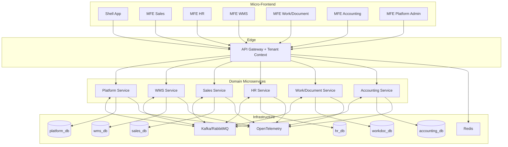

# Kiến trúc mục tiêu Backend SaaS Multi-tenant (Open ERP)

## 1) Mapping từ 11 service hiện tại sang 6 domain target

| Service hiện tại | Domain target | Hành động | Ghi chú |
|---|---|---|---|
| auth | Platform | Gộp | Trở thành Identity & Access trong Platform |
| user | Platform, HR | Tách + chuyển | Hồ sơ tài khoản hệ thống ở Platform, hồ sơ nhân sự nghiệp vụ chuyển HR |
| organization | Platform | Gộp | Tenant/Org hierarchy, policy, RBAC root |
| config-service | Platform | Gộp | Quản trị cấu hình toàn hệ thống theo tenant |
| common-service | Platform, Sales, WMS | Tách + chuyển | Master catalog và shared taxonomy vào Platform; phần nghiệp vụ đẩy về domain tương ứng |
| inventory | WMS | Giữ + mở rộng | Trở thành lõi kho vận (stock, location, movement, lot/serial) |
| data-transfer | WMS, Accounting | Tách + chuyển | Luồng nhập/xuất kho giữ ở WMS; chứng từ bút toán chuyển Accounting |
| file-service | Work/Document | Chuyển | Dịch vụ tài liệu, đính kèm, version |
| chat | Work/Document | Gộp | Collaboration/inbox theo document workflow |
| approval-flow | Work/Document, HR, Accounting | Tách + chuyển | Workflow engine nằm Work/Document; template duyệt domain-specific nằm từng domain |
| notification | Platform | Gộp | Notification hub đa kênh, event-driven |

Domain mới cần hình thành bổ sung: **Sales**, **HR**, **Accounting** (hiện chưa có service chuyên trách rõ ràng).

## 2) Bounded context và ownership dữ liệu

| Domain | Bounded context chính | Ownership dữ liệu |
|---|---|---|
| Platform | Identity, Tenant, RBAC, Master Catalog, System Config, Notification | `tenant`, `user_account`, `role`, `permission`, `catalog_*`, `system_config`, `notification_*` |
| WMS | Warehouse, Inventory, Stock Movement, Transfer, Receiving/Picking/Packing | `warehouse`, `location`, `inventory_balance`, `stock_movement`, `transfer_order`, `lot_serial` |
| Sales | Price list, Quote, Sales Order, Fulfillment orchestration | `customer`, `price_list`, `quote`, `sales_order`, `sales_order_line` |
| HR | Employee, Contract, Timekeeping, Leave/Approval policy | `employee`, `employment_contract`, `attendance`, `leave_request` |
| Work/Document | Workflow engine, Document lifecycle, File metadata, Task collaboration | `workflow_definition`, `workflow_instance`, `document`, `file_metadata`, `work_task`, `comment_thread` |
| Accounting | COA, Journal, AP/AR, Posting, Reconciliation | `chart_of_account`, `journal_entry`, `invoice`, `payment`, `reconciliation` |

Nguyên tắc ownership:
- Mỗi aggregate chỉ có 1 domain owner ghi dữ liệu.
- Domain khác chỉ đọc qua API/query model hoặc subscribe event.
- Không dùng truy cập chéo DB giữa domain.

## 3) Chiến lược DB/schema theo domain + tenant isolation

### Mô hình đề xuất (giai đoạn chưa go-live)
- 1 cụm MongoDB chung, **database tách theo domain**:
	- `platform_db`, `wms_db`, `sales_db`, `hr_db`, `workdoc_db`, `accounting_db`.
- Mỗi collection bắt buộc có `tenant_id`, `org_id` (nếu có cây tổ chức), `created_at`, `updated_at`.
- Index chuẩn cho multi-tenant:
	- `{ tenant_id: 1, _id: 1 }`
	- `{ tenant_id: 1, code: 1 }` unique theo tenant với thực thể có mã.
	- `{ tenant_id: 1, status: 1, updated_at: -1 }` cho truy vấn dashboard.

### Tenant isolation model
- Mặc định: **Shared database cluster + Shared collection + Tenant key isolation**.
- Bắt buộc enforcement ở 3 lớp:
	- API Gateway inject tenant context từ JWT.
	- Service Guard/Interceptor reject request thiếu `tenant_id`.
	- Repository base filter cứng `tenant_id` cho mọi query.
- Mở rộng quy mô: hỗ trợ nâng cấp tenant lớn sang database riêng theo chiến lược "hybrid isolation" mà không đổi API contract.

## 4) Event contracts cốt lõi giữa domain

Chuẩn chung:
- Topic naming: `erp.<domain>.<entity>.<event>.v1`
- Payload envelope:

```json
{
	"event_id": "uuid",
	"event_type": "erp.wms.stock.moved.v1",
	"occurred_at": "2026-05-08T10:00:00Z",
	"tenant_id": "t_001",
	"source": "wms-service",
	"trace_id": "trace-123",
	"data": {}
}
```

Event cốt lõi:
- `erp.platform.catalog.item.created.v1`
- `erp.platform.catalog.item.updated.v1`
- `erp.wms.stock.moved.v1`
- `erp.wms.transfer.completed.v1`
- `erp.sales.order.confirmed.v1`
- `erp.workdoc.workflow.approved.v1`
- `erp.hr.employee.created.v1`
- `erp.accounting.journal.posted.v1`

## 5) Lộ trình migration 3 phase

### Phase 1 (Bắt buộc ưu tiên): WMS + Master Catalog partition
- Tạo `platform-domain-service` quản trị danh mục toàn hệ thống (UoM, category, product taxonomy).
- Refactor `inventory` + `data-transfer` thành `wms-domain-service` thống nhất.
- Áp dụng tenant guard bắt buộc cho Platform và WMS.
- Thiết lập event bus + outbox cho 2 domain này trước.

### Phase 2: Work/Document + HR
- Tách `file-service`, `chat`, workflow runtime trong `approval-flow` sang `workdoc-domain-service`.
- Tách employee profile nghiệp vụ khỏi `user` sang `hr-domain-service`.
- Chuẩn hóa luồng duyệt qua event + workflow adapter.

### Phase 3: Sales + Accounting + decommission legacy
- Hình thành `sales-domain-service`, `accounting-domain-service` từ phần nghiệp vụ rải rác.
- Cắt route API Gateway khỏi 11 service cũ.
- Freeze legacy services và chuyển sang read-only trong giai đoạn cutover.

## 6) Sơ đồ kiến trúc mục tiêu



## ADR (Architecture Decision Records)

| # | Quyết định | Lý do | Phương án thay thế đã xem xét |
|---|---|---|---|
| ADR-001 | 11 service -> 6 domain service | Giảm phân mảnh ownership, tăng tốc phát triển theo domain | Giữ nguyên 11 service + cleanup nhẹ |
| ADR-002 | DB tách theo domain trên 1 cluster | Cân bằng chi phí và ranh giới dữ liệu | Mỗi service 1 cluster riêng |
| ADR-003 | Multi-tenant bằng tenant key + guard cứng | Phù hợp giai đoạn chưa go-live, dễ scale dần | Mỗi tenant 1 DB ngay từ đầu |
| ADR-004 | Event-driven qua outbox + contract versioned | Giảm coupling, an toàn khi cắt dần legacy | Gọi đồng bộ REST hoàn toàn |

## Tech stack đề xuất

| Lớp | Công nghệ | Phiên bản đề xuất | Ghi chú |
|---|---|---|---|
| Backend Service | NestJS | 11.x | Monorepo hiện tại đã dùng NestJS |
| API Gateway | NestJS Gateway/BFF hoặc Kong | 11.x / latest | Inject tenant context, authn/authz tập trung |
| Database | MongoDB | 7.x | Database per domain, index per tenant |
| Cache | Redis | 7.x | Idempotency, session, rate limit |
| Message Queue | Kafka hoặc RabbitMQ | latest | Event bus domain integration |
| Container & Orchestration | Docker + Kubernetes | latest | Hiện tại Docker sẵn có, nâng lên K8s khi scale |
| CI/CD | GitHub Actions | latest | Build/test/deploy theo từng domain service |
| Monitoring | OpenTelemetry + Prometheus + Grafana | latest | Trace theo tenant + domain |

## 7) Tham khảo hệ thống tương tự

| Hệ thống tham chiếu | Cách tổ chức domain | Điểm áp dụng cho Open ERP |
|---|---|---|
| Odoo Enterprise | Tổ chức theo module nghiệp vụ lớn (Sales, Inventory, HR, Accounting) dùng core platform chung | Dùng chung platform cho tenant/RBAC/catalog, tách domain nghiệp vụ để giảm coupling |
| ERPNext | Domain rõ theo chuỗi nghiệp vụ và document workflow tập trung | Ưu tiên Work/Document domain làm workflow engine dùng lại cho HR/Accounting |
| Microsoft Dynamics 365 | Phân ranh domain theo bounded context và event integration | Chuẩn hoa event contract versioned + outbox/inbox cho tích hợp lien mien |

Nguyen tac rut ra:
- Gom service theo ownership nghiep vu, khong gom theo utility ky thuat.
- Platform giu vai tro domain dung chung cho SaaS multi-tenant (identity, tenant, catalog, config, notification).
- Domain nghiep vu lien ket qua event contract, tranh truy cap cheo DB.
