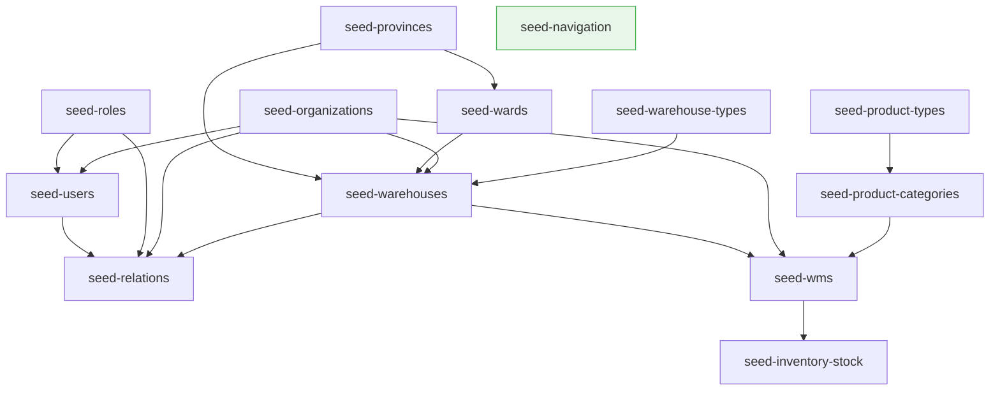

# Thiết kế Chuẩn hóa Seed Data — open-erp-backend

> **Trạng thái:** Dự thảo thiết kế  
> **Phiên bản:** 1.0  
> **Ngày tạo:** 2026-05-08  
> **Tác giả:** Technical Leader  

---

## 1. Phân tích hiện trạng

### 1.1 Cấu trúc hiện tại

```
scripts/seeds/
  seed-utils.ts                  ← FILE GỐC (chỉ có connectToDatabase, ~75 dòng)
  utils/
    seed-utils.ts                ← FILE UTILS (parseArgs, SeedOptions, SeedStats, v.v.)
    angular-route-parser.ts
  seed-all.ts                    ← Orchestrator (có parseArgs local RIÊNG)
  seed-provinces.ts              ← import mongoose trực tiếp (connectToDatabase inline)
  seed-wards.ts                  ← import mongoose trực tiếp (connectToDatabase inline)
  seed-roles.ts                  ← import utils/seed-utils (parseArgs, v.v.)
  seed-organizations.ts          ← import mongoose trực tiếp
  seed-users.ts                  ← import utils/seed-utils
  seed-warehouse-types.ts        ← import mongoose trực tiếp
  seed-warehouses.ts             ← import mongoose trực tiếp
  seed-relations.ts              ← import utils/seed-utils
  seed-navigation.ts             ← import utils/seed-utils
  seed-product-types.ts          ← import utils/seed-utils
  seed-product-categories.ts     ← import utils/seed-utils
  seed-wms.ts                    ← import utils/seed-utils
  seed-inventory-stock.ts        ← import utils/seed-utils
```

### 1.2 Vấn đề cốt lõi

| # | Vấn đề | Mức độ | Tác động |
|---|---|---|---|
| 1 | `connectToDatabase()` copy-paste ≥ 8 file (import mongoose trực tiếp) | Cao | Mỗi lần sửa logic DB phải sửa nhiều nơi |
| 2 | Hai file seed-utils xung đột: root-level vs `utils/` | Cao | Nhầm lẫn import path, logic DB bị phân tán |
| 3 | `parseArgs` local trong `seed-all.ts` (không dùng shared) | Trung bình | Logic parse trùng lặp, khó maintain |
| 4 | Không có cơ chế first-run auto-init | Cao | Phải chạy tay sau mỗi lần deploy lần đầu |
| 5 | Không tracking trạng thái seed | Cao | Không biết seed nào đã chạy, chạy lại nguy hiểm |
| 6 | Không phân loại essential vs sample | Trung bình | Không rõ seed nào bắt buộc cho production |

---

## 2. Kiến trúc mới đề xuất

### 2.1 Cấu trúc file sau refactor

```
scripts/seeds/
  utils/
    seed-utils.ts                ← ĐẦU MỐI DUY NHẤT (hợp nhất từ cả hai file cũ)
      - connectToDatabase()      ← Di chuyển vào đây từ root seed-utils.ts
      - parseArgs()
      - SeedOptions, SeedStats, SeedReport (interfaces)
      - validateDestructiveOps()
      - printStats()
      - saveReport()
      - createBatches()
      - generateStrongPassword()
      - SeedStateTracker          ← MỚI
    angular-route-parser.ts      ← Giữ nguyên
    seed-state.ts                ← MỚI: Quản lý trạng thái seed trong MongoDB
  seed-all.ts                    ← Refactor: dùng shared parseArgs + SeedStateTracker
  seed-provinces.ts              ← Refactor: import connectToDatabase từ utils/
  seed-wards.ts                  ← Refactor: import connectToDatabase từ utils/
  ... (tất cả seed files)        ← Refactor: import connectToDatabase từ utils/
  first-run-init.ts              ← MỚI: Entry point cho first-run auto-init
```

**Quy tắc import (bắt buộc sau refactor):**
- Tất cả file seed chỉ được import từ `./utils/seed-utils` (hoặc `../utils/seed-utils`)
- Không được import `connect` hoặc `getDatabaseConfig` trực tiếp trong file seed
- `seed-all.ts` phải dùng `parseArgs` từ `utils/seed-utils`, xóa parseArgs local

### 2.2 Nội dung `utils/seed-utils.ts` sau hợp nhất

```typescript
// utils/seed-utils.ts — Điểm import duy nhất cho toàn bộ seed scripts

// Re-export từ logic DB (di chuyển từ ../seed-utils.ts)
export { connectToDatabase } from './db-connect';  // tách riêng hoặc inline

// Interfaces
export interface SeedOptions { ... }
export interface SeedStats { ... }
export interface SeedReport { ... }

// Functions
export function parseArgs(args?: string[]): SeedOptions { ... }
export function validateDestructiveOps(opts: SeedOptions): void { ... }
export function printStats(stats: SeedStats): void { ... }
export function saveReport(report: SeedReport): void { ... }
export function createBatches<T>(arr: T[], size: number): T[][] { ... }
export function generateStrongPassword(length?: number): string { ... }

// Seed State (mới)
export class SeedStateTracker { ... }
```

---

## 3. Cơ chế First-Run Auto-Init

### 3.1 Phân tích các phương án

| Phương án | Mô tả | Ưu điểm | Nhược điểm |
|---|---|---|---|
| **A — Docker Entrypoint** | `docker-entrypoint.sh` kiểm tra flag và chạy seed trước khi start app | Tách biệt hoàn toàn, không ảnh hưởng app runtime | Chỉ hoạt động trong Docker, không hỗ trợ dev local |
| **B — NestJS Bootstrap Hook** | `OnModuleInit` trong AppModule, kiểm tra DB và tự seed | Hoạt động trong mọi môi trường | Làm chậm startup, seed chạy trong process app (rủi ro) |
| **C — Kết hợp (Hybrid)** | Entrypoint cho production Docker; env flag `SEED_ON_STARTUP=true` cho dev | Linh hoạt, production-safe | Phức tạp hơn, cần maintain 2 entry point |

### 3.2 Quyết định: **Phương án A — Docker Entrypoint Script**

**Lý do chọn Phương án A:**

1. **Tách biệt mối quan tâm (Separation of Concerns):** Seed data là công việc hạ tầng, không phải logic nghiệp vụ. Không nên trộn vào app runtime.

2. **An toàn hơn cho production:** App không bao giờ có quyền tự ghi seed data trong lúc đang phục vụ request. Tránh race condition khi scale nhiều replica.

3. **Dễ kiểm soát:** Operator có thể bật/tắt seed bằng cách set `RUN_SEEDS=true` trong Docker environment, không cần rebuild image.

4. **Tương thích Kubernetes:** Khi deploy lên K8s, có thể chạy seed như `initContainer` — pattern chuẩn của K8s.

5. **Dev local không cần Docker:** Dev chạy `npm run db:seed:all` thủ công như hiện tại, không bị ảnh hưởng.

**Phương án bổ sung cho dev:** Thêm `npm run db:seed:first-run` script gọi `first-run-init.ts` để dev có thể chạy tương tự entrypoint.

### 3.3 Thiết kế Docker Entrypoint

```bash
#!/bin/sh
# scripts/docker-entrypoint.sh

set -e

echo "=== open-erp entrypoint starting ==="

# Chờ MongoDB sẵn sàng
wait_for_mongo() {
  echo "Waiting for MongoDB..."
  until mongosh "$MONGODB_URI" --eval "db.adminCommand('ping')" > /dev/null 2>&1; do
    sleep 2
  done
  echo "MongoDB is ready."
}

# Chạy seed nếu được bật
if [ "${RUN_SEEDS:-false}" = "true" ]; then
  wait_for_mongo
  echo "Running first-run seed initialization..."
  cd /app
  npx ts-node -r tsconfig-paths/register scripts/seeds/first-run-init.ts
  echo "Seed initialization complete."
fi

# Khởi động ứng dụng
exec node dist/main.js
```

**Biến môi trường liên quan:**

| Biến | Mặc định | Mô tả |
|---|---|---|
| `RUN_SEEDS` | `false` | Bật/tắt auto-seed khi container khởi động |
| `SEED_SKIP_IF_EXISTS` | `true` | Bỏ qua seed đã có (idempotency) |
| `SEED_SUPERADMIN_PASSWORD` | (random) | Mật khẩu SuperAdmin, bắt buộc set trong production |
| `SEED_LOG_LEVEL` | `info` | Mức log khi seed |

---

## 4. Tracking Trạng Thái Seed

### 4.1 Cơ chế: MongoDB Collection `seed_metadata`

**Lý do chọn MongoDB thay vì file flag:**
- File flag (`.seed-init`) bị mất khi container restart nếu không mount volume riêng
- MongoDB luôn available khi seed chạy
- Có thể query, audit, rollback theo seed name + version

**Schema collection `seed_metadata`:**

```typescript
// Trong utils/seed-state.ts
interface SeedMetadata {
  _id: ObjectId;
  name: string;         // Tên seed, ví dụ: "seed-roles"
  version: string;      // Version của seed data, ví dụ: "1.0.0"
  runAt: Date;          // Thời điểm chạy thành công lần cuối
  duration: number;     // Thời gian thực thi (ms)
  stats: SeedStats;     // Số bản ghi inserted/updated/skipped
  checksum?: string;    // Hash của data source (optional, cho địa lý)
  environment: string;  // 'production' | 'staging' | 'development'
}
```

**Index:** `{ name: 1, version: 1 }` unique

**Lớp SeedStateTracker:**

```typescript
class SeedStateTracker {
  // Kiểm tra seed đã chạy chưa
  async hasRun(name: string, version: string): Promise<boolean>

  // Đánh dấu seed đã chạy thành công
  async markComplete(name: string, version: string, stats: SeedStats, duration: number): Promise<void>

  // Xóa trạng thái (để force re-run)
  async reset(name: string): Promise<void>

  // Lấy danh sách seed đã chạy
  async listCompleted(): Promise<SeedMetadata[]>
}
```

### 4.2 Idempotency Pattern chuẩn

Mỗi seed file phải tuân theo pattern:

```typescript
export async function seedXxx(opts: SeedOptions = {}) {
  const tracker = new SeedStateTracker();

  // Kiểm tra nếu skipIfExists và đã seed rồi
  if (opts.skipIfExists && await tracker.hasRun('seed-xxx', SEED_VERSION)) {
    console.log('⏭️  seed-xxx đã chạy, bỏ qua.');
    return;
  }

  const start = Date.now();
  const stats: SeedStats = { total: 0, inserted: 0, updated: 0, skipped: 0, errors: 0 };

  // ... logic seed với upsert ...
  // Dùng updateOne({ filter }, { $setOnInsert: ... }, { upsert: true })

  await tracker.markComplete('seed-xxx', SEED_VERSION, stats, Date.now() - start);
}
```

---

## 5. Thứ tự Seed Chuẩn & Dependency Graph

### 5.1 Sơ đồ dependency



### 5.2 Thứ tự thực thi (theo tầng)

| Tầng | Seed Script | Phụ thuộc | Lý do thứ tự |
|---|---|---|---|
| **0 — Độc lập** | `seed-navigation` | Không có | Menu items không phụ thuộc entity nào |
| **1 — Master Data cơ bản** | `seed-provinces` | Không có | Dữ liệu địa lý gốc |
| **1 — Master Data cơ bản** | `seed-roles` | Không có | System roles gốc |
| **1 — Master Data cơ bản** | `seed-warehouse-types` | Không có | Danh mục kho hàng |
| **1 — Master Data cơ bản** | `seed-product-types` | Không có | Danh mục loại sản phẩm |
| **2 — Master Data phụ thuộc** | `seed-wards` | `seed-provinces` | Phường/xã tham chiếu tỉnh/thành |
| **2 — Master Data phụ thuộc** | `seed-product-categories` | `seed-product-types` | Danh mục sản phẩm tham chiếu loại |
| **3 — Entities nghiệp vụ** | `seed-organizations` | `seed-roles` (opt) | Tổ chức cần có roles tồn tại |
| **3 — Entities nghiệp vụ** | `seed-users` | `seed-roles`, `seed-organizations` | User cần roles và organizations |
| **4 — Entities phụ thuộc** | `seed-warehouses` | `seed-provinces`, `seed-wards`, `seed-warehouse-types`, `seed-organizations` | Kho cần địa chỉ + loại + tổ chức |
| **5 — Relations** | `seed-relations` | `seed-users`, `seed-roles`, `seed-organizations`, `seed-warehouses` | Gán quyền + thành viên tổ chức |
| **6 — Demo/Business Data** | `seed-wms` | `seed-warehouses`, `seed-organizations`, `seed-product-categories` | Dữ liệu WMS mẫu |
| **7 — Derived Data** | `seed-inventory-stock` | `seed-wms`, `seed-warehouses` | Stock kho từ WMS data |

### 5.3 Thứ tự chuẩn trong `seed-all.ts`

```
1.  seed-provinces
2.  seed-wards
3.  seed-roles
4.  seed-warehouse-types
5.  seed-product-types
6.  seed-product-categories
7.  seed-organizations
8.  seed-users
9.  seed-warehouses
10. seed-relations
11. seed-navigation
12. seed-wms
13. seed-inventory-stock
```

> **Lưu ý:** `seed-navigation` (số 11) có thể chạy ở bất kỳ đâu trước `seed-relations`, nhưng đặt sau business data cho dễ đọc log.

---

## 6. Phân loại Seed (Essential vs Sample)

Theo quyết định người dùng, **tất cả seed hiện tại đều là Essential** — cần chạy khi khởi tạo hệ thống lần đầu.

| Seed | Loại | Ghi chú |
|---|---|---|
| `seed-provinces` | Essential | Dữ liệu địa lý quốc gia, bắt buộc |
| `seed-wards` | Essential | Dữ liệu địa lý cấp xã, bắt buộc |
| `seed-roles` | Essential | System roles, bắt buộc cho auth |
| `seed-organizations` | Essential | Tổ chức mẫu, cần cho demo/test |
| `seed-users` | Essential | SuperAdmin bắt buộc; users mẫu cho dev |
| `seed-warehouse-types` | Essential | Master data bắt buộc |
| `seed-warehouses` | Essential | Kho hàng mẫu, cần cho WMS |
| `seed-relations` | Essential | Gán quyền, bắt buộc cho RBAC |
| `seed-navigation` | Essential | Menu items, bắt buộc cho frontend |
| `seed-product-types` | Essential | Master data bắt buộc |
| `seed-product-categories` | Essential | Master data bắt buộc |
| `seed-wms` | Essential | Demo WMS, cần cho inventory |
| `seed-inventory-stock` | Essential | Stock ban đầu, cần cho WMS |

> **Hướng mở rộng tương lai:** Khi cần tách, thêm field `category: 'essential' | 'sample' | 'demo'` vào `seed_metadata` và thêm flag `--only-essential` vào `seed-all.ts`.

---

## 7. Tổng kết Quyết định Kỹ thuật (ADR)

| # | Quyết định | Lựa chọn | Lý do |
|---|---|---|---|
| ADR-001 | Vị trí `connectToDatabase` | `utils/seed-utils.ts` | Điểm import duy nhất, loại bỏ copy-paste |
| ADR-002 | Cơ chế first-run | Docker Entrypoint Script | Tách biệt infra và app, an toàn multi-replica |
| ADR-003 | Tracking trạng thái seed | MongoDB collection `seed_metadata` | Persistent, queryable, không phụ thuộc filesystem |
| ADR-004 | Idempotency | Upsert pattern + SeedStateTracker | An toàn khi chạy lại, audit được |
| ADR-005 | Phân loại seed | Tất cả Essential (hiện tại) | Theo yêu cầu người dùng, có thể mở rộng sau |
| ADR-006 | parseArgs trong seed-all.ts | Xóa local, dùng shared từ `utils/` | DRY principle, dễ maintain |
